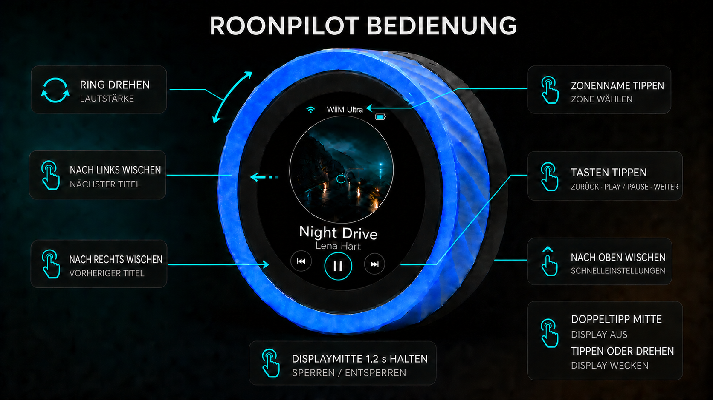

# RoonPilot

### Die haptische Fernbedienung für Roon

**Ring drehen. Musik berühren. Raum steuern.**

*RoonPilot auf der originalen Waveshare ESP32-S3-Knob-Touch-LCD-1.8-Hardware.*

**Deutsch** · [English](README.md)

[Projektseite](https://mermayer.github.io/RoonPilot/de/) · [Webinstaller](https://mermayer.github.io/RoonPilot/de/firmware/)

RoonPilot macht aus Waveshares kompaktem Controller mit rundem Display eine
schnelle, eigenständige Roon-Fernbedienung. Der Außenring regelt die
Lautstärke, das Touchdisplay übernimmt Wiedergabe und Zonenwahl, und die vom
Cover bestimmte Oberfläche hält die Musik sichtbar, ohne zum Telefon greifen
zu müssen.

RoonPilot spricht im lokalen Netzwerk direkt mit Roon. Es wird weder ein
Raspberry Pi noch ein Docker-Container, Node.js-Host, Desktop-Helfer,
Cloudkonto oder zusätzlicher ständig laufender RoonPilot-Dienst benötigt.

## Hier beginnen

Wer das Gerät gerade ausgepackt hat, liest diese Seiten in dieser Reihenfolge:

1. [Hardware und die beiden Prozessoren](guides/de/hardware-and-two-processors.md)
2. [Beide Original-Firmwares sichern](guides/de/factory-backup.md)
3. [RoonPilot sicher installieren](guides/de/installation.md)
4. [WLAN und Roon erstmals einrichten](guides/de/first-time-setup.md)
5. [Display, Ring, Touch und Gesten kennenlernen](guides/de/device-controls.md)

Der [vollständige Dokumentationsindex](guides/de/README.md) erklärt außerdem
jeden Bildschirm, jede Webseite, Updates, Wiederherstellung,
Konfigurationssicherung, Akku-Kalibrierung, Datenschutz und Fehlerbehebung.

> [!IMPORTANT]
> Das Board enthält **zwei unabhängige ESP-Prozessoren**. Durch Drehen des
> USB-C-Steckers kann Windows mit einem anderen Prozessor verbunden werden.
> Vor dem Löschen oder Flashen immer den Chip prüfen. Das ESP32-S3-Factory-
> Abbild und das Abbild für den klassischen Begleit-ESP32 sind nicht
> austauschbar.

Nach dem Erstellen und Prüfen beider Sicherungen wird der öffentliche
[RoonPilot-Webinstaller](https://mermayer.github.io/RoonPilot/de/firmware/) in
einem aktuellen Chromium-Desktopbrowser geöffnet.

## Was RoonPilot besonders macht

- Lautstärkeregelung über den kompletten äußeren Drehring. RoonPilot erkennt
  Prozent-, dB- und relative Lautstärkeausgänge automatisch und zeigt echte
  dB-Werte an, wenn Roon sie liefert.
- Drei Player-Layouts: Classic, Focus und Orbit mit Vollbild-Cover.
- Direkte Roon-Verbindung, Freigabe, Zonenstatus und Befehle im ESP32-S3.
- Zonenwahl direkt am Gerät per Touch oder Ring.
- Schwarzer Ruhezustand, Bahnhofsuhr oder Digitaluhr mit Datum.
- Optionaler echter Deep Sleep bei pausierter/gestoppter Zone, Aufwachen per
  Touch oder Drehring.
- Responsive Konfigurationsseiten direkt aus dem Gerät, ohne Cloud.
- Export/Import ohne WLAN-Kennwort und andere Geheimnisse.
- Signierte A/B-Updates mit Startprüfung und automatischem Rollback.
- Auffälliger Updatehinweis auf allen lokalen Webseiten und optional höchstens
  einmal täglich am Gerät; quittierbar und ohne automatische Installation.
- Nach der Einrichtung ist für den normalen Betrieb kein Browser nötig.

## Player und Geräteansichten

<table>
  <tr>
    <td align="center"> <b>Classic</b></td>
    <td align="center"> <b>Focus</b></td>
    <td align="center"> <b>Orbit</b></td>
  </tr>
  <tr>
    <td align="center"> <b>Zonenwahl</b></td>
    <td align="center"> <b>Schnelleinstellungen</b></td>
    <td align="center"> <b>IP &amp; Roon Server</b></td>
  </tr>
</table>

Hintergrund und Farbverlauf werden aus dem aktuellen Cover abgeleitet und
bleiben dunkel genug für lesbaren Text. Die Akzentfarbe kann am Gerät und auf
der Webseite eingestellt werden. Alle Renderbilder verwenden fiktive Musik,
Räume, Netzwerknamen und Dokumentationsadressen.

## Bedienung im Alltag

*Ein Klick auf die Grafik öffnet die Vollansicht. Ausführliche Erklärungen stehen
in der [kompletten Gerätebedienung](guides/de/device-controls.md).*

| Aktion | Ring | Touch |
| --- | --- | --- |
| Lautstärke ändern | Drehen | – |
| Wiedergabe/Pause | – | Mittlere Taste antippen |
| Zurück/Weiter | – | Taste antippen oder horizontal wischen |
| Zonenwahl öffnen | – | Zonennamen antippen |
| Zonen-/Menüseiten wechseln | Drehen | Wischen oder tippen |
| Schnelleinstellungen öffnen | – | Auf „Now Playing“ nach oben wischen |
| Bedienung sperren/entsperren | – | Displaymitte lange drücken |
| Display sofort ausschalten | – | Doppeltipp in die Displaymitte |
| Display/Uhr aufwecken | Drehen | Tippen |
| Aus Deep Sleep aufwecken | Drehen, dann Start abwarten | Tippen, dann Start abwarten |

Der erste Menüpunkt **System** zeigt die Geräte-IP, den verbundenen Roon Server
und den Verbindungszustand. Damit lässt sich die lokale Webseite auch ohne
Kenntnis der Router-Oberfläche finden.

## Lokale Weboberfläche

Die lokale Oberfläche bietet Live-Status, Zonenverwaltung, manuelle
Roon-Serveradresse, Display- und Uhreinstellungen, Drehreglerkonfiguration,
WLAN-Wechsel, Akku-Kalibrierung, Deep Sleep, Diagnose, sicheren
Konfigurationsexport/-import sowie lokale und signierte Online-Updates.

## Installation und Updates

- **Factory-Abbild:** vollständige Erstinstallation oder Wiederherstellung ab
  Adresse `0x0`; löscht den kompletten ESP32-S3 und alle Einstellungen.
- **OTA-Abbild:** Update eines bereits laufenden RoonPilot über dessen lokale
  Firmwareseite; Einstellungen bleiben normalerweise erhalten.
- **Companion-Abbild:** ausschließlich für den klassischen zweiten ESP32 und
  erst nach vollständiger 4-MB-Sicherung.

Der USB-Web-Installer funktioniert nur mit einem aktuellen Chromium-
Desktopbrowser mit Web Serial, zum Beispiel Chrome oder Edge. Nach der ersten
Factory-Installation erfolgen normale Updates über **System → Firmware update
→ Check for updates** auf der Geräte-Webseite. Der Web-Installer beschreibt
niemals den Begleit-ESP32.

**Bereit zur Installation:** [Autorisierten RoonPilot-Webinstaller öffnen](https://mermayer.github.io/RoonPilot/de/firmware/).

## Hardware

| Merkmal | Zielhardware |
| --- | --- |
| Produkt | Waveshare ESP32-S3-Knob-Touch-LCD-1.8 |
| Hauptprozessor | ESP32-S3R8, bis 240 MHz |
| Flash / PSRAM | 16 MB / 8 MB |
| Display | 1,8-Zoll rundes IPS-LCD, 360 × 360, kapazitiver Touch |
| Bedienung | Kompletter Drehring plus Touchdisplay |
| Funk | 2,4-GHz-WLAN und Bluetooth-Hardware |
| Begleitprozessor | ESP32-U4WDH mit unabhängigem 4-MB-Flash |
| Weitere Hardware | PCM5100A-DAC, Mikrofon, Vibrationsmotor, microSD |
| Stromversorgung | USB-C oder optionaler interner 3,7-V-/800-mAh-Akku |

Die vom ESP32-S3 gemessene Spannung stammt von der geregelten Systemschiene,
nicht direkt vom Li-Ion-Akku. Eine ehrliche exakte Prozent- oder
Restlaufzeitanzeige ist daher nicht möglich. Die dokumentierte
Laufzeitkalibrierung ermittelt stattdessen einen reproduzierbaren Richtwert für
das konkrete Gerät.

## Dokumentation

- [Dokumentationsindex](guides/de/README.md)
- [Hardware und zwei Prozessoren](guides/de/hardware-and-two-processors.md)
- [Original-Firmware sichern](guides/de/factory-backup.md)
- [Installation](guides/de/installation.md)
- [Ersteinrichtung](guides/de/first-time-setup.md)
- [Bedienung am Gerät](guides/de/device-controls.md)
- [Alle Gerätebildschirme](guides/de/screen-reference.md)
- [Alle Webseiten](guides/de/web-interface.md)
- [Firmwareupdates und Wiederherstellung](guides/de/firmware-updates-and-recovery.md)
- [Akku und Laufzeit](guides/de/battery-and-runtime.md)
- [Deep Sleep](guides/de/deep-sleep.md)
- [Fehlerbehebung](guides/de/troubleshooting.md)
- [Datenschutz und Sicherheit](guides/de/privacy-and-security.md)
- [Lizenzierung und Weitergabe](guides/de/licensing.md)
- [Testplan für Einsteiger](guides/de/test-plan.md)

## Projekt und Marken

RoonPilot wurde von **Senior Coder** entworfen und entwickelt. Es ist ein
unabhängiges, nicht kommerzielles Projekt und weder mit Roon Labs noch mit
Waveshare verbunden oder von ihnen empfohlen. Roon ist eine Marke von Roon
Labs. Waveshare-Produktnamen dienen ausschließlich zur Bezeichnung der
unterstützten Hardware.

Für die RoonPilot-eigenen Teile gilt die RoonPilot-Lizenz für private
Binärnutzung 1.0. Sie erlaubt die Installation der offiziellen unveränderten
Firmware über den autorisierten Web Installer sowie die private, nicht
kommerzielle Nutzung. Weitergabe, Veränderung, Reverse Engineering,
Quellcode-Rückgewinnung, Wettbewerbsanalyse und kommerzielle Nutzung sind
untersagt, soweit zwingendes Recht keine Ausnahme vorsieht.
Drittanbieterbestandteile behalten ihre unabhängigen Lizenzen. Die genaue
Trennung erklärt [Lizenzierung und erlaubte Nutzung](guides/de/licensing.md).

Copyright © 2026 Senior Coder. Siehe [LICENSE](LICENSE.md), [NOTICE](NOTICE)
und [Hinweise zu Drittanbietern](THIRD_PARTY_NOTICES.md).
