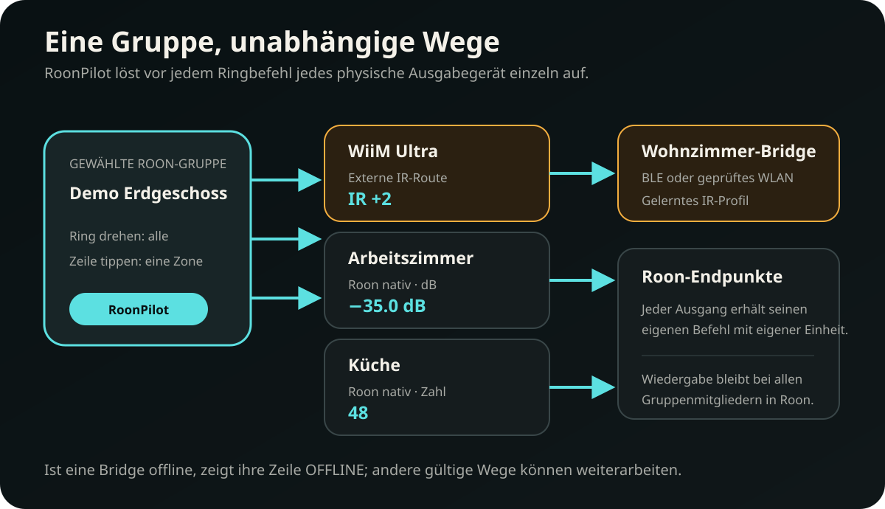
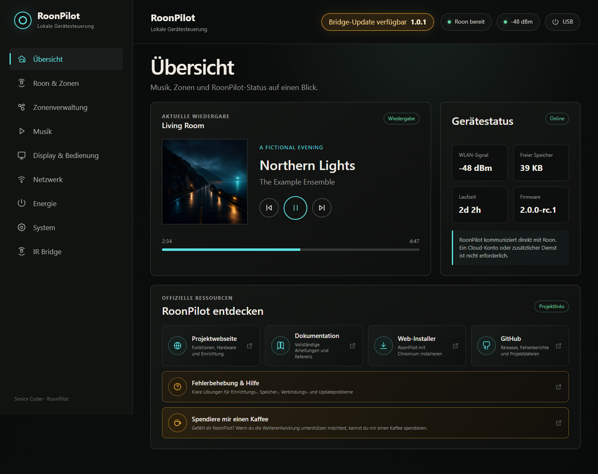
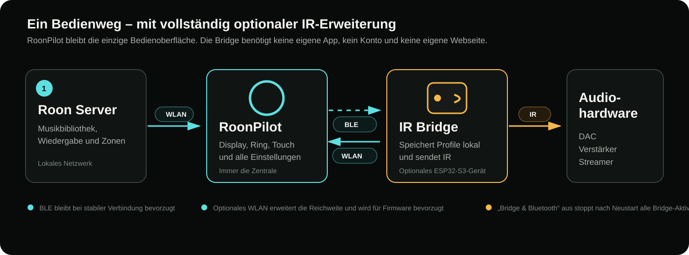
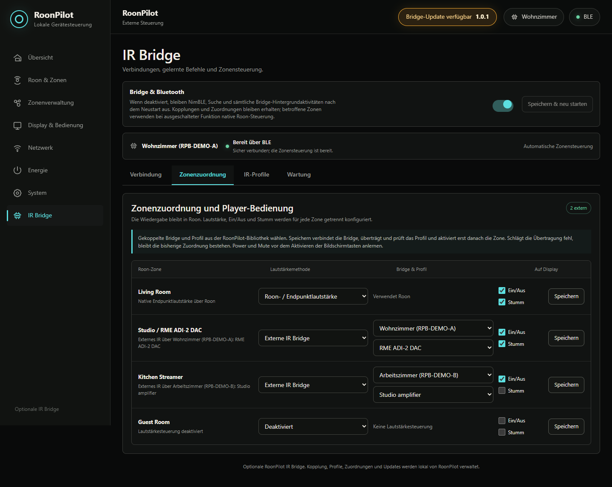
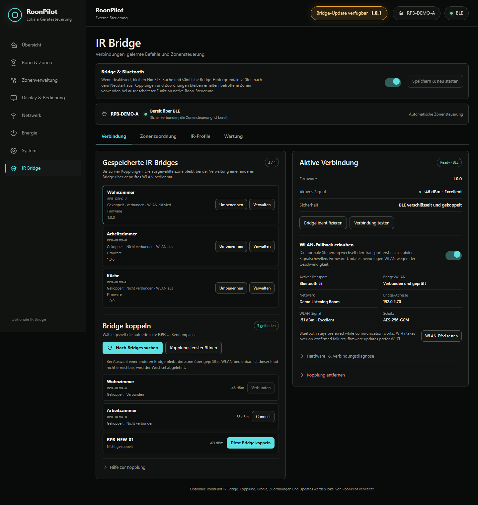

# RoonPilot

### Die haptische Fernbedienung für Roon

**Ring drehen. Musik berühren. Raum steuern.**

*RoonPilot auf der originalen Waveshare ESP32-S3-Knob-Touch-LCD-1.8-Hardware.*

**Deutsch** · [English](README.md)

**[Projektseite →](https://mermayer.github.io/RoonPilot/de/)** · **[Installation →](#hier-beginnen)** · **[Fehlerbehebung →](guides/de/troubleshooting.md)**

**Hardware gesucht?** [Bezugsquellen: Amazon.de, Amazon.co.uk, Amazon.com, EU-Händler oder Waveshare →](guides/de/hardware-and-two-processors.md#bezugsquellen)

**[3D-Stand: Anleitung & STL-Dateien →](guides/de/roonpilot-stand.md)** · **[IR-Bridge-Gehäuse: Anleitung & STL-Dateien →](guides/de/ir-bridge-enclosure.md)**

**[Release Notes 2.0.2 →](docs/release-notes-2.0.2.de.md)** · **[Änderungsprotokoll →](CHANGELOG.de.md)**

## Videoanleitungen zur Installation

Beginne mit RoonPilot. Companion-Firmware und IR Bridge sind optional.

  
  
  

> [!NOTE]
> **Aktuelle USB-Firmware: 2.0.2.**
> Die optionale IR-Bridge-Firmware **1.0.0** ist mit dieser Ausgabe verfügbar.
> Beide USB-Webinstaller bleiben verfügbar; IR-Bridge-Onlineupdates sind nicht betroffen.

> [!WARNING]
> **RoonPilot-Onlineupdates sind vorübergehend gesperrt.** Bitte den internen
> RoonPilot-Updater nicht verwenden. Für eine saubere Installation von 2.0.2 den
> [USB-Webinstaller](https://mermayer.github.io/RoonPilot/de/firmware/?v=2.0.2-usb) verwenden.
> Dabei werden RoonPilot-Einstellungen, Profile, WLAN und Bridge-Kopplungen gelöscht.
> Die vorhandene Firmware kann noch eine alte Update-Meldung oder einen Prüffehler anzeigen.
> Updates der separaten IR Bridge bleiben verfügbar.

RoonPilot macht aus Waveshares kompaktem Controller mit rundem Display eine
schnelle, eigenständige Roon-Fernbedienung. Der Außenring regelt die
Lautstärke, das Touchdisplay übernimmt Wiedergabe und Zonenwahl, und die vom
Cover bestimmte Oberfläche hält die Musik sichtbar, ohne zum Telefon greifen
zu müssen.

RoonPilot spricht im lokalen Netzwerk direkt mit Roon. Es wird weder ein
Raspberry Pi noch ein Docker-Container, Node.js-Host, Desktop-Helfer,
Cloudkonto oder zusätzlicher ständig laufender RoonPilot-Dienst benötigt. Die
gleiche einheitliche Firmware kann optional eine RoonPilot IR Bridge für Zonen
verwalten, deren DAC, Verstärker oder Streamer die benötigte Hardwaresteuerung
nicht über Roon anbietet. Bei ausgeschaltetem Bridge-Hauptschalter bleiben
Bluetooth und sämtliche Bridge-Hintergrundaufgaben nach dem Neustart aus.

> [!NOTE]
> **Aus Freude an Musik und Technik**
>
> RoonPilot ist ein privates Hobbyprojekt, das aus Spaß an Musik, Technik und
> eigener Entwicklung entstanden ist – ohne kommerzielle Absichten. Es gibt
> keine Werbung, keine Abonnements und keine versteckten Kosten. RoonPilot
> übermittelt weder persönliche Daten noch Nutzungs- oder Telemetriedaten an
> den Entwickler oder an Dritte. Wer sich freiwillig für die investierte Zeit
> und Arbeit bedanken möchte, kann das hier tun:
>
>  
>
> **Support und Austausch:** im
> [Roon Community Forum](https://community.roonlabs.com/t/new-big-thing-roonpilot-the-new-era-of-roon-control)
> oder über [GitHub Issues](https://github.com/mermayer/RoonPilot/issues).

## Hier beginnen

Für die normale Installation direkt den
**[RoonPilot-Webinstaller öffnen →](https://mermayer.github.io/RoonPilot/de/firmware/)**.
Chrome oder Edge zeigt die angeschlossenen Geräte selbst im Auswahldialog an.
Dort ist der Name **vor der Klammer** entscheidend:

- **USB JTAG/serial debug unit** ist der richtige ESP32-S3 für RoonPilot.
- Erscheint **USB serial**, den Dialog geöffnet lassen, USB abziehen, den
  USB-C-Stecker um 180 Grad drehen und neu verbinden. Der Webinstaller erkennt
  das Gerät sofort wieder.

Geräte-Manager und macOS-Systembericht sind für die normale Installation nicht
nötig. Wer die Prozessorseite zusätzlich kontrollieren möchte, findet diese
freiwillige Prüfung in den ausführlichen Anleitungen für
[Windows](guides/de/installation-windows.md) und
[macOS](guides/de/installation-macos.md).

Nach dem Flashen [WLAN und Roon erstmals einrichten](guides/de/first-time-setup.md)
und danach [Display, Ring, Touch und Gesten kennenlernen](guides/de/device-controls.md).

Der [vollständige Dokumentationsindex](guides/de/README.md) erklärt außerdem
jeden Bildschirm, jede Webseite, Updates, Wiederherstellung,
Konfigurationssicherung, Akku-Kalibrierung, Datenschutz und Fehlerbehebung.

> [!IMPORTANT]
> Das Board enthält **zwei unabhängige ESP-Prozessoren**. Für RoonPilot im
> Geräteauswahldialog des Webinstallers immer **USB JTAG/serial debug unit**
> wählen. **USB serial** gehört zum getrennten Begleitprozessor.

Eine [optionale Sicherung der Original-Firmware](guides/de/factory-backup.md)
ist sinnvoll, wenn später möglicherweise der exakte Auslieferungszustand des
Herstellers wiederhergestellt werden soll. Sie ist keine Voraussetzung für die
Installation von RoonPilot. Die gewählte Anleitung für
[Windows](guides/de/installation-windows.md) oder
[macOS](guides/de/installation-macos.md) führt nach der USB-Prüfung zum
öffentlichen Webinstaller.

Auch die Stromspar-Firmware des zweiten Prozessors lässt sich einfach
installieren und bleibt vollständig freiwillig. Der Zugang erfolgt über die
getrennte Companion-Anleitung für
[Windows](guides/de/companion-installation-windows.md) oder
[macOS](guides/de/companion-installation-macos.md).

## Was RoonPilot besonders macht

- Lautstärkeregelung über den kompletten äußeren Drehring. RoonPilot erkennt
  dimensionslose, dB- und relative Lautstärkeausgänge automatisch, übernimmt
  die von Roon gelieferte Einheit unverändert und zeigt echte dB-Werte an.
- Vier Player-Layouts: Classic, Focus, Orbit mit Vollbild-Cover und die
  coverfarbige Ansicht Aura ohne Coverbild.
- Optional kann die ungefähr covergroße Displaymitte in allen Playeransichten
  als besonders leicht treffbare Play/Pause-Touchfläche dienen.
- Direkte Roon-Verbindung, Freigabe, Zonenstatus und Befehle im ESP32-S3.
- Zonenwahl direkt am Gerät per Touch oder Ring.
- Roon-Gruppen mit Einzelsteuerung: Ring für die ganze Gruppe drehen oder eine
  große Mitgliederzeile antippen und nur diesen physischen Ausgang regeln.
  Zahlenwert, echte dB, relative Roon- und mehrere IR-Bridge-Routen dürfen sich
  dabei mischen.
- Schwarzer Ruhezustand, Bahnhofsuhr oder Digitaluhr mit Datum.
- Optionaler echter Deep Sleep bei pausierter/gestoppter Zone, Aufwachen per
  Touch oder Drehring.
- Responsive Konfigurationsseiten direkt aus dem Gerät, ohne Cloud.
- Gemeinsame Umschaltung auf Deutsch oder Englisch für Gerätedisplay,
  Schnelleinstellungen und sämtliche lokalen Webseiten; Roon-Metadaten und
  selbst vergebene Namen bleiben unverändert.
- Export/Import ohne WLAN-Kennwort und andere Geheimnisse.
- Signierte A/B-Updates mit Startprüfung und automatischem Rollback.
- Auffälliger Updatehinweis auf allen lokalen Webseiten und optional höchstens
  einmal täglich am Gerät; quittierbar und ohne automatische Installation.
- Nach der Einrichtung ist für den normalen Betrieb kein Browser nötig.
- Optionale Hardwaresteuerung per IR: Einzelne Zonen können einer von bis zu
  vier gespeicherten Bridges zugeordnet werden; alle anderen bleiben bei der
  nativen Roon-Steuerung.

## Die vier Playeransichten und weitere Gerätebildschirme

<table>
  <tr>
    <td align="center"> <b>Classic</b></td>
    <td align="center"> <b>Focus</b></td>
    <td align="center"> <b>Orbit</b></td>
    <td align="center"> <b>Aura</b></td>
  </tr>
  <tr>
    <td align="center"> <b>Zonenwahl</b></td>
    <td align="center"> <b>Schnelleinstellungen</b></td>
    <td align="center"> <b>IP &amp; Roon Server</b></td>
  </tr>
  <tr>
    <td align="center"> <b>IR Bridges</b></td>
    <td align="center"> <b>Ruhige IR-Rückmeldung</b></td>
    <td align="center"> <b>Classic-Bedienung</b></td>
  </tr>
  <tr>
    <td align="center"> <b>Playlisten</b></td>
    <td align="center"> <b>Live Radio</b></td>
  </tr>
  <tr>
    <td align="center"> <b>Ganze Gruppe</b></td>
    <td align="center"> <b>Ein Gruppenmitglied</b></td>
    <td align="center"> <b>Gemischte Wege</b></td>
  </tr>
</table>

Hintergrund und Farbverlauf werden aus dem aktuellen Cover abgeleitet und
bleiben dunkel genug für lesbaren Text. Die Akzentfarbe kann am Gerät und auf
der Webseite eingestellt werden. Mit Ausnahme der maßgeblichen Classic-
Projektreferenz verwenden die erläuternden Renderbilder fiktive Musik, Räume,
Netzwerknamen und Dokumentationsadressen.

Von Roon gelieferte Metadaten bleiben als UTF-8 erhalten. Die eingebetteten
Display-Schriften decken erweiterte europäische lateinische Zeichen, Griechisch,
Kyrillisch, häufige Symbole und eine ausgewählte Gruppe einfarbiger Emoji ab.
Große asiatische Schriftsysteme sind wegen ihres erheblichen Speicherbedarfs
nicht gebündelt; die Browseroberfläche ist davon nicht betroffen.

## Bedienung im Alltag

*Die optionale unsichtbare Mittelfläche erleichtert Play/Pause, ohne die
Playeransicht zu verändern. Ein Klick öffnet das Schaubild in voller Größe;
alle Gesten stehen in der [kompletten Gerätebedienung](guides/de/device-controls.md).*

| Aktion | Ring | Touch |
| --- | --- | --- |
| Lautstärke ändern | Drehen | – |
| Wiedergabe/Pause | – | Mittlere Taste oder optionale große Mittelfläche antippen |
| Zurück/Weiter | – | Taste antippen oder horizontal wischen |
| Zonenwahl öffnen | – | Zonennamen antippen |
| Zonen-/Menüseiten wechseln | Drehen | Wischen oder tippen |
| Schnelleinstellungen öffnen | – | Auf „Now Playing“ nach oben wischen |
| Bedienung sperren/entsperren | – | Displaymitte lange drücken |
| Display sofort ausschalten | – | Doppeltipp in die Displaymitte, wenn die große Play/Pause-Fläche aus ist |
| Display/Uhr aufwecken | Drehen | Tippen |
| Aus Deep Sleep aufwecken | Drehen, dann Start abwarten | Tippen, dann Start abwarten |

Bei einer gruppierten Roon-Zone öffnet das erste einzelne Ringraster nur den
großen Gruppenmixer und verändert noch keine Lautstärke. Weiterdrehen regelt die
Gruppe; alternativ zuerst eine Mitgliederzeile antippen. Einzelheiten stehen
unter [Roon-Gruppen und Gruppenmixer](guides/de/roon-groups.md).

Der erste Menüpunkt **System** zeigt die Geräte-IP, den verbundenen Roon Server
und den Verbindungszustand. Damit lässt sich die lokale Webseite auch ohne
Kenntnis der Router-Oberfläche finden.

## Lokale Weboberfläche

Die lokale Oberfläche bietet Live-Status, Zonenverwaltung, manuelle
Roon-Serveradresse, Display- und Uhreinstellungen, Drehreglerkonfiguration,
WLAN-Wechsel, Auswahl der Akkuhardware, Akku-Kalibrierung, Deep Sleep, Diagnose,
sicheren Konfigurationsexport/-import sowie lokale und signierte Online-Updates.
Hinzu kommen Roon-Playlisten und Live Radio mit einer auf Webseite und Gerät
gemeinsam verwendeten Sortierung, Vibrationsstärke, die optionale große
Play/Pause-Touchfläche, ein Neustarts überstehendes Ereignislog, eine gemeinsame
Deutsch/Englisch-Sprachwahl sowie pro Zone native Roon-, IR- oder deaktivierte
Lautstärkerouten, Power/Mute und bis zu drei benannte HTTP-Ein/Aus-Aktionspaare.

## Optionale RoonPilot IR Bridge

Die Bridge ist ein getrenntes ESP32-S3-Modul in Sichtweite des zu steuernden
Geräts. Kopplung, Verbindungsweg, gelernte Profile, Zonenrouting, Backup,
Diagnose und signierte Onlineupdates werden vollständig von RoonPilot aus
verwaltet. Es gibt keine separate Bridge-App, kein Cloudkonto und keinen
zusätzlichen Server.

Ein konkretes Beispiel ist eine **WiiM-Ultra-Roon-Zone mit einem RME ADI-2
DAC**. Die Wiedergabesteuerung bleibt bei Roon, während Lautstärke, Mute und
Power über die gelernten RME-Infrarotbefehle laufen. Dadurch ändert der RME den
Hardwarepegel selbst und seine Auto-Ref-Level-Funktion bleibt erhalten, statt
durch eine digitale Lautstärkeabsenkung in Roon ersetzt zu werden.

<table>
  <tr>
    <td width="50%"></td>
    <td width="50%"></td>
  </tr>
  <tr>
    <td align="center"><b>Jede Zone wählt ihren Steuerweg</b></td>
    <td align="center"><b>Alle benötigten Gruppen-Bridges bleiben ansprechbar</b></td>
  </tr>
</table>

- Bis zu vier gekoppelte Bridges können in einem RoonPilot gespeichert sein.
- Die **automatische Zonensteuerung** folgt der gewählten Zone oder Gruppe. Eine
  Einzelzone nutzt ihre zugeordnete Bridge; eine Gruppe kann mehrere benötigte
  Bridges über einen BLE-Link und getrennte authentifizierte WLAN-Wege bereithalten.
- Verschlüsseltes BLE wird bevorzugt; ein authentifizierter lokaler
  WLAN-Rückfall ist für andere Räume optional zuschaltbar.
- Jede Bridge kann bis zu acht Geräteprofile speichern.
- Volume up/down, Mute, Power on und Power off werden getrennt gelernt – mit
  erkanntem Protokoll/Wiederholungstiming oder verlustarmem Rohdaten-Rückfall.
- Bei externer IR-Lautstärke zeigt RoonPilot einen relativen amberfarbenen
  `+ / −`-Zähler und erfindet keinen absoluten DAC-Pegel.
- Bridge-Onlineupdates werden gemeldet, aber niemals automatisch installiert.
- **Bridge & Bluetooth** aus erhält Kopplungen und Routen, verhindert nach dem
  Neustart aber Bluetooth, Scans, Bridge-Verkehr und Bridge-Updateprüfungen.

Zuerst die [vollständige IR-Bridge-Übersicht](guides/de/ir-bridge.md) lesen und
danach die [bebilderte Hardware- und Factory-Installation](guides/de/ir-bridge-installation.md)
durchführen.
Das [3D-druckbare Bridge-Gehäuse](guides/de/ir-bridge-enclosure.md) enthält
Außen-/Innenansicht und alle STL-Downloads.

## Optionaler 3D-gedruckter Stand

<table>
  <tr>
    <td align="center"> <b>Vierteiliger Stand</b></td>
    <td align="center"> <b>RoonPilot eingesetzt</b></td>
  </tr>
</table>

Der optionale Stand hält RoonPilot schräg und integriert einen USB-C-Halter.
Die [bebilderte Standanleitung](guides/de/roonpilot-stand.md) bietet alle vier
STL-Dateien einschließlich der Rückwand zum Herunterladen an.

## Installation und Updates

- **Factory-Abbild:** vollständige Erstinstallation oder Wiederherstellung ab
  Adresse `0x0`; löscht den kompletten ESP32-S3 und alle Einstellungen.
- **OTA-Abbild:** Update eines bereits laufenden RoonPilot über dessen lokale
  Firmwareseite; Einstellungen bleiben normalerweise erhalten.
- **Companion-Abbild:** getrennte Browser-Installation ausschließlich für den
  klassischen zweiten ESP32; eine Original-Sicherung ist freiwillig und nur
  für einen späteren Rückweg zum exakten Herstellerzustand nötig.

Der USB-Web-Installer funktioniert nur mit einem aktuellen Chromium-
Desktopbrowser mit Web Serial, zum Beispiel Chrome oder Edge. Nach der ersten
Factory-Installation erfolgen normale Updates über **System → Firmware update
→ Check for updates** auf der Geräte-Webseite. Haupt- und Companion-Installer
verwenden getrennte, auf die jeweilige Prozessorfamilie beschränkte Manifeste.

**Installationsanleitungen:** [Windows](guides/de/installation-windows.md) · [macOS](guides/de/installation-macos.md) · **Optionaler Companion:** [Windows](guides/de/companion-installation-windows.md) · [macOS](guides/de/companion-installation-macos.md)

**Von 2.0.2 zurück auf 1.0.2?** Die getrennte Anleitung
[Zurück zu RoonPilot 1.0.2](guides/de/return-to-1.0.2.md) und die
[feste 1.0.2-Auswahl im Webinstaller](https://mermayer.github.io/RoonPilot/de/firmware/?version=1.0.2#web-installer-title)
verwenden. Diese saubere USB-Installation löscht RoonPilot-Einstellungen und
Profile. Sicherungen aus 1.0.2 und 2.0.x getrennt aufbewahren und unter 1.0.2
keine Akkukalibrierung durchführen.

Einfache Schrittfolgen: [Windows](guides/de/installation-windows.md) ·
[macOS](guides/de/installation-macos.md) ·
[optionaler Companion](guides/de/companion-firmware.md). Der Geräteauswahldialog
des Webinstallers genügt zur Erkennung; Geräte-Manager und Systembericht sind
für die normale Installation nicht nötig.

## Hardware

**Kaufen:** [Amazon.de, Amazon.co.uk, Amazon.com, EU-Händler und Waveshare](guides/de/hardware-and-two-processors.md#bezugsquellen) – mit Bestellnummern für die Varianten mit und ohne Akku.

| Merkmal | Zielhardware |
| --- | --- |
| Produkt | Waveshare ESP32-S3-Knob-Touch-LCD-1.8 |
| Hauptprozessor | ESP32-S3R8, bis 240 MHz |
| Flash / PSRAM | 16 MB / 8 MB |
| Display | 1,8-Zoll rundes IPS-LCD, 360 × 360, kapazitiver Touch |
| Bedienung | Kompletter Drehring plus Touchdisplay |
| Funk | 2,4-GHz-WLAN und Bluetooth-Hardware |
| Begleitprozessor | ESP32-U4WDH mit unabhängigem 4-MB-Flash |
| Weitere Hardware | PCM5100A-DAC, Mikrofon, Vibrationsmotor, microSD |
| Stromversorgung | USB-C oder optionaler interner 3,7-V-/800-mAh-Akku |

Der ESP32-S3 führt RoonPilot aus. Für den ungenutzten Begleitprozessor steht
eine kleine freiwillige Stromspar-Firmware mit eigenem Webinstaller bereit. Sie
ist für RoonPilot und die Roon-Kommunikation nicht erforderlich.

Die vom ESP32-S3 gemessene Spannung stammt von der geregelten Systemschiene,
nicht direkt vom Li-Ion-Akku. Eine ehrliche exakte Prozent- oder
Restlaufzeitanzeige ist daher nicht möglich. Da es Gerätevarianten mit und ohne
Akku gibt, aber keinen eigenen „Akku vorhanden“-Kontakt, stehen unter **Energie >
Eingebauter Akku** die Optionen **Automatisch**, **Eingebaut** und **Nicht
eingebaut** bereit. Die Automatik merkt sich einen positiven USB-zu-Akku-Wechsel;
**Nicht eingebaut** entfernt Akkuanzeige und Kalibrierung, lässt aber alle für
eine Powerbank sinnvollen Energieeinstellungen bestehen. Die dokumentierte
Laufzeitkalibrierung ermittelt einen reproduzierbaren Richtwert für das konkrete
Gerät.

Für eine gültige Kalibrierung RoonPilot vorher an einem stabilen
USB-Netzteil/Ladegerät vollständig laden. Ein Computer-USB-Port kann am Board
eine niedrigere Spannung liefern und das Gerät betreiben, ohne den Akku
vollständig zu laden.

## Dokumentation

- [Dokumentationsindex](guides/de/README.md)
- [Hardware und zwei Prozessoren](guides/de/hardware-and-two-processors.md)
- [Original-Firmware sichern](guides/de/factory-backup.md)
- [Optionale Companion-Firmware](guides/de/companion-firmware.md)
- [Companion-Installation unter Windows](guides/de/companion-installation-windows.md)
- [Companion-Installation unter macOS](guides/de/companion-installation-macos.md)
- [Standalone- oder Python-esptool unter macOS](guides/de/esptool-macos.md)
- [Windows oder macOS wählen](guides/de/installation.md)
- [Installation unter Windows](guides/de/installation-windows.md)
- [Installation unter macOS](guides/de/installation-macos.md)
- [Ersteinrichtung](guides/de/first-time-setup.md)
- [Bedienung am Gerät](guides/de/device-controls.md)
- [Roon-Gruppen und Gruppenmixer am Gerät](guides/de/roon-groups.md)
- [Alle Gerätebildschirme](guides/de/screen-reference.md)
- [Alle Webseiten](guides/de/web-interface.md)
- [Firmwareupdates und Wiederherstellung](guides/de/firmware-updates-and-recovery.md)
- [Von 2.0.2 zurück zu RoonPilot 1.0.2](guides/de/return-to-1.0.2.md)
- [Akku und Laufzeit](guides/de/battery-and-runtime.md)
- [Deep Sleep](guides/de/deep-sleep.md)
- [Fehlerbehebung](guides/de/troubleshooting.md)
- [Datenschutz und Sicherheit](guides/de/privacy-and-security.md)
- [Lizenzierung und Weitergabe](guides/de/licensing.md)
- [Optionale IR Bridge: Übersicht und Dokumentationsweg](guides/de/ir-bridge.md)
- [IR-Bridge-Hardware und Factory-Installation](guides/de/ir-bridge-installation.md)
- [3D-druckbarer RoonPilot-Stand](guides/de/roonpilot-stand.md)
- [3D-druckbares IR-Bridge-Gehäuse](guides/de/ir-bridge-enclosure.md)
- [Verbindungen und automatische Zonensteuerung](guides/de/ir-bridge-connectivity.md)
- [IR-Profile und Zonenrouting](guides/de/ir-bridge-zones-and-profiles.md)
- [IR-Bridge-Updates und Wiederherstellung](guides/de/ir-bridge-updates.md)
- [IR-Bridge-Fehlerbehebung](guides/de/ir-bridge-troubleshooting.md)

## Projekt und Marken

RoonPilot wurde von **Senior Coder** entworfen und entwickelt. Es ist ein
unabhängiges, nicht kommerzielles Projekt und weder mit Roon Labs noch mit
Waveshare verbunden oder von ihnen empfohlen. Roon ist eine Marke von Roon
Labs. Waveshare-Produktnamen dienen ausschließlich zur Bezeichnung der
unterstützten Hardware.

Für die RoonPilot-eigenen Teile gilt die RoonPilot-Lizenz für private
Binärnutzung 1.0. Sie erlaubt die Installation der offiziellen unveränderten
Firmware über den autorisierten Web Installer sowie die private, nicht
kommerzielle Nutzung. Weitergabe, Veränderung, Reverse Engineering,
Quellcode-Rückgewinnung, Wettbewerbsanalyse und kommerzielle Nutzung sind
untersagt, soweit zwingendes Recht keine Ausnahme vorsieht.
Drittanbieterbestandteile behalten ihre unabhängigen Lizenzen. Die genaue
Trennung erklärt [Lizenzierung und erlaubte Nutzung](guides/de/licensing.md).

Copyright © 2026 Senior Coder. Siehe [LICENSE](LICENSE.md), [NOTICE](NOTICE)
und [Hinweise zu Drittanbietern](THIRD_PARTY_NOTICES.md).
