<div align="center">

# RoonPilot

### A dedicated tactile controller for Roon

**Turn the ring. Touch the music. Control the room.**

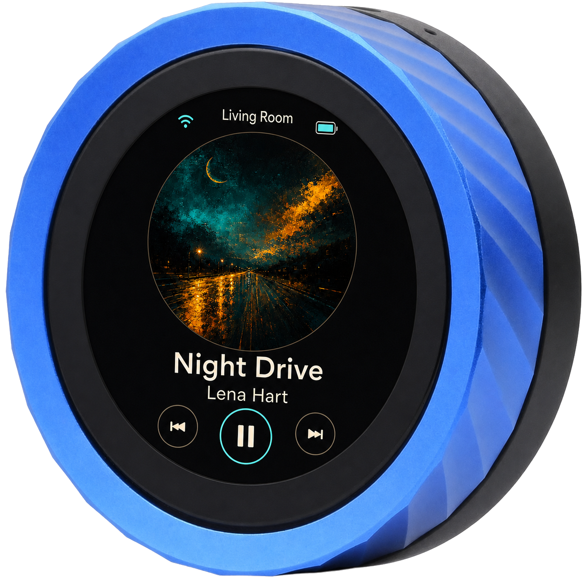

*RoonPilot running on the original Waveshare ESP32-S3-Knob-Touch-LCD-1.8 hardware.*

[Deutsch](README.de.md) · **English**

[Project website](https://mermayer.github.io/RoonPilot/) · [Web Installer](https://mermayer.github.io/RoonPilot/firmware/)

</div>

RoonPilot turns Waveshare's compact round display controller into a fast,
self-contained remote for Roon. The physical ring controls volume, the touch
display handles transport and zone selection, and the artwork-led interface
keeps the music visible without reaching for a phone.

RoonPilot talks directly to Roon over the local network. It needs no Raspberry
Pi, Docker container, Node.js host, desktop helper, cloud account or additional
always-on RoonPilot service.

## Start here

If the device has just arrived, read these pages in order:

1. [Know the hardware and its two processors](guides/hardware-and-two-processors.md)
2. [Back up both factory firmwares](guides/factory-backup.md)
3. [Install RoonPilot safely](guides/installation.md)
4. [Complete Wi-Fi and Roon first-time setup](guides/first-time-setup.md)
5. [Learn the display, ring, touch and gestures](guides/device-controls.md)

The complete [documentation index](guides/README.md) also covers every screen,
every web page, updates, recovery, configuration backup, battery calibration,
privacy and troubleshooting.

> [!IMPORTANT]
> This board contains **two independent ESP processors**. Rotating the USB-C
> plug can connect Windows to a different processor. Never erase or flash until
> the chip identity has been checked. The ESP32-S3 Factory image and the classic
> ESP32 companion image are not interchangeable.

After completing and checking both backups, open the public
[RoonPilot Web Installer](https://mermayer.github.io/RoonPilot/firmware/) in a
current desktop Chromium browser.

## Why it feels different

- **Real volume control:** use the outer rotary ring instead of a small slider.
- **Three player layouts:** Classic, Focus and full-artwork Orbit.
- **Direct Roon connection:** discovery, authorization, zone state and commands
  run on the ESP32-S3 itself.
- **Room selection on the device:** browse shown zones with touch or the ring,
  then select on the display.
- **Useful idle modes:** black screen, station clock or digital clock with date.
- **Real deep sleep:** optional ESP32-S3 shutdown while the selected zone is
  paused/stopped, with touch and ring wake-up.
- **Local configuration:** responsive web pages are served by RoonPilot itself.
- **Private by design:** no cloud relay and no password in configuration exports.
- **Recoverable updates:** signed A/B firmware updates with boot validation and
  rollback support.
- **Independent operation:** after setup, a browser is not needed for normal use.

## The three player screens

<table>
  <tr>
    <td align="center">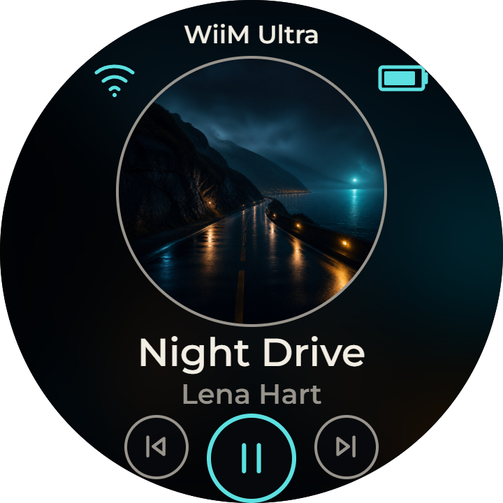<br><b>Classic</b><br>Balanced artwork and controls</td>
    <td align="center">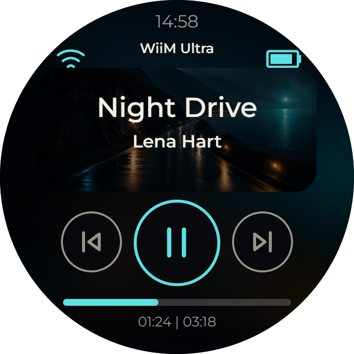<br><b>Focus</b><br>Large transport controls</td>
    <td align="center">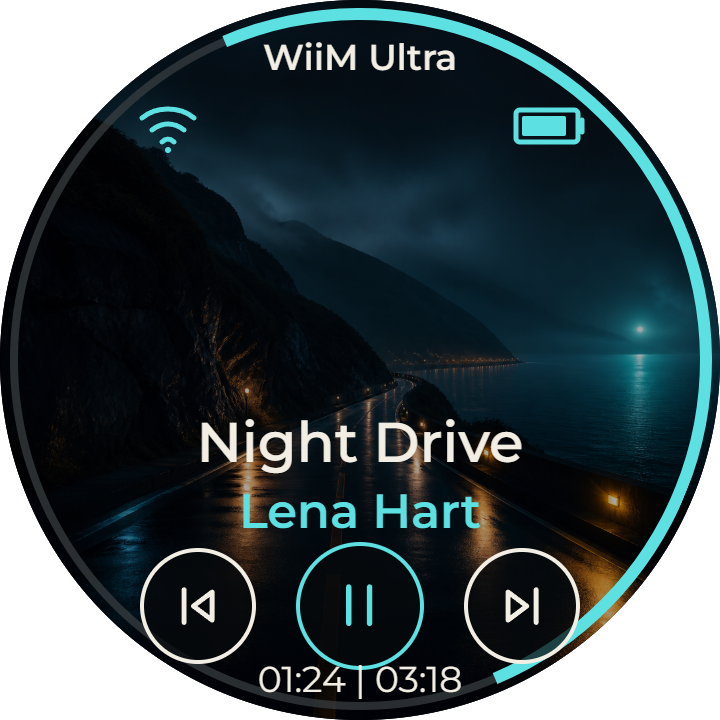<br><b>Orbit</b><br>Full-screen artwork</td>
  </tr>
</table>

The screen background is derived from the current cover and kept dark enough
for readable text. The active accent colour is configurable on the device and
in the web interface.

## Everyday control

[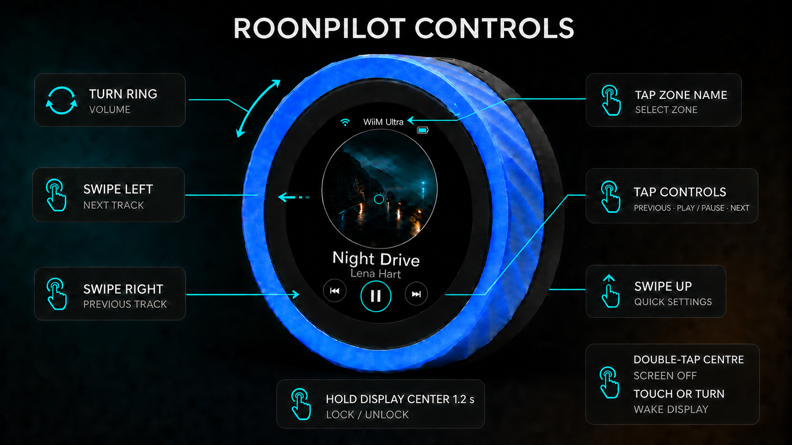](docs/assets/roonpilot-controls-overview.png)

*Click the infographic for the full-resolution view. Detailed explanations are
available in the [complete device controls guide](guides/device-controls.md).*

| Action | Ring | Touch |
| --- | --- | --- |
| Change volume | Turn | — |
| Play or pause | — | Tap centre transport button |
| Previous/next | — | Tap a transport button or swipe horizontally |
| Open zone picker | — | Tap the zone name |
| Browse zone/menu pages | Turn | Swipe or tap |
| Open Quick Settings | — | Swipe up on Now Playing |
| Lock/unlock controls | — | Long-press the centre of the display |
| Wake the screen/clock | Turn | Tap |
| Wake from deep sleep | Turn, then wait for boot | Tap, then wait for boot |

See [Device controls](guides/device-controls.md) for timing, locked-operation
feedback, screen-off wake-up and settings details.

## Device screen gallery

RoonPilot includes player, volume, zone, pairing, clock, setup, maintenance and
error views. Every current view is shown and explained in the
[complete screen reference](guides/screen-reference.md).

<table>
  <tr>
    <td align="center">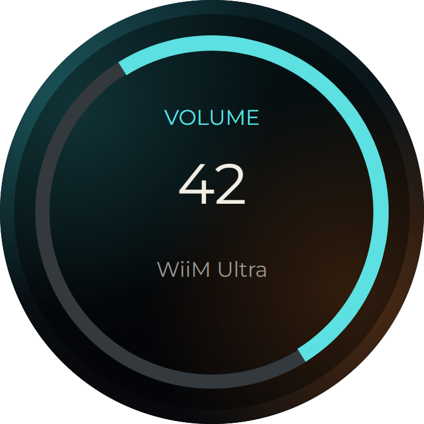<br><b>Volume</b></td>
    <td align="center">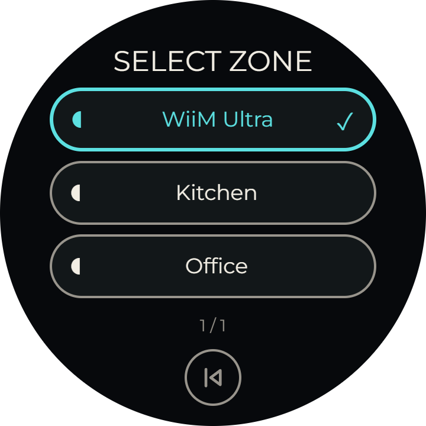<br><b>Zones</b></td>
    <td align="center">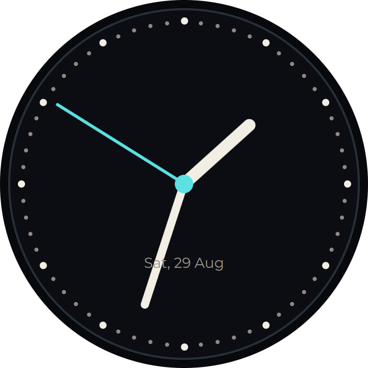<br><b>Station clock</b></td>
  </tr>
  <tr>
    <td align="center">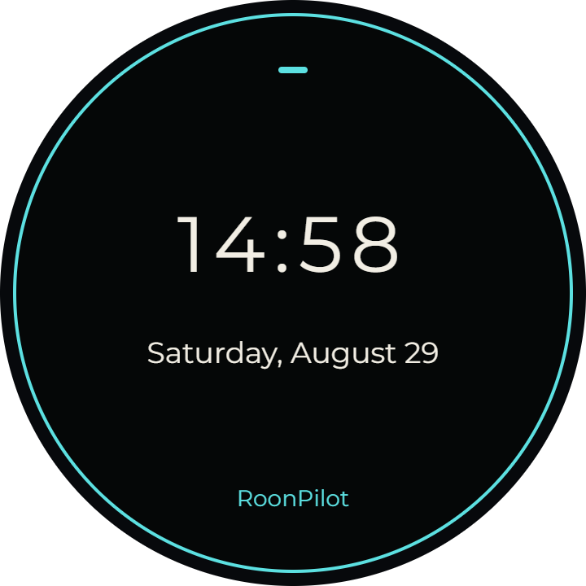<br><b>Digital clock</b></td>
    <td align="center">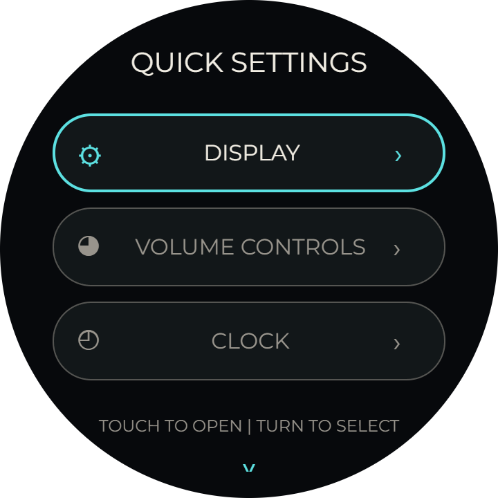<br><b>Quick Settings</b></td>
    <td align="center">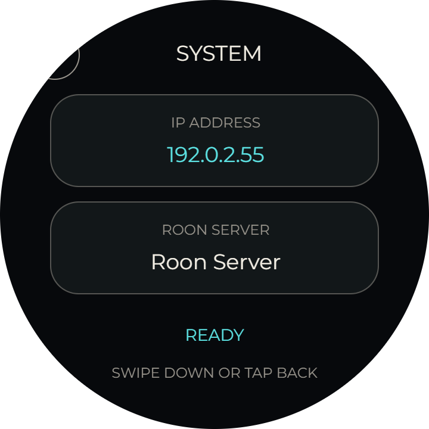<br><b>IP &amp; Roon Server</b></td>
  </tr>
  <tr>
    <td align="center">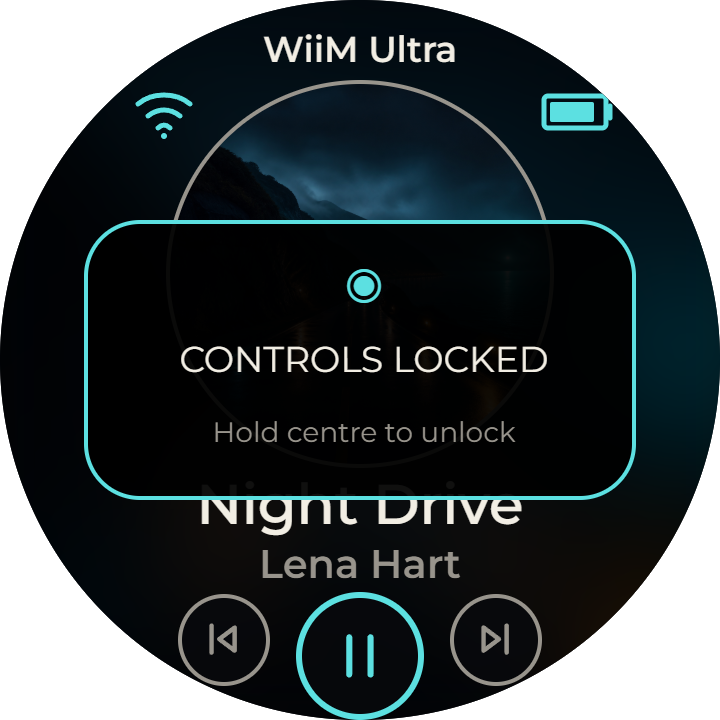<br><b>Control lock</b></td>
  </tr>
</table>

All screenshots use fictional music, rooms, network names and documentation-only
addresses. They contain no private test data.

## Local web interface

Open RoonPilot's local address in a browser to configure it. The interface is
served from the device; it is not a cloud dashboard.

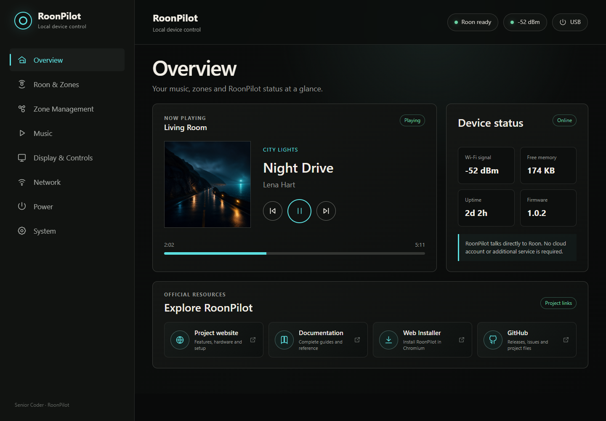

The pages cover:

- live status and basic playback control;
- Roon Server discovery, manual server address and zone selection;
- shown and hidden zones;
- player layout, brightness, dimming, clocks and display rotation;
- rotary direction, step, acceleration and maximum-volume protection;
- Wi-Fi status and network replacement;
- battery runtime calibration and result history;
- guarded deep-sleep timeout and wake policy;
- firmware updates, diagnostics, safe export/import, restart and factory reset.

View every page in the [web-interface reference](guides/web-interface.md).

## No RoonPilot service to install

```text
Touch + rotary ring
        │
        ▼
  RoonPilot firmware ───── local Wi-Fi ───── Roon Server
        ▲                                      │
        └──── subscribed zones + metadata ─────┘
```

RoonPilot uses Roon's Extension protocol and appears in Roon's Extensions page
for one-time approval. A Roon installation and subscription are still required,
but no separate RoonPilot process is installed on the server.

## Hardware

| Feature | Target hardware |
| --- | --- |
| Product | Waveshare ESP32-S3-Knob-Touch-LCD-1.8 |
| Main processor | ESP32-S3R8, up to 240 MHz |
| Main flash / PSRAM | 16 MB / 8 MB |
| Display | 1.8-inch round IPS LCD, 360 × 360, capacitive touch |
| Controls | Full rotary ring plus touch display |
| Wireless | 2.4 GHz Wi-Fi and Bluetooth hardware |
| Companion processor | ESP32-U4WDH with independent 4 MB flash |
| Other onboard hardware | PCM5100A DAC, microphone, vibration motor, microSD |
| Power | USB-C or optional internal 3.7 V / 800 mAh battery |

The main ESP32-S3 runs RoonPilot. The companion ESP32 receives a small optional
low-power firmware so it does not waste energy while RoonPilot is in use. It is
not needed for Roon communication and is never flashed by the main Web Installer.

Purchase links and exact variants are listed in
[Hardware and the two processors](guides/hardware-and-two-processors.md).

## Battery information without invented precision

The exposed ADC measures the board's regulated rail rather than the Li-ion cell,
so RoonPilot cannot honestly calculate a precise battery percentage. The battery
symbol remains a coarse filtered indication. A controlled runtime calibration
can, however, record how long an individual unit operates with a repeatable
display/Wi-Fi profile. Read [Battery and runtime](guides/battery-and-runtime.md)
before interpreting the result.

## Installation, updates and recovery

RoonPilot provides three deliberately separate paths:

- **Factory image:** complete ESP32-S3 installation or recovery from address 0.
- **OTA image:** upload through an already running RoonPilot.
- **Companion image:** classic ESP32 only, after a complete 4 MB factory backup.

The installation guide explains the complete backup and chip-identification
procedure. The browser installer never writes the classic companion ESP32. Do
not guess a file or flash an image based only on its size.

**Ready to install:** [Open the authorized RoonPilot Web Installer](https://mermayer.github.io/RoonPilot/firmware/).

## Documentation

- [Documentation index](guides/README.md)
- [Hardware and two processors](guides/hardware-and-two-processors.md)
- [Factory backup](guides/factory-backup.md)
- [Installation](guides/installation.md)
- [First-time setup](guides/first-time-setup.md)
- [Device controls](guides/device-controls.md)
- [All device screens](guides/screen-reference.md)
- [All web pages](guides/web-interface.md)
- [Firmware updates and recovery](guides/firmware-updates-and-recovery.md)
- [Configuration export and import](guides/configuration-backup.md)
- [Battery and runtime](guides/battery-and-runtime.md)
- [Deep sleep](guides/deep-sleep.md)
- [Troubleshooting](guides/troubleshooting.md)
- [Privacy and security](guides/privacy-and-security.md)
- [Licensing and redistribution](guides/licensing.md)
- [Beginner test plan](guides/test-plan.md)

## Project and trademarks

RoonPilot is designed and developed by **Senior Coder**. It is an independent,
non-commercial project and is not affiliated with or endorsed by Roon Labs or
Waveshare. Roon is a trademark of Roon Labs. Waveshare product names identify
the supported hardware only.

RoonPilot-authored portions use the RoonPilot Personal-Use Binary License 1.0.
It permits installation of official unmodified firmware through the authorized
Web Installer and private noncommercial operation. Redistribution,
modification, reverse engineering, source recovery, competitive analysis and
commercial use are prohibited except where mandatory law provides otherwise.
Third-party portions retain their independent licences. See
[Licensing and permitted use](guides/licensing.md) for the exact distinction.

Copyright © 2026 Senior Coder. See [LICENSE](LICENSE.md), [NOTICE](NOTICE) and
[third-party notices](THIRD_PARTY_NOTICES.md).
