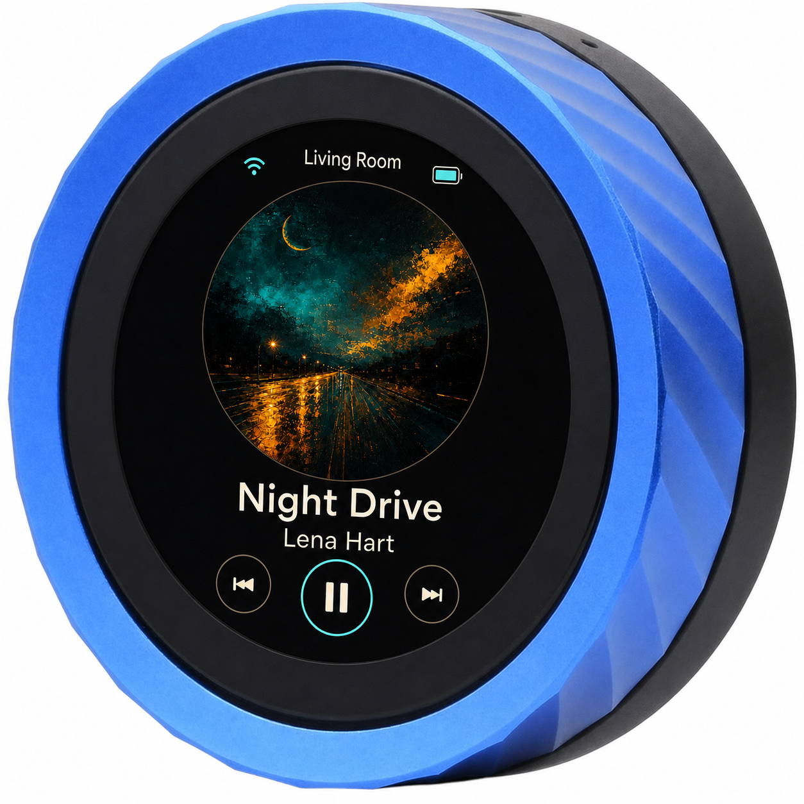
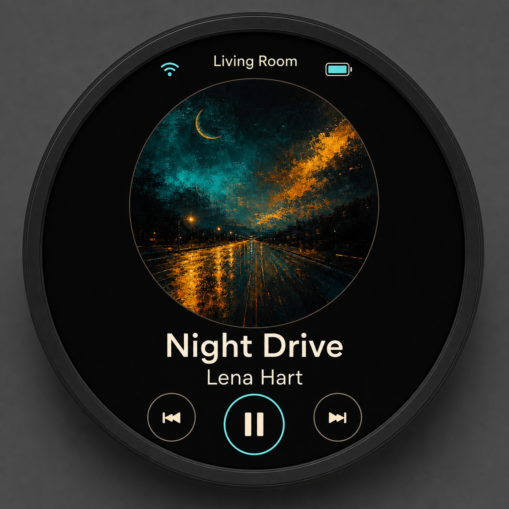
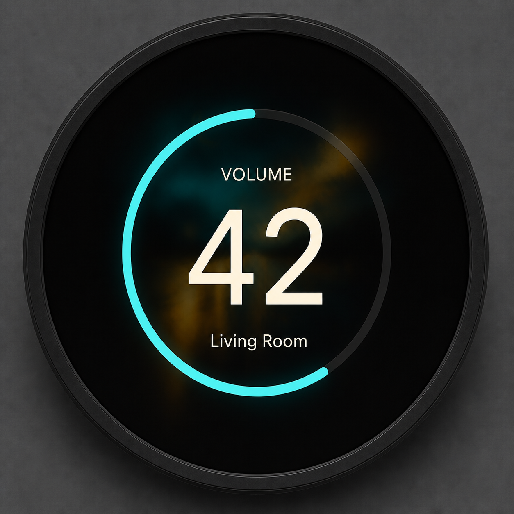
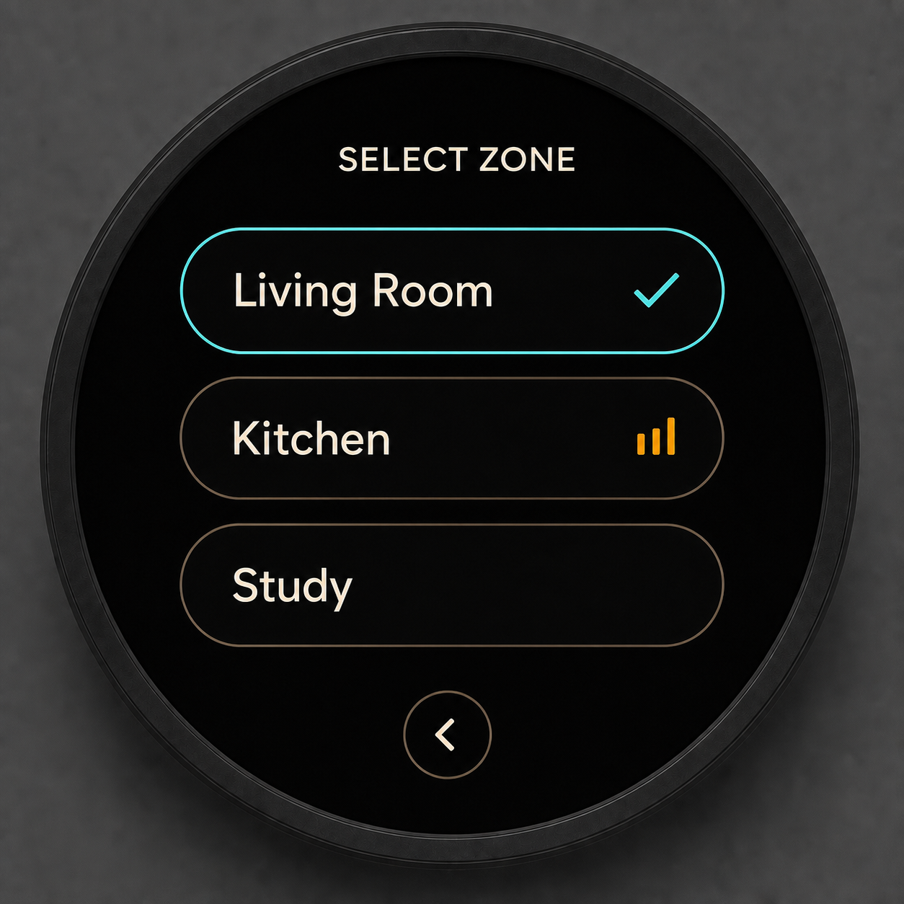
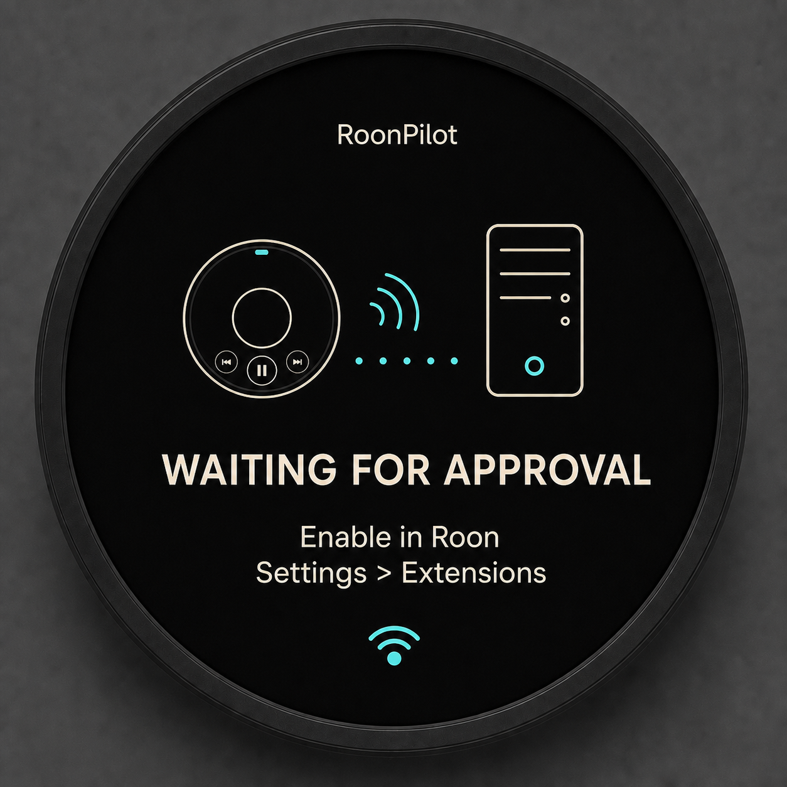
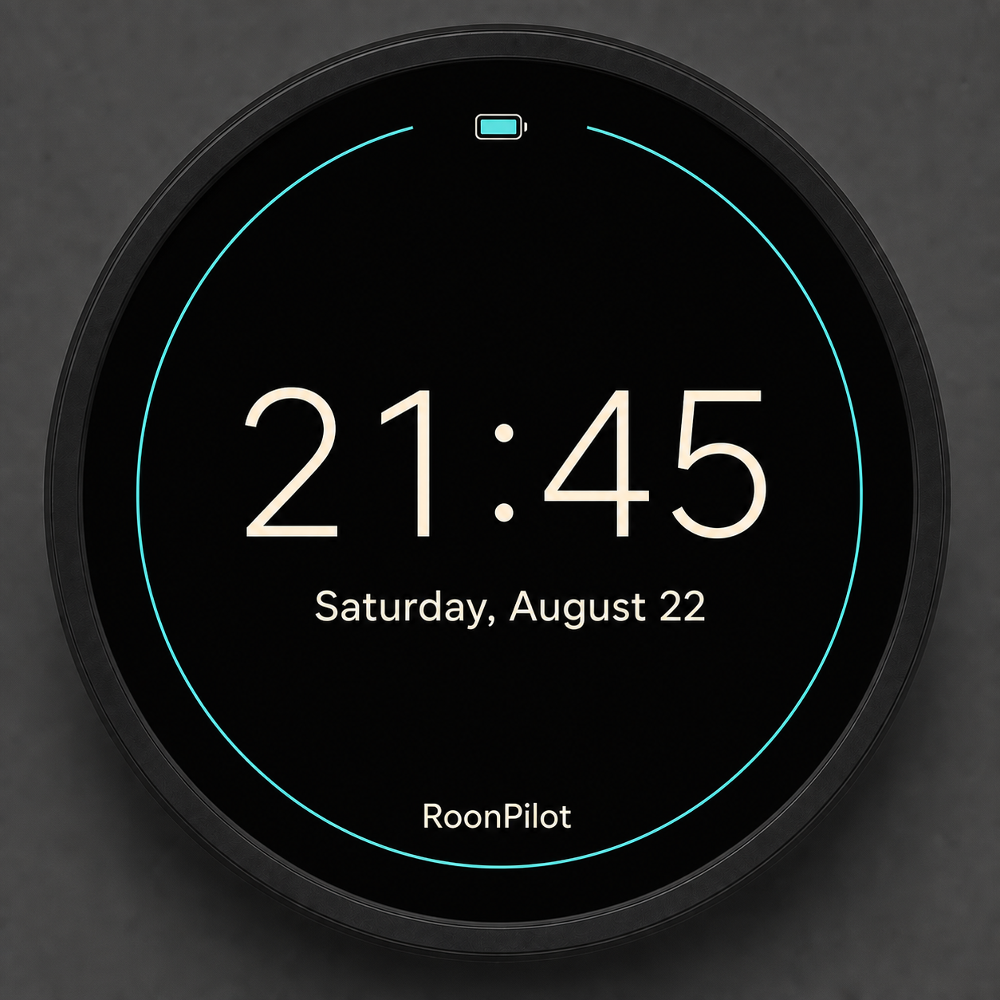

<div align="center">

# RoonPilot

### The dedicated control surface for Roon

**Turn the music up. Change the room. See what is playing. Nothing else gets in the way.**



*Original hardware platform with the planned RoonPilot interface.*

</div>

> **Private development preview** — RoonPilot is under active development and
> is not yet offered for sale. The product presentation below describes the
> intended production experience. Hardware runtime validation is still pending.

## Music control should feel immediate

RoonPilot is a compact, purpose-built wireless controller for Roon. Its tactile
rotary ring gives volume control the precision and speed of real hi-fi hardware,
while the round touch display keeps album artwork, playback controls and zone
selection exactly where you need them.

It is not another phone app and it does not try to become a music player.
RoonPilot stays focused on one job: making everyday control of your existing
Roon zones faster, calmer and more satisfying.

## No companion service. No bridge. No cloud dependency.

RoonPilot communicates **directly with your Roon Core over the local Wi-Fi
network** using the Roon Extension protocol.

You do **not** need to install or maintain:

- a Raspberry Pi or other always-on bridge
- Docker containers
- a Node.js extension host
- a desktop helper application
- an additional background daemon
- a RoonPilot cloud account

Once connected to Wi-Fi and approved in Roon, the controller operates as a
self-contained appliance. A working Roon system, a Roon subscription and local
Wi-Fi are the only external requirements.

## Designed for the way Roon is used

### Tactile volume control

Turn the outer ring for immediate control of the selected Roon zone. Rapid
encoder movement is coalesced into a bounded command stream, keeping the
interface responsive without flooding the Core.

### Now playing at a glance

The 1.8-inch round display presents album artwork, title, artist, playback state,
zone, Wi-Fi status and battery information in a clear hi-fi-oriented layout.

### Touch transport and zone selection

Play, pause, skip and choose among available Roon zones directly on the device.
The selected zone is remembered by its stable Roon identifier.

### Quiet when the music stops

After playback becomes inactive, RoonPilot can transition to a restrained clock
or turn the display black. Wi-Fi and Roon remain connected for an instant return.

### Resilient local operation

Automatic Core discovery, persistent pairing, subscribed zone updates and
bounded reconnect behavior are designed to make RoonPilot feel like an appliance,
not a computer that needs supervision.

## Interface preview

<table>
  <tr>
    <td align="center"><br><b>Now playing</b></td>
    <td align="center"><br><b>Volume overlay</b></td>
  </tr>
  <tr>
    <td align="center"><br><b>Zone picker</b></td>
    <td align="center"><br><b>Simple Roon approval</b></td>
  </tr>
  <tr>
    <td colspan="2" align="center"><br><b>Low-power idle clock</b></td>
  </tr>
</table>

The images are high-resolution product concepts. Final spacing, brightness,
fonts and touch targets will be tuned on the physical 360 × 360 display.

## Purpose-built hardware

RoonPilot targets the Waveshare ESP32-S3-Knob-Touch-LCD-1.8 platform:

- 1.8-inch round 360 × 360 IPS touch display
- tactile rotary encoder ring
- ESP32-S3 up to 240 MHz
- 16 MB flash and 8 MB PSRAM
- 2.4 GHz Wi-Fi
- CNC-machined metal enclosure
- battery-capable design

The product uses the onboard hardware as a dedicated Roon remote. It is not an
audio endpoint; playback continues through your existing Roon zones and audio
system.

Hardware platform details are available from the
[Waveshare product page](https://www.waveshare.com/esp32-s3-knob-touch-lcd-1.8.htm)
and [technical wiki](https://www.waveshare.com/wiki/ESP32-S3-Knob-Touch-LCD-1.8).

## Direct architecture

```text
Touch + rotary encoder
          │
          ▼
     RoonPilot firmware ───── local Wi-Fi ───── Roon Core
          ▲                                          │
          └──── subscribed zones and metadata ──────┘
```

There is no intermediate RoonPilot server in this path.

## Development status

The current ESP-IDF 6.0.1 firmware builds successfully for ESP32-S3 and already
contains the software foundations for:

- station-mode Wi-Fi with bounded reconnect
- automatic Roon Core discovery
- direct MOO/WebSocket communication
- extension approval and persistent token storage
- subscribed zone and now-playing state
- transport and volume commands
- immutable UI snapshots and bounded event queues

The next milestone is validation on the delivered hardware, followed by the
final LVGL display/touch implementation, artwork pipeline and production Wi-Fi
provisioning flow.

## Created by Senior Coder

RoonPilot is designed and developed by **Senior Coder**.

Roon is a trademark of Roon Labs. RoonPilot is an independent project and is
not affiliated with or endorsed by Roon Labs. Waveshare product names are used
only to identify the target hardware platform.

Copyright © 2026 Senior Coder. All rights reserved.
