<div align="center">

# RoonPilot

### A dedicated tactile controller for Roon

**Turn the ring. Touch the music. Control the room.**

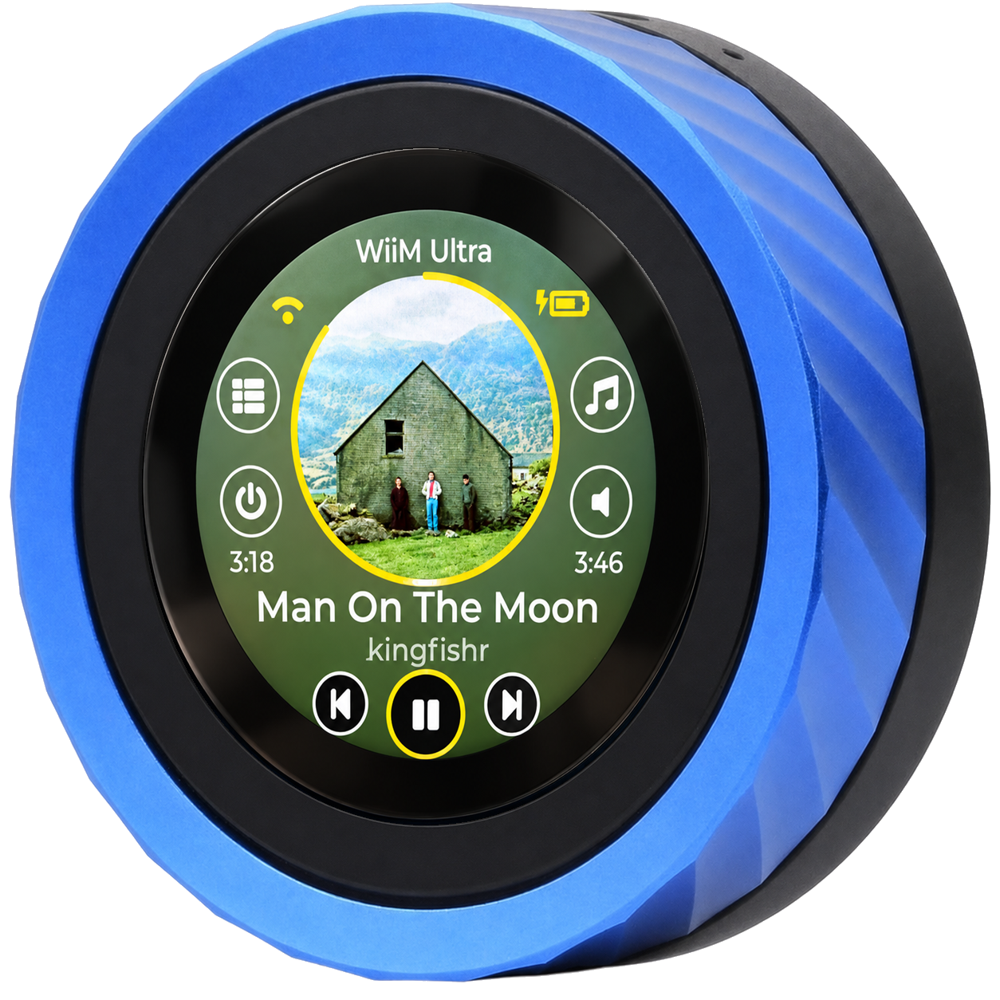

*RoonPilot running on the original Waveshare ESP32-S3-Knob-Touch-LCD-1.8 hardware.*

[Deutsch](README.de.md) · **English**

**[Project website →](https://mermayer.github.io/RoonPilot/)** · **[Installation →](#start-here)** · **[Troubleshooting →](guides/troubleshooting.md)**

**Need the hardware?** [Where to buy: Amazon.co.uk, Amazon.com, Amazon.de, EU retailer or Waveshare →](guides/hardware-and-two-processors.md#where-to-buy)

**[3D stand: guide & STL files →](guides/roonpilot-stand.md)** · **[IR Bridge enclosure: guide & STL files →](guides/ir-bridge-enclosure.md)**

**[2.0.2 Release Notes →](docs/release-notes-2.0.2.md)** · **[Changelog →](CHANGELOG.md)**

</div>

## Installation videos

Start with RoonPilot. The Companion firmware and IR Bridge are optional.

<p align="center">
  <a href="https://mermayer.github.io/RoonPilot/video/installation-en.html"></a>
  <a href="https://mermayer.github.io/RoonPilot/video/companion-installation-en.html"></a>
  <a href="https://mermayer.github.io/RoonPilot/video/ir-bridge-installation-en.html"></a>
</p>

> [!NOTE]
> **Current USB firmware: 2.0.2.**
> The optional IR Bridge firmware **1.0.0** is available with this release.
> Both USB Web Installers remain available; IR Bridge online updates are unaffected.

> [!WARNING]
> **RoonPilot online updates are temporarily suspended.** Do not use the internal
> RoonPilot updater. For a clean 2.0.2 installation, use the
> [USB Web Installer](https://mermayer.github.io/RoonPilot/firmware/?v=2.0.2-usb).
> This erases RoonPilot settings, profiles, Wi-Fi and Bridge pairings.
> Existing firmware may still show an old update notice or an update-check error.
> Separate IR Bridge updates remain available.

RoonPilot turns Waveshare's compact round display controller into a fast,
self-contained remote for Roon. The physical ring controls volume, the touch
display handles transport and zone selection, and the artwork-led interface
keeps the music visible without reaching for a phone.

RoonPilot talks directly to Roon over the local network. It needs no Raspberry
Pi, Docker container, Node.js host, desktop helper, cloud account or additional
always-on RoonPilot service. The same unified firmware can optionally manage a
RoonPilot IR Bridge for zones whose DAC, amplifier or streamer cannot expose
the required hardware controls through Roon. With the Bridge master switch off,
Bluetooth and all Bridge background activity stay off after restart.

> [!NOTE]
> **Made for the joy of music and technology**
>
> RoonPilot is a personal hobby project created for the enjoyment of music,
> technology and building something useful—not as a commercial venture. There
> are no advertisements, subscriptions or hidden costs. RoonPilot does not
> transmit personal, usage or telemetry data to the developer or any third
> party. Anyone who would voluntarily like to say thank you for the time and
> effort invested can do so through
> [Send Me a Coffee](https://buy.stripe.com/6oU3cw0eV0hC5nbdlX2Fa00) or
> [Buy Me a Coffee](https://buymeacoffee.com/mermayer).
>
> **Support and discussion:** use the
> [Roon Community Forum thread](https://community.roonlabs.com/t/new-big-thing-roonpilot-the-new-era-of-roon-control)
> or [GitHub Issues](https://github.com/mermayer/RoonPilot/issues).

## Start here

For a normal installation, open the
**[RoonPilot Web Installer directly →](https://mermayer.github.io/RoonPilot/firmware/)**.
Chrome or Edge shows connected devices in its own chooser. The name **before
the parentheses** is what matters:

- **USB JTAG/serial debug unit** is the correct ESP32-S3 for RoonPilot.
- If **USB serial** appears, leave the chooser open, unplug USB, turn the USB-C
  plug by 180 degrees and reconnect it. The Web Installer detects the device
  again immediately.

Device Manager and macOS System Information are not needed for a normal
installation. Anyone who wants an additional processor check can find the
optional procedure in the detailed [Windows](guides/installation-windows.md)
and [macOS](guides/installation-macos.md) guides.

After flashing, [complete Wi-Fi and Roon first-time setup](guides/first-time-setup.md),
then [learn the display, ring, touch and gestures](guides/device-controls.md).

The complete [documentation index](guides/README.md) also covers every screen,
every web page, updates, recovery, configuration backup, battery calibration,
privacy and troubleshooting.

> [!IMPORTANT]
> This board contains **two independent ESP processors**. In the Web Installer
> device chooser, always select **USB JTAG/serial debug unit** for RoonPilot.
> **USB serial** belongs to the separate companion processor.

An [optional factory backup](guides/factory-backup.md) is useful if you may want
to restore the exact firmware state in which the manufacturer delivered the
device. It is not a prerequisite for installing RoonPilot. Once you have
identified the ESP32-S3, the selected guide for
[Windows](guides/installation-windows.md) or
[macOS](guides/installation-macos.md) leads to the public Web Installer after
the USB check.

The second processor's low-power firmware is also easy to install and remains
completely optional. Start with its separate Companion guide for
[Windows](guides/companion-installation-windows.md) or
[macOS](guides/companion-installation-macos.md).

## Why it feels different

- **Real volume control:** use the outer rotary ring instead of a small slider.
  RoonPilot automatically follows the zone's native unitless, dB or relative
  volume model, preserves the unit supplied by Roon and displays real dB values.
- **Four player layouts:** Classic, Focus, full-artwork Orbit and cover-colour
  Aura without artwork.
- **Easier Play/Pause target:** optionally use the approximately artwork-sized
  centre of every player layout as one large touch area.
- **Direct Roon connection:** discovery, authorization, zone state and commands
  run on the ESP32-S3 itself.
- **Room selection on the device:** browse shown zones with touch or the ring,
  then select on the display.
- **Roon groups without losing individual control:** turn for the whole group,
  or tap a large member row and keep turning for only that physical output.
  Native number, real dB, relative Roon and several IR Bridge routes can coexist.
- **Useful idle modes:** black screen, station clock or digital clock with date.
- **Real deep sleep:** optional ESP32-S3 shutdown while the selected zone is
  paused/stopped, with touch and ring wake-up.
- **Local configuration:** responsive web pages are served by RoonPilot itself.
- **English or German:** one saved language setting switches the device display,
  Quick Settings and every local web page; Roon metadata and user-defined names
  remain untouched.
- **Private by design:** no cloud relay and no password in configuration exports.
- **Recoverable updates:** signed A/B firmware updates with boot validation and
  rollback support.
- **Visible update awareness:** every local web page can announce a newer
  release, while an optional once-daily device notice remains dismissible and
  never installs anything automatically.
- **Independent operation:** after setup, a browser is not needed for normal use.
- **Optional hardware IR control:** assign individual zones to one of up to four
  saved IR Bridges while native Roon control remains unchanged for all others.

## The four player screens

<table>
  <tr>
    <td align="center"><br><b>Classic</b><br>Balanced artwork and controls</td>
    <td align="center">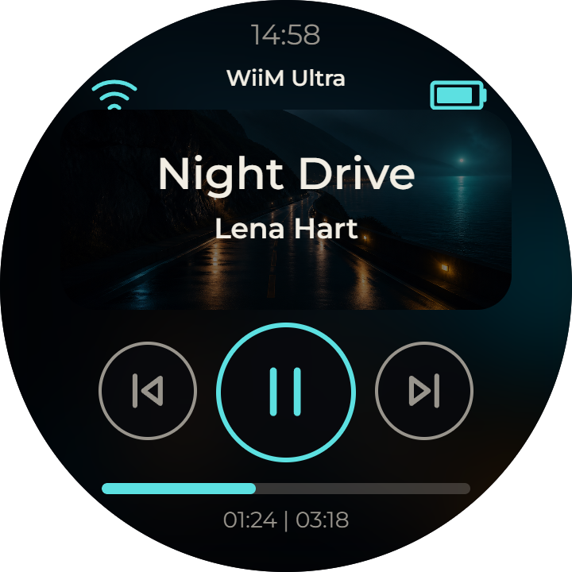<br><b>Focus</b><br>Large transport controls</td>
    <td align="center">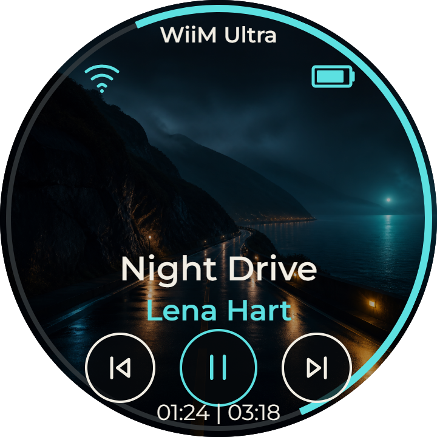<br><b>Orbit</b><br>Full-screen artwork</td>
    <td align="center">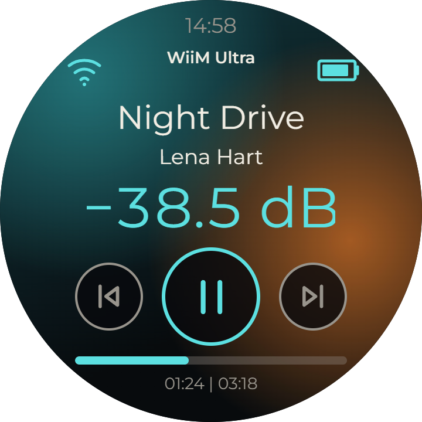<br><b>Aura</b><br>Cover-derived colour without artwork</td>
  </tr>
</table>

The screen background is derived from the current cover and kept dark enough
for readable text. The active accent colour is configurable on the device and
in the web interface.

## Everyday control

[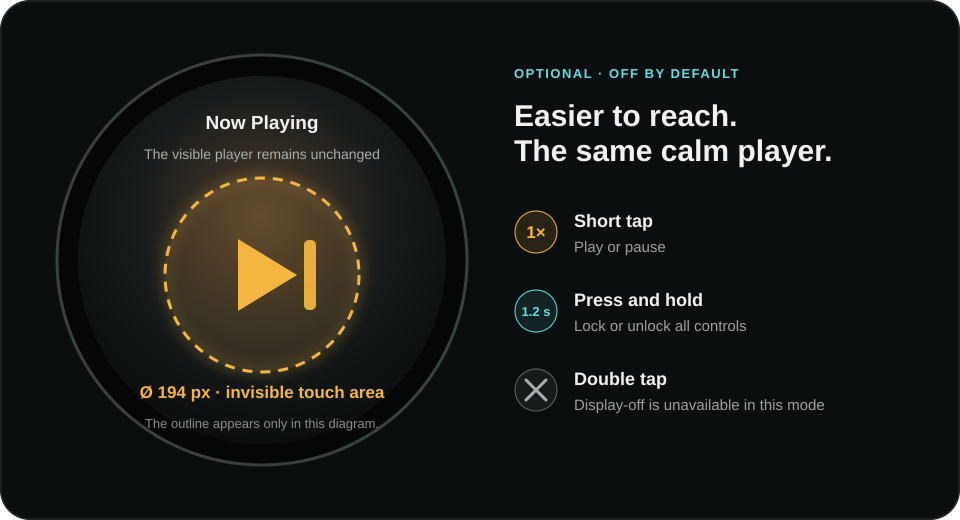](docs/assets/large-play-pause-touch-en.svg)

*The optional invisible centre area makes Play/Pause easier to hit without
changing the player layout. Click the diagram for its full-resolution view;
every gesture is covered in the [complete device controls guide](guides/device-controls.md).*

| Action | Ring | Touch |
| --- | --- | --- |
| Change volume | Turn | — |
| Play or pause | — | Tap centre transport button or optional large centre area |
| Previous/next | — | Tap a transport button or swipe horizontally |
| Open zone picker | — | Tap the zone name |
| Browse zone/menu pages | Turn | Swipe or tap |
| Open Quick Settings | — | Swipe up on Now Playing |
| Lock/unlock controls | — | Long-press the centre of the display |
| Switch display off immediately | — | Double-tap centre while the large Play/Pause area is off |
| Wake the screen/clock | Turn | Tap |
| Wake from deep sleep | Turn, then wait for boot | Tap, then wait for boot |

For a grouped Roon zone, the first single ring detent opens the large group
mixer without changing volume. Continue turning for the whole group, or tap one
of its member rows first. See [Roon groups and the group mixer](guides/roon-groups.md).

See [Device controls](guides/device-controls.md) for timing, locked-operation
feedback, screen-off wake-up and settings details.

## Device screen gallery

RoonPilot includes player, volume, zone, pairing, clock, setup, maintenance and
error views. Every current view is shown and explained in the
[complete screen reference](guides/screen-reference.md).

<table>
  <tr>
    <td align="center">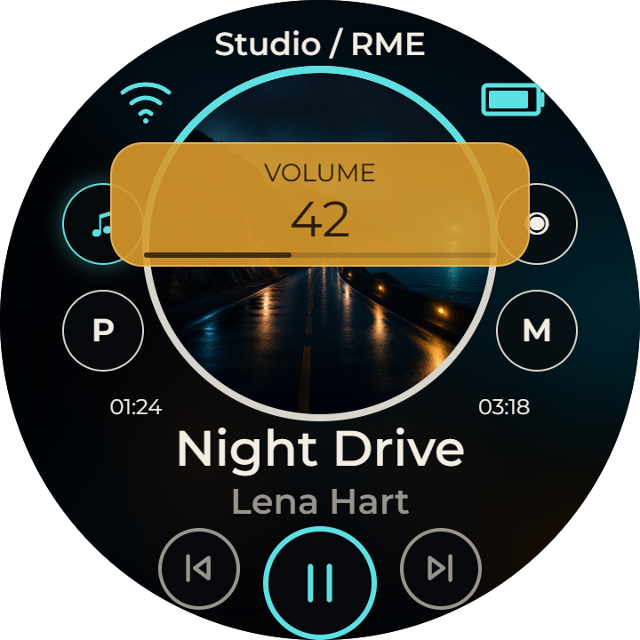<br><b>Volume</b></td>
    <td align="center">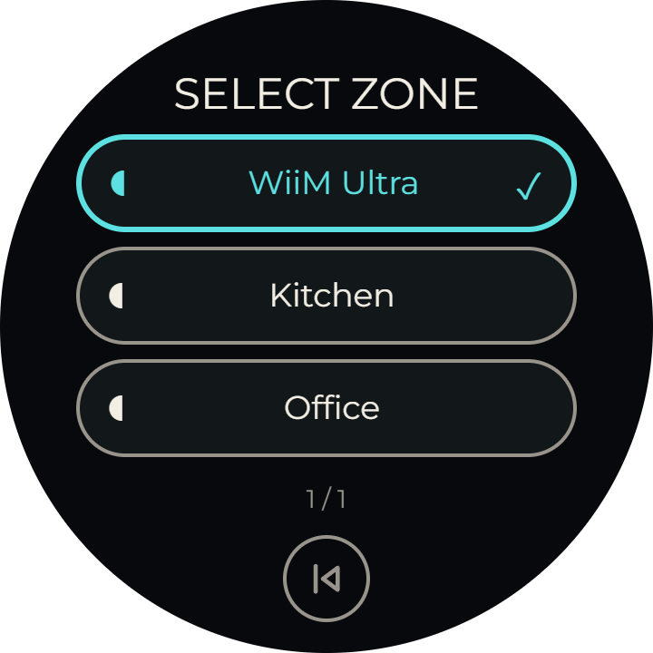<br><b>Zones</b></td>
    <td align="center">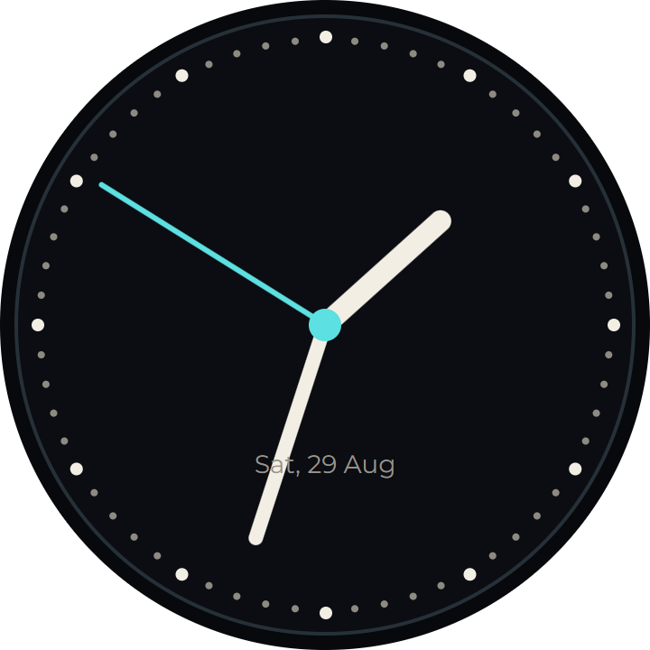<br><b>Station clock</b></td>
  </tr>
  <tr>
    <td align="center">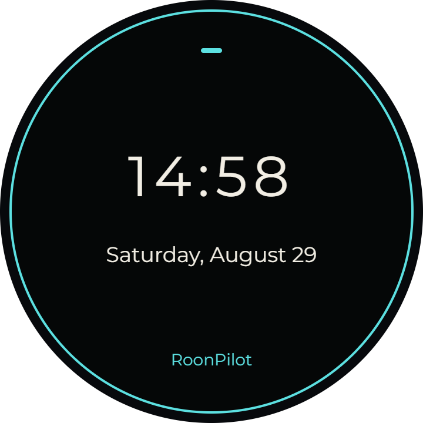<br><b>Digital clock</b></td>
    <td align="center">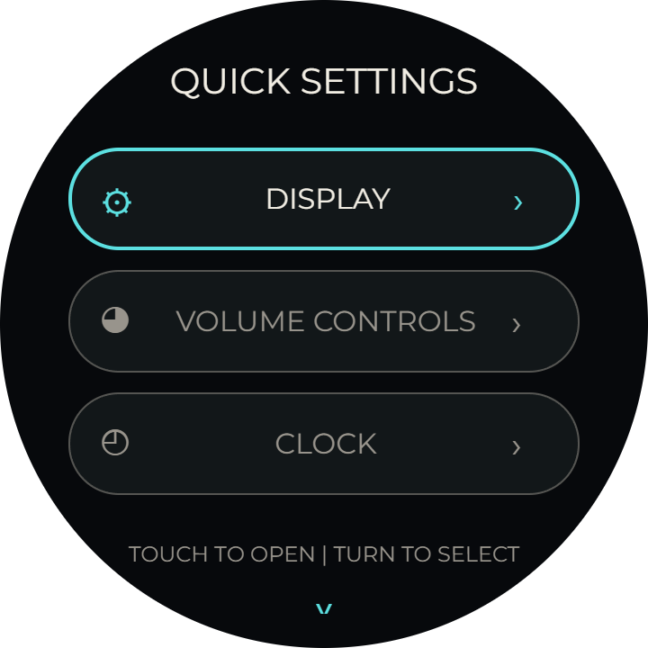<br><b>Quick Settings</b></td>
    <td align="center">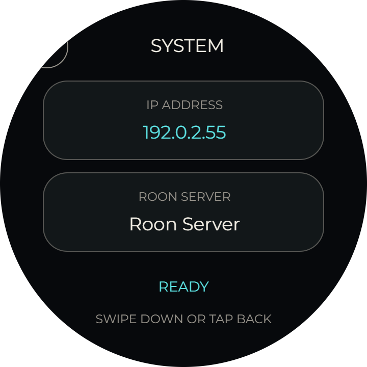<br><b>IP &amp; Roon Server</b></td>
  </tr>
  <tr>
    <td align="center">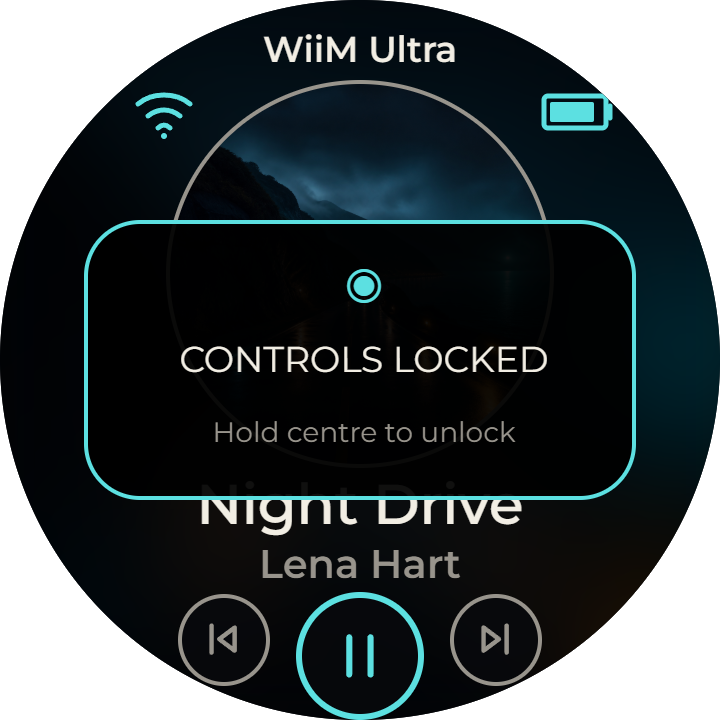<br><b>Control lock</b></td>
    <td align="center">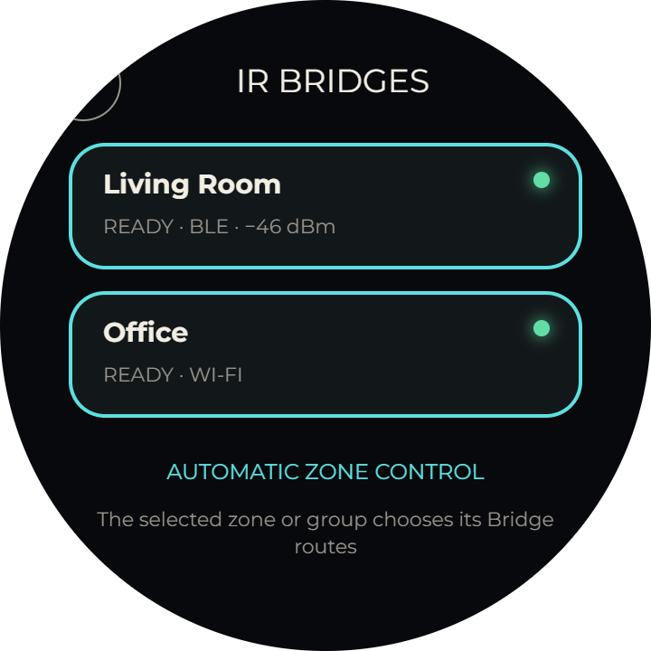<br><b>IR Bridges</b></td>
    <td align="center">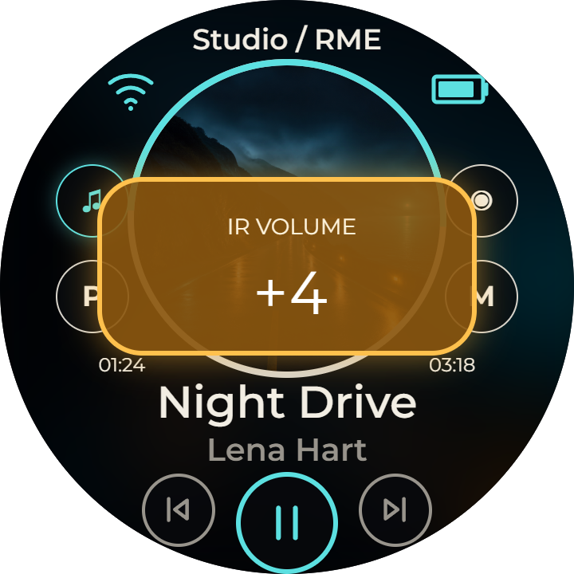<br><b>Quiet IR feedback</b></td>
  </tr>
  <tr>
    <td align="center">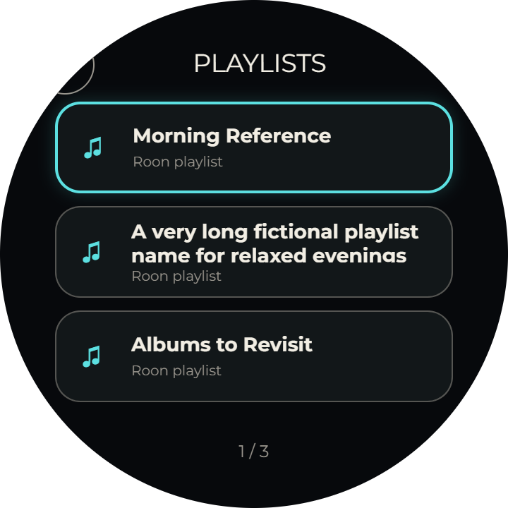<br><b>Playlists</b></td>
    <td align="center">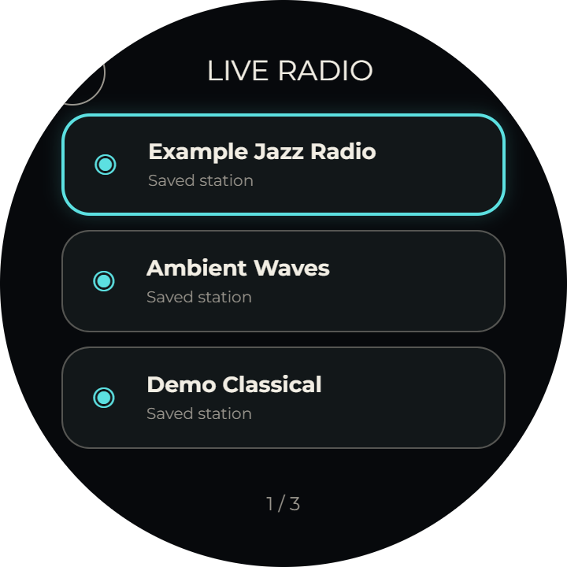<br><b>Live Radio</b></td>
    <td align="center"><br><b>Classic controls</b></td>
  </tr>
  <tr>
    <td align="center">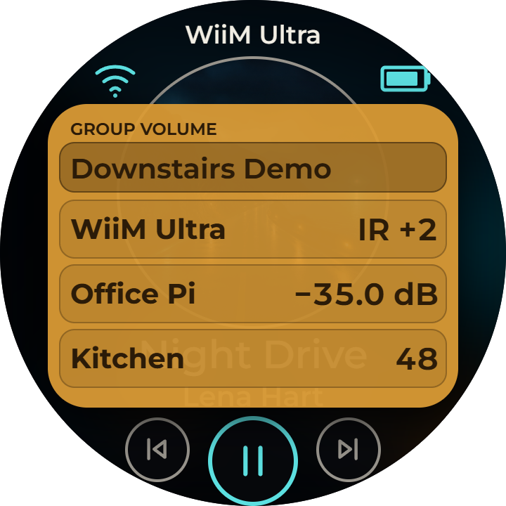<br><b>Whole group</b></td>
    <td align="center">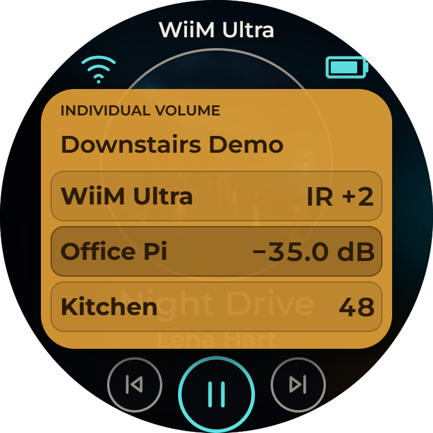<br><b>One group member</b></td>
    <td align="center">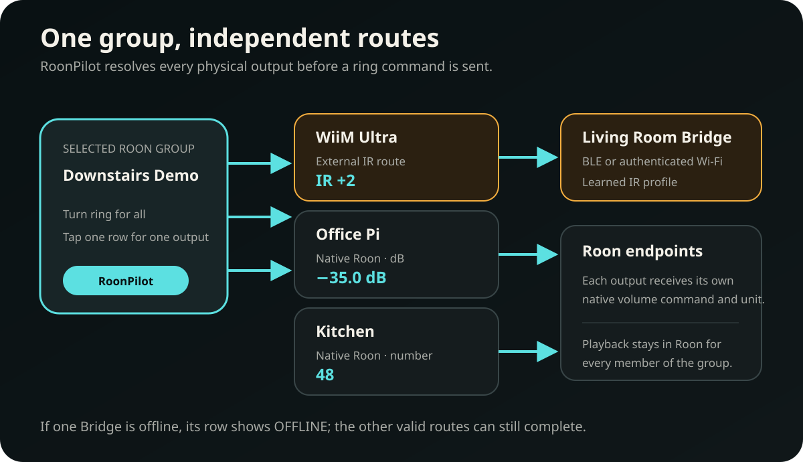<br><b>Mixed routes</b></td>
  </tr>
</table>

Except for the authoritative Classic project reference, illustrative renders use
fictional music, rooms, network names and documentation-only addresses. They
contain no private test data.

Roon-supplied metadata remains UTF-8. The embedded display fonts cover extended
European Latin characters, Greek, Cyrillic, common symbols and a selected set
of monochrome emoji. Large Asian writing systems are not bundled because of
their substantial memory cost; the browser interface is unaffected.

## Local web interface

Open RoonPilot's local address in a browser to configure it. The interface is
served from the device; it is not a cloud dashboard.

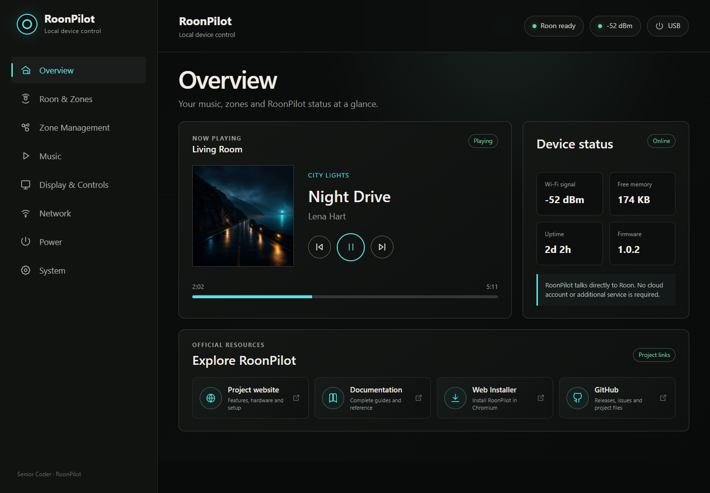

The pages cover:

- live status and basic playback control;
- Roon Server discovery, manual server address and zone selection;
- shown and hidden zones;
- per-zone native Roon, IR Bridge or disabled volume routing, independent
  encoder steps, optional Power/Mute controls and up to three named HTTP
  on/off action pairs;
- Roon playlists and saved Live Radio stations with one saved order shared by
  the web page and device menu;
- player layout, brightness, dimming, clocks, display rotation and an optional
  large centre Play/Pause touch area;
- touch-feedback vibration strength and matching Quick Settings control;
- rotary direction, native Roon-step multiplier, acceleration and
  maximum-volume protection where the endpoint reports usable limits;
- Wi-Fi status and network replacement;
- explicit Automatic/Installed/Not installed battery-hardware selection,
  conditional battery UI and runtime-calibration history;
- guarded deep-sleep timeout and wake policy;
- firmware updates, diagnostics, safe export/import, restart and factory reset.
- a reboot-persistent event log with download and explicit clear action.
- one global English/German language choice for the display, Quick Settings and
  all local pages.

View every page in the [web-interface reference](guides/web-interface.md).

## Optional RoonPilot IR Bridge

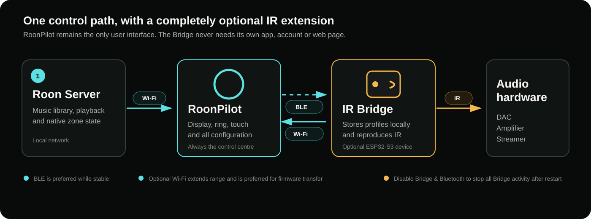

The Bridge is a separate ESP32-S3 module placed where its infrared transmitter
can see the controlled equipment. Pairing, connection choice, learned profiles,
zone routing, backup, diagnostics and signed online updates are all managed from
RoonPilot. No Bridge app, cloud account or additional web server is required.

A practical example is a **WiiM Ultra Roon zone feeding an RME ADI-2 DAC**.
Transport remains native Roon control, while volume, mute and power can use the
RME remote commands learned by the Bridge. The RME performs the hardware level
change itself, preserving its Auto Ref Level behaviour instead of substituting
Roon digital attenuation.

<table>
  <tr>
    <td width="50%">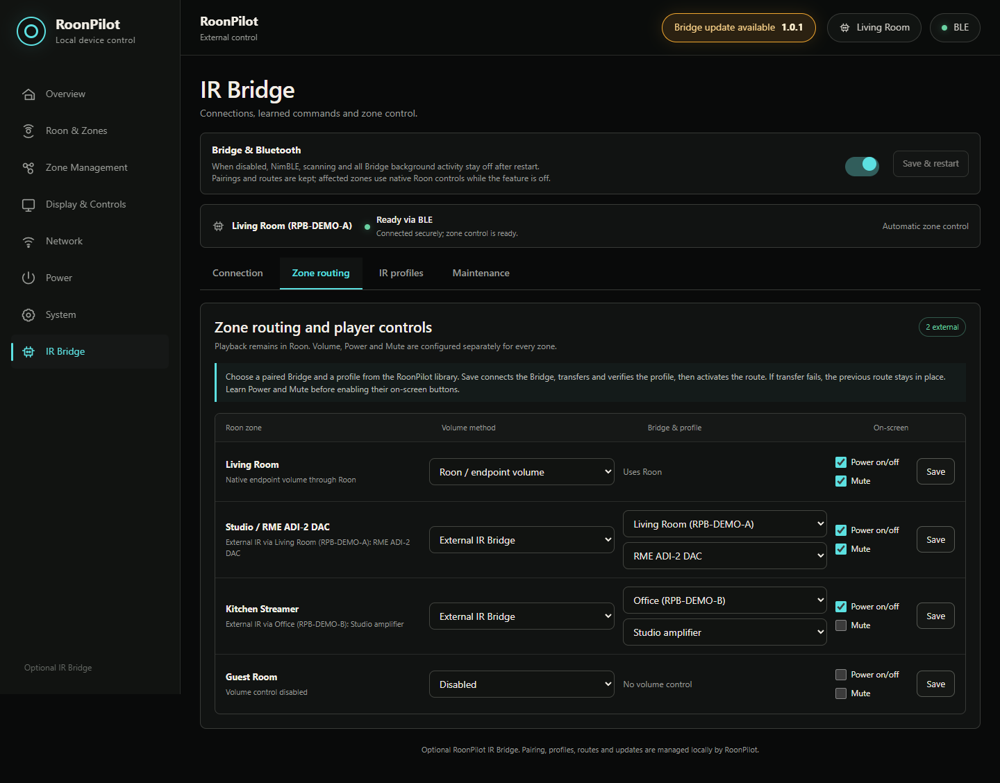</td>
    <td width="50%">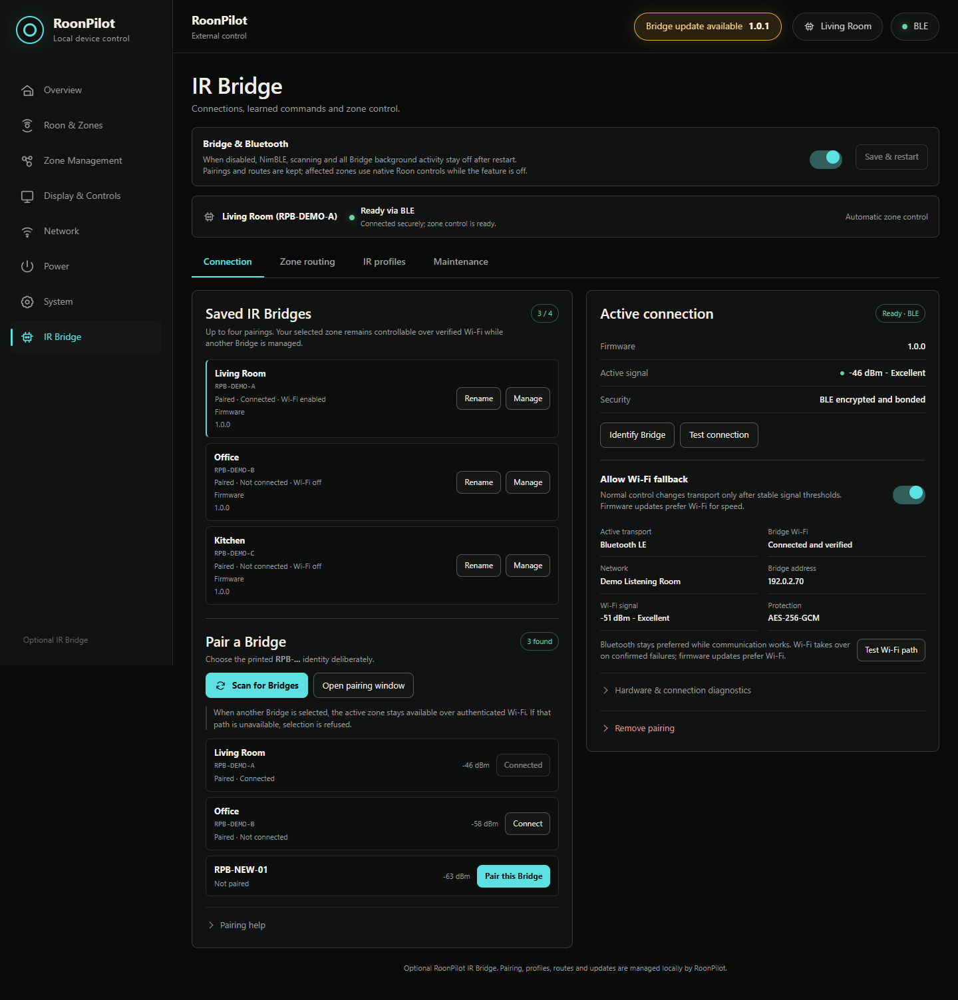</td>
  </tr>
  <tr>
    <td align="center"><b>Every zone chooses its route</b></td>
    <td align="center"><b>Every required group Bridge remains addressable</b></td>
  </tr>
</table>

- up to four paired Bridges can be saved by one RoonPilot;
- **Automatic zone control** follows the selected zone or group. A single zone
  uses its assigned Bridge; a group can keep several required Bridges ready
  through one BLE link and independent authenticated Wi-Fi paths;
- encrypted BLE is preferred; authenticated local Wi-Fi fallback is optional
  for a Bridge in another room;
- each Bridge stores up to eight learned equipment profiles;
- Volume up/down, Mute, Power on and Power off are learned independently, with
  recognised protocol/repeat timing or a raw-timing fallback;
- external IR volume uses a relative amber `+ / −` counter because the Bridge
  cannot honestly know the DAC’s absolute volume;
- Bridge online updates are announced but never installed automatically;
- disabling **Bridge & Bluetooth** preserves pairings and routes but prevents
  Bluetooth, scans, Bridge traffic and Bridge update checks after restart.

Read the [complete IR Bridge guide](guides/ir-bridge.md), then follow the
[illustrated hardware and Factory-installation procedure](guides/ir-bridge-installation.md).
The [3D-printable Bridge enclosure](guides/ir-bridge-enclosure.md) includes
exterior/interior photos and all STL downloads.

## Optional 3D-printed stand

<table>
  <tr>
    <td align="center">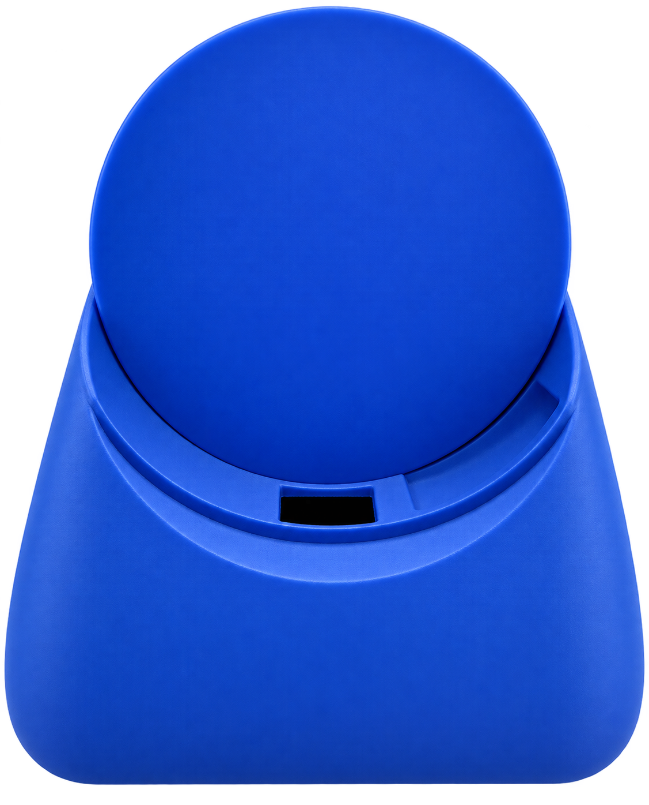<br><b>Four-part stand</b></td>
    <td align="center">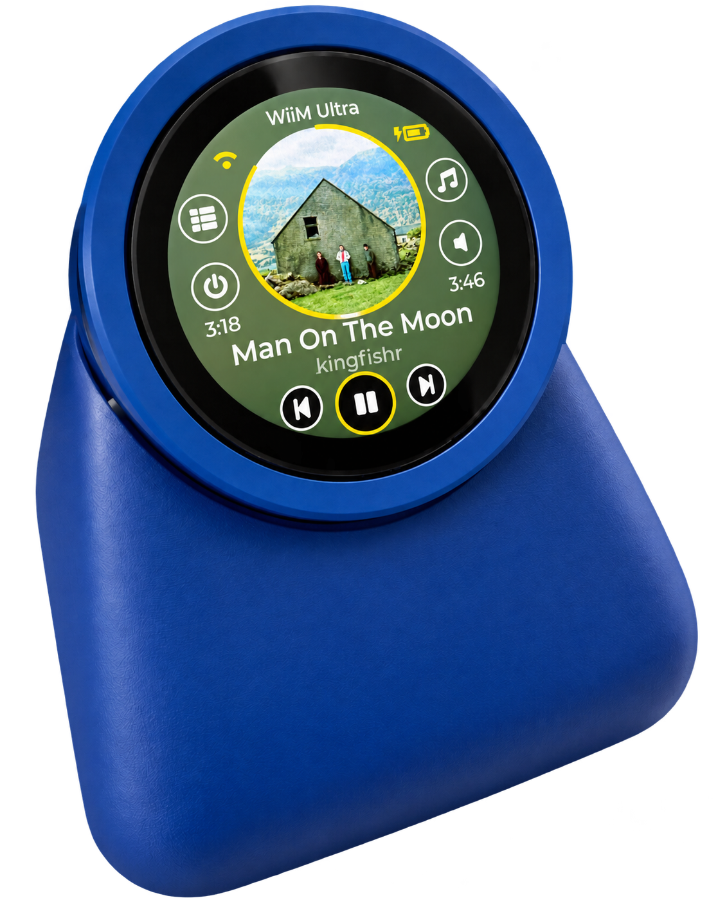<br><b>RoonPilot installed</b></td>
  </tr>
</table>

The optional stand holds RoonPilot at an angle and integrates a USB-C holder.
See the [illustrated stand guide and download its four STL files](guides/roonpilot-stand.md), including the rear panel.

## No RoonPilot service to install

```text
Touch + rotary ring
        │
        ▼
  RoonPilot firmware ───── local Wi-Fi ───── Roon Server
        ▲                                      │
        └──── subscribed zones + metadata ─────┘
```

RoonPilot uses Roon's Extension protocol and appears in Roon's Extensions page
for one-time approval. A Roon installation and subscription are still required,
but no separate RoonPilot process is installed on the server.

## Hardware

| Feature | Target hardware |
| --- | --- |
| Product | Waveshare ESP32-S3-Knob-Touch-LCD-1.8 |
| Main processor | ESP32-S3R8, up to 240 MHz |
| Main flash / PSRAM | 16 MB / 8 MB |
| Display | 1.8-inch round IPS LCD, 360 × 360, capacitive touch |
| Controls | Full rotary ring plus touch display |
| Wireless | 2.4 GHz Wi-Fi and Bluetooth hardware |
| Companion processor | ESP32-U4WDH with independent 4 MB flash |
| Other onboard hardware | PCM5100A DAC, microphone, vibration motor, microSD |
| Power | USB-C or optional internal 3.7 V / 800 mAh battery |

The main ESP32-S3 runs RoonPilot. The companion ESP32 receives a small optional
low-power firmware so it does not waste energy while RoonPilot is in use. It is
not needed for Roon communication. Its separate Web Installer accepts classic
ESP32 hardware only; the main Web Installer accepts ESP32-S3 hardware only.

Find Amazon.co.uk, Amazon.com, Amazon.de, an EU retailer and Waveshare purchase links—plus
the exact battery and colour variants—in [Where to buy the hardware](guides/hardware-and-two-processors.md#where-to-buy).

## Battery information without invented precision

The exposed ADC measures the board's regulated rail rather than the Li-ion cell,
so RoonPilot cannot honestly calculate a precise battery percentage. The battery
symbol remains a coarse filtered indication when battery hardware is enabled.
Because Waveshare sells variants with and without a battery but exposes no
dedicated battery-present signal, **Power > Installed battery** provides
Automatic, Installed and Not installed modes. Automatic remembers a positive
USB-to-battery transition; Not installed removes the battery UI and calibration
while preserving all power-bank-relevant settings. A controlled runtime
calibration can record how long an individual unit operates with a repeatable
display/Wi-Fi profile. Read [Battery and runtime](guides/battery-and-runtime.md)
before interpreting the result.

For a valid full-charge calibration reference, charge RoonPilot from a stable
USB power supply/charger. A computer USB port can deliver a lower voltage at the
board and may operate the device without charging its battery completely.

## Installation, updates and recovery

RoonPilot provides three deliberately separate paths:

- **Factory image:** complete ESP32-S3 installation or recovery from address 0.
- **OTA image:** upload through an already running RoonPilot.
- **Companion image:** separate browser installation for the classic ESP32
  only; an original 4 MB backup is optional and useful only for restoring the
  exact manufacturer firmware later.

The installation guides explain the operating system's USB names and link to
the optional full-device backup procedure. The main and Companion installers
use separate chip-restricted manifests. Do not guess a file or flash an image
based only on its size.

**Installation guides:** [Windows](guides/installation-windows.md) · [macOS](guides/installation-macos.md) · **Optional Companion:** [Windows](guides/companion-installation-windows.md) · [macOS](guides/companion-installation-macos.md)

**Need to return from 2.0.2 to 1.0.2?** Use the separate
[Return to RoonPilot 1.0.2](guides/return-to-1.0.2.md) instructions and the
[fixed 1.0.2 Web Installer choice](https://mermayer.github.io/RoonPilot/firmware/?version=1.0.2#web-installer-title).
This clean USB installation erases RoonPilot's settings and profiles. Keep
backups from 1.0.2 and 2.0.x separate, and do not run battery calibration under
1.0.2.

Simple step-by-step paths: [Windows](guides/installation-windows.md) ·
[macOS](guides/installation-macos.md) ·
[optional Companion](guides/companion-firmware.md). The Web Installer device
chooser is sufficient for identification; Device Manager and System
Information are not required for the normal installation.

## Documentation

- [Documentation index](guides/README.md)
- [Hardware and two processors](guides/hardware-and-two-processors.md)
- [Factory backup](guides/factory-backup.md)
- [Optional Companion firmware](guides/companion-firmware.md)
- [Companion installation with Windows](guides/companion-installation-windows.md)
- [Companion installation with macOS](guides/companion-installation-macos.md)
- [Using standalone or Python esptool on macOS](guides/esptool-macos.md)
- [Choose Windows or macOS](guides/installation.md)
- [Installation with Windows](guides/installation-windows.md)
- [Installation with macOS](guides/installation-macos.md)
- [First-time setup](guides/first-time-setup.md)
- [Device controls](guides/device-controls.md)
- [Roon groups and the on-device group mixer](guides/roon-groups.md)
- [All device screens](guides/screen-reference.md)
- [All web pages](guides/web-interface.md)
- [Firmware updates and recovery](guides/firmware-updates-and-recovery.md)
- [Return from 2.0.2 to RoonPilot 1.0.2](guides/return-to-1.0.2.md)
- [Configuration export and import](guides/configuration-backup.md)
- [Battery and runtime](guides/battery-and-runtime.md)
- [Deep sleep](guides/deep-sleep.md)
- [Troubleshooting](guides/troubleshooting.md)
- [Privacy and security](guides/privacy-and-security.md)
- [Licensing and redistribution](guides/licensing.md)
- [Optional IR Bridge: overview and documentation path](guides/ir-bridge.md)
- [IR Bridge hardware and Factory installation](guides/ir-bridge-installation.md)
- [3D-printable RoonPilot stand](guides/roonpilot-stand.md)
- [3D-printable IR Bridge enclosure](guides/ir-bridge-enclosure.md)
- [IR Bridge connectivity and automatic zone control](guides/ir-bridge-connectivity.md)
- [IR profiles and per-zone routing](guides/ir-bridge-zones-and-profiles.md)
- [IR Bridge updates and recovery](guides/ir-bridge-updates.md)
- [IR Bridge troubleshooting](guides/ir-bridge-troubleshooting.md)

## Project and trademarks

RoonPilot is designed and developed by **Senior Coder**. It is an independent,
non-commercial project and is not affiliated with or endorsed by Roon Labs or
Waveshare. Roon is a trademark of Roon Labs. Waveshare product names identify
the supported hardware only.

RoonPilot-authored portions use the RoonPilot Personal-Use Binary License 1.0.
It permits installation of official unmodified firmware through the authorized
Web Installer and private noncommercial operation. Redistribution,
modification, reverse engineering, source recovery, competitive analysis and
commercial use are prohibited except where mandatory law provides otherwise.
Third-party portions retain their independent licences. See
[Licensing and permitted use](guides/licensing.md) for the exact distinction.

Copyright © 2026 Senior Coder. See [LICENSE](LICENSE.md), [NOTICE](NOTICE) and
[third-party notices](THIRD_PARTY_NOTICES.md).
