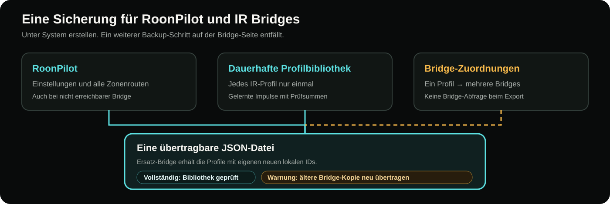
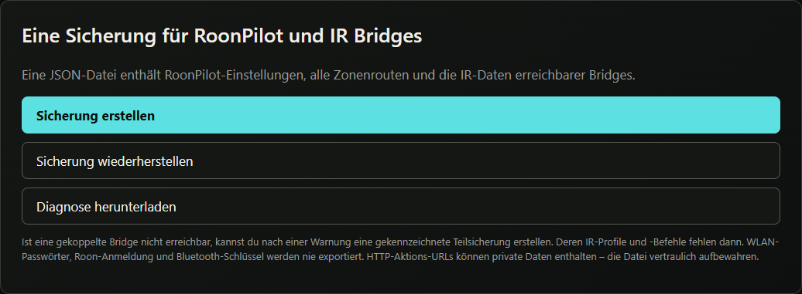

# Konfiguration sichern und wiederherstellen

[English](../configuration-backup.md) · **Deutsch**

RoonPilot 2 erstellt **eine JSON-Datei** für das Gerät und seine gekoppelten IR Bridges. Dazu unter **System → Sicherung erstellen** wählen. Unter **IR Bridge → Wartung** gibt es keinen separaten Backup-Bereich mehr. Die JSON-Datei enthält Einstellungen, kein Firmwareabbild und keine Kopie der ursprünglichen Hersteller-Firmware.

## Inhalt der Datei

- RoonPilot-Einstellungen: Sprache, gewählte Roon-Zone, sichtbare und ausgeblendete Zonen, Displaylayout und Helligkeit, Uhr und Zeitzone, Bedienung und Touch-Rückmeldung, Energie- und Akkuoptionen, Update-Einstellungen sowie der Schalter **Bridge & Bluetooth**.
- Zoneneinstellungen und **alle gespeicherten Zonenrouten**, einschließlich Ringschritten, Power-/Mute-Optionen und bis zu drei benannten HTTP-ON/OFF-Aktionspaaren pro Zone mit einzelnen Aktivierungsschaltern und URLs.
- Jedes eigenständige IR-Profil **einmal unter einem eindeutigen Namen**, mit gelernten Befehlen und Prüfsummen der Impulsdaten. Die Profilbibliothek bleibt zusätzlich dauerhaft auf RoonPilot gespeichert.
- Getrennte Zuordnungen zwischen Profilnamen und Bridge-Kennungen. Dasselbe Profil kann auf mehreren Bridges liegen, dort jeweils mit einer eigenen numerischen Profil-ID.
- Eine Prüfsumme über die gesamte JSON-Datei einschließlich Geräteeinstellungen und Zonenrouten.

HTTP-URLs und Raumbezeichnungen können private Informationen enthalten. Die Datei vertraulich aufbewahren.

## Sicherung bei ausgeschalteter Bridge erstellen

Eine neue Sicherung liest die **dauerhafte Profilbibliothek auf RoonPilot**, nicht jede einzelne Bridge. Eine ausgeschaltete Bridge verzögert den Download deshalb nicht und macht die Datei nicht unvollständig. Gesichert werden die Bibliotheksprofile, ihre Zuordnungen zu gekoppelten Bridges und die Zonenrouten. Auch ohne gekoppelte Bridge bleiben die Bibliotheksprofile enthalten.

Speichern oder Anlernen über RoonPilots Bridge-Seite gleicht das Profil mit der Bibliothek ab. Änderungen auf einer Bridge, die **noch nicht synchronisiert** wurden, können in einer reinen Bibliothekssicherung nicht enthalten sein. Fehlt für eine gespeicherte IR-Zonenroute die passende Bibliothekszuordnung, bricht RoonPilot die Sicherung ab und fordert zum manuellen Abgleich dieser Bridge auf – eine scheinbar vollständige Datei wird nicht erzeugt.

Verweist eine gespeicherte Bridge-Zuordnung noch auf eine ältere Profilkopie, fragt RoonPilot nach und markiert die Datei mit „warning“. Die Bibliotheksversion bleibt maßgeblich; sie kann bei Bedarf erneut auf die Bridge übertragen werden. Dieser Hinweis beruht auf den gespeicherten Signaturen, nicht auf einer Live-Abfrage. Ältere „partial“-Sicherungen bleiben für ihre enthaltenen Daten importierbar.

## Absichtlich ausgeschlossene Daten

WLAN-Kennwörter, Roon-Freigaben, kurzlebige Web-Sitzungstoken, Bluetooth-Kopplungsschlüssel, Bridge-Transportschlüssel und Firmware-Signaturschlüssel werden nie exportiert. Eine Datei allein kann eine Bridge nicht mit einem anderen RoonPilot koppeln. WLAN und Roon gegebenenfalls erneut einrichten und die benötigten Bridges koppeln, bevor Profile auf sie übertragen werden. Zum Wiederherstellen der Bibliothek auf RoonPilot muss keine Bridge erreichbar sein.

Eine Factory-Installation oder ein Ersatzboard erzeugt eine neue `RPB-…`-Kennung. Diese Bridge zunächst mit RoonPilot koppeln und beim Wiederherstellen ausdrücklich als Ziel auswählen. Der Import kopiert die gelernten Befehle des benannten Profils und merkt sich die **neue** lokale Profil-ID. Alte numerische IDs werden nicht als gültig vorausgesetzt. Bluetooth-Besitz und WLAN-Zugangsdaten werden nicht durch ein Backup übertragen.

Die gewählte Akku-Einstellung **Automatisch / Eingebaut / Nicht eingebaut** ist enthalten. Ein positiver automatischer Akku-Nachweis gehört dagegen zum konkreten Gerät und wird nicht auf ein anderes übertragen.

## Erstellen und wiederherstellen

1. Auf der lokalen RoonPilot-Webseite **System → Sicherung erstellen** öffnen. Während die Datei vorbereitet wird, zeigt ein kleines Statusfeld die aktuelle Phase. Die heruntergeladene JSON-Datei privat speichern. Neue Dateien tragen „complete“ oder bei bekannten älteren Bridge-Kopien „warning“ im Namen.
2. Vor dem Wiederherstellen RoonPilot mit Roon verbinden, damit seine Zonen zugeordnet werden können. Die **Ziel-Bridges** koppeln, die Profile erhalten sollen; ihre Kennungen dürfen sich von denen in der Sicherung unterscheiden. Eine bereits gekoppelte Bridge darf offline sein. Bei ausgeschaltetem Bridge & Bluetooth kann die Bibliothek zunächst ohne Übertragung wiederhergestellt werden.
3. Unter **System → Sicherung wiederherstellen** die JSON-Datei wählen. Nach der Prüfsummenkontrolle pro Profil eine oder mehrere aktuell gekoppelte Ziel-Bridges auswählen. Das Ziel für jede IR-Zonenroute bewusst bestimmen; nicht ausgewählte Routen bleiben unverändert.
4. Danach Zone, Routen und Einstellungen kontrollieren. Falls sich der Bridge-Hauptschalter geändert hat, den angeforderten Neustart ausführen. IR-Lautstärke, Mute und Power an der echten Anlage testen.

Die Wiederherstellung über mehrere Geräte ist **nicht atomar**. Scheitert ein späterer Schritt, können vorherige Schritte bereits gespeichert sein. Den gemeldeten Fehler beheben und dieselbe Datei erneut importieren; passende Profile werden wiederverwendet und nicht dupliziert. Der Import vertraut einer numerischen Profil-ID aus der Datei niemals allein. Andere vorhandene Routen bleiben erhalten.

Ältere reine RoonPilot-Konfigurationsdateien und ältere JSON-Dateien einer einzelnen Bridge bleiben unter **System** importierbar. Letztere werden in benannte eigenständige Profile und getrennte Zuordnungen umgewandelt; im Importdialog eine aktuelle Ziel-Bridge wählen. Neue Sicherungen entstehen nur noch als gemeinsame Datei.

## Wiederherstellen bei ausgeschalteter Bridge

Eine nicht erreichbare Bridge **bricht die Wiederherstellung nicht ab**.
RoonPilot speichert die Profilbibliothek lokal, stellt die Geräteeinstellungen
wieder her und fährt mit den anderen ausgewählten Bridges fort. Auch eine
Bridge, die während der Übertragung ausfällt, wird für später zurückgestellt,
statt die übrigen Geräte zu blockieren.

| Situation | Ergebnis |
| --- | --- |
| Ziel-Bridge ist erreichbar | Profile werden übertragen oder wiederverwendet, geprüft und ihren aktuellen lokalen Profil-IDs zugeordnet. |
| Ziel ist offline, aber dieses RoonPilot kennt bereits eine geprüfte Zuordnung für das identische Profil | Diese bekannte Zuordnung kann wiederhergestellt werden; die Profil-ID in der Datei gilt nicht als Nachweis. Die tatsächliche Bridge-Übertragung bleibt unbestätigt. |
| Ziel ist offline und seine Zuordnung auf diesem RoonPilot neu, geändert oder ungeprüft | Das Profil bleibt für die spätere Übertragung in der wiederhergestellten Bibliothek. Die unbestätigte IR-Route wird nicht aktiviert; ihre vorhandene Route bleibt unverändert. |

Das Fortschrittsfenster kann **100 % mit einem Warnhinweis** erreichen und die
Bridges nennen, deren Übertragung nicht bestätigt werden konnte. Damit ist die
Wiederherstellung auf RoonPilot abgeschlossen, nicht die Übertragung auf jede
ausgeschaltete Bridge. Ein Hinweis auf zurückgestellte Übertragungen ist etwas
anderes als **Wiederherstellung unterbrochen**: Diese Meldung bezeichnet einen
echten Fehler, etwa eine ungültige Datei, einen Speicherfehler oder einen
Routenkonflikt.

Eine zurückgestellte Übertragung vervollständigen:

1. Die genannte Bridge einschalten und ihre Erreichbarkeit von RoonPilot prüfen.
2. Dieselbe Sicherung erneut importieren und diese Bridge auswählen oder das
   wiederhergestellte Bibliotheksprofil unter **IR Bridge → IR-Profile** übertragen.
3. Unter **IR Bridge → Zonenrouting** für den betroffenen Ausgang die gewünschte
   Bridge und das Profil auswählen und speichern. Speichern prüft die aktuelle
   Profilkopie, bevor die Zuordnung aktiviert wird.

Das bloße Wiederverbinden garantiert nicht, dass zurückgestellte Profile und
unbestätigte Routen automatisch übernommen werden. Vor der IR-Bedienung die
Zuordnungen kontrollieren.

## Umzug auf ein anderes RoonPilot

Display- und Verhaltenseinstellungen sind übertragbar. Roon-Zonen-IDs, lokale HTTP-URLs und eine auf dem alten Gerät gemessene Akkulaufzeit können auf dem neuen Gerät falsch sein. WLAN und Roon neu verbinden, Bridges bewusst koppeln, jede Zonenroute prüfen und die Akku-Kalibrierung am Zielgerät wiederholen.
