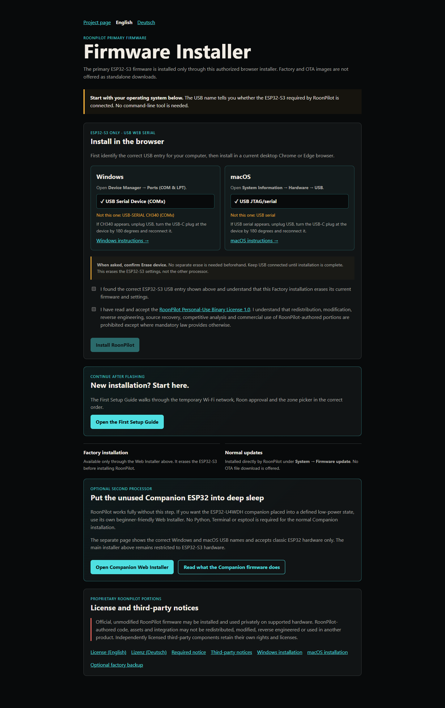

# RoonPilot installieren

[English](../installation.md) · **Deutsch**

Zuerst [Hardware und beide Prozessoren](hardware-and-two-processors.md) lesen
und [beide Original-Firmwares sichern](factory-backup.md).

## Die richtige Datei wählen

| Datei | Ziel | Verwendung |
| --- | --- | --- |
| `roonpilot-factory-v1.0.0.bin` | ESP32-S3 | Neuinstallation/Wiederherstellung ab `0x0` |
| `roonpilot-ota-v1.0.0.bin` | vorhandenes RoonPilot | Lokales Update über die Geräte-Webseite |
| `roonpilot-companion-sleep-factory-v1.0.0.bin` | klassischer Begleit-ESP32 | optionale Stromspar-Firmware ab `0x0` |

Factory- und OTA-Dateien enthalten keine WLAN-Zugangsdaten, Roon-Serveradresse
oder Kopplungstoken. Eine saubere Installation startet deshalb den WLAN-
Einrichtungs-AP.

## Empfohlen: ESP32-S3 mit dem Browser installieren

Der Web Installer funktioniert **nur in einem aktuellen Chromium-
Desktopbrowser mit Web Serial**, zum Beispiel Chrome, Edge, Chromium, Brave
oder Opera. Firefox und Safari werden nicht unterstützt. Die veröffentlichte
HTTPS-Seite, ein direkter USB-Anschluss und ein Datenkabel sind erforderlich.

1. ESP-IDF Monitor, PuTTY, Arduino Serial Monitor und alle Programme schließen,
   die den COM-Port geöffnet haben könnten.
2. Gerät über USB-C verbinden.
3. Port mit `py -m esptool --port COM4 chip-id` prüfen.
4. Nur bei **ESP32-S3** fortfahren.
5. Die separat bereitgestellte Web-Installer-Adresse öffnen.
6. Zwei-Prozessor-Warnung lesen und Sicherungs-/Chipprüfung bestätigen.
7. **RoonPilot installieren** auswählen und den geprüften Port öffnen.
8. Das vollständige Löschen erst nach geprüfter Original-Sicherung bestätigen.
9. Kabel während Löschen, Schreiben und Verifizieren nicht trennen.
10. Nach Erfolg USB trennen und in derselben ESP32-S3-Orientierung neu verbinden.



> [!WARNING]
> Die Factory-Installation löscht den kompletten vorhandenen ESP32-S3-Flash:
> Waveshare-/RoonPilot-Firmware, WLAN-Daten, Roon-Freigabe und alle
> Einstellungen. Der Web Installer beschreibt niemals den Begleit-ESP32.

## Spätere Updates

Der Chromium-Web-Installer wird normalerweise nur bei Erstinstallation oder
vollständiger Wiederherstellung benötigt. Danach die Geräte-IP öffnen und
**System → Firmware update → Check for updates → Download and install** wählen.
Das signierte Online-Update schreibt den inaktiven A/B-Slot und behält die
Einstellungen normalerweise bei. Alternativ kann dort eine OTA-Datei lokal
hochgeladen werden.

Für normale Updates nicht zum Factory-Installer zurückkehren: Factory löscht
alles, OTA ist für den Erhalt der Konfiguration ausgelegt.

## Manuelle ESP32-S3-Installation

```powershell
py -m esptool --chip esp32s3 --port COM4 chip-id
py -m esptool --chip esp32s3 --port COM4 erase-flash
py -m esptool --chip esp32s3 --port COM4 --baud 460800 write-flash 0x0 roonpilot-factory-v1.0.0.bin
```

Niemals die OTA-Datei bei Adresse `0x0` verwenden; sie enthält Bootloader und
Partitionstabelle nicht.

## Optionale Companion-Installation

Dieser getrennte Kommandozeilenvorgang ist für RoonPilot nicht erforderlich.
Zuerst die vollständige 4-MB-Sicherung erstellen, Stecker drehen, klassischen
ESP32 bestätigen und anschließend:

```powershell
py -m esptool --chip esp32 --port COM4 chip-id
py -m esptool --chip esp32 --port COM4 --baud 460800 write-flash 0x0 roonpilot-companion-sleep-factory-v1.0.0.bin
```

Danach USB trennen, zurückdrehen und ESP32-S3/RoonPilot-Start bestätigen. Die
vollständige Einsteigeranleitung steht unter [Companion-Firmware](companion-firmware.md).

## Download prüfen

```powershell
Get-FileHash -Algorithm SHA256 .\roonpilot-factory-v1.0.0.bin
```

Wert Zeichen für Zeichen mit `SHA256SUMS.txt` vergleichen. Bei Abweichung nicht
fortfahren, sondern neu herunterladen. Danach folgt die [Ersteinrichtung](first-time-setup.md).
