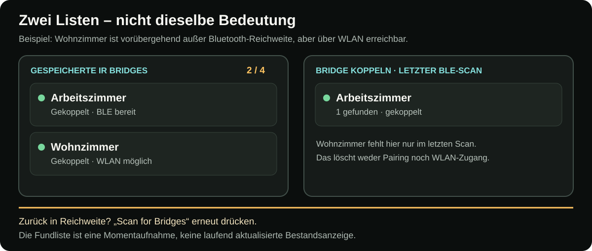
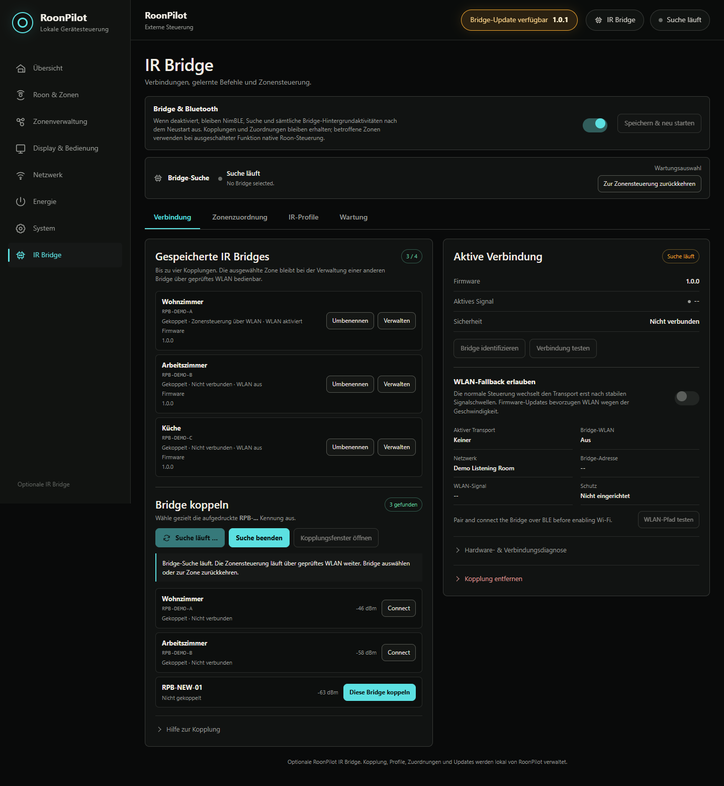
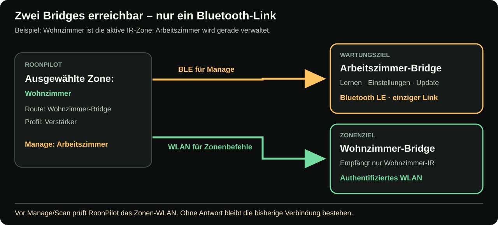
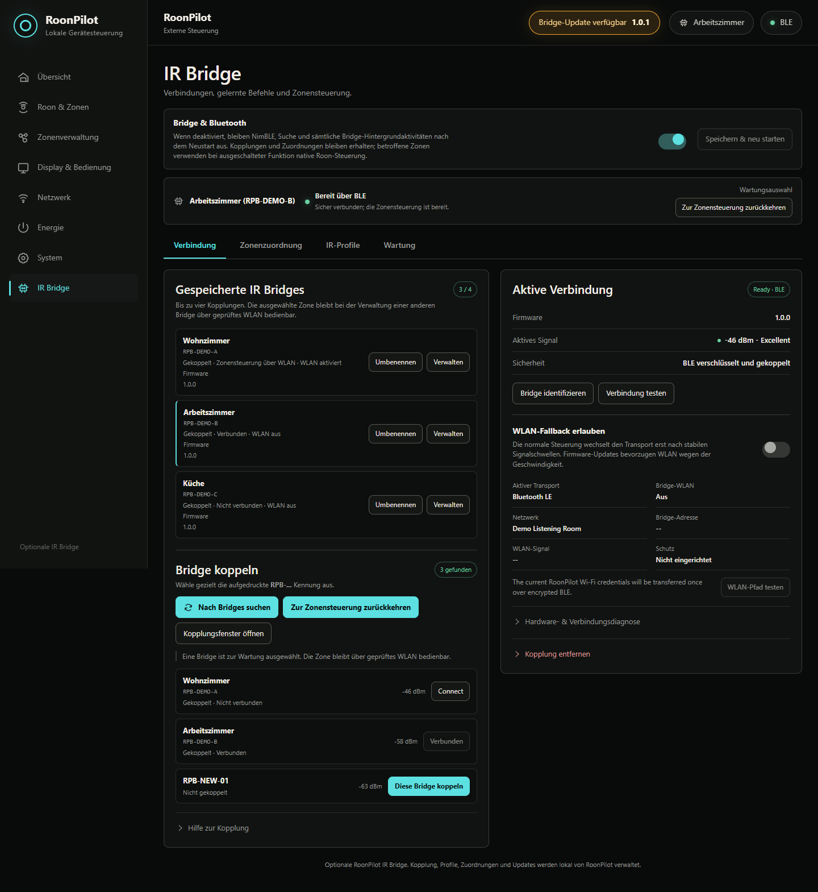
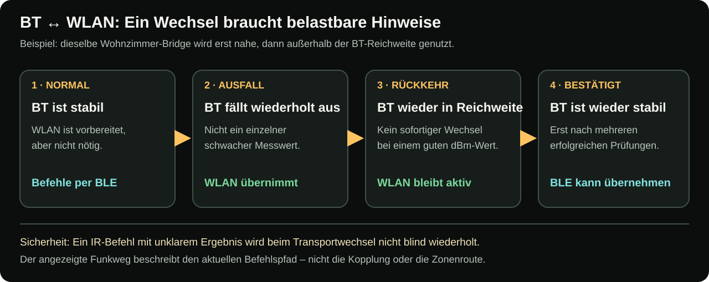

# IR-Bridge-Kopplung, Verbindung und automatische Zonensteuerung

[English](../ir-bridge-connectivity.md) · **Deutsch** · [Bridge-Übersicht](ir-bridge.md)

Die Verbindungsseite besitzt zwei Aufgaben, die nicht verwechselt werden dürfen:

1. **Automatische Zonensteuerung** bestimmt anhand der ausgewählten Roon-Zone
   oder jedes physischen Ausgangs einer ausgewählten Gruppe, welche Bridges
   IR-Befehle erhalten. Das ist der Normalbetrieb.
2. **Wartungsauswahl** verbindet vorübergehend eine gespeicherte Bridge per
   BLE, um WLAN, Profile, Diagnose oder Firmware zu verwalten. Die aktive Zone
   kann ihre eigene Bridge gleichzeitig über geprüftes WLAN weiter bedienen.

## Eine fabrikneue Bridge koppeln

Eine fabrikneue Bridge öffnet automatisch ihr Pairing-Fenster und pulsiert blau.

1. Lokale RoonPilot-Seite öffnen und **IR Bridge** wählen.
2. Ist der obere Schalter aus, **Bridge & Bluetooth** aktivieren, **Speichern &
   Neustarten** wählen und die Seite nach der Verbindung erneut öffnen.
3. **Nach Bridges suchen** wählen.
4. Die aufgedruckte oder notierte Kennung der echten Einheit lesen, zum Beispiel
   `RPB-DEMO-A`.
5. Jedes Zeichen mit der Fundliste vergleichen.
6. **Diese Bridge koppeln** wählen.
7. Auf **Bereit per BLE** und den verschlüsselten/gebondeten Sicherheitsstatus
   warten.

Der Signalwert hilft bei der Platzierung, ist aber keine Kennung. Niemals ein
unbekanntes Gerät nur wegen des stärksten dBm-Werts koppeln.

## Pairing ohne Gehäusetaster erneut öffnen

Eine früher gekoppelte Bridge weist einen neuen Besitzer normalerweise ab. Muss
sie erneut gekoppelt werden und liegt BOOT im geschlossenen Gehäuse, die Bridge
innerhalb von 15 Sekunden dreimal aus- und einschalten. Sie öffnet ein
fünfminütiges Pairing-Fenster und signalisiert es blau. Dadurch werden Profile
nicht automatisch gelöscht.

Nur mit einer physisch eindeutig erkannten Einheit durchführen. Bei mehreren
eingeschalteten Bridges die anderen abschalten oder die vollständige Kennung
vergleichen.

## Zwei Listen, zwei Bedeutungen

Die Anzeige **Saved IR Bridges / Gespeicherte IR Bridges** ist das dauerhafte
Verzeichnis der bis zu vier Kopplungen. Die Anzeige **Pair a Bridge / Bridge
koppeln** zeigt dagegen **nur Geräte, deren Bluetooth-Werbung beim letzten
zehnsekündigen Scan gehört wurde**. Die Zahl „1 found“ bedeutet nicht „nur
eine Bridge gekoppelt“ und sagt nichts über die WLAN-Erreichbarkeit aus.

[Schaubild groß öffnen](../../docs/ir-bridge/assets/bridge-scan-vs-saved-de.svg)

**Beispiel:** „Wohnzimmer“ und „Arbeitszimmer“ sind gekoppelt. Wohnzimmer wird
außer BLE-Reichweite gebracht und über WLAN weiter gesteuert. Ein Scan findet
nur Arbeitszimmer: **1 found**, aber **2 / 4** gespeicherte Bridges. Nach der
Rückkehr von Wohnzimmer in BLE-Reichweite bleibt die alte Fundliste zunächst
unverändert. **Scan for Bridges** erneut drücken; erst dieser Scan kann
Wohnzimmer wieder aufnehmen. Weder ein neues Pairing noch das erneute
Einrichten von WLAN ist deshalb erforderlich.

| Beobachtung | Bedeutung | Nächster Schritt |
| --- | --- | --- |
| Gespeichert, aber nicht gefunden | Kopplung bleibt erhalten; letzter BLE-Scan hörte die Bridge nicht. | Bei Bedarf erneut scannen; Stromversorgung und Reichweite prüfen. |
| Über WLAN bereit, aber nicht gefunden | WLAN-Steuerung funktioniert unabhängig von der BLE-Fundliste. | Nichts reparieren; nur für BLE-Nähe erneut scannen. |
| Nicht gespeichert, aber gefunden | Noch keine Kopplung mit diesem RoonPilot. | Vollständige Kennung vergleichen und nur das richtige Gerät koppeln. |

## Suchmodus und Rückweg

Die Suche benötigt den einzigen BLE-Link. Die ausgewählte IR-Zone bleibt
gleichzeitig nur dann bedienbar, wenn **ihre eigene Bridge** vorab über
authentifiziertes WLAN erreichbar ist. Sonst wird die Suche zum Schutz der
Zonenbedienung abgelehnt. Nach der Suche **Cancel search / Suche abbrechen**
wählen, um die automatische BLE-Auswahl wiederherzustellen.

Auch ein Neuladen der Browserseite darf RoonPilot nicht im Suchmodus fangen. Der
Abbruch bleibt verfügbar, bis die normale Zonensteuerung wiederhergestellt ist.

## Gespeichert bedeutet nicht verbunden

RoonPilot kann bis zu vier Kopplungen halten. Eine Karte kann anzeigen:

- **Gekoppelt · Verbunden** — mindestens ein nutzbarer Weg besteht;
- **Gekoppelt · Zonensteuerung über WLAN** — diese Bridge bedient die Zone,
  während der BLE-Link eine andere Bridge verwaltet;
- **Gekoppelt · Nicht verbunden** — Schlüssel und Kennung sind gespeichert,
  aber diese Bridge wird gerade nicht benötigt oder ist nicht erreichbar;
- **Nicht gekoppelt** — sichtbar, aber noch ohne gemeinsamen Schlüssel.

Das ist Absicht. Es gibt höchstens **eine BLE-Verbindung**, aber jede
entsprechend eingerichtete Bridge besitzt ihren **eigenen authentifizierten
WLAN-Weg**. Mehrere Bridges können dadurch gleichzeitig erreichbar sein.

## Automatische Zonensteuerung

Bei jedem Zonen- oder Gruppenwechsel folgt RoonPilot diesem Ablauf:

1. Gespeicherte Route jedes physischen Ausgangs der neuen Roon-Zone lesen.
2. Native und deaktivierte Ausgänge benötigen keine Bridge.
3. Für jeden externen IR-Ausgang genau die gespeicherte Bridge-Kennung suchen.
4. Jede benötigte Einheit über ihren verfügbaren geprüften BLE- oder WLAN-Weg
   ansprechen.
5. Zugeordnete Profile verwenden und jede IR-Route erst bei Bereitschaft
   freigeben.

Während der kurzen Umschaltung bleiben Befehle geschlossen: Sie werden weder an
eine andere Bridge noch unbemerkt an Roon umgeleitet. Eine Meldung auf RoonPilot
und der Webseite erklärt, wenn die benötigte Bridge fehlt.

### Beispiel

| Ausgewählte Zone | Gespeicherte Route | Ergebnis |
| --- | --- | --- |
| Wohnzimmer | Roon / Endpunkt-Lautstärke | Ring sendet native Roon-Lautstärke; keine Bridge nötig. |
| Studio / RME ADI-2 DAC | RPB-DEMO-A + RME-Profil | RPB-DEMO-A verbindet; der Ring sendet gelernte RME-IR-Schritte. |
| Küchen-Streamer | RPB-DEMO-B + Verstärkerprofil | Das IR-Ziel wechselt zu RPB-DEMO-B; dessen WLAN kann auch ohne BLE funktionieren. |
| Gästezimmer | Deaktiviert | Ring sendet keinen Lautstärkebefehl. |

### Gruppenbeispiel mit zwei Bridges

Die Gruppe **Erdgeschoss** enthalte WiiM Ultra, Arbeitszimmer und Küche:

| Physischer Ausgang | Gespeicherte Route | Benötigter Weg |
| --- | --- | --- |
| WiiM Ultra | Wohnzimmer-Bridge + RME-Profil | BLE oder das authentifizierte WLAN dieser Bridge |
| Arbeitszimmer | Arbeitszimmer-Bridge + Verstärkerprofil | Meist eigener authentifizierter WLAN-Weg, während BLE anderswo liegt |
| Küche | Native numerische Roon-Lautstärke | Keine Bridge |

Drehen für die ganze Gruppe spricht beide Bridges und den nativen Endpunkt in
einer logischen Aktion an. Es existiert weiterhin nur ein BLE-Link; paralleler
Mehr-Bridge-Betrieb stützt sich deshalb auf die getrennt geprüften WLAN-Wege.
Fällt die Arbeitszimmer-Bridge aus, meldet ihre Zeile `OFFLINE`; WiiM Ultra und
Küche werden nicht heimlich umgeleitet und können über ihre gültigen Wege
weiterarbeiten. RoonPilot erkennt die Rückkehr jeder zur aktuellen Gruppe
gehörenden Bridge.

Die genaue Ring- und Touchbedienung steht unter
[Roon-Gruppen und Gruppenmixer](roon-groups.md).

## Wartungsauswahl

Auf einer gespeicherten Bridge **Manage / Verwalten** wählen, um genau diese
Einheit zu prüfen oder zu ändern. Die Wartungsauswahl belegt den BLE-Link,
**ändert aber keine Zonenroute**. Benötigt die gewählte Zone oder Gruppe andere
IR-Bridges, prüft RoonPilot *vorher* jeden betroffenen WLAN-Weg. Nur wenn keine
aktive Route dadurch den Transport verlieren würde, darf Manage den BLE-Link
übernehmen; sonst bleibt die bisherige Verbindung erhalten. Ein IR-Befehl der
Zone oder Gruppe wird nicht allein wegen des BLE-Links an die Wartungs-Bridge
geschickt.

[Schaubild groß öffnen](../../docs/ir-bridge/assets/bridge-parallel-control-de.svg)

Nach der Wartung **Return to zone control / Zurück zur Zonensteuerung** wählen.
Ohne Wartungsaktivität endet die Auswahl nach fünf Minuten automatisch;
laufendes Lernen oder Update wird nicht mitten im Vorgang unterbrochen.

## Optionales WLAN aktivieren

WLAN wird für jede Bridge getrennt eingerichtet.

1. Gewünschte Bridge per BLE verbinden, normalerweise über **Verwalten**.
2. **WLAN-Fallback erlauben** aktivieren.
3. RoonPilot überträgt seine gespeicherten 2,4-GHz-Zugangsdaten über die
   verschlüsselte BLE-Verbindung.
4. Auf **Verbunden und geprüft** samt Adresse warten.
5. **WLAN-Pfad testen** wählen.
6. Zur automatischen Zonensteuerung zurückkehren.

Die Bridge zeigt das Kennwort weder im Status noch in Backup oder Diagnose. Bei
geänderten Zugangsdaten per BLE neu verbinden und erneut bereitstellen.

## Transportwahl und Feldstärken

- BLE bleibt für normale nahe Bedienung bevorzugt, solange es stabil ist.
- WLAN ist nur auf Bridges erlaubt, deren Schalter aktiv ist und deren Test
  erfolgreich war.
- Der Transport wechselt nicht bei jedem schwankenden dBm-Wert. Filter,
  Hysterese und Gnadenzeiten verhindern nervöse Umschaltungen.
- Firmwareübertragung bevorzugt authentifiziertes WLAN; BLE kann bei fehlendem
  WLAN wiederherstellen.
- Ein Transportwechsel darf einen IR-Befehl nicht doppelt ausführen. Logische
  Sequenz und Replay-Schutz gelten für beide Wege.

[Schaubild groß öffnen](../../docs/ir-bridge/assets/bridge-transport-timeline-de.svg)

**Beispiel:** Wohnzimmer ist zunächst per BLE bereit. Nach wiederholt
bestätigten BLE-Ausfällen nutzt dieselbe Zone ihren bereits eingerichteten
WLAN-Weg. Wird die Bridge wieder näher platziert, bleibt WLAN zunächst aktiv;
ein einzelner guter Signalwert erzwingt keine Rückschaltung. Erst wenn BLE
wieder ausreichend zuverlässig geprüft ist, kann RoonPilot zurückwechseln.
Ein möglicherweise schon gesendeter IR-Befehl wird dabei nicht blind
nachgesendet.

| Bei BLE → WLAN oder WLAN → BLE | Ändert sich? |
| --- | --- |
| Aktueller Weg für IR-Befehle | **Ja** – die Anzeige wechselt zwischen „Ready via BLE“ und „Ready via Wi-Fi“. |
| Kopplung, Bridge-Klarname und WLAN-Schlüssel | **Nein** – ein Transportwechsel setzt die Bridge nicht zurück. |
| Zonenroute und benanntes IR-Profil | **Nein** – dieselbe Zone steuert dieselbe Bridge mit demselben Profil. |
| Wiedergabe über Roon | **Nein** – Musiktransport und Play/Pause bleiben Roon-Aufgaben. |
| IR-Befehl mit unklarem Ergebnis | **Kein blindes Replay** – eine zweite Ausführung wird nicht riskiert. |

Feldstärke schwankt durch Antennenausrichtung, Reflexionen und gleichzeitigen
2,4-GHz-Verkehr. Entscheidend sind Befehl und Neuverbindung, nicht ein einzelner
dBm-Wert bei 30 cm Abstand.

## Status an den Geräten

Die RGB-LED der Bridge liefert lokale Rückmeldung:

- langsames blaues Pulsieren: Pairing offen;
- Lernsignal: Empfänger wartet auf die Originalfernbedienung;
- kurze Bestätigung: gültiger Befehl gelernt, Lernvorgang beendet;
- Updatemuster: Firmwareübertragung/-installation aktiv — Strom nicht trennen;
- Identifikationsmuster: ausgewählte Bridge zeigt sich und kehrt danach zum
  vorherigen Zustand zurück.

RoonPilot meldet Verbindungsänderungen und besitzt im Geräte-Quickmenü den
Eintrag **IR Bridges**. Dort stehen relevante Bridge, Transport, WLAN-Zustand
und Feldstärken auch ohne Browser.

## Komplette Funktion abschalten

**Bridge & Bluetooth** ausschalten, speichern und neu starten. Das ist ein
Startschalter und kein ausgeblendetes Menü. Der Bluetooth-Stack wird nicht
initialisiert; Bridge-Hintergrundarbeit bleibt aus. Auch erneutes Einschalten
benötigt einen kontrollierten Neustart, da freigegebener Funkspeicher innerhalb
desselben Starts nicht sicher zurückgewonnen werden kann.
