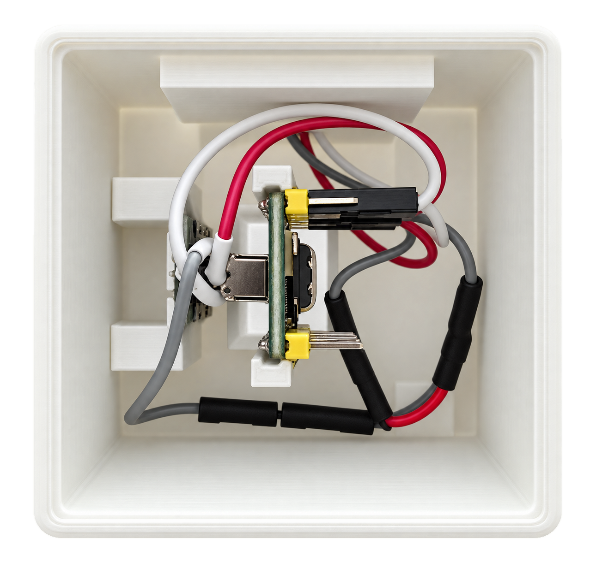
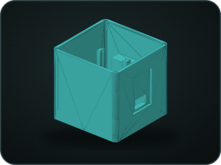
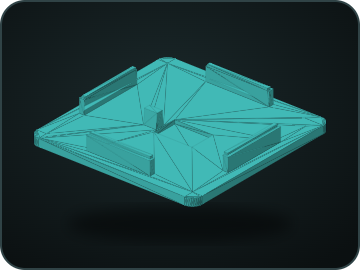
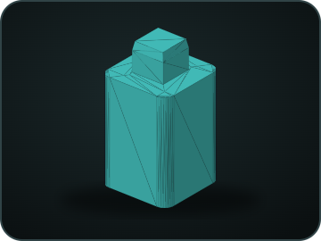
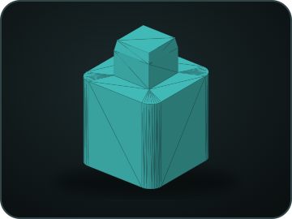
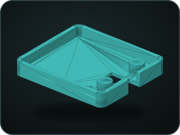

# 3D-druckbares Gehäuse für die IR Bridge

[English](../ir-bridge-enclosure.md) · **Deutsch** · [Bridge-Hardware und Installation](ir-bridge-installation.md)

Die Gehäusedateien fassen Waveshare ESP32-S3-Zero, Adafruit High Power Infrared
LED Emitter und den optionalen Lernempfänger zu einer kompakten Bridge zusammen.
Firmware, Elektronik und Verdrahtung sind nicht Bestandteil der STL-Dateien.

<table>
  <tr>
    <td align="center"> <strong>Geschlossenes Gehäuse mit Größenvergleich</strong></td>
    <td align="center"> <strong>Montierter Innenraum</strong></td>
  </tr>
</table>

Die Münze dient nur als Größenvergleich. Beide Infrarotöffnungen an der Front
freihalten und die Senderöffnung auf das zu steuernde Audiogerät ausrichten.

## STL-Dateien und Stückzahlen

| Vorschau | Datei | Aufgabe | Ungefährer Modell-Bauraum | Anzahl |
| --- | --- | --- | --- | --- |
|  | [`Bridge_Cube.stl`](../../docs/ir-bridge/assets/3d/enclosure/Bridge_Cube.stl) | Hauptgehäuse | 52 × 52 × 49,6 mm | 1 |
|  | [`deckel.stl`](../../docs/ir-bridge/assets/3d/enclosure/deckel.stl) | Deckel | 52 × 52 × 7,4 mm | 1 |
|  | [`fuss_1x_drucken_4x.stl`](../../docs/ir-bridge/assets/3d/enclosure/fuss_1x_drucken_4x.stl) | Längerer Fuß für zusätzliche USB-C-Freiheit | 8,5 × 8,5 × 16 mm | 4 dieser Version |
|  | [`fuss_1x_drucken_4x_KURZ.stl`](../../docs/ir-bridge/assets/3d/enclosure/fuss_1x_drucken_4x_KURZ.stl) | Kurzer Fuß für ein kompaktes USB-C-Steckergehäuse | 8,5 × 8,5 × 12 mm | 4 dieser Version |
|  | [`ir_sender_kappe.stl`](../../docs/ir-bridge/assets/3d/enclosure/ir_sender_kappe.stl) | Abdeckung des IR-Senders | 29 × 25,5 × 4,1 mm | 1 |

Möglichst ein USB-C-Kabel mit **kurzem Steckergehäuse** verwenden. Reicht der
Abstand zum Untergrund wegen eines längeren Kabelsteckers dennoch nicht aus,
den längeren Fuß `fuss_1x_drucken_4x.stl` verwenden. Nach Prüfung der benötigten
Bodenfreiheit **einen vollständigen Satz aus vier Füßen** wählen; lange und
kurze Füße nicht an einem Gehäuse mischen. Die Maße beschreiben den
Modell-Bauraum. Die echte Passung hängt von Drucker und Material ab.

## Montageübersicht

1. Die Verdrahtung aus der
   [Bridge-Installationsanleitung](ir-bridge-installation.md) vollständig
   aufbauen und elektrisch prüfen, bevor das Gehäuse geschlossen wird.
2. Hauptkörper, Deckel, Senderkappe und einen vollständigen Satz aus vier Füßen
   zunächst trocken einpassen. Mit einem kurzen USB-C-Stecker zuerst die kurzen
   Füße prüfen; bei fehlender Bodenfreiheit vier lange Füße verwenden.
3. Das ESP32-S3-Zero so positionieren, dass USB erreichbar bleibt und die
   Onboard-Status-LED wie vorgesehen erkennbar ist.
4. Den Adafruit-Sender auf seine Frontöffnung ausrichten. Weder Druckteil noch
   Leitung darf seinen Infrarotweg abschatten.
5. Besitzt diese Bridge den optionalen Lernempfänger, ihn auf die zweite Öffnung
   ausrichten und sein Sichtfeld freihalten. Andere gekoppelte Bridges benötigen
   keinen Empfänger; eine Lern-Bridge kann die Profile für alle anlernen.
6. Leitungen ohne Zug, scharfe Knicke und offene Kontakte führen. Das offene Foto
   zeigt die geprüfte Bauteilanordnung und ist keine Freigabe dafür, lose
   Verdrahtung das Board berühren zu lassen.
7. Den offenen Aufbau einschalten, Status-LED, Pairing, Lernen und IR-Reichweite
   prüfen und USB vor dem Aufsetzen des Deckels wieder trennen.
8. Nach dem Schließen den IR-Test am echten Audiogerät wiederholen und prüfen,
   dass das Gehäuse stabil steht und keine unerwartete Wärme entwickelt.

## Aufstellung

- Die Bridge so platzieren, dass der Hochleistungssender das Zielgerät erreicht;
  Reflexionen können funktionieren, müssen aber im echten Raum geprüft werden.
- Infrarotöffnungen nicht verdecken und die Bridge nicht hinter einer
  IR-undurchlässigen Tür einschließen.
- USB für eine Factory-Wiederherstellung zugänglich halten, auch wenn normale
  Updates über RoonPilot verwaltet werden.
- In RoonPilot kann ein Klarname wie **Wohnzimmer** oder **Arbeitszimmer**
  vergeben werden; die dauerhafte Kennung `RPB-…` bleibt die eindeutige Hardware-ID.

Es wird kein allgemeingültiges Slicer-Rezept behauptet. Material, Stützen,
Temperaturen, Wandzahl und Infill passend zum verwendeten Drucker wählen und
jeden Druck prüfen, bevor er eingeschaltete Elektronik umschließt.

Die STL-Dateien unterliegen weiterhin der RoonPilot-Projektlizenz. Vor der
Weitergabe von Dateien oder Druckteilen die [Lizenzhinweise](licensing.md) lesen.
