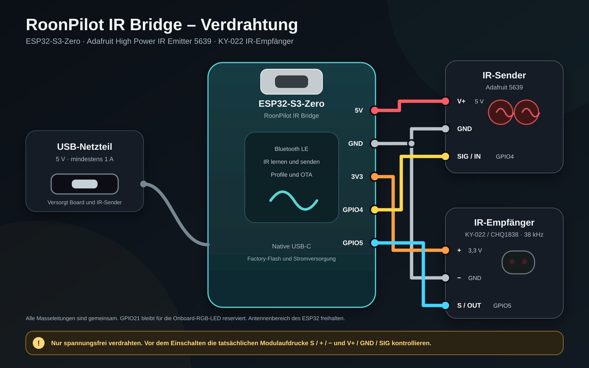

# IR-Bridge-Hardware und Factory-Installation

[English](../ir-bridge-installation.md) · **Deutsch** · [Bridge-Übersicht](ir-bridge.md)

Diese Anleitung betrifft die separate RoonPilot IR Bridge. Sie installiert
**nicht** das runde RoonPilot-Display und verwendet auch nicht den zweiten ESP
im Waveshare-Displaymodul.

## Unterstützter Referenzaufbau

| Bauteil | Referenz | Anschluss |
| --- | --- | --- |
| Controller | [Waveshare ESP32-S3-Zero mit offizieller Hardwaredokumentation](https://docs.waveshare.com/ESP32-S3-Zero) · [Händlerangebot des Projektboards](https://www.amazon.de/dp/B0F3XKMPMK?th=1) | USB-Versorgung, kein Akku |
| IR-Empfänger | [AZ-Delivery KY-022 IR-Empfängermodul](https://www.az-delivery.de/products/ir-empfanger-modul) | Signal an `GPIO5` / Boardaufschrift `GP5` |
| IR-Sender | [Adafruit High Power Infrared LED Emitter, Produkt 5639](https://www.adafruit.com/product/5639) | Steuersignal von `GPIO4` / `GP4`, separate 5-V-Versorgung nach Modulvorgabe |
| Status | Adressierbare RGB-LED auf dem Board | Muster für Pairing, Lernen, Erfolg und Update |

`GPIO5` und `GP5` bezeichnen auf dem dokumentierten Board denselben allgemeinen
Pin; entsprechend gilt dies für `GPIO4` und `GP4`.

Für Pinbelegung, natives USB-/BOOT-Verfahren, Onboard-RGB-LED und den
freizuhaltenden Antennenbereich gilt die [offizielle Waveshare-Dokumentation zum
ESP32-S3-Zero](https://docs.waveshare.com/ESP32-S3-Zero). Der zweite
Controller-Link führt lediglich zum Händlerangebot des im Projekt eingesetzten
Boards. Händler können Boardrevisionen unbemerkt ändern. Vor Verdrahtung und
Flashen deshalb Platine, ESP32-S3-Aufdruck, nativen USB-Anschluss und die
aufgedruckten Pins `GP4`/`GP5` mit dieser Anleitung vergleichen. Kein ähnlich
benanntes ESP32-C3- oder klassisches ESP32-Board einsetzen.

> [!WARNING]
> Vor jeder Verdrahtungsänderung USB abziehen. Niemals die 5-V-Versorgung des
> Senders auf einen ESP32-GPIO führen. Der GPIO liefert nur das Steuersignal.
> Controller, Empfänger und Sender benötigen eine gemeinsame Masse. Entscheidend
> sind Modulbeschriftung und Herstellerdokumentation, nicht Kabelfarben.

Das Hochleistungssendemodul darf mit 5 V versorgt werden, obwohl sein
Steuereingang vom 3,3-V-ESP32 kommt. Dadurch wird der GPIO nicht 5-V-fest: Nur
der Versorgungseingang des Moduls erhält 5 V; die gemeinsame Masse bildet die
Referenz des Steuersignals. Eine einzelne nackte IR-LED darf nicht ohne
berechnete Treiberstufe und Vorwiderstand mit hohem Strom betrieben werden.

*Beispielgehäuse des kompakten Testaufbaus; die Münze dient nur als
Größenvergleich. Beide Infrarotöffnungen frei halten und Reichweite sowie
Temperatur in der endgültigen Aufstellung prüfen.*

## Status-LED der Bridge

Die kleine RGB-LED sitzt auf dem ESP32-S3-Zero-Board. **Im normalen Betrieb ist
sie aus** – das bedeutet nicht, dass die Bridge ausgeschaltet oder die
Verbindung unterbrochen ist. Sie zeigt nur vorübergehende Vorgänge an:

| LED-Muster | Bedeutung |
| --- | --- |
| Langsam blau pulsierend | Ein Pairingfenster ist geöffnet. |
| Zweimal kurz blau | Die verschlüsselte Bluetooth-Kopplung war erfolgreich. |
| Mehrfach kurz blau für etwa 1,5 Sekunden | „Bridge identifizieren“ wurde in RoonPilot ausgelöst. |
| Orange pulsierend | Die Bridge wartet auf ein IR-Signal oder zeichnet es zum Lernen auf. |
| Zweimal kurz grün | Zwei passende IR-Aufnahmen wurden gespeichert. Nach violettem Pulsieren: Firmware angenommen, Neustart folgt. |
| Zweimal kurz rot | IR-Lernen fehlgeschlagen oder abgelaufen. Nach violettem Pulsieren: Firmwareübertragung oder -prüfung fehlgeschlagen. |
| Violett pulsierend | Firmware wird übertragen oder geprüft. **Stromversorgung nicht trennen.** |

Nach einer kurzen Bestätigung geht die LED wieder aus oder zeigt ein noch
offenes Pairingfenster an. Wird das IR-Lernen abgebrochen, erlischt das orange
Signal ohne rote Fehlermeldung. Für den laufenden Verbindungsstatus die
Bridge-Seite in RoonPilot verwenden, nicht die LED.

## Platzierung

- Die fertige Bridge an einem stabilen USB-Netzteil betreiben.
- ESP32-Antenne von Metall und dem Hochstrompfad des Senders fernhalten.
- Empfänger so ausrichten, dass die Originalfernbedienung ihn beim Lernen
  erreicht.
- Sender auf das Zielgerät oder eine zuverlässig reflektierende Fläche richten.
- Zunächst dicht am Gerät testen und erst nach wiederholtem Erfolg den Abstand
  vergrößern.
- Den finalen Reichweitentest mit dem eingebauten Adafruit 5639 durchführen.
  Alle vorgesehenen Gerätepositionen prüfen, da Entfernung, Ausrichtung und
  Reflexionen die IR-Zuverlässigkeit beeinflussen.

## Vor dem ersten Flashen

1. USB trennen und die Beschriftungen `5V`, `3V3`, `GND`, `GP4` und `GP5`
   kontrollieren.
2. Empfängerausgang an GP5 und Sendersteuerung an GP4 bestätigen.
3. Gemeinsame Masse prüfen; keine 5-V-Leitung darf einen GPIO berühren.
4. Ein bekanntes USB-Datenkabel verwenden, kein reines Ladekabel.
5. Einen aktuellen Desktop-Chromium-Browser mit Web Serial verwenden: Chrome,
   Edge, Chromium oder Brave. Safari, Firefox, Smartphones und Tablets können
   den Webinstaller nicht ausführen.
6. Arduino Serial Monitor, ESP-IDF Monitor, PuTTY und alle Programme schließen,
   die den seriellen Port belegen könnten.

## Serielles Gerät auswählen

Beim ersten Versuch nur die Bridge anschließen. Im Gerätefenster des
Webinstallers den nativen ESP32-S3-Port wählen:

- Windows: **USB JTAG/serial debug unit** (`COM…`).
- macOS: **USB JTAG/serial debug unit** (`cu.usbmodem…`).

Entscheidend ist der Name vor der Klammer; der Anschlussname in Klammern kann
abweichen. Eine vorherige Suche im Geräte-Manager oder macOS-Systembericht ist
nicht nötig. **USB serial** bezeichnet im Browserdialog einen klassischen
ESP32 und ist nicht die ESP32-S3-Bridge. Wird ein falscher Eintrag angezeigt,
den Dialog geöffnet lassen, USB abziehen und korrekt neu verbinden. Der
Webinstaller zeigt das Gerät unmittelbar wieder an. Falls gleichzeitig ein
rundes RoonPilot-Gerät angeschlossen ist, kann dessen Hauptprozessor ebenfalls
als **USB JTAG/serial debug unit** erscheinen. Deshalb während der
Bridge-Installation nur die Bridge per USB verbinden.

Erscheint kein nativer Port, ein anderes Datenkabel und einen direkten USB-Port
testen. Bei manchen Boards muss beim Einstecken **BOOT** gehalten und nach dem
Erscheinen des Ports losgelassen werden. Diese Taste ist nur für USB-Recovery
oder die erste Erkennung nötig; das spätere Pairing verlangt kein Öffnen des
Gehäuses.

## Factory-Installation

Factory ist für ein neues Board oder eine vollständige Wiederherstellung. Dabei
werden die von der Bridge verwendeten Flashbereiche gelöscht, darunter:

- ihre `RPB-…`-Kennung;
- Bluetooth-Bonding;
- eingerichteter WLAN-Fallback;
- gelernte IR-Profile und Befehle auf der Bridge. Zonenrouten liegen auf
  RoonPilot, funktionieren aber nur mit den passenden Profilen.

Bei einer vorhandenen funktionsfähigen Bridge zuerst die neuesten IR-Profile
mit RoonPilots Bibliothek abgleichen und vor der Factory-Installation unter
**System** eine **vollständige Sicherung** erstellen. Beim Export muss die
Bridge nicht mehr online sein. Auf einem fabrikneuen Board gibt es noch nichts
Sinnvolles zu sichern.

Eine Factory-Installation ersetzt die Bridge-Kennung. Die neue `RPB-…`-Bridge
zunächst mit RoonPilot koppeln und beim Wiederherstellen benannter IR-Profile
aus der gemeinsamen Sicherung ausdrücklich auswählen. Jede Ziel-Bridge erhält
eigene lokale Profil-IDs. Normale signierte Anwendungsupdates bleiben einfacher,
weil Kennung, Kopplung und gelernte Daten erhalten bleiben.

1. Den offiziellen Bridge-Factory-Webinstaller in einem unterstützten
   HTTPS-Browser öffnen.
2. Hardware- und Löschhinweis lesen.
3. **Verbinden und installieren** wählen.
4. Den geprüften ESP32-S3-Port auswählen.
5. Factory-Vorgang bestätigen.
6. USB angeschlossen lassen, bis Löschen, Schreiben und Verifizieren beendet sind.
7. Den Neustart abwarten. Eine fabrikneue Bridge erstellt eine neue Kennung,
   bietet Pairing an und ihre RGB-LED pulsiert blau.

Ein separater `erase-flash`-Befehl ist weder erforderlich noch empfohlen. Der
Webinstaller erledigt den für das Factory-Abbild nötigen Löschvorgang innerhalb
derselben kontrollierten Installation.

## In RoonPilot fortfahren

1. Bridge nahe bei RoonPilot eingeschaltet lassen.
2. Lokale RoonPilot-Weboberfläche öffnen.
3. **IR Bridge** auswählen.
4. **Bridge & Bluetooth** aktivieren, speichern und bei ausgeschalteter Funktion
   neu starten.
5. **Nach Bridges suchen** wählen.
6. Die vollständige `RPB-…`-Kennung vergleichen; nicht einfach das stärkste
   Signal wählen.
7. **Diese Bridge koppeln** wählen und auf „verbunden/bereit“ warten.

Weiter mit [Kopplung und Verbindung](ir-bridge-connectivity.md), danach mit
[IR-Lernen und Zonenrouting](ir-bridge-zones-and-profiles.md).

## Spätere Firmwareupdates

Für normale Updates nicht zum Factory-Webinstaller zurückkehren. RoonPilot
zeigt installierte und verfügbare Bridge-Versionen unter **IR Bridge → Wartung**
und führt signierte Onlineupdates über die aktuelle verschlüsselte Verbindung
aus. WLAN wird bevorzugt, BLE bleibt der Wiederherstellungsweg. Die Installation
beginnt erst nach Nutzerbestätigung und erhält normalerweise Kopplung, WLAN und
Profile.

Siehe [Bridge-Updates und Wiederherstellung](ir-bridge-updates.md).
