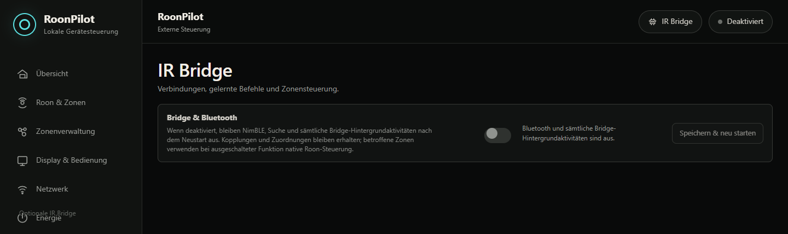

# IR-Bridge-Fehlerbehebung

[English](../ir-bridge-troubleshooting.md) · **Deutsch** · [Bridge-Übersicht](ir-bridge.md)

Beim beobachteten Symptom beginnen und Factory-Löschen nicht als Diagnoseschritt
verwenden. Die meisten Verbindungsprobleme verlangen weder das Löschen der
Kopplung noch der Profile.

## Der Eintrag IR Bridge fehlt

- Eine vereinheitlichte RoonPilot-Version installieren, welche die optionale
  Funktion enthält.
- Lokale Seite ohne alten Browsercache neu laden.
- Eine deaktivierte Bridge besitzt weiterhin den Navigationseintrag **IR Bridge**
  und die kompakte Hauptschalterseite. Nur ein bewusst Bridge-freier Build hat
  keinen Eintrag.

## Die Bridge-Seite zeigt nur den oberen Schalter

Das ist der vorgesehene deaktivierte Zustand. **Bridge & Bluetooth** aktivieren,
**Speichern & Neustarten** wählen, RoonPilot neu verbinden lassen und Seite
erneut öffnen. Kopplungen und Routen wurden nicht gelöscht.

## Keine Bridge wird gefunden

1. Stromversorgung prüfen. Die Status-LED ist im Normalbetrieb aus; nur bei
   geöffnetem Pairingfenster pulsiert sie blau. Alle Muster stehen unter
   [Status-LED der Bridge](ir-bridge-installation.md#status-led-der-bridge).
2. Für das erste Pairing nahe an RoonPilot stellen.
3. Prüfen, dass Bridge & Bluetooth nach Neustart aktiviert ist.
4. **Nach Bridges suchen** wählen und vollständigen Suchlauf abwarten.
5. Bei früherer Kopplung durch dreimaliges Aus-/Einschalten innerhalb 15
   Sekunden Pairing öffnen.
6. Andere nahe Bridges vorübergehend ausschalten.
7. Nur die Bridge neu starten und erneut suchen.

RSSI ist keine Kennung. Den kompletten `RPB-…`-Wert vergleichen.

## Die Liste zeigt Gekoppelt · Nicht verbunden

Das ist meistens normal: Die Kopplung bleibt gespeichert, aber diese Bridge
ist möglicherweise gerade nicht das Zonen- oder Wartungsziel. Eine andere
Bridge kann gleichzeitig über ihr eigenes WLAN erreichbar sein. Prüfen:

- welche Zone auf RoonPilot ausgewählt ist;
- ihre Route unter **Zonenrouting**;
- die Kennung unter `Bridge & Profil`;
- ob die Seite in der Wartungsauswahl steht.

**Verbinden** oder **Verwalten** nur zur Wartung wählen. Mit **Zurück zur
Zonensteuerung** beenden.

## Gekoppelte Bridge fehlt unter „Pair a Bridge“

Die Fundliste zeigt nur den letzten zehnsekündigen BLE-Scan, nicht alle
gespeicherten Kopplungen. **Saved IR Bridges** bleibt maßgeblich. Nach
Rückkehr in Bluetooth-Reichweite **Scan for Bridges** erneut drücken. Ein
fehlender Scan-Eintrag bedeutet nicht, dass Pairing oder WLAN verloren sind.

## Nach „Suchen“ komme ich nicht zurück

Im Abschnitt „Bridge koppeln“ **Suche abbrechen** wählen. Die Schaltfläche bleibt
auch nach leerem Ergebnis und Seitenneuladen vorhanden. Sie stellt automatische
Zonensteuerung wieder her. Reagiert sie nicht, Ereignislog und Diagnose vor einem
Neustart sichern; Kopplungen nicht entfernen.

## BLE-/WLAN-Zustand wechselt zu häufig

Ein schwankender dBm-Wert ist normal. Häufige Transportwechsel oder
Verbindungsmeldungen sind es nicht.

1. BLE- und WLAN-Wert notieren, nicht nur einen davon.
2. RoonPilot und Bridge zehn Minuten unbewegt lassen.
3. **WLAN-Fallback erlauben** vorübergehend ausschalten. Stabiles BLE grenzt den
   WLAN-Weg ein; weitere Abbrüche weisen auf BLE, Strom oder Störungen.
4. WLAN wiederherstellen und **WLAN-Pfad testen**.
5. Stabiles USB-Netzteil verwenden und ESP-Antenne von Metall/USB-Kabel fernhalten.
6. Im Ereignislog geplante lokale Trennung, Supervision Timeout,
   Statusabfrage-Timeout und Transport-Fallback vergleichen.

RoonPilot soll erst nach gefilterten Schwellen und Gnadenzeit wechseln.
Hintergrundstatus der Bridge darf Roon-Keepalive nicht blockieren. Ein
wiederholbarer Roon-Abbruch direkt nach Bridge-Timeouts ist mit Ereignis- und
Roon-Server-Zeitstempeln zu melden.

## Nach Zonenwechsel wird die falsche Bridge gemeldet

- Gespeicherte Bridge-Kennung/Profil der Zone prüfen.
- Wartung mit **Zurück zur Zonensteuerung** verlassen.
- Umschaltstatus abwarten, bevor am Ring gedreht wird.
- Ist die zugeordnete Bridge aus, nutzt RoonPilot bewusst weder eine andere
  Bridge noch unbemerkt native Roon-Lautstärke.

## Beim Lernen wird kein Signal empfangen

1. Empfänger `OUT/S` muss an GP5 liegen; `VCC`/`GND` nach Modulbeschriftung.
2. Empfängermodule besitzen oft eine andere physische Pinreihenfolge — weder
   Boardfarbe noch beliebiges Internetfoto ist verbindlich.
3. Originalfernbedienung bei 10–30 cm auf den Empfänger richten.
4. Lernlicht abwarten, bevor die Taste gedrückt wird.
5. Direktes Sonnenlicht/starke Lampen am Empfänger vermeiden.
6. Eine sicher funktionierende Fernbedienung testen, um Verdrahtung und
   Protokollproblem zu unterscheiden.

## Die beiden Aufnahmen stimmen nicht überein

- Beide Male dieselbe Taste drücken.
- Angefordertes kurzes/gehaltenes Verhalten gleich ausführen.
- Fernbedienung zwischen Aufnahmen nicht bewegen.
- Taste vor der zweiten Aufnahme vollständig loslassen.
- Entfernung und Umgebungs-IR verringern.
- Neu beginnen; der vorher gültige Befehl bleibt bis zur Annahme erhalten.

## „Gesendet“, aber Audiogerät reagiert nicht

1. Sendersteuerung an GP4 und gemeinsame Masse prüfen.
2. Hochleistungsmodul muss erforderliche 5 V am Versorgungseingang erhalten;
   niemals am ESP-GPIO.
3. Aus kurzer Entfernung auf das IR-Fenster des Zielgeräts zielen.
4. Prüfen, ob Träger oder Duty versehentlich geändert wurden.
5. Mit Originalfernbedienung neu lernen und sofort testen.
6. Den eingebauten Adafruit 5639 an allen vorgesehenen Gerätepositionen prüfen;
   seine Reichweite hängt von Ausrichtung und Raumreflexionen ab.

## Lautstärkeschritt stimmt nicht

`Drehschritt` der Zone ist eine Anzahl, kein Prozent- oder dB-Umrechner.

- `1x` auf einer IR-Route sendet einen vollständigen Befehl pro Raster.
- Ändert der DAC 0,5 dB pro Befehl, ergeben `2x` genau 1 dB.
- Ändert er 1 dB pro Befehl, ergeben `2x` genau 2 dB.

Wert am echten Gerät bestimmen und sicherstellen, dass in der Zonenverwaltung
die richtige Zone geändert wurde.

## Befehle laufen nach Ringstillstand weiter

Eine kleine begrenzte Aktion kann noch laufen; mehrere Sekunden Lautstärkeänderung
sind nicht akzeptabel.

- Zonenschritt vorübergehend reduzieren und wiederholen.
- Korrektes Wiederholtiming des Profils prüfen.
- Plötzlichen Richtungswechsel testen; alte Schritte müssen schnell wegfallen.
- Physische Raster und exakte dB-Änderung notieren.
- Ereignis-/Diagnosedaten vor Neustart herunterladen.

## Externe Lautstärke zeigt keinen absoluten Wert

Das ist Absicht. Normales IR hat keinen Rückkanal. RoonPilot zeigt Lauter/Leiser
oder einen relativen vorzeichenbehafteten Zähler in einem Amber-Infofeld. Ein
absoluter 0–100- oder dB-Wert erscheint nur, wenn ein Roon-Endpunkt ihn meldet.

## Power- oder Mute-Taste fehlt

In der Zonenverwaltung die Taste dieser Zone aktivieren. Externe Route benötigt
den passenden gelernten Profilbefehl. Power kurz = ON, Power lange = OFF. Für
HTTP muss zuerst Power aktiv sein, bevor **HTTP aktivieren** verfügbar wird.

## HTTP-Test ist deaktiviert

- Power und danach HTTP aktivieren.
- ON- oder OFF-Richtung dieses Paars aktivieren.
- Gültige numerische IPv4-`http://`-URL eintragen.
- Zonenverwaltung vor dem Test speichern.
- Prüfen, dass kein anderer HTTP-Test läuft.

Ein Test kann reale Stromversorgung ändern. Es gibt bewusst weder automatische
Wiederholung noch Weiterleitung.

## Onlineupdate ist langsam

Geprüftes WLAN wird bevorzugt; BLE-Übertragung ist erwartbar langsamer. Während
RoonPilot-Warnung und Bridge-Update-LED aktiv sind, Strom nicht trennen. Stoppt
der Fortschritt vollständig, gemeldeten Timeout oder Neuverbindung abwarten;
dasselbe Abbild kann bestätigte Daten fortsetzen.

## Update beendet, aber alte Version bleibt

RoonPilot meldet Erfolg erst nach Neustart und exakter Zielversion. Prüfen:

- Kompatibilitätssperre;
- Signatur-/Digestfehler;
- Rollback nach Startprüfung;
- falsche Bridge in Wartungsauswahl;
- Strom-/Transportverlust beim Abschluss.

Vorversion weiterlaufen lassen, Diagnose laden und nur bei Anweisung das
freigegebene lokale Recovery-Abbild verwenden. Nicht zuerst Factory löschen.

## IR-Befehle fehlen nach der Wiederherstellung

Prüfen, ob das benannte Profil in RoonPilots dauerhafter Profilbibliothek
vorhanden ist und beim Import der richtigen Ziel-Bridge zugeordnet wurde.
Ein neuer Export liest die Bibliothek auch dann, wenn die Bridge offline ist.
Nur Änderungen, die vor dem Export noch nicht mit der Bibliothek synchronisiert
waren, können fehlen. Eine ältere reine RoonPilot-Konfigurationsdatei enthielt
nie Bridge-IR-Daten: Falls vorhanden, die alte Einzel-Bridge-Datei unter
**System** importieren oder die Befehle neu anlernen. Siehe
[Konfiguration sichern und wiederherstellen](configuration-backup.md).

## Angaben für einen Fehlerbericht

- RoonPilot- und Bridge-Version;
- beteiligte `RPB-…`-Kennungen, sofern nicht privat;
- ausgewählte Zone und Route/Profil (Musikmetadaten unnötig);
- aktiver Transport und BLE-/WLAN-Feldstärken;
- genaue Aktion und Ergebnis;
- Ereignislog-Download;
- bereinigte Diagnose;
- Roon-Server-Zeitstempel bei gleichzeitigem Roon-Abbruch;
- ob Gerät oder USB-Versorgung bewegt wurde.

Niemals WLAN-Kennwörter, BLE-Schlüssel, private Signaturdaten, rohe
Factory-Sicherungen oder als privat betrachtete gemeinsame Einstellungs-/IR-
Sicherungen veröffentlichen.
