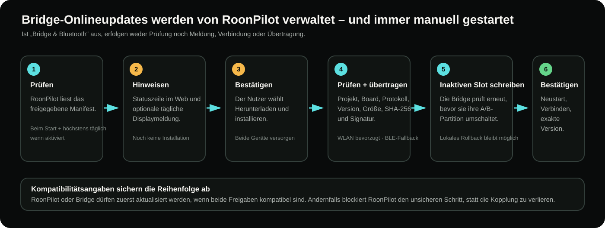
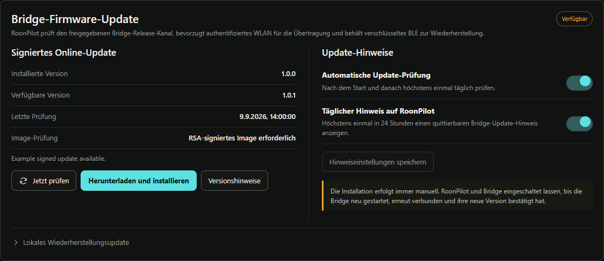

# IR-Bridge-Updates, Backup und Wiederherstellung

[English](../ir-bridge-updates.md) · **Deutsch** · [Bridge-Übersicht](ir-bridge.md)

Die Bridge-Firmware wird von RoonPilot aktualisiert. Für ein normales Update
sind weder USB-Kabel an der Bridge noch separater BIN-Download oder Rückkehr zum
Factory-Webinstaller nötig.

## Updatemeldungen

Unter **IR Bridge → Wartung** zeigt RoonPilot:

- installierte Bridge-Version;
- verfügbare freigegebene Version;
- letzte Prüfung und aktuellen Prüfzustand;
- Unterstützung signierter OTA durch die verbundene Bridge;
- Schalter für automatische Prüfung und Gerätemeldung.

Wenn aktiviert, wird nach dem Start und höchstens einmal pro Tag geprüft. Eine
neue Bridge-Version kann in der Web-Statuszeile und höchstens einmal in 24
Stunden als quittierbare RoonPilot-Displaymeldung erscheinen. Die Meldung wartet,
bis wichtige Bedienung, Akkukalibrierung oder andere Firmwarearbeit beendet ist.

Nur die Suche ist auf Wunsch automatisch. Die Installation ist **niemals**
automatisch.

## Vor der Installation

1. IR-Lernen und Profiländerungen beenden.
2. Bei neuen Profilen nach dem Bibliotheksabgleich **System → Sicherung erstellen**
   wählen. Die Bridges müssen für den Export nicht erreichbar sein.
3. RoonPilot und Bridge an stabile Stromversorgung anschließen.
4. Nicht gleichzeitig ein RoonPilot-Firmwareupdate starten.
5. Release Notes und Kompatibilitätsergebnis lesen.
6. Bei aktiviertem Bridge-WLAN dessen Verbindung prüfen. RoonPilot bevorzugt
   WLAN für die Übertragung. Ist WLAN auf der gekoppelten Bridge aus, aber BLE
   verfügbar, kann der Updateablauf WLAN vorübergehend bereitstellen und
   einschalten, für das Abbild verwenden und danach den vorherigen Aus-Zustand
   wiederherstellen.

## Normales Onlineupdate

1. **IR Bridge → Wartung** öffnen.
2. **Jetzt prüfen** wählen, wenn das automatische Ergebnis nicht aktuell ist.
3. Oben die gewünschte Bridge-Kennung bestätigen.
4. **Herunterladen und installieren** wählen.
5. Beide Geräte versorgt lassen. Auf dem RoonPilot-Display bleibt eine
   Updatewarnung; die Bridge-RGB-LED zeigt das Updatemuster.
6. Download, Prüfung, Übertragung, Bridge-Neustart und Neuverbindung abwarten.
7. Erfolg erscheint erst, wenn die Bridge exakt die angeforderte Version meldet.

Die Übertragung bevorzugt authentifiziertes lokales WLAN. Verschlüsseltes BLE
bleibt Fallback und kann langsamer sein; bei einer kurzen Fortschrittspause
nicht die Stromversorgung trennen. Nur für das Update aktiviertes WLAN ändert
nach Abschluss nicht unbemerkt die normale Fallback-Einstellung der Bridge.

## Was wird geprüft?

RoonPilot prüft Releasekanal, Projekt, Zielboard, Protokollbereich, Version,
Abbildgröße, SHA-256 und Signaturangaben vor der Installation. Die Bridge prüft
Blockreihenfolge, Gesamtgröße, Digest, eingebettete Identität und Signatur erneut,
bevor sie ihren inaktiven A/B-Anwendungsslot auswählt.

Nach dem Neustart verbindet RoonPilot neu und bestätigt die gemeldete Zielversion.
Eine bloß vollständig gesendete Bytezahl gilt nicht als Erfolg.

## Wenn RoonPilot- und Bridge-Update gleichzeitig vorliegen

Die Release-Metadaten nennen unterstützte Controller- und Bridge-Bereiche. Sind
beide Freigaben gegenseitig kompatibel, darf eines der beiden genehmigten
Updates zuerst installiert werden. Wäre eine Zwischenkombination unsicher,
blockiert RoonPilot diesen Schritt und erklärt die nötige Reihenfolge, statt eine
dauerhafte Trennung zu riskieren.

Eine Kompatibilitätssperre niemals mit einem älteren lokalen Abbild umgehen.
Beide Release Notes bereithalten, bis beide Updates beendet sind.

## Eine Sicherung für RoonPilot und Bridges

Unter **System → Sicherung erstellen** werden Einstellungen, alle Zonenrouten,
die dauerhafte IR-Profilbibliothek und getrennte Bridge-Zuordnungen in **einer
JSON-Datei** gesichert. Der Export liest RoonPilots Bibliothek, nicht jede
einzelne Bridge; gekoppelte Bridges dürfen offline sein. Neue Lernvorgänge
vorher mit der Bibliothek abgleichen. Im Wartungs-Tab gibt es keinen eigenen
Backup-Bereich mehr.

Zur Wiederherstellung die gewünschten Ziel-Bridges koppeln und unter
**System → Sicherung wiederherstellen** die Datei wählen. Datei- und
IR-Prüfsummen werden vor Änderungen geprüft. Beide Geräte versorgt lassen,
anschließend Routen kontrollieren und Lautstärke, Mute und beide Power-Befehle
an der echten Anlage testen. Ältere Einzel-Bridge-Dateien lassen sich auf der
System-Seite importieren und werden in eigenständige benannte Profile umgewandelt.

Factory-Installation oder Ersatzboard erhalten eine neue `RPB-…`-Kennung.
Diese neu gekoppelte Bridge im Importdialog ausdrücklich auswählen. Benannte
Profile lassen sich an mehrere Bridges übertragen, jeweils mit eigener neuer
lokaler Profil-ID; alte numerische IDs werden nicht blind übernommen. Normale
signierte Updates und Factory-Recovery weiterhin klar unterscheiden.

Die Regeln für neue Sicherungen und alte Dateien
stehen unter [Konfiguration sichern und wiederherstellen](configuration-backup.md).
WLAN-Kennwörter, Roon-Freigaben und Bluetooth-Schlüssel werden nie exportiert;
private HTTP-URLs dagegen schon.

## Lokales Wiederherstellungsupdate

Der eingeklappte Abschnitt **Lokales Wiederherstellungsupdate** ist für ein
signiertes Bridge-Anwendungsabbild des RoonPilot-IR-Bridge-Projekts gedacht,
wenn Onlineupdate nicht verfügbar ist. Er ist nicht der Normalweg.

- Bridge-Factory-Abbild, RoonPilot-Displayabbild oder unsignierte Datei werden
  abgelehnt.
- Eingetragene/Freigabeversion muss exakt zur eingebetteten Dateiversion passen.
- Kompatibilitäts-, Hash- und Signaturregeln gelten weiterhin.
- Recovery darf kein Downgrade oder einen blockierten Pairing-Vertrag umgehen.

## Unterbrochenes Update

Bei Verbindungsabbruch Stromversorgung beibehalten. Das Protokoll verfolgt
bestätigte Blöcke und kann dasselbe Abbild fortsetzen; eine andere Datei beendet
die alte Sitzung. Inaktiver Slot und Startprüfung erhalten die letzte gültige
Anwendung, wenn Abschlussprüfung oder Start scheitern.

Bei gemeldetem Fehler:

1. Neuverbindung/Rollback abwarten und nicht sofort wiederholen.
2. Exakte installierte Version und Ereignislog prüfen.
3. Wartung erneut öffnen und Diagnose unter **System** herunterladen.
4. Stromversorgung und WLAN-/BLE-Zustand prüfen.
5. Nur wiederholen, wenn die vorherige Sitzung sicher inaktiv ist.
6. Lokales Recovery ausschließlich mit freigegebenem signiertem Anwendungsabbild.
7. Factory-Webinstaller nur zur Komplettwiederherstellung; Factory löscht
   Kopplung, WLAN und Profile.

## Bei deaktivierter Bridge-Funktion

Es erfolgen weder Bridge-Updateprüfung noch Status-/Displaymeldung, Verbindung
oder Hintergrundupdate. Gespeicherte Meldungseinstellungen bleiben erhalten und
gelten wieder nach Aktivierung von Bridge & Bluetooth samt Neustart.
