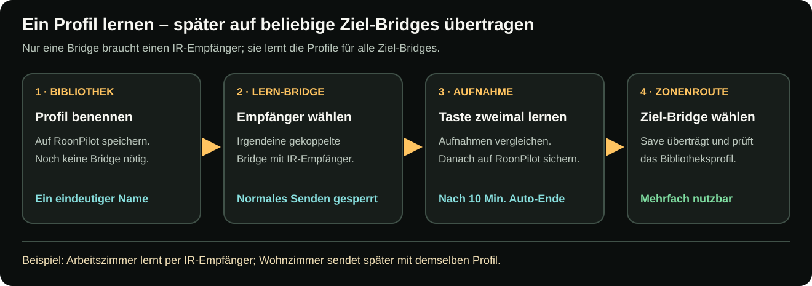

# IR-Profile, Lernen und Zonenrouting

[English](../ir-bridge-zones-and-profiles.md) · **Deutsch** · [Bridge-Übersicht](ir-bridge.md)

Es gibt zwei getrennte Konfigurationsebenen:

- **IR Bridge → Zonenrouting** wählt native Roon-Steuerung, externe
  Bridge/Profil oder deaktivierte Lautstärke.
- **Zonenverwaltung** legt pro Zone Drehschritt sowie optionale Power-/Mute-
  Tasten fest und kann zusätzliche HTTP-Poweraktionen anhängen.

Dadurch kann dasselbe RoonPilot in einem Raum Roon-Lautstärke, in einem zweiten
gelerntes IR und in einem dritten überhaupt keine Lautstärkesteuerung verwenden.

**Bei mehreren Bridges genügt eine einzige Bridge mit IR-Empfänger.** Sie dient
als Lern-Bridge für alle Profile. Die übrigen Bridges benötigen zum Senden
keinen Empfänger. Lern-Bridge und spätere Ziel-Bridge dürfen verschieden sein.

## Ein IR-Profil anlegen

1. **IR Bridge** öffnen.
2. **IR-Profile** öffnen und **Profil erstellen** wählen.
3. Einen eindeutigen Gerätenamen vergeben, etwa `RME ADI-2 DAC`.
4. Träger bei 38 kHz und Duty bei 33 % lassen, solange Gerätedokumentation oder
   Messung keinen anderen Wert verlangt.
5. **Auf RoonPilot speichern** wählen. Dazu muss noch keine Bridge verbunden sein.

Das Profil liegt dauerhaft in der RoonPilot-Bibliothek und ist nicht an eine
Bridge gebunden. Sein Name muss dort eindeutig sein. Beim späteren Speichern
einer Zonenroute wird eine Kopie automatisch auf die gewählte Ziel-Bridge
übertragen und geprüft. Dasselbe Profil kann mehreren Bridges zugeordnet
werden; deren lokale Profilplätze sind unabhängig. Jede Bridge kann bis zu
acht installierte Profile halten.

## Befehle jedes Profils

| Befehl | RoonPilot-Aktion |
| --- | --- |
| Lauter | Ringraster im Uhrzeigersinn bei aktiver externer Route. |
| Leiser | Ringraster gegen den Uhrzeigersinn. |
| Mute | Optionale Mute-Taste auf der Playeransicht. |
| Power On | Kurzes Tippen auf die optionale Power-Taste. |
| Power Off | Langer Druck auf dieselbe Power-Taste. |

Power On und Power Off besitzen bewusst getrennte Lernplätze. Ein Gerät kann
dieselbe Fernbedienungstaste verwenden, zum Ausschalten aber ein gehaltenes
Wiederholsignal verlangen. Die Bridge speichert für jeden Befehl das gelernte
Sendeverhalten, statt beide als unspezifischen Toggle zu behandeln.

## Befehle mit einer Lern-Bridge aufnehmen

1. Das gespeicherte Profil und **eine gekoppelte Bridge mit IR-Empfänger** als
   Lern-Bridge auswählen. Sie muss nicht die spätere Ziel-Bridge sein.
2. Den Empfänger so platzieren, dass ihn die Originalfernbedienung erreicht,
   und **Lernmodus starten** wählen.
3. Beim gewünschten Befehl **Anlernen** wählen. Auf die Aufforderung für die
   erste Aufnahme warten und die Originalfernbedienung auf den Empfänger
   richten, nicht auf RoonPilot.
4. Originaltaste einmal auf normale Weise drücken. Bei der zweiten
   Aufnahmeaufforderung denselben Tastendruck wiederholen.
5. Die weiteren benötigten Befehle ebenso aufnehmen. RoonPilot vergleicht die
   Aufnahmen; während des Lernmodus ist normales IR-Senden dieser Bridge
   gesperrt.
6. **Auf RoonPilot speichern** schließt den Lernmodus ab und übernimmt die
   bestätigten Befehle in die Profilbibliothek. **Lernvorgang verwerfen**
   lässt das Bibliotheksprofil unverändert. Ohne Abschluss endet der Lernmodus
   spätestens nach zehn Minuten automatisch.
7. Unter **Zonenrouting** eine Ziel-Bridge und dieses Profil auswählen und
   speichern. Erst danach am endgültigen Gerät testen, ob genau die erwartete
   IR-Aktion ausgeführt wird.

Zwischen beiden Aufnahmen keine andere Taste drücken. Bei langem Power Off der
Aufforderung folgen und den Tastendruck so halten, wie ihn das Originalgerät
erwartet.

[Schaubild groß öffnen](../../docs/ir-bridge/assets/bridge-learning-workflow-de.svg)

### Was wird automatisch analysiert?

Der Lernweg erfasst die demodulierte Impulsfolge und versucht Protokolldaten,
Bitzahl, Wiederholart und Frameperiode zu erkennen. Ist eine sichere
Protokolldarstellung möglich, verwendet die Bridge diese. Sonst bleibt eine
portable Rohfolge in Mikrosekunden erhalten. Zwei Aufnahmen helfen, Rauschen,
falsche Tasten und unvollständige Frames abzuweisen.

Deshalb kann ein gelernter Befehl mehrfach gesendet werden, ohne für jede
Drehgeschwindigkeit einen neuen Code anzulernen. Die gespeicherte
Wiederhol-/Timingstrategie bestimmt die Ausgabe der Folgeframes.

### Was bedeutet Duty?

Duty ist der Anteil jedes IR-Trägerzyklus, während dessen der Sender aktiv ist.
Bei 38 kHz und 33 % leuchtet die LED ungefähr ein Drittel jeder Trägerperiode.
Es ist weder Lautstärkeschritt noch Haltedauer oder Wiederholzahl. Höhere Werte
können mittleren Senderstrom und Wärme erhöhen und verbessern nicht automatisch
die Zuverlässigkeit. 33 % beibehalten, solange Sender und Zielgerät nicht für
einen anderen Wert geprüft wurden.

## Eine Zonenroute konfigurieren

**IR Bridge → Zonenrouting** öffnen. Für jede Roon-Zone wählen:

### Roon / Endpunkt-Lautstärke

RoonPilot verwendet die vom Endpunkt gemeldete Lautstärkefähigkeit. Numerische,
dB- und inkrementelle Typen werden automatisch erkannt. Meldet der Endpunkt dB,
beginnt der aktuelle Wert bei diesem gemeldeten dB-Wert und nicht bei null.

### Externe IR Bridge

Eine gekoppelte Bridge und ein Profil aus der RoonPilot-Bibliothek wählen.
**Speichern** verbindet die Ziel-Bridge, überträgt und prüft das IR-Profil
und aktiviert erst danach die Zonenzuordnung. Manuelles Laden oder Übertragen
ist nicht nötig. Ist die Bridge offline oder schlägt die Übertragung fehl,
bleibt die bisherige Zuordnung aktiv; die ungespeicherte Auswahl bleibt für
einen erneuten Versuch im Formular erhalten.

Normale IR-Geräte melden ihre absolute Lautstärke nicht zurück. Die Playeransicht
zeigt deshalb ein relatives Amber-Infofeld mit vorzeichenbehafteten Schritten
wie `+2` oder `-1`, statt einen erfundenen 0–100- oder dB-Wert.

### Deaktiviert

Der Ring sendet für diese Zone keinen Lautstärkebefehl. Wiedergabetasten bleiben
Roon-Befehle.

## Was geschieht beim Gruppieren in Roon?

Die Routen gehören zu den physischen Ausgängen und werden nicht durch den
vorübergehenden Gruppennamen ersetzt. Verbindet Roon mehrere Ausgänge, baut
RoonPilot aus deren vorhandenen Einstellungen eine Gruppenaktion:

- jedes native Mitglied erhält seinen eigenen ausgangsspezifischen Roon-Befehl;
- jedes externe IR-Mitglied nutzt seine zugeordnete Bridge und das Profil aus
  der Bibliothek;
- deaktivierte Mitglieder werden übersprungen;
- jede benötigte Bridge wird getrennt geprüft; eine nicht erreichbare steht als
  `OFFLINE` in der Anzeige, ohne ihre Route unbemerkt zu verändern;
- verweisen zwei Mitglieder auf dieselbe physische Bridge, erzeugt ein Raster
  dort nur eine IR-Aktion und keinen versehentlichen Doppelschritt.

Das erste einzelne Raster öffnet den per Touch auswählbaren Gruppenmixer, ohne
die Lautstärke zu ändern. Weiterdrehen regelt alle Mitglieder, eine Zeile wählt
ein Mitglied und die Gruppenkopfzeile wieder alle. Die bebilderte
[Anleitung zu Roon-Gruppen](roon-groups.md) erklärt gemischte Einheiten,
mehrere Bridges und die Grenze von drei sichtbaren Zeilen.

## Drehschritt pro Zone konfigurieren

**Zonenverwaltung** öffnen und pro Zone **Drehschritt** wählen.

- Bei einer nativen Roon-Zone bedeutet `2x` zwei native Endpunktschritte. Meldet
  der Endpunkt 1-dB-Schritte, fordert ein Raster 2 dB vor optionaler
  Beschleunigung an.
- Bei externer IR-Zone bedeutet `2x` zwei vollständige IR-Lautstärkebefehle pro
  Raster. Softwarebeschleunigung wird dem IR-Weg nicht zusätzlich aufgeprägt;
  das gelernte Timing steuert die Sendefolge.
- Eine Fernbedienung bzw. ein Gerät kann einen vollständigen Befehl als 0,5 dB,
  1 dB oder anders auslegen. Den Wert am echten Gerät beobachten und nicht als
  Prozentwert annehmen.

Schnelles Drehen wird gesammelt, ein Richtungswechsel baut Gegenschritte sofort
ab und veraltete Warteschlangen bleiben begrenzt. Der DAC darf nach Ringstillstand
nicht noch mehrere Sekunden weiterlaufen.

## Power- und Mute-Tasten

In der **Zonenverwaltung** Power und Mute für jede Zone getrennt aktivieren.

- Native Roon-Routen verwenden die Endpunktfunktion, sofern vorhanden.
- Externe Routen verwenden den passenden gelernten Befehl des Profils.
- Power kurz drücken = ON; Power lange drücken = OFF.
- Eine Taste erst aktivieren, wenn Endpunktaktion oder IR-Befehl sicher arbeitet.
  Fehlende externe Befehle fallen nicht unbemerkt auf Roon zurück.

## Optionale HTTP-Poweraktionen

Bei aktivem Power wird **HTTP aktivieren** für diese Zone verfügbar. Bis zu drei
benannte Befehlspaare können gespeichert werden, zum Beispiel `DAC-Strom`,
`Tablet-Dock` und `Raumlicht`.

Jedes Paar besitzt unabhängige ON-/OFF-Schalter, URLs und **Test**-Tasten. Beim
Deaktivieren einer Richtung bleiben Name und URL erhalten. Die Player-Power-
Aktion führt alle für diese Richtung aktivierten HTTP-Befehle der Reihe nach
zusammen mit dem konfigurierten nativen/IR-Powerweg aus.

Sicherheitsregeln:

- Eine Testtaste sendet eine echte HTTP-Anfrage und kann reale Geräte schalten.
- Vor dem Test speichern. Die Bestätigung nennt Zone, Paar und Richtung.
- Nur einfaches lokales HTTP mit numerischem IPv4-Ziel wird akzeptiert.
- Weiterleitungen und automatische Wiederholungen sind bewusst deaktiviert,
  damit eine Poweraktion nicht doppelt ausgeführt wird.
- Jede URL ist auf 512 Zeichen begrenzt; Zoneneinstellungen teilen sich einen
  begrenzten, deduplizierten URL-Pool.
- Die gemeinsame System-Sicherung enthält diese privaten URLs und gehört
  deshalb in private Ablage.

