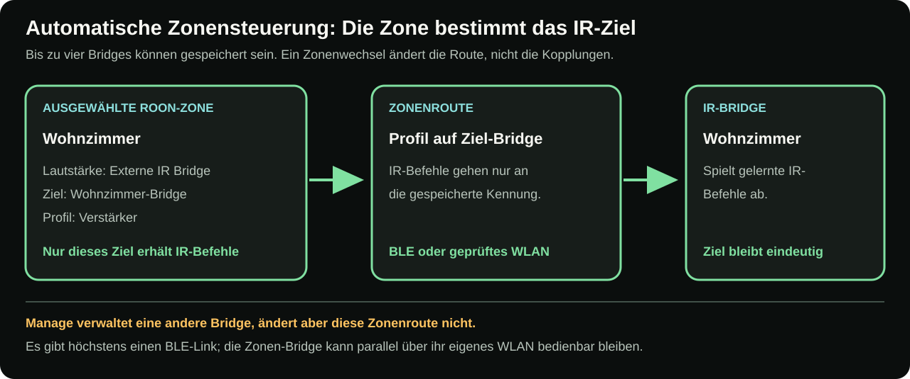
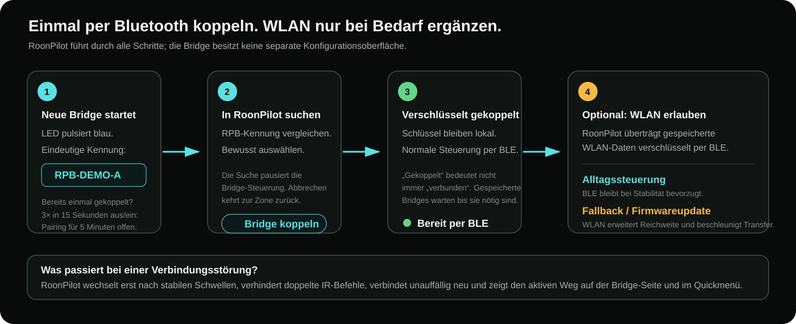
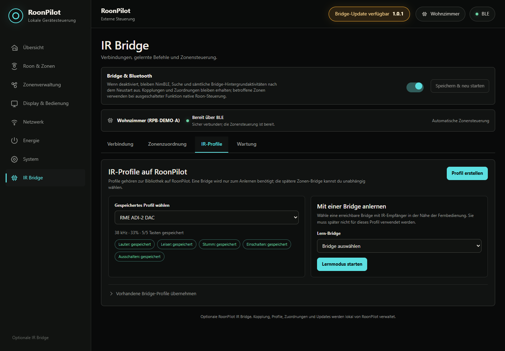

# RoonPilot IR Bridge

[English](../ir-bridge.md) · **Deutsch**

Die RoonPilot IR Bridge ist eine optionale ESP32-S3-Erweiterung für Audiogeräte,
deren gewünschte Funktionen nicht vollständig über Roon erreichbar sind.
RoonPilot bleibt die einzige Zentrale: Es koppelt die Bridge, lernt
Infrarotbefehle, ordnet jeder Roon-Zone eine Bridge samt Profil zu, wählt
Bluetooth oder WLAN, installiert Bridge-Updates und sichert gelernte Profile.

Bridge-Seite und IR-Bridge-Ansicht im Schnellmenü folgen der globalen
Deutsch/Englisch-Einstellung von RoonPilot. Physische `RPB-…`-Kennungen sowie
selbst vergebene Zonen-, Geräte- und Profilnamen werden nicht übersetzt.

Wird die Erweiterung nicht benötigt, **Bridge & Bluetooth** ausschalten und
neu starten. Bluetooth, Suche, Bridge-Verbindungen, Updateprüfungen und alle
Bridge-Hintergrundaufgaben bleiben dann aus. Die normalen RoonPilot-Funktionen
laufen weiter; Kopplungen, Routen und Profile bleiben für eine spätere
Aktivierung gespeichert.

> [!NOTE]
> Alle Bildschirmbilder und Adressen dieser Dokumentation enthalten erfundene
> Beispieldaten. Namen wie `RPB-DEMO-A` und Adressen aus `192.0.2.0/24` gehören
> zu keinem echten Gerät.

*Das Beispielgehäuse zeigt die Größenordnung des kompakten Testaufbaus; die
Ein-Euro-Münze dient nur als Vergleich. Beide Infrarotöffnungen müssen frei
bleiben.*

Die RGB-Status-LED ist im Normalbetrieb aus. Die Bedeutung ihrer blauen,
orangen, grünen, roten und violetten Signale steht in der
[LED-Legende der Hardwareanleitung](ir-bridge-installation.md#status-led-der-bridge).

## Welches Problem löst die Bridge?

Ein Roon-Ready-Endpunkt meldet seine Lautstärkefähigkeiten normalerweise an
Roon. RoonPilot sendet dann den dazu passenden Roon-Befehl. Das ist der
bevorzugte Weg, sofern damit die gewünschte Hardwarelautstärke geregelt wird.

Manche Anlagen benötigen einen anderen Weg. Ein RME ADI-2 DAC kann zum Beispiel
mit seiner Original-Infrarotfernbedienung gesteuert werden. Wird die Roon-Zone
über ein IR-Profil geleitet, ändert der RoonPilot-Ring die Lautstärke direkt im
DAC. Das erhält das Auto-Ref-Level-Verhalten des RME, statt die digitale
Lautstärke in Roon zu verwenden. Auf dieselbe Weise lassen sich Power-Befehle
eines Verstärkers, DACs oder Streamers bedienen, wenn dessen Roon-Endpunkt kein
Standby anbietet.

Die Wiedergabe bleibt trotzdem in Roon. Play, Pause, vorheriger/nächster Titel,
Playlists und Live Radio sind weiterhin Roon-Vorgänge. Nur ausdrücklich auf IR
geroutete Funktionen verlassen RoonPilot über die Bridge.

## Ähnliche Begriffe mit unterschiedlicher Bedeutung

| Begriff | Bedeutung |
| --- | --- |
| **Gekoppelt / gespeichert** | RoonPilot und Bridge besitzen gemeinsame verschlüsselte Schlüssel. Eine gespeicherte Bridge kann ausgeschaltet oder nicht verbunden sein. |
| **Verbunden** | RoonPilot besitzt gerade einen aktiven BLE- oder WLAN-Steuerweg zu dieser Bridge. |
| **Automatische Zonensteuerung** | Die gewählte Roon-Zone – oder jeder physische Ausgang einer gewählten Gruppe – bestimmt, welche gespeicherten Bridges IR-Befehle erhalten. Das ist der Normalbetrieb. |
| **Wartungsauswahl** | Eine andere gespeicherte Bridge wird vorübergehend für Profile, Verbindung oder Updates geöffnet. Die Zonenroute bleibt unverändert und kann über ihr geprüftes WLAN weiterarbeiten. |
| **IR-Profil** | Ein benannter Satz gelernter Befehle in der dauerhaften RoonPilot-Bibliothek; er kann auf mehrere Bridges übertragen werden. |
| **Zonenroute** | Pro Roon-Zone die Auswahl zwischen nativer Roon-Lautstärke, externer Bridge/Profil oder deaktivierter Lautstärke. |
| **WLAN-Fallback** | Optionales Bridge-WLAN, das verschlüsselt per BLE eingerichtet wird. BLE bleibt für nahe Alltagssteuerung bevorzugt; WLAN erweitert die Reichweite und wird für Firmwareübertragung bevorzugt. |

## Mehrere Zonen und mehrere Bridges

RoonPilot kann bis zu vier Bridges speichern. Jede Roon-Zone verwendet
unabhängig einen von drei Wegen:

- **Roon / Endpunkt-Lautstärke**;
- **Externe IR Bridge** mit gewählter Bridge und einem Profil aus RoonPilots Bibliothek;
- **Deaktiviert**, wenn der Ring die Lautstärke dieser Zone nicht ändern soll.

Zum Anlernen aller IR-Profile genügt **eine einzige Bridge mit IR-Empfänger**.
Die Profile bleiben in RoonPilots Bibliothek und können anschließend auch an
andere gekoppelte Bridges **ohne eigenen IR-Empfänger** übertragen werden.

Es gibt höchstens **einen BLE-Link**, aber mehrere Bridges können gleichzeitig
über ihre **jeweils eigenen authentifizierten WLAN-Wege** erreichbar sein.
Bei einer anderen Zonen- oder Gruppenauswahl prüft RoonPilot jede relevante
Ausgangsroute und richtet IR-Befehle ausschließlich an die jeweils zugeordnete
Bridge. Alle anderen gespeicherten Geräte behalten Kopplung und WLAN-Einstellungen.

### Roon-Gruppen

Eine Roon-Gruppe drängt ihre Mitglieder nicht in eine beliebige gemeinsame
Lautstärkeroute. Jeder physische Ausgang behält die in RoonPilot konfigurierte
Route. Eine Ringbewegung kann deshalb gleichzeitig einen nativen dB-Endpunkt,
einen nativen Zahlenwert und mehrere IR Bridges steuern. Benötigte Gruppen-
Bridges werden getrennt überwacht; eine ausgefallene Einheit steht als
`OFFLINE` in der Anzeige, während andere gültige Wege weiterarbeiten können.

Der Gruppenmixer öffnet mit dem ersten Raster, ohne die Lautstärke zu verändern.
Danach lässt sich die ganze Gruppe oder ein angetipptes Mitglied regeln. Die
[Anleitung zu Roon-Gruppen](roon-groups.md) erklärt den Ablauf vollständig.

Die **gespeicherten Bridges** und die **Fundliste des letzten BLE-Scans** sind
verschiedene Anzeigen. „1 found“ kann korrekt neben „2 / 4 gespeichert“
stehen. Die genaue Erklärung mit einem Zwei-Bridge-Beispiel und Schaubildern
steht unter [Kopplung und Verbindungswege](ir-bridge-connectivity.md).

Derzeit gehört eine Bridge genau zu einem RoonPilot. Die Kopplung an einen
anderen Controller ist ein bewusster Besitzerwechsel und keine gemeinsame
Mehrcontroller-Nutzung.

## So funktioniert die Kommunikation

Erste Kopplung und vertrauliche Bereitstellung verwenden Bluetooth Low Energy.
Die Verbindung ist gebondet und verschlüsselt. Wird **WLAN-Fallback erlauben**
aktiviert, überträgt RoonPilot seine gespeicherten Netzwerkdaten über diese
verschlüsselte BLE-Verbindung. Die Bridge eröffnet weder einen eigenen Setup-AP
noch eine unabhängige Verwaltungsseite.

Im Alltag bleibt BLE bevorzugt, solange der Weg stabil ist. RoonPilot wechselt
erst nach stabilen Schwellen, unterdrückt doppelte logische Befehle und verbindet
unauffällig neu. Außerhalb der BLE-Reichweite kann WLAN übernehmen; für ein
Firmwareabbild ist WLAN der bevorzugte Weg. Aktiver Transport und beide
Feldstärken stehen auf der Bridge-Seite; auch das Geräte-Quickmenü zeigt den
Bridge-Status.

## Was wird wo gespeichert?

RoonPilot speichert Bridge-Kennungen/Bonds, zonenbezogene Routen,
Funktionsschalter und die dauerhafte Bibliothek benannter IR-Profile. Jede
Bridge speichert ihre eigene Kennung, das Bluetooth-Bond, die optionale
WLAN-Konfiguration und die auf sie übertragenen Kopien der IR-Profile. Ein
Lautstärkebefehl bleibt dadurch klein und schnell: RoonPilot sendet nur den
logischen Befehl, die Bridge erzeugt das gespeicherte Signal.

Unter **System → Sicherung erstellen** entsteht eine JSON-Datei mit
RoonPilot-Einstellungen, allen Zonenrouten und der dauerhaft gespeicherten
IR-Profilbibliothek. Die Sicherung liest RoonPilots Bibliothek und fragt nicht
jede gekoppelte Bridge ab; eine ausgeschaltete Bridge hält sie daher nicht auf.
Noch nicht synchronisierte Änderungen auf einer Bridge können fehlen. Ein
zusätzlicher Backup-Schritt im Wartungs-Tab entfällt. WLAN-Kennwörter,
Roon-Freigaben sowie Bluetooth-/Transportschlüssel bleiben ausgeschlossen.
Einzelheiten erklärt [Konfiguration sichern und wiederherstellen](configuration-backup.md).

Beim Import können aktuell gekoppelte Ziel-Bridges pro Profil gewählt werden.
Eine Factory-Neuinstallation oder ein Ersatzboard erzeugt eine neue
`RPB-…`-Kennung: zuerst koppeln, dann beim Wiederherstellen als Ziel wählen.
Alte numerische Profil-IDs werden nicht blind übernommen.

## Normaler Aufbau in acht Schritten

1. Bridge-Hardware bei abgezogenem USB aufbauen und kontrollieren.
2. Das freigegebene Factory-Abbild mit dem separaten Bridge-Webinstaller
   installieren.
3. In RoonPilot **IR Bridge** öffnen, **Bridge & Bluetooth** aktivieren,
   speichern und den kontrollierten Neustart zulassen.
4. Suchen, vollständige aufgedruckte `RPB-…`-Kennung vergleichen und genau diese
   Bridge koppeln.
5. Optional WLAN aktivieren und den WLAN-Pfad testen.
6. IR-Profil anlegen, jeden Originalbefehl zweimal erfassen und direkt am echten
   Audiogerät testen.
7. **Zonenrouting** öffnen, Bridge/Profil der Roon-Zone zuordnen,
   Power-/Mute-Tasten bei Bedarf wählen und speichern.
8. Unter **System** eine vollständige Sicherung erstellen, sobald die Profile
   auf RoonPilot synchronisiert sind und die Routen wie gewünscht arbeiten.

Ausführliche Anleitungen:

- [Bridge-Hardware und Factory-Installation](ir-bridge-installation.md)
- [3D-druckbares Gehäuse und STL-Downloads](ir-bridge-enclosure.md)
- [Kopplung, automatische Zonensteuerung und Verbindung](ir-bridge-connectivity.md)
- [IR-Profile, Lernen und Zonenrouting](ir-bridge-zones-and-profiles.md)
- [Bridge-Updates, Backups und Wiederherstellung](ir-bridge-updates.md)
- [Bridge-Fehlerbehebung](ir-bridge-troubleshooting.md)

## Was der Hauptschalter garantiert

Nach dem Ausschalten von **Bridge & Bluetooth** und einem RoonPilot-Neustart:

- starten weder Bluetooth-Controller noch NimBLE-Host;
- laufen keine Suche, Neuverbindung, Statusabfrage oder Bridge-Updateprüfung;
- zeigt die Bridge-Seite nur den kompakten Hauptschalter;
- bleiben alle Bridge-Daten gespeichert;
- verwenden Zonen mit gespeicherter externer oder deaktivierter Route
  vorübergehend natives Roon-Verhalten, solange die komplette Funktion aus ist;
- bleibt ein kompatibles Konfigurationsbackup unabhängig vom Schalterzustand
  importierbar.

Nach erneutem Aktivieren und Neustart gelten die gespeicherten Routen wieder.
Ist die Bridge-Funktion dagegen aktiv, aber eine zugeordnete Bridge fehlt,
sendet RoonPilot denselben Lautstärke-/Power-Befehl **nicht** unbemerkt über
Roon. Dieses geschlossene Fehlerverhalten verhindert eine unerwartete Reaktion
eines zweiten Geräts.

## Grenzen und Erwartungen

- Infrarot braucht geeignete Positionierung, Sichtkontakt oder nutzbare
  Reflexionen.
- Eigenständige IR-Profile liegen dauerhaft in RoonPilot; Kopien liegen auf
  den zugeordneten Bridges. Vor einer Factory-Neuinstallation eine aktuelle
  System-Sicherung erstellen.
- Pro Bridge sind bis zu acht Profile, pro RoonPilot bis zu vier Bridges möglich.
- Aktive Routen folgen der ausgewählten Zone oder allen physischen Mitgliedern
  einer Roon-Gruppe; Wartung darf BLE nur verwenden, solange alle betroffenen
  Steuerwege erreichbar bleiben, normalerweise über ihr geprüftes WLAN.
- Eine Bridge wird derzeit von einem RoonPilot besessen und verwaltet.
- WLAN-Fallback ist optional, lokal und keine Cloud-Steuerung.
- Die Suche nach Updates darf automatisch laufen; die Installation niemals.
- `Duty` ist keine Lautstärkestärke, sondern das Tastverhältnis des IR-Trägers.
  33 % bleibt der Normalwert, solange keine geprüfte Hardwareänderung nötig ist.

## Aktuelle Oberflächenbeispiele

