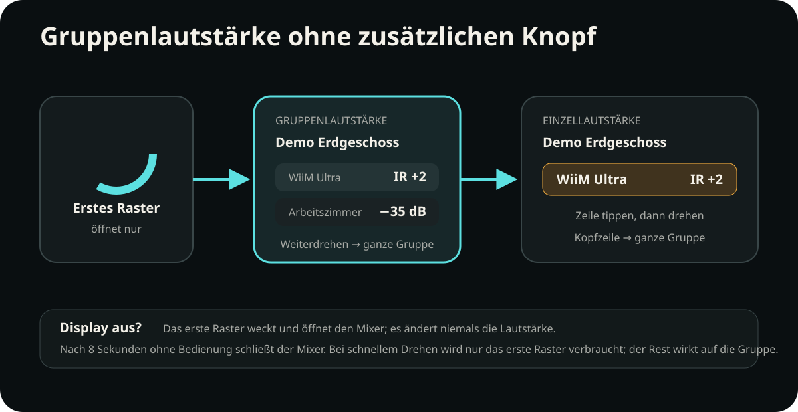

# Roon-Gruppen und der Gruppenmixer am Gerät

[English](../roon-groups.md) · **Deutsch** · [Bedienung am Gerät](device-controls.md)

RoonPilot behandelt eine Roon-Gruppe als eine ausgewählte Wiedergabezone, deren
physische Ausgabegeräte trotzdem unterschiedliche Lautstärkewege benötigen
können. Eine Ringbewegung kann deshalb native Roon-Lautstärke, echte dB-Werte,
relative Roon-Befehle und mehrere IR Bridges kombinieren. Entscheidend bleibt
die gespeicherte Route jedes physischen Ausgangs; das Gruppieren in Roon
überschreibt sie nicht.

[Schaubild zum Routing groß öffnen](../../docs/assets/roon-group-routing-de.svg)

## Was die erste Ringbewegung macht

Besitzt die gewählte Zone mehrere Ausgänge und ist der Mixer geschlossen:

1. Den Ring um ein Raster in eine beliebige Richtung drehen.
2. RoonPilot öffnet den Gruppenmixer und verbraucht dieses erste Raster. **Es
   wird noch kein Lautstärkebefehl gesendet.**
3. Weiterdrehen verändert alle regelbaren Mitglieder der Gruppe.

Damit lässt sich der Mixer ohne einen zusätzlichen kleinen Bildschirmknopf
öffnen. Bei schwarzem Display weckt dasselbe erste Raster das Gerät und öffnet
den Mixer ebenfalls ohne Lautstärkeänderung. Enthält eine schnelle Bewegung
bereits mehrere Raster, wird nur das erste verbraucht; die restlichen Raster
wirken auf die ganze Gruppe.

[Schaubild zur Bedienung groß öffnen](../../docs/assets/roon-group-mixer-de.svg)

## Die ganze Gruppe regeln

Zunächst steht in der Kopfzeile **Gruppenlautstärke**, darunter der Roon-
Gruppenname. Beim Weiterdrehen behandelt RoonPilot jeden physischen Ausgang
einzeln:

| Gespeicherte Route eines Gruppenmitglieds | Wirkung des Rings | Anzeigebeispiel |
| --- | --- | --- |
| Roon nativ `number` | eigener nativer Roon-Befehl für diesen Ausgang | `48` — ohne erfundenes Prozentzeichen |
| Roon nativ `db` | eigener nativer Roon-Befehl | `−35.0 dB` |
| Roon nativ `incremental` | relativer Lauter-/Leiser-Befehl | `Roon +2` |
| Externe IR Bridge | gelernter Befehl über zugeordnete Bridge und Profil | `IR +2` |
| Deaktiviert oder nicht unterstützt | kein Lautstärkebefehl für dieses Mitglied | Mitglied wird übersprungen |
| Benötigte IR Bridge nicht erreichbar | kein stiller Wechsel auf einen anderen Weg | `OFFLINE` |

Die Werte müssen keine gemeinsame Einheit besitzen. `48`, `−35.0 dB` und
`IR +2` gleichzeitig sind korrekt: Jede Zeile zeigt ehrlich das Modell ihres
Ausgangs. Wiedergabe, Titelwechsel, Playlisten und Live Radio bleiben
Roon-Vorgänge.

  

## Ein Mitglied ohne zusätzlichen Knopf regeln

Solange der Gruppenmixer sichtbar ist:

1. Die große Zeile des gewünschten Mitglieds antippen.
2. Die Überschrift wechselt zu **Einzellautstärke** und die Zeile wird markiert.
3. Den Ring drehen. Nur dieser physische Ausgang erhält Lautstärkebefehle.
4. Den Gruppennamen in der Kopfzeile antippen, um wieder die ganze Gruppe zu
   wählen.

Nach acht Sekunden ohne Ring- oder Touchbedienung schließt der Mixer automatisch
und der normale Player erscheint wieder.

  

## Mehrere IR Bridges in einer Gruppe

RoonPilot berücksichtigt alle Bridges, die zur gerade gesteuerten Gruppe
gehören. Es gibt höchstens eine BLE-Verbindung, aber mehrere unabhängig
authentifizierte WLAN-Wege können gleichzeitig aktiv sein. Eine nahe Bridge
kann per BLE arbeiten, während eine andere im Nebenraum über WLAN gesteuert
wird.

- Jedes Gruppenmitglied behält seine eigene Bridge- und Profilzuordnung.
- Fällt eine Bridge aus, wird nur ihre Route unbenutzbar; gültige native Wege
  und andere Bridges können weiterarbeiten.
- Ausfall und Wiederkehr werden pro beteiligter Bridge gemeldet, ohne Display
  oder Ereignislog während eines anhaltenden Fehlers ständig zu überfluten.
- Ein Wechsel zwischen BLE und WLAN ändert keine gespeicherte Route und darf
  einen IR-Befehl nicht doppelt ausführen.
- Zwei unabhängig gesteuerte IR-Ausgänge dürfen innerhalb einer Gruppe nicht
  dieselbe Bridge verwenden. Bei diesem Konflikt stoppt RoonPilot den
  Gruppenbefehl, statt ein Profil zu erraten. Siehe den Routenschutz unten.

[IR-Bridge-Kopplung und Verbindungswege](ir-bridge-connectivity.md) erklärt
BLE-Suche, authentifiziertes WLAN und automatische Transportwechsel.

## ROUTEN PRUEFEN und STOP

Werden zwei IR-Ausgänge der gewählten Gruppe derselben **Bridge** zugeordnet,
zeigt RoonPilot über dem Mixer **ROUTEN PRUEFEN** (Englisch: **CHECK ROUTES**).
Bei den regelbaren Zeilen steht **STOP**. Kein Mitglied erhält einen
Gruppen-Lautstärkebefehl, auch kein nativer Roon-Ausgang. Gruppen-Power oder
-Mute können ebenfalls gestoppt werden, wenn ihre beteiligten IR-Routen
kollidieren.

Das schützt vor einer mehrdeutigen Zuordnung und bedeutet nicht, dass die
Bridges offline sind. **OFFLINE** kennzeichnet dagegen einen nicht erreichbaren
Bridge-Weg; andere gültige Gruppenmitglieder können weiterarbeiten. Gruppieren
oder Auflösen allein verlangt keine erneute Bestätigung, solange jedes Mitglied
eine gültige eigene Zuordnung behält.

**ROUTEN PRUEFEN** beheben:

1. Die lokale Webseite öffnen und **IR Bridge → Zonenrouting** wählen.
2. Jeden physischen Ausgang der Gruppe kontrollieren, nicht nur den Gruppennamen.
   Jedem unabhängigen IR-Ziel seine eigene gekoppelte Bridge und das richtige
   Bibliotheksprofil zuordnen. Für einen Ausgang ohne IR-Steuerung Roon nativ
   wählen oder die Lautstärkeregelung deaktivieren.
3. Jede korrigierte Route speichern. RoonPilot prüft die gewählte Profilkopie
   vor dem Aktivieren; scheitert die Vorbereitung, bleibt die bisherige Route
   bestehen.
4. Im Mixer wieder die ganze Gruppe wählen. Nach Auflösen des Konflikts erscheinen
   **Gruppenlautstärke** und die normalen Werte statt **ROUTEN PRUEFEN / STOP**.

Eine Route nicht nur zum Ausblenden der Warnung auf Roon nativ umstellen, wenn
das tatsächliche Gerät über IR gesteuert werden muss.

## Anzeigegrenze bei größeren Gruppen

RoonPilot kann das vollständige Gruppenmodell verarbeiten, auf der runden
Touchanzeige ist jedoch Platz für höchstens **drei regelbare Zeilen**. Existieren
mehr Routen, zeigt die Überschrift beispielsweise `3/4`:

- Drehen für die ganze Gruppe verarbeitet weiterhin alle geeigneten Ausgänge;
- nur die drei sichtbaren Zeilen lassen sich am Gerät einzeln auswählen;
- soll ein nicht sichtbarer Ausgang einzeln geändert werden, dafür Roon nutzen
  oder die Gruppe vorübergehend ändern.

Das ist nur eine Platzgrenze der Anzeige und verändert die Roon-Gruppe nicht.

## Ausführliches Beispiel

Die fiktive Gruppe **Demo Erdgeschoss** enthält:

- **WiiM Ultra** — externe IR-Steuerung über die Wohnzimmer-Bridge;
- **Arbeitszimmer** — native dB-Lautstärke über Roon;
- **Küche** — native numerische Roon-Lautstärke.

Ein Raster öffnet den Mixer. Zwei weitere Raster im Uhrzeigersinn können
gleichzeitig `IR +2`, `−35.0 dB` und `48` anzeigen. Nach Antippen von
**Arbeitszimmer** verändert das nächste Raster nur diesen Ausgang. Ein Tipp auf
**Demo Erdgeschoss** wählt wieder die ganze Gruppe. Wird die Wohnzimmer-Bridge
ausgeschaltet, steht bei WiiM Ultra `OFFLINE`; Arbeitszimmer und Küche arbeiten
über ihre gültigen nativen Wege weiter.
