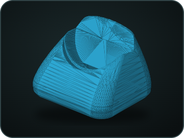
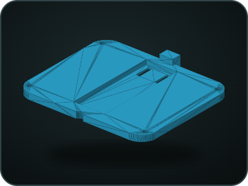
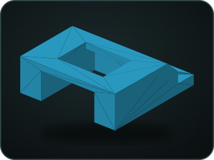
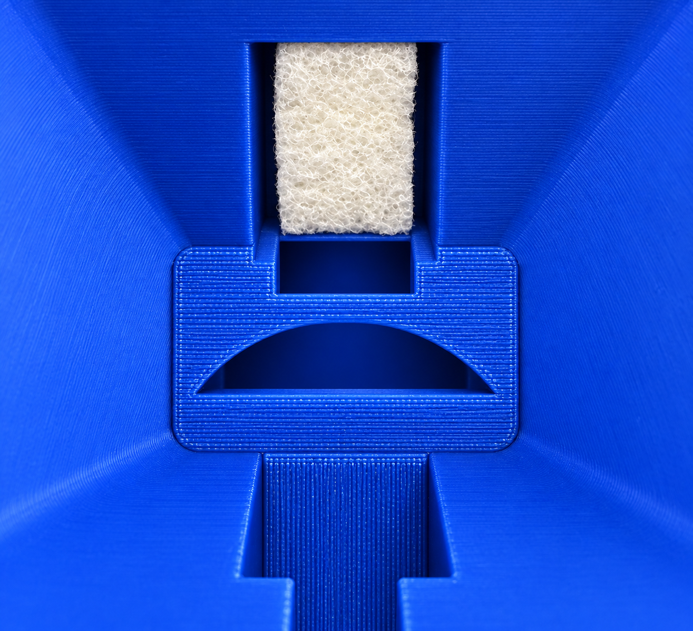
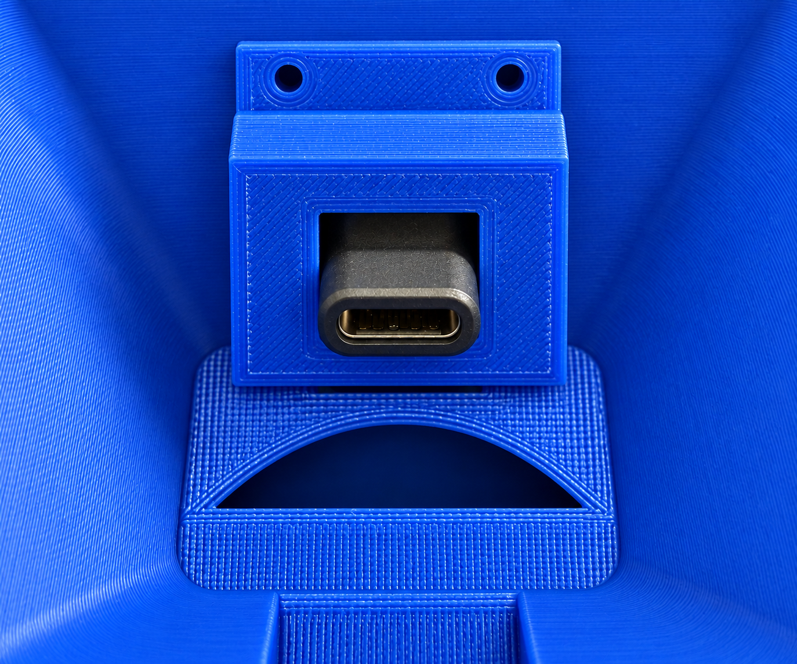

# 3D-druckbarer Stand für RoonPilot

[English](../roonpilot-stand.md) · **Deutsch** · [Hardware](hardware-and-two-processors.md)

Der optionale dreiteilige Stand hält den runden RoonPilot in einem angenehmen
Betrachtungswinkel und führt einen USB-C-Anschluss in die Aufnahme. Er verändert
weder Elektronik noch Firmware und ist für RoonPilot nicht erforderlich.

<table>
  <tr>
    <td align="center"> <strong>Stand ohne RoonPilot</strong></td>
    <td align="center"> <strong>Vollständiges Beispiel</strong></td>
  </tr>
</table>

## STL-Dateien herunterladen

Jedes Teil einmal drucken:

| Vorschau | Teil | Ungefährer Modell-Bauraum | Download |
| --- | --- | --- | --- |
|  | Standkörper | 93 × 79 × 63,4 mm | [`dock_body.stl` herunterladen](../../docs/assets/3d/roonpilot-stand/dock_body.stl) |
|  | Bodenabdeckung | 83,4 × 73,7 × 7,5 mm | [`dock_bottom_cover.stl` herunterladen](../../docs/assets/3d/roonpilot-stand/dock_bottom_cover.stl) |
|  | USB-C-Halter | 25 × 25 × 8,5 mm | [`halter.stl` herunterladen](../../docs/assets/3d/roonpilot-stand/halter.stl) |

Die Maße stammen aus den Modelldateien und sind keine garantierten Maße des
fertigen Drucks. Druckerkalibrierung, Materialschrumpfung und Slicer-Toleranzen
beeinflussen die Passung. Halter und Boden zuerst trocken einpassen; niemals
Kraft auf RoonPilots USB-C-Buchse ausüben.

## Was auf den Montagebildern zu sehen ist

<table>
  <tr>
    <td align="center"> <strong>Unterseite mit Schaumstoffstreifen</strong></td>
    <td align="center"> <strong>Magnetkupplung und Halter</strong></td>
  </tr>
</table>

`usb_c_install_01` zeigt den Stand von unten. Dort wird ein dünner Streifen
Schaumstoff eingeklemmt oder angeklebt. Seine Dicke richtet sich nach der Härte
des verwendeten Schaumstoffs: Er soll die abgewinkelte USB-C-Magnetkupplung
leicht führen, sie aber nicht starr festklemmen. Auch nach dem Aufsetzen des
Halters muss sich die Kupplung noch geringfügig bewegen und selbst ausrichten
können.

`usb_c_install_02` zeigt den darüber montierten USB-C-Halter. Er wird mit zwei
kleinen, zu den vorhandenen Bohrungen passenden Schrauben befestigt. Kleben ist
hier ungünstig, weil die Magnetkupplung nach der ersten Passprobe eventuell noch
nachjustiert werden muss. Der Anschluss muss mittig und gerade sitzen: Beim
Einsetzen darf er nicht verkanten und RoonPilots USB-C-Buchse darf keine tragende
Funktion übernehmen.

> [!IMPORTANT]
> Den Halter zunächst nur leicht verschrauben, RoonPilot vorsichtig einsetzen
> und die Magnetkupplung spannungsfrei ausrichten. Erst danach die beiden
> Schrauben gleichmäßig anziehen. Die Kupplung soll weiterhin etwas nachgeben
> können; sie darf das Gerät weder anheben noch seitlich belasten.

## Montagereihenfolge

1. Standkörper, Bodenabdeckung und USB-C-Halter jeweils einmal drucken.
2. Druckreste entfernen und Boden sowie Halter trocken einpassen. Bei zu strammer
   Passung zuerst die Drucktoleranzen korrigieren und nichts erzwingen.
3. Den Stand wie auf `usb_c_install_01` von unten betrachten und einen dünnen
   Schaumstoffstreifen an der gezeigten Stelle einklemmen oder ankleben. Die
   Dicke passend zur Schaumstoffhärte wählen.
4. Bei getrennter Stromversorgung die abgewinkelte USB-C-Magnetkupplung mittig
   auf dem Schaumstoff positionieren. Sie muss leicht beweglich bleiben.
5. Den gedruckten Halter wie auf `usb_c_install_02` darüber einsetzen und mit
   zwei kleinen passenden Schrauben zunächst nur leicht befestigen. Den Halter
   nicht verkleben.
6. RoonPilot vorsichtig zur Passprobe einsetzen, die Kupplung spannungsfrei
   nachjustieren und erst dann beide Schrauben gleichmäßig anziehen. Anschließend
   die Bodenabdeckung einsetzen.
7. Den Stand rutschfest und stabil aufstellen. RoonPilot senkrecht und ohne
   seitliche Belastung einsetzen; dabei die USB-C-Ausrichtung beobachten.
8. Ein stabiles USB-Netzteil verbinden und prüfen, dass das Gerät ohne Kabelzug
   sitzt. Bei belastetem Anschluss oder kippendem Gehäuse sofort wieder entnehmen.

Die im Prototyp verwendete abgewinkelte USB-C-Magnetkupplung wurde über
[dieses Amazon-Angebot](https://www.amazon.de/dp/B0H3C1G3CY?th=1) bezogen. Für
diesen Kupplungstyp gibt es nur wenig Auswahl. Trotzdem vor dem Kauf Maße,
Winkel und durchverbundene Pins prüfen; Produktangebote können sich unabhängig
von den STL-Dateien ändern.

Für den Anschluss möglichst ein USB-C-Kabel mit **kurzem Steckergehäuse**
verwenden. Ein langer oder steifer Stecker kann am Stand anliegen, Zug auf die
Magnetkupplung übertragen und ihre notwendige Beweglichkeit einschränken. Diese
Empfehlung gilt ebenso für die RoonPilot IR Bridge.

## Hinweise zum Drucken

Es werden bewusst keine druckerspezifischen Temperaturen, Stützen, Wandstärken,
Infill- oder Materialrezepte behauptet, weil sie nicht für verschiedene Drucker
validiert wurden. Einstellungen passend zum verwendeten Material wählen und den
fertigen Druck vor dem Einsetzen von Elektronik auf Schichttrennung, scharfe
Kanten und Verformung prüfen.

Die STL-Dateien sind RoonPilot-Projektbestandteile und unterliegen weiterhin der
Projektlizenz. Vor Weitergabe von Dateien oder Druckteilen die
[Lizenzhinweise](licensing.md) lesen.
