# Vollständige Referenz der Weboberfläche

[English](../web-interface.md) · **Deutsch**

Die deutsch/englische Oberfläche wird direkt vom RoonPilot im lokalen Netzwerk
bereitgestellt. Sie ist kein Cloud-Dashboard und benötigt keinen zusätzlichen
Dienst.

## Öffnen

Die Geräte-IP steht im Schnellmenü unter **System**. Diese Adresse in einem
Browser desselben Netzes aufrufen, beispielsweise `http://192.0.2.40` in den
fiktiven Bildern dieser Anleitung. Die echte Adresse ist anders; `192.0.2.0/24`
ist ein reserviertes Dokumentationsnetz. Aktuelle Werte werden nach dem ersten
Seitenaufbau asynchron geladen; die Oberfläche bleibt dabei bedienbar. Bei
Erreichbarkeitsproblemen siehe [Fehlerbehebung](troubleshooting.md).

Ist eine neuere freigegebene Version bekannt, erscheint auf jeder Seite oben
ein auffälliger gelber Hinweis mit der verfügbaren Version. Ein Klick springt
direkt zu **System → Firmware update**. Der Hinweis startet niemals selbst eine
Installation.

## Übersicht

- WLAN, IP, Signalstärke, Roon-Verbindung, Server, Zone und Firmware;
- Titel, Interpret, Cover, Wiedergabe, verstrichene/Gesamtzeit und
  Titelfortschritt; für eine reine IR-Zone wird kein absoluter Web-Pegel
  erfunden;
- schnelle Play/Pause-/Zurück-/Weiter-Befehle;
- Links zu den wichtigsten Konfigurationsbereichen sowie Projektseite,
  Dokumentation, Fehlerbehebung, GitHub und autorisiertem Factory-Installer.

## Roon & Zones

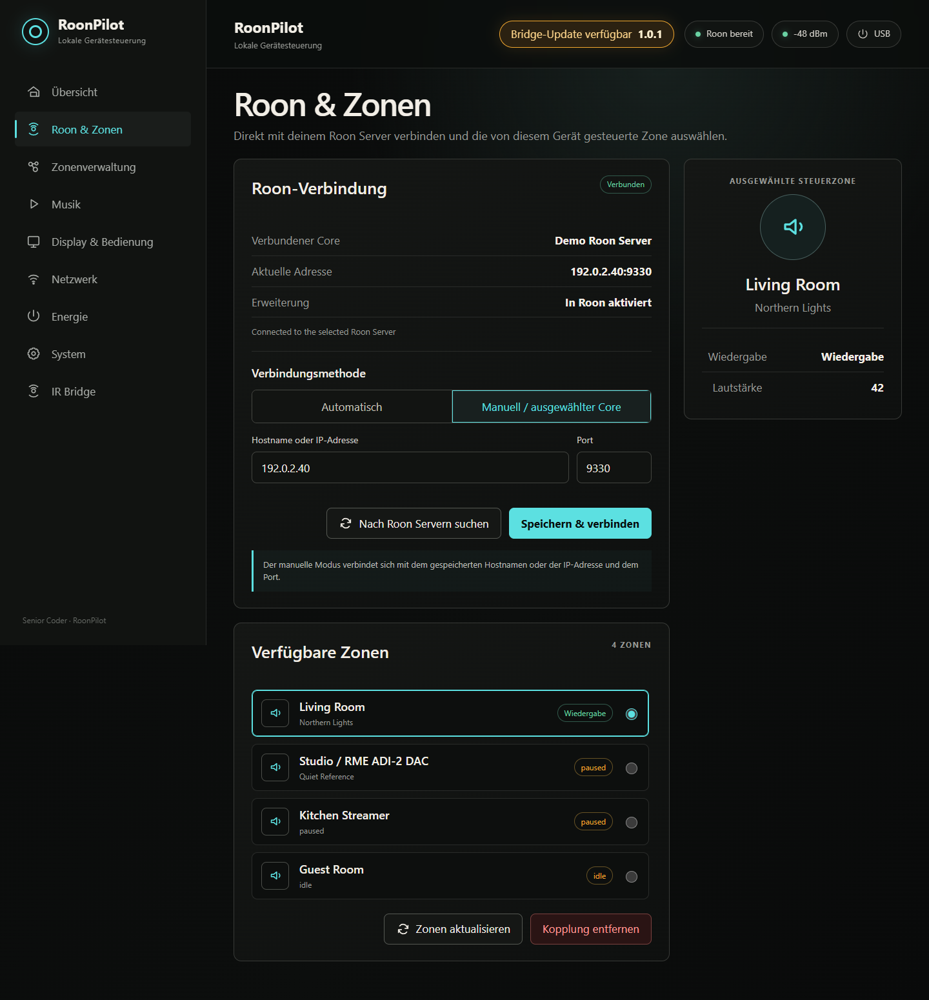

- automatisch gefundene Roon Server anzeigen und auswählen;
- bei mehreren Servern den gewünschten festlegen;
- Auto-Discovery abschalten und lokale IP/Port manuell eintragen;
- Freigabe- und Verbindungszustand sehen;
- primäre Steuerzone wählen.

Eine manuelle Adresse ist für Netze sinnvoll, in denen Multicast-Discovery
durch VLANs oder Filter nicht funktioniert. Sie muss lokal erreichbar sein.

## Zone Management

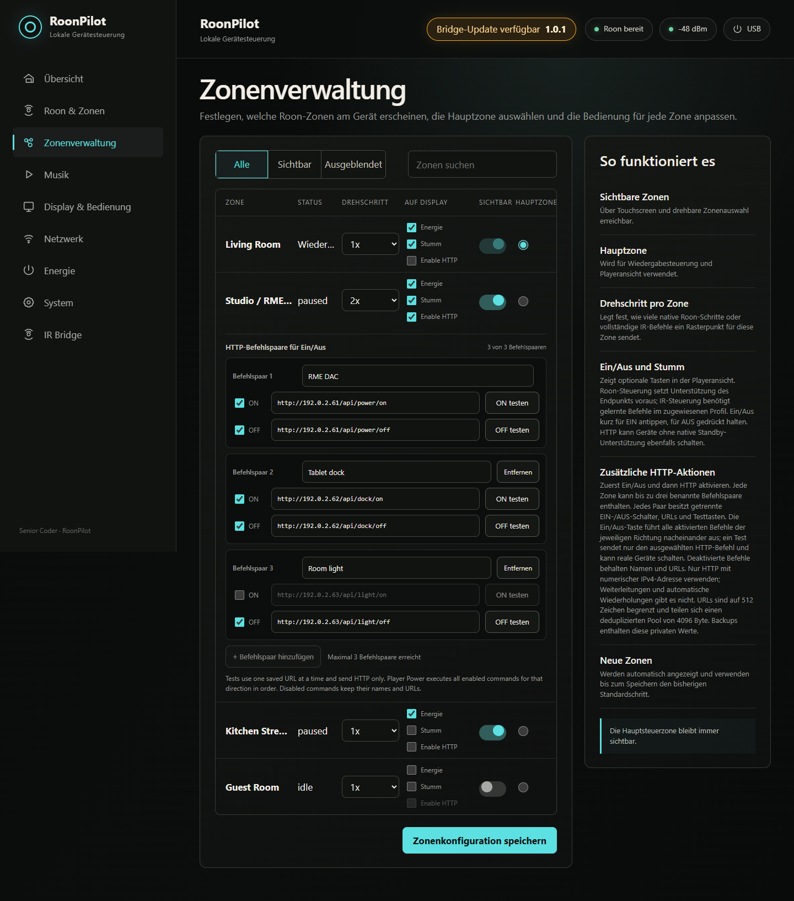

Jede von Roon gemeldete Zone besitzt einen Schalter für sichtbar/ausgeblendet.
Die gewählte Displayzone wird gekennzeichnet. **Save changes** speichert die
Auswahl dauerhaft; ohne Speichern darf ein kurzzeitig geänderter Schalter nicht
als gespeicherte Einstellung verstanden werden.

Die einheitliche Bridge-fähige Firmware verwaltet hier außerdem alle wirklich
zonenbezogenen Einstellungen:

- native Roon-/Endpunktlautstärke, externe IR Bridge oder bewusst deaktivierte
  Lautstärkesteuerung;
- gespeicherte Bridge und IR-Profil für den externen Pfad;
- eigener Schritt-Multiplikator für jede Zone;
- optionale Power- und Mute-Tasten auf dem Display;
- **Enable HTTP**, nur wählbar, wenn Power aktiviert ist;
- bis zu drei benannte HTTP-Aktionspaare mit getrenntem Ein-/Aus-Schalter und
  dauerhaft erhaltener URL für ON und OFF;
- Testtaste neben jedem HTTP-Befehl. Sie sendet wirklich und darf deshalb nur
  bei einer gefahrlosen Zielaktion verwendet werden.

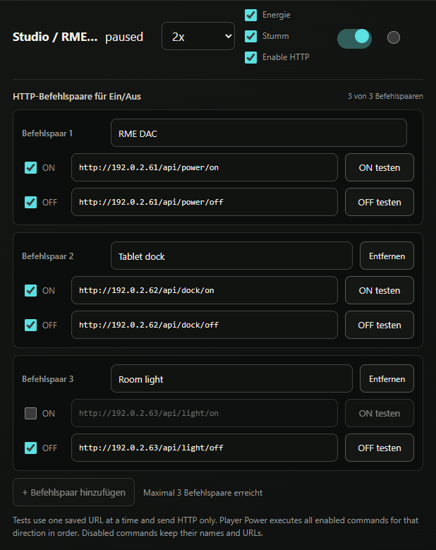

Ein deaktivierter Befehl behält Bezeichnung und URL, wird aber nicht ausgeführt.
Beim Power-Befehl einer Zone werden alle für diese Richtung aktivierten
HTTP-Aktionen zusätzlich zum nativen oder IR-Powerpfad gesendet.

## Musik

Die optionalen Displaytasten für Playlisten und Live Radio sind auch über diese
Seite zugänglich. RoonPilot ruft die Listen erst bei Bedarf von Roon ab und
teilt sie in Seiten auf, damit RAM und Antwortzeiten begrenzt bleiben.

<table>
  <tr>
    <td>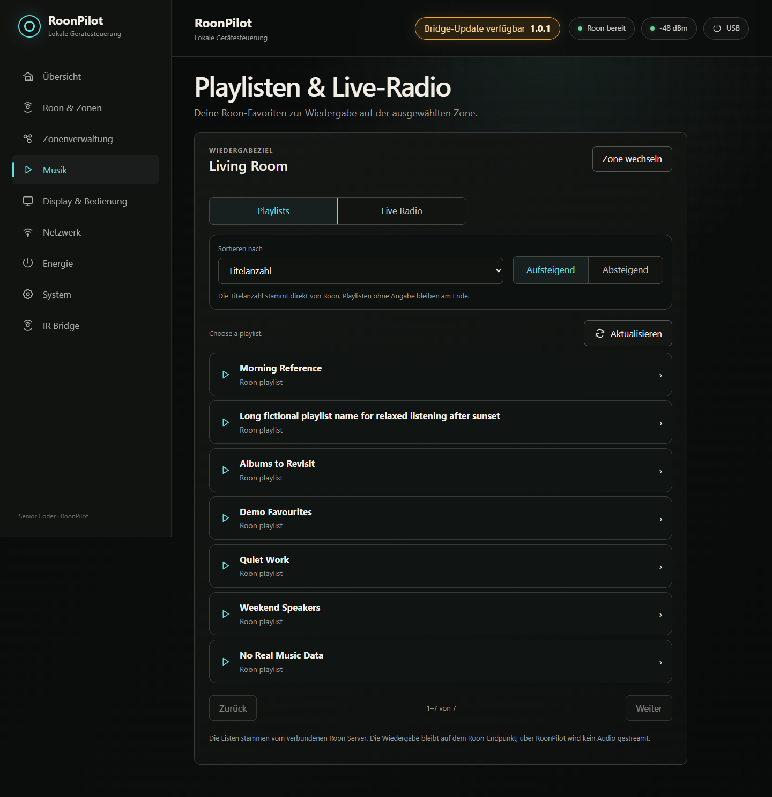</td>
    <td>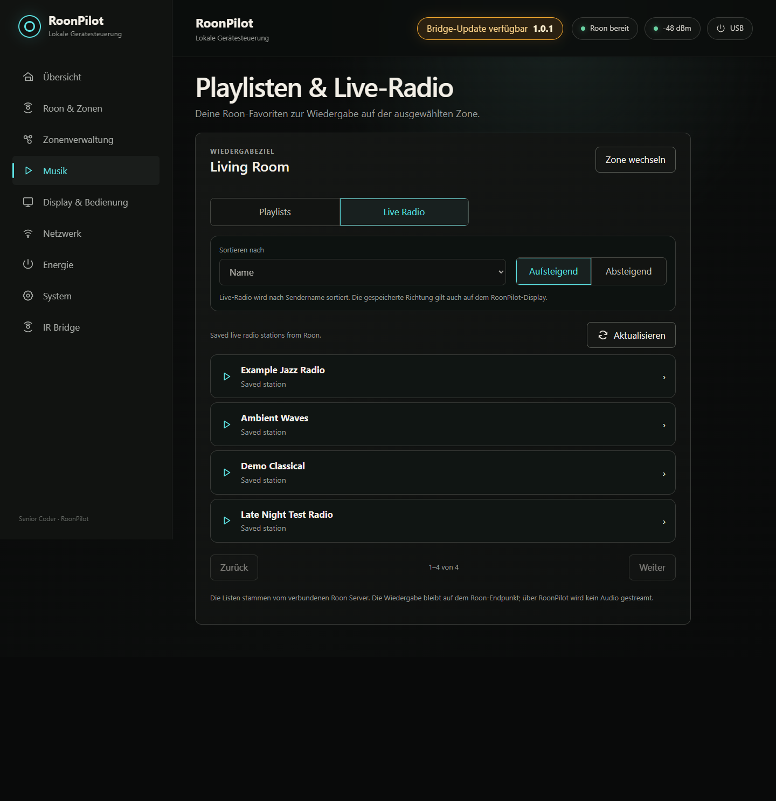</td>
  </tr>
</table>

Vor dem Start einer Playliste folgt die Abfrage Normal/Zufällig. Bei einem
Radiosender entfällt sie. Reagiert Roon ausnahmsweise langsam, bleibt die Seite
bedienbar, zeigt den laufenden Vorgang und meldet einen Timeout, ohne Display
oder Gerät zu blockieren. Der Start ersetzt die laufende Wiedergabe der
gewählten Zone.

Die gespeicherte Sortierung gilt gleichzeitig für die Webseite und die Listen
auf dem Gerät. Playlisten lassen sich auf- oder absteigend nach **Name**,
**Titelanzahl** oder **Änderungsdatum** sortieren. Weil Roons öffentliche
Browse-Schnittstelle dabei weder einen verlässlichen Datumswert noch die
Gesamtdauer liefert, bedeutet „Änderungsdatum“ die von Roon gelieferte Reihenfolge
(absteigend) beziehungsweise deren Umkehrung (aufsteigend); **Länge** bleibt
sichtbar, aber deaktiviert. Live Radio kann nach **Name** auf- oder absteigend
geordnet werden. RoonPilot speichert nur Kriterium und Richtung, nicht eine
zweite Kopie der Listen.

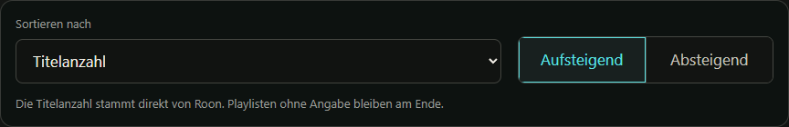

## Display & Controls

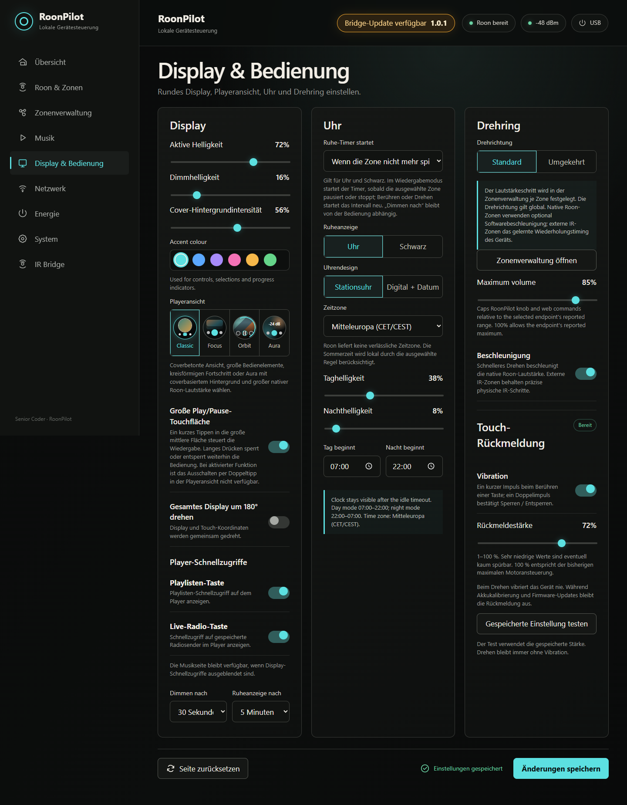

### Display

- aktive Helligkeit und Dimmhelligkeit;
- Zeit bis Dimmen, einschließlich **Never**;
- Zeit bis Ruheanzeige, einschließlich **Never**;
- Schwarz, Bahnhofsuhr oder Digitaluhr als Ruheanzeige;
- Helligkeit/Intensität des coverbasierten Hintergrundverlaufs;
- Akzentfarbe;
- Classic-, Focus-, Orbit- oder Aura-Player mit Vorschau;
- optionale große Play/Pause-Touchfläche in der Displaymitte;
- vollständige Drehung von Display und Touch um 180°.

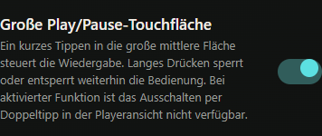

Die große Touchfläche ist standardmäßig aus. Aktiviert sie der Nutzer, schaltet
ein kurzer Tipp in den 194 Pixel großen mittleren Bereich in jeder Playeransicht
zwischen Play und Pause um. Sichtbare Tasten behalten Vorrang; langes Halten
sperrt oder entsperrt weiterhin. Der Doppeltipp zum sofortigen Display-Aus wird
in diesem Modus bewusst deaktiviert, damit zwei Wiedergabebefehle nicht als
Displaygeste umgedeutet werden.

### Uhr

- Bahnhofsuhr oder Digitaluhr mit Datum;
- eigene Tag- und Nachthelligkeit nur für den Uhrmodus;
- regionale Zeitzone, da Roon diese Information nicht verlässlich liefert;
- automatische Sommer-/Winterzeit nach der ausgewählten regionalen Regel;
- Uhrzeiten für Tagbeginn und Nachtbeginn.

Wird eine Uhr als Ruheanzeige gewählt, bleibt sie sichtbar und wird nicht
später automatisch schwarz. Touch kehrt zur Playeransicht zurück.

### Drehring

- Standard-/umgekehrte Richtung;
- 1, 2, 3, 5 oder 10 native Roon-Schritte pro Raster;
- Beschleunigung bei schneller Drehung;
- maximale Lautstärke für Befehle dieses Geräts, sofern Roon einen brauchbaren
  Minimal-/Maximalbereich liefert.

Die Einheit wird automatisch aus den Roon-Daten erkannt. Ein `number`-Ausgang
erscheint als dimensionsloser Roon-Wert ohne erfundenes Prozentzeichen, ein
`db`-Ausgang mit dem tatsächlich
gemeldeten dB-Wert und ein `incremental`-Ausgang erhält relative Befehle. Die
gewählte Schrittweite ist ein Multiplikator der nativen Endpunkt-Schrittweite
und nicht immer ein Prozentwert: Bei 1 dB nativer Schrittweite bedeuten `2`
beispielsweise 2 dB pro Raster.

Ein absoluter Lautstärkeregler und die lokale Obergrenze benötigen bekannte
Grenzen. Für ältere `number`-Ausgänge kann der übliche Bereich 0 bis 100 als
Rückfall dienen. Meldet ein dB-Ausgang kein Minimum und Maximum, bleiben
korrekte dB-Anzeige und Ringregelung erhalten; der Webregler ist jedoch
deaktiviert und RoonPilot erfindet keinen irreführenden Bereich.

### Touch-Rückmeldung

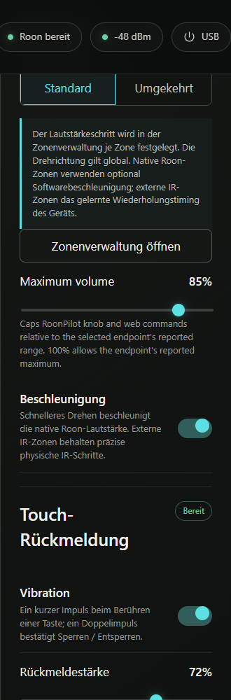

Der Vibrationsmotor lässt sich abschalten oder stufenlos von 0 bis 100 Prozent
einstellen. Er bestätigt Touchaktionen und verwendet ein unterscheidbares
Muster beim Sperren/Entsperren. Das Drehen des ohnehin fühlbaren Rings löst nie
eine Vibration aus. Die gleiche Stärke steht unter **Schnelleinstellungen →
Display** zur Verfügung.

## Network

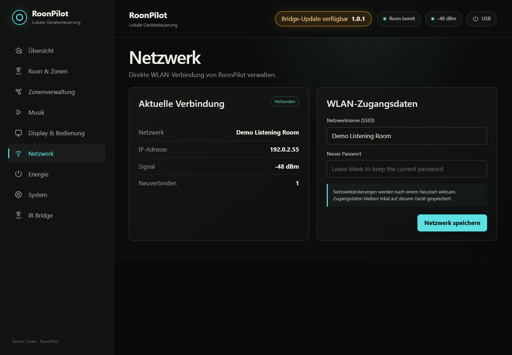

Zeigt SSID, IP, RSSI und Wiederverbindungen. Ein WLAN-Wechsel wird lokal
gespeichert. Sind neue Daten falsch, startet nach mehreren erfolglosen Versuchen
automatisch wieder der Setup-AP. Kein erneutes Flashen erforderlich.

## Energie

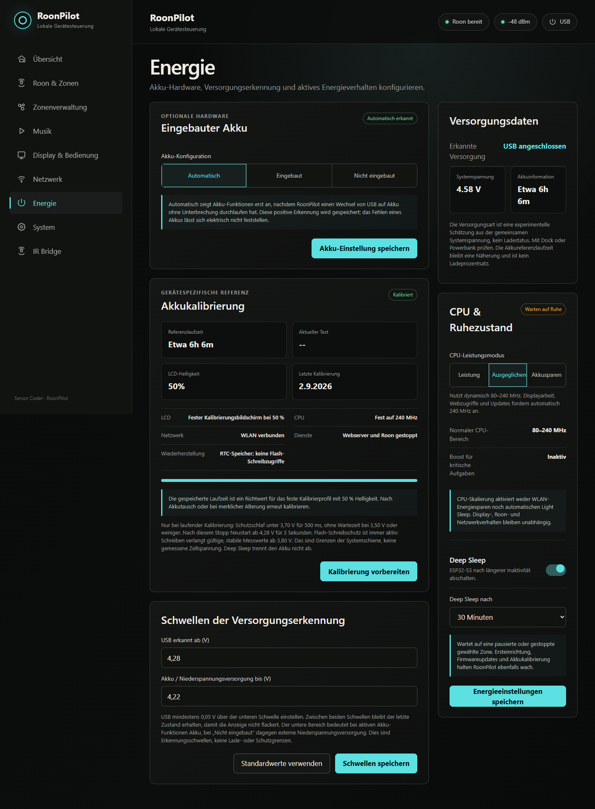

- Auswahl **Eingebauter Akku** mit **Automatisch**, **Eingebaut** und **Nicht
  eingebaut**;
- grobe Systemspannungsinformation ohne erfundene Akkuprozentzahl;
- zwei einstellbare Schwellen mit Hysterese für Akku beziehungsweise externe
  Niederspannungsversorgung, Computer-USB und ein höheres USB-Netzteil; der
  Blitz bedeutet externe Versorgung, nicht den sicher nachgewiesenen
  Ladevorgang;
- Vorbereitung, Status, Ergebnis und Löschen der Laufzeitkalibrierung;
- Deep Sleep ein/aus und Wartezeit;
- eindeutiger Status **Deep Sleep aus**, **Warten auf Ruhe** oder **Schlaf
  bereit**, der sich nur auf Deep Sleep und nicht auf die gesamte
  Energieverwaltung bezieht.

Der Schalter ist notwendig, weil Waveshare Varianten mit und ohne Akku anbietet,
der ESP32-S3 aber keinen eigenen „Akku vorhanden“-Kontakt besitzt. Ein einzelner
Wert der gemeinsamen Systemspannung kann deshalb nicht sicher beweisen, dass
ein Akku eingebaut ist. **Automatisch** blendet Akku-Funktionen erst ein, wenn
das laufende Gerät zunächst USB erkannt hat und nach dem Abziehen des Kabels
oder Abheben aus dem Dock im niedrigeren Spannungsbereich weiterläuft. Dieser
positive Nachweis wird lokal gespeichert. Die Automatik behauptet niemals,
dass kein Akku vorhanden sei; bei einer Variante ohne Akku wird **Nicht
eingebaut** manuell gewählt.

Bei **Eingebaut** erscheinen Akkusymbol, Akkuinformationen und Kalibrierung
immer. Bei **Nicht eingebaut** verschwinden genau diese drei Bereiche. CPU-Modi,
Versorgungsschwellen, Display-Zeitsteuerung und Deep Sleep bleiben für Netzteil
und externe Powerbank vollständig erhalten.

Während laufender Akku-Kalibrierung sind Webserver, Roon und der normale
Deep Sleep absichtlich deaktiviert, damit das Messprofil reproduzierbar bleibt.
Der unabhängige Unterspannungsschutz bleibt aktiv. Die Laufzeit wird jede
Sekunde im erhaltenen RTC-Speicher aufgezeichnet, ohne minütliche
Flash-Schreibvorgänge. Der Messlauf endet mit dem Schutzstopp, nicht mit einer
Entladung bis zur Hardwareabschaltung des Akkus.

Vorbereitung und **Ergebnis speichern** benötigen mindestens **4,28 V
Systemspannung für drei Sekunden**. Speichern ist nur bei einem vollständig
durch Schutzstopp beendeten Lauf mit erhaltener Aufzeichnung und mindestens
fünf Minuten Dauer möglich. Ein unterbrochener Lauf kann nur verworfen werden;
die bisherige Referenz bleibt erhalten.

Nur während einer **laufenden Kalibrierung** geht RoonPilot unter
**3,70 V für 500 ms** in den Schutz-Deep-Sleep; bei **3,50 V oder weniger**
wartet es nicht diese 500 ms ab. Der Schalter für normalen Deep Sleep deaktiviert
diesen Kalibrierungsstopp nicht. Im normalen Betrieb löst kurzes Umstecken
zwischen USB-Versorgungen keinen solchen Schutzschlaf aus. Der Flash-Schreibschutz
bleibt dagegen in jeder Betriebsart aktiv, auch bei **Nicht eingebaut**:
Neue Schreib- und Löschvorgänge verlangen mindestens 300 ms gültiger, stabiler
Messwerte ab **3,80 V**. Während des Messlaufs bleibt Flash-Schreiben vollständig
gesperrt. Diese festen Grenzen sind nicht die einstellbaren Schwellen der
Versorgungserkennung; sie beziehen sich auf die Systemschiene, nicht die Akkuzelle.

Nach einem Kalibrierungs-Schutzstopp stabile USB-Versorgung anschließen. Der Wiederanlaufcheck
kann das Display noch etwa **33 Sekunden** dunkel lassen; Touch und Drehregler
können den Schutzstopp nicht übergehen. Deep Sleep trennt den Akku nicht ab und
ersetzt seine Schutzschaltung nicht. Die ausführliche Anleitung steht unter
[Akku und Laufzeit](battery-and-runtime.md).

Vor einer Kalibrierung RoonPilot an einem stabilen USB-Netzteil/Ladegerät
vollständig laden. Ein Computer-USB-Port kann eine niedrigere Systemspannung
liefern und das Gerät betreiben, ohne den Akku vollständig zu laden; er ist
deshalb keine verlässliche Volladungsreferenz.

Die CPU-Stufen **Leistung**, **Ausgeglichen** und **Akkusparen** tauschen Leistungsreserve
gegen Energiebedarf. Für Webseite, Roon, Updates und kritische Vorgänge darf die
Firmware vorübergehend die volle Leistung anfordern. Der Ruhezustands-Timer kann
wahlweise ab der letzten lokalen Bedienung oder ab dem Ende der Wiedergabe in
der gewählten Zone zählen.

## System

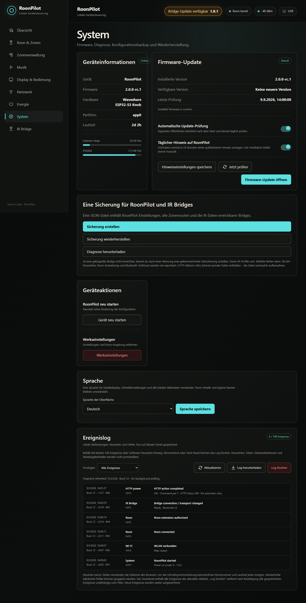

### Sprache

Unter **System → Sprache** wird eine gemeinsame Einstellung für **Deutsch**
oder **English** gespeichert. Sie gilt für das runde Gerätedisplay, die
Schnelleinstellungen, den WLAN-Einrichtungsdialog, die Firmware-Update-Seiten,
die IR-Bridge-Seite und sämtliche übrigen lokalen RoonPilot-Seiten. Das Display
wechselt sofort; nach erfolgreichem Speichern lädt der Browser die aktuelle
Seite in der gewählten Sprache neu.

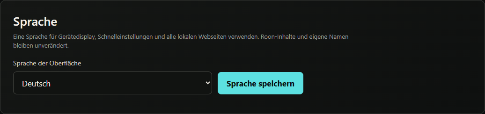

Von Roon oder vom Nutzer stammende Inhalte bleiben absichtlich unverändert:
Titel, Interpret, Album, Zonen- und Playlistnamen, Live-Radio-Namen,
Bridge-Kennungen und IR-Profilnamen werden nicht übersetzt. Die Sprachwahl ist
Bestandteil der gemeinsamen Sicherung. Fehlt das Feld in einer älteren
kompatiblen Konfiguration, verwendet RoonPilot sicherheitshalber Englisch.

Diese Inhalte bleiben als UTF-8 erhalten. Das Gerätedisplay besitzt Glyphen für
west-, mittel- und osteuropäische lateinische Zeichen, Griechisch, Kyrillisch,
häufige Satz-/Währungssymbole und eine ausgewählte Gruppe gebräuchlicher
einfarbiger Emoji. Große asiatische Schriftsysteme sind aus Speichergründen
nicht Bestandteil der eingebetteten Display-Schriften; die Webseite selbst
bleibt davon unberührt und verwendet die Schriften des Browsers.

- installierte Firmwareversion, Partition, Laufzeit und Speicher;
- installierte und verfügbare Version sowie Zeitpunkt der letzten Prüfung;
- getrennte Schalter für automatische Onlineprüfung und die tägliche Meldung
  am Gerät;
- **Check now** und direkter Sprung zur signierten Firmwareupdateseite;
- Diagnosepaket herunterladen;
- **Sicherung erstellen** und **Sicherung wiederherstellen**: eine JSON-Datei
  mit RoonPilot-Einstellungen, allen Zonenrouten, einer eigenständigen benannten
  IR-Profilbibliothek und getrennten Bridge-Zuordnungen;
- Neustarts überstehendes Ereignislog für Starts, Verbindungswechsel, Updates
  und wichtige Server-/API-Fehler;
- Neustart;
- durch Texteingabe geschützter Factory Reset.

Die automatische Prüfung liest nach dem Start und danach täglich nur das
freigegebene Release-Manifest. Nach einem Fehler wird später erneut versucht.
Sie installiert nichts; eine Installation muss immer ausdrücklich auf der
separaten Firmwareupdateseite bestätigt werden.

Die Sicherung liest RoonPilots dauerhafte Profilbibliothek. Eine gekoppelte
Bridge darf deshalb offline sein, ohne die Datei zu verzögern. Noch nicht
mit der Bibliothek abgeglichene Änderungen auf einer Bridge können fehlen.
Auch die Wiederherstellung läuft bei einer fehlenden Bridge weiter: RoonPilot-
Einstellungen und Bibliothek werden wiederhergestellt, unbestätigte Bridge-
Übertragungen für die spätere Vervollständigung genannt. Ungeprüfte IR-Routen
werden nicht aktiviert. Näheres
unter [Konfiguration sichern und
wiederherstellen](configuration-backup.md); im Bridge-Wartungs-Tab gibt es
keinen separaten Backup-Bereich mehr.

Der Factory Reset entfernt RoonPilot-Einstellungen und Freigabe, stellt aber
nicht Waveshares Original-Firmware wieder her.

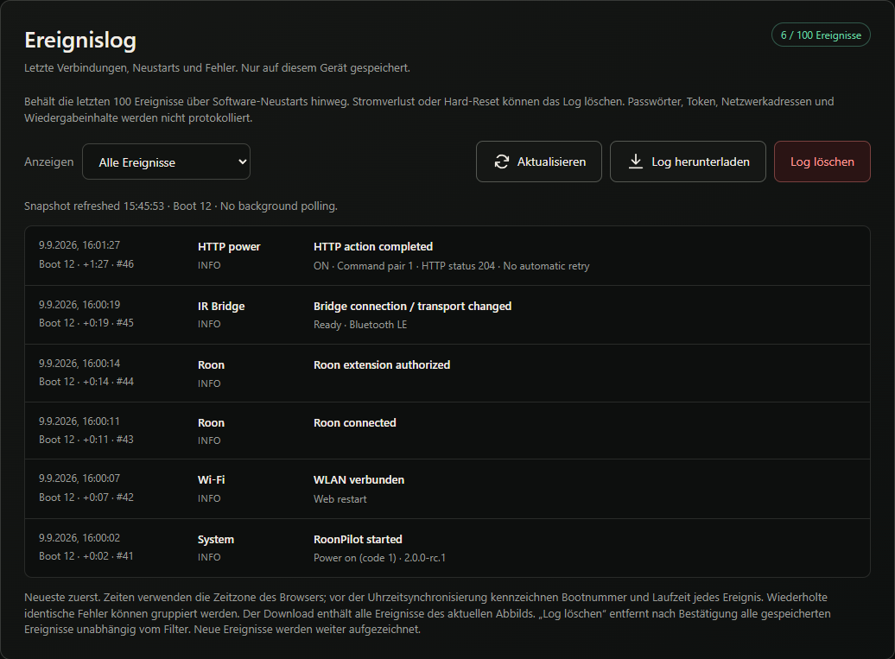

Das Log übersteht einen Softwareneustart, darf nach vollständigem Stromverlust
aber leer sein. Wiederholte identische Ereignisse werden zusammengefasst.
**Download JSON** sichert es für die Diagnose; **Clear log** löscht nur diese
Liste, nicht Einstellungen, Kopplungen oder den getrennten Absturzbericht.
Fehler eines Web-Einstellungsvorgangs erscheinen sowohl als rote Meldung als
auch im Ereignislog.

## Mobile Darstellung

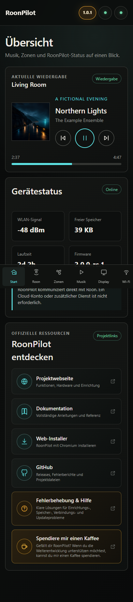

Karten werden untereinander angeordnet. Die acht Hauptseiten liegen in einer
waagerecht verschiebbaren unteren Navigation; **IR Bridge** kommt nur bei
aktivierter optionaler Funktion hinzu. Funktionen und Werte entsprechen der
Desktopansicht.

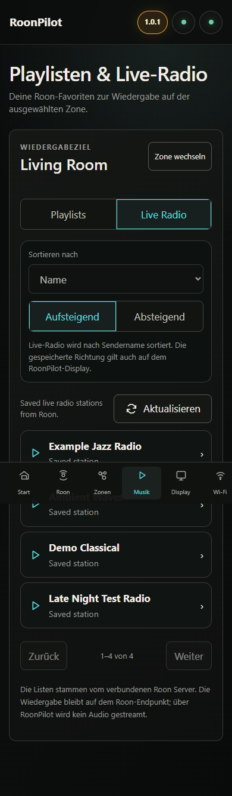

## IR Bridge

Bei eingeschaltetem **Bridge & Bluetooth** erscheint die zusätzliche Seite mit
den Bereichen Verbindung, Zonenrouting, IR-Profile und Wartung. Bis zu vier
Kopplungen können gespeichert sein. Die automatische Zonensteuerung folgt jedem
physischen Ausgang der gewählten Zone oder Gruppe: Es gibt einen BLE-Link,
während mehrere benötigte Bridges über ihre getrennten authentifizierten
WLAN-Wege bereit bleiben können. Eine Wartungsauswahl verwendet BLE
vorübergehend zum Lernen, Bearbeiten von Profilen oder Aktualisieren, ohne eine
gespeicherte Zonenroute zu ändern. Sicherungen werden unter **System** erstellt
und wiederhergestellt.

Auch die Bridge-Seite folgt der globalen RoonPilot-Sprache. Physische
`RPB-…`-Kennungen sowie selbst vergebene Profil-, Geräte- und Zonennamen bleiben
unverändert, damit sie weiterhin eindeutig mit der Hardware verglichen werden
können.

Die Ring- und Touchbedienung gruppierter Zonen steht getrennt unter
[Roon-Gruppen und Gruppenmixer](roon-groups.md).

Ist der Hauptschalter aus und RoonPilot neu gestartet, reduziert sich die Seite
auf die kleine Schalterkarte. Bluetooth, Scans, Statusverkehr und
Bridge-Updateprüfungen bleiben aus; Kopplungen, Routen und Profilverweise bleiben
gespeichert. Vor Kopplung oder Routenänderung die eigene
[IR-Bridge-Dokumentation](ir-bridge.md) lesen.

## Minimale WLAN-Einrichtungsseite

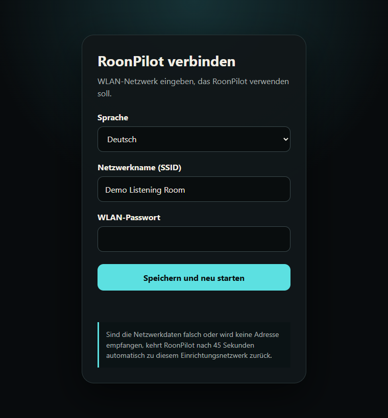

Sie ist nur im Setup-AP verfügbar und enthält absichtlich ausschließlich
WLAN-Auswahl, Kennwort und Speichern. Vollständige Konfiguration wird erst im
Heimnetz angeboten.

## Seite fuer signierte Firmwareupdates

Für ein vorhandenes RoonPilot: mit **Check for updates** ein freigegebenes
signiertes Online-Update suchen und installieren. Ein manueller Firmwareupload
ist absichtlich nicht vorhanden. Einstellungen bleiben beim A/B-OTA
normalerweise erhalten.

## USB Web Installer

Nur für vollständige ESP32-S3-Erstinstallation oder Wiederherstellung. Er
funktioniert ausschließlich mit aktuellem Desktop-Chromium und Web Serial,
verlangt die Bestätigung des ESP32-S3-Ziels, des Factory-Löschens und der
Lizenz und bietet das Hauptabbild nicht als Download an. Die Sicherung der
Original-Firmware wird als optionaler Rückweg erklärt und ist keine
Installationsvoraussetzung. Factory löscht den kompletten ESP32-S3. Der
Begleit-ESP32 wird niemals durch diesen Installer beschrieben.

Der Installer trennt **Aktuelle RoonPilot-Version** und **Zurück zu RoonPilot
1.0.2**. Die zweite Auswahl installiert immer die originale Version 1.0.2 mit
verbindlichem Löschen und zusätzlicher Bestätigung des Verlusts von
Einstellungen und Profilen. Dort kein 2.0.0-Backup einspielen und keine
Akkukalibrierung durchführen. Beim Sprachwechsel bleibt die ausgewählte
Wiederherstellung erhalten. Den vollständigen Ablauf erklärt
[Zurück zu RoonPilot 1.0.2](return-to-1.0.2.md).

Die optionale Companion-Tafel öffnet einen getrennten, einsteigerfreundlichen
Webinstaller für den klassischen ESP32-U4WDH. Dafür werden weder Python noch
esptool benötigt. Dieser Installer akzeptiert ausschließlich den
Begleitprozessor; der Hauptinstaller beschreibt ihn niemals.
