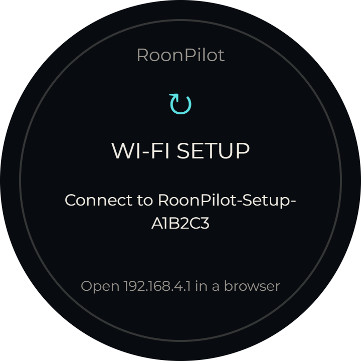
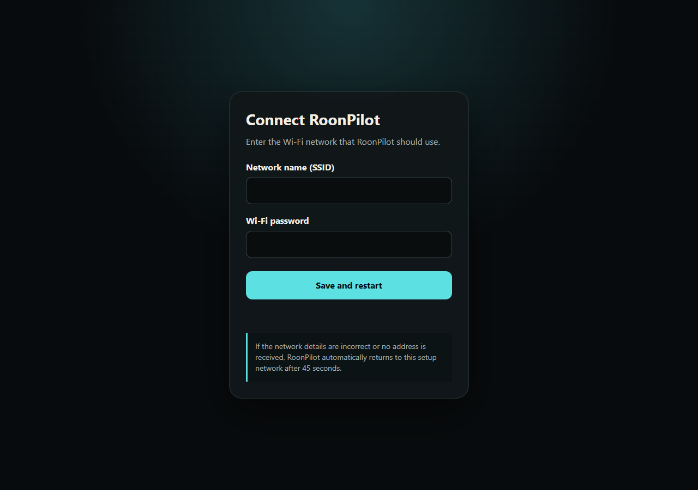
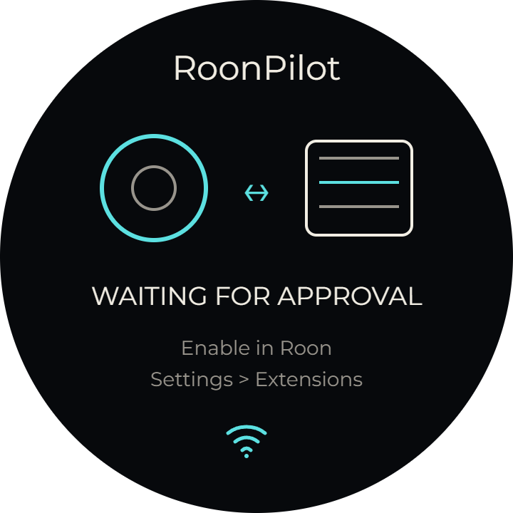
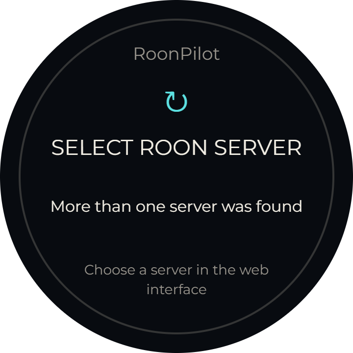

# First-time setup

After a clean Factory installation, RoonPilot has no Wi-Fi credentials and no
Roon authorization. Setup therefore happens in two stages: join Wi-Fi, then
approve RoonPilot in Roon.

## 1. Join the RoonPilot setup network

The display shows **Wi-Fi setup** and the temporary access-point name.

1. On a phone, tablet or computer, open Wi-Fi settings.
2. Join `RoonPilot-Setup-XXXXXX`; the final six characters identify the unit.
3. Enter the temporary password `roonpilot-setup`.
4. A captive setup page should open. If it does not, browse to
   `http://192.168.4.1`.
5. Select or type the home 2.4 GHz Wi-Fi name.
6. Enter its password carefully. Passwords are case-sensitive.
7. Press **Save and connect**.

Only Wi-Fi can be configured on this minimal page. Roon, zones, display,
firmware and system actions are intentionally absent.

## If the Wi-Fi password is wrong

RoonPilot tries the saved network for up to approximately 45 seconds. If it
cannot obtain a network address, it automatically returns to the protected
setup AP. Rejoin `RoonPilot-Setup-XXXXXX`, open `192.168.4.1`, correct the
details and save again. No erase or USB cable is required.

Some phones leave the AP because it has no Internet access. Choose **stay
connected** or temporarily disable mobile-data auto-switching.

## 2. Open the full local interface

After a successful connection, find RoonPilot in the router's client list or use
the address displayed/announced for the device. Enter that address in a browser
on the same network. Bookmark it or reserve the DHCP address in the router if
desired.

The local page loads its structure immediately and fills live values after its
status request completes. A short initial placeholder period is normal; long
multi-second delays are not and should be checked with the troubleshooting page.

## 3. Authorize the Roon extension

The display shows **Waiting for approval**.

1. Open the Roon application.
2. Go to **Settings → Extensions**.
3. Locate **RoonPilot**, created by **Senior Coder**.
4. Press **Enable**.
5. Return to RoonPilot. Zone and now-playing information should appear without a
   firmware restart.

The authorization is stored locally. Reapproval is normally needed only after a
factory reset, settings erase, Roon authorization removal or server migration.

## More than one Roon Server

If discovery finds several servers, RoonPilot shows a server-selection screen
and the web interface lists the candidates. Choose the intended server by name.
The selection is remembered.

## No server is discovered

Discovery normally needs multicast traffic between RoonPilot and the Roon
Server. Guest Wi-Fi, client isolation, VLAN boundaries or multicast filtering
can prevent it.

On the local **Roon & zones** page:

1. confirm that RoonPilot and Roon are on reachable networks;
2. wait for a fresh discovery scan;
3. enter the Roon Server's fixed IP address in **Manual server address**;
4. save and then approve the extension in Roon.

Use a router DHCP reservation for a manually configured address. Do not enter a
public Internet address; RoonPilot is designed for the local network.

## 4. Select and limit zones

Open **Roon & zones**, choose the primary control zone and save. Then open
**Zone management** and hide rooms that should not appear on the round display.
Hiding a zone affects RoonPilot only; it does not remove or alter the zone in
Roon. The selected control zone must remain visible.

## 5. Perform a quick functional check

- Artwork, title and artist update for the chosen zone.
- Tapping play/pause changes both Roon and the displayed icon.
- Previous/next and horizontal swipes work.
- Turning the ring changes the selected zone's volume and shows the overlay.
- Tapping the zone name opens the zone picker.
- A browser refresh retains saved settings.

Continue with [Device controls](device-controls.md).

