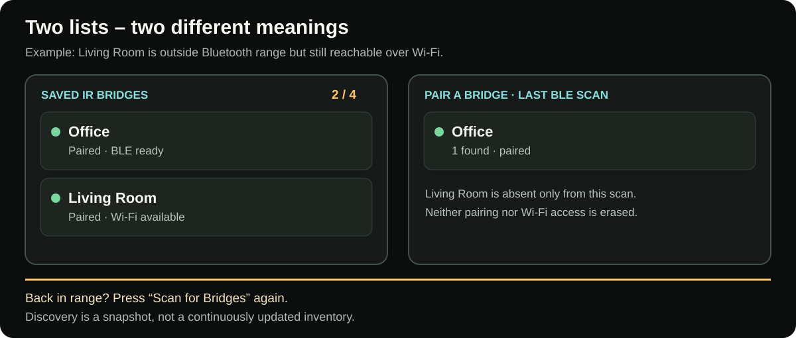
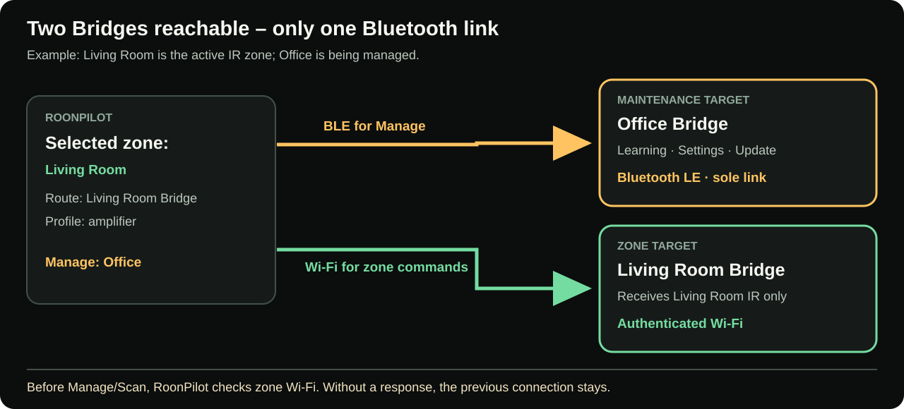
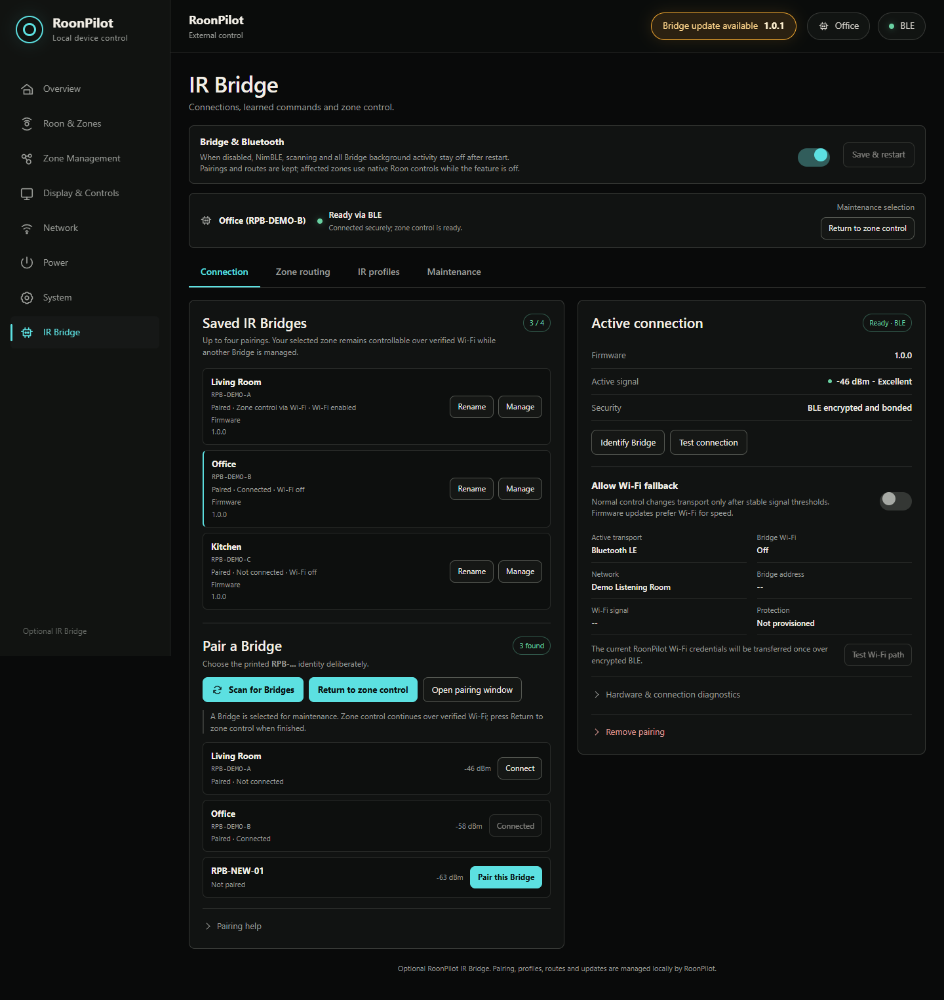
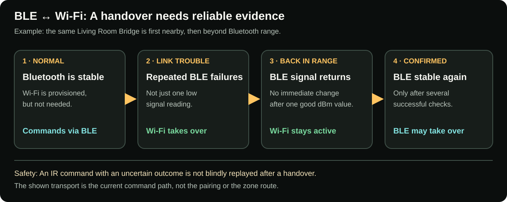

# IR Bridge pairing, connectivity and automatic zone control

**English** · [Deutsch](de/ir-bridge-connectivity.md) · [Bridge overview](ir-bridge.md)

The connection page has two jobs that must not be confused:

1. **Automatic zone control** uses the selected Roon zone—or every physical
   output in a selected group—to determine which Bridges receive IR commands.
   This is the normal operating mode.
2. **Maintenance selection** temporarily connects a saved Bridge over BLE for
   Wi-Fi setup, profiles, diagnostics or firmware. The active zone can keep
   controlling its own Bridge over verified Wi-Fi at the same time.

## Pair a factory-new Bridge

A factory-new Bridge automatically opens its pairing window and pulses blue.

1. Open RoonPilot's local page and select **IR Bridge**.
2. If the top switch is off, enable **Bridge & Bluetooth**, select **Save &
   restart**, then reopen the page after RoonPilot reconnects.
3. Select **Scan for Bridges**.
4. Read the identity printed or recorded for the physical unit, for example
   `RPB-DEMO-A`.
5. Match every character in the discovered list.
6. Select **Pair this Bridge**.
7. Wait for **Ready via BLE** and the encrypted/bonded security status.

The signal value helps with placement but is not an identity. Never pair an
unknown unit only because it has the strongest dBm value.

## Reopen pairing without an enclosure button

A previously paired Bridge normally rejects a new owner. If it must be paired
again and the BOOT button is inside the enclosure, power it off and on three
times within 15 seconds. The Bridge opens a five-minute pairing window and
signals the state in blue. This changes availability for pairing; it does not
erase profiles by itself.

Use this only for the unit you can physically identify. When several Bridges
are powered nearby, switch off the others or compare the complete identity.

## Two lists with different meanings

**Saved IR Bridges** is the persistent inventory of up to four pairings.
**Pair a Bridge** shows **only units whose Bluetooth advertisements were heard
during the last ten-second scan**. “1 found” does not mean “only one paired
Bridge” and says nothing about Wi-Fi reachability.

[Open full-size diagram](../docs/ir-bridge/assets/bridge-scan-vs-saved-en.svg)

**Example:** Living Room and Office are paired. Living Room is moved beyond
BLE range but remains controllable through Wi-Fi. A scan finds only Office:
**1 found**, while **2 / 4** Bridges remain saved. Bringing Living Room back
into BLE range does not change the old result. Select **Scan for Bridges**
again; the new scan can find it. No new pairing or Wi-Fi setup is needed.

| Observation | Meaning | What to do |
| --- | --- | --- |
| Saved but not found | Pairing remains; the last BLE scan did not hear the unit. | Scan again if needed; check power and range. |
| Ready over Wi-Fi but not found | Wi-Fi control is independent of the BLE discovery list. | Nothing to repair; rescan only to confirm BLE range. |
| Found but not saved | This RoonPilot has not paired with the unit. | Match the full identity before pairing. |

## Search mode and how to leave it

Scanning needs the sole BLE link. An active IR zone remains controllable at
the same time **only if its own Bridge** first answers over authenticated
Wi-Fi. Otherwise RoonPilot refuses the scan to protect zone control. After
searching, select **Cancel search** to restore automatic BLE selection.

Reloading the browser does not trap RoonPilot in search mode. The cancel action
remains available until normal zone control has been restored.

## Saved does not mean connected

RoonPilot can retain up to four pairings. A card may say:

- **Paired · Connected** — at least one usable path to the unit exists;
- **Paired · Zone control via Wi-Fi** — this Bridge serves the zone while BLE
  is used to manage another unit;
- **Paired · Not connected** — keys and identity are stored, but this Bridge is
  not currently required or is unreachable;
- **Not paired** — the unit is visible but does not yet share keys with this
  RoonPilot.

This is intentional. There is at most **one BLE link**, but every provisioned
Bridge has its **own authenticated Wi-Fi path**. Several Bridges can therefore
be reachable at the same time.

## Automatic zone control

For every selected-zone or group change, RoonPilot follows this sequence:

1. Read the saved route for every physical output in the new Roon zone.
2. Native Roon and disabled outputs require no Bridge.
3. For every External IR output, locate the exact saved Bridge ID.
4. Reach each required unit over the available verified BLE or Wi-Fi path.
5. Use the assigned profiles and enable each IR route only when it is ready.

During the short switch, controls fail closed; they are not silently redirected
to another Bridge or to Roon. A status message on RoonPilot and the web page
explains when the required Bridge is unavailable.

### Example

| Selected zone | Saved route | Result |
| --- | --- | --- |
| Living Room | Roon / endpoint volume | Ring sends native Roon volume; no Bridge needed. |
| Studio / RME ADI-2 DAC | RPB-DEMO-A + RME profile | RPB-DEMO-A connects and the ring sends learned RME IR steps. |
| Kitchen Streamer | RPB-DEMO-B + amplifier profile | The IR target changes to RPB-DEMO-B; its Wi-Fi may work without BLE. |
| Guest Room | Disabled | Ring sends no volume command. |

### Group example with two Bridges

Assume **Downstairs** contains WiiM Ultra, Office Pi and Kitchen:

| Physical output | Saved route | Required path |
| --- | --- | --- |
| WiiM Ultra | Living Room Bridge + RME profile | BLE or that Bridge's authenticated Wi-Fi |
| Office Pi | Office Bridge + amplifier profile | Normally its independent authenticated Wi-Fi while BLE is elsewhere |
| Kitchen | Native Roon number volume | No Bridge |

Turning for the whole group addresses both Bridges and the native endpoint in
one logical action. There is still only one BLE link, so parallel multi-Bridge
operation relies on the separately verified Wi-Fi paths. If Office Bridge goes
offline, its row reports `OFFLINE`; WiiM Ultra and Kitchen are not silently
rerouted and can continue through their valid paths. Recovery is detected for
every Bridge relevant to the current group.

The detailed ring and touch sequence is documented under
[Roon groups and the group mixer](roon-groups.md).

## Maintenance selection

Select **Manage** on a saved Bridge to inspect or change that unit. Maintenance
uses the BLE link but **does not change any zone route**. If the selected zone
or group requires other IR Bridges, RoonPilot checks every affected Wi-Fi path
*before* moving BLE. Manage is refused when an active route would be stranded,
leaving the existing connection in place. A zone or group IR command is never
sent to the maintenance Bridge merely because it owns the BLE link.

[Open full-size diagram](../docs/ir-bridge/assets/bridge-parallel-control-en.svg)

When finished, select **Return to zone control**. The selection also expires
after five minutes without maintenance activity; an active learning session or
update is not interrupted halfway through.

## Enable optional Wi-Fi

Wi-Fi is configured separately for each Bridge.

1. Connect the intended Bridge through BLE, normally with **Manage**.
2. Enable **Allow Wi-Fi fallback**.
3. RoonPilot transfers the currently saved 2.4 GHz credentials through the
   encrypted BLE connection.
4. Wait for **Connected and verified** and an address.
5. Select **Test Wi-Fi path**.
6. Return to automatic zone control.

The Bridge does not reveal the password in its status, backup or diagnostics.
If the credentials later change, reconnect by BLE and provision again.

## Transport choice and signal values

- BLE is preferred for ordinary nearby control while stable.
- Wi-Fi is allowed only for Bridges on which the switch is enabled and a test
  has succeeded.
- Transport does not switch on every fluctuating dBm sample. Filtering,
  hysteresis and grace periods prevent nervous oscillation.
- Firmware transfer prefers authenticated Wi-Fi because it is faster; BLE can
  recover when Wi-Fi is unavailable.
- A change of transport must not execute an IR command twice. Logical command
  sequence and replay protection are shared across both paths.

[Open full-size diagram](../docs/ir-bridge/assets/bridge-transport-timeline-en.svg)

**Example:** Living Room is initially ready over BLE. After repeated confirmed
BLE failures, the same zone uses its already provisioned Wi-Fi path. Bringing
the Bridge closer does not force an immediate switch back; one good signal
reading is not enough. RoonPilot may return to BLE only after its reliability
checks succeed. A possibly transmitted IR command is not blindly resent.

| During BLE → Wi-Fi or Wi-Fi → BLE | Does it change? |
| --- | --- |
| Current IR command path | **Yes** – the status changes between “Ready via BLE” and “Ready via Wi-Fi”. |
| Pairing, friendly Bridge name and Wi-Fi key | **No** – a transport handover does not reset the Bridge. |
| Zone route and named IR profile | **No** – the same zone controls the same Bridge with the same profile. |
| Playback through Roon | **No** – music transport and Play/Pause remain Roon actions. |
| IR command with an uncertain outcome | **No blind replay** – a second execution is not risked. |

Signal strength naturally fluctuates because of antenna orientation,
reflections and simultaneous 2.4 GHz traffic. Judge reliability by command and
reconnect behaviour, not a single dBm number at 30 cm.

## Status on the physical devices

The Bridge RGB LED provides local feedback:

- slow blue pulse: pairing is open;
- learning indication: receiver is waiting for the original remote;
- short confirmation: a valid command was learned and the learning session
  ended;
- update pattern: firmware transfer/installation is active—do not remove power;
- Identify pattern: the selected physical Bridge identifies itself, then
  returns to its previous status indication.

RoonPilot also reports connection changes and has an **IR Bridges** entry in
the device Quick Menu. It lists the relevant Bridge, transport, Wi-Fi state and
signal information without requiring a browser.

## Disable the complete feature

Turn off **Bridge & Bluetooth**, save and restart. This is a boot-level switch,
not merely a hidden menu. The Bluetooth stack is not initialized and Bridge
background work does not run. Enabling it later likewise requires a controlled
restart because the released radio memory cannot safely be reconstructed in
the same boot.
