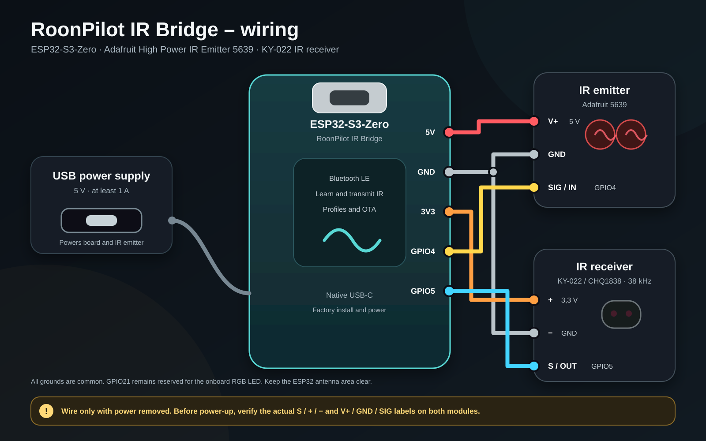
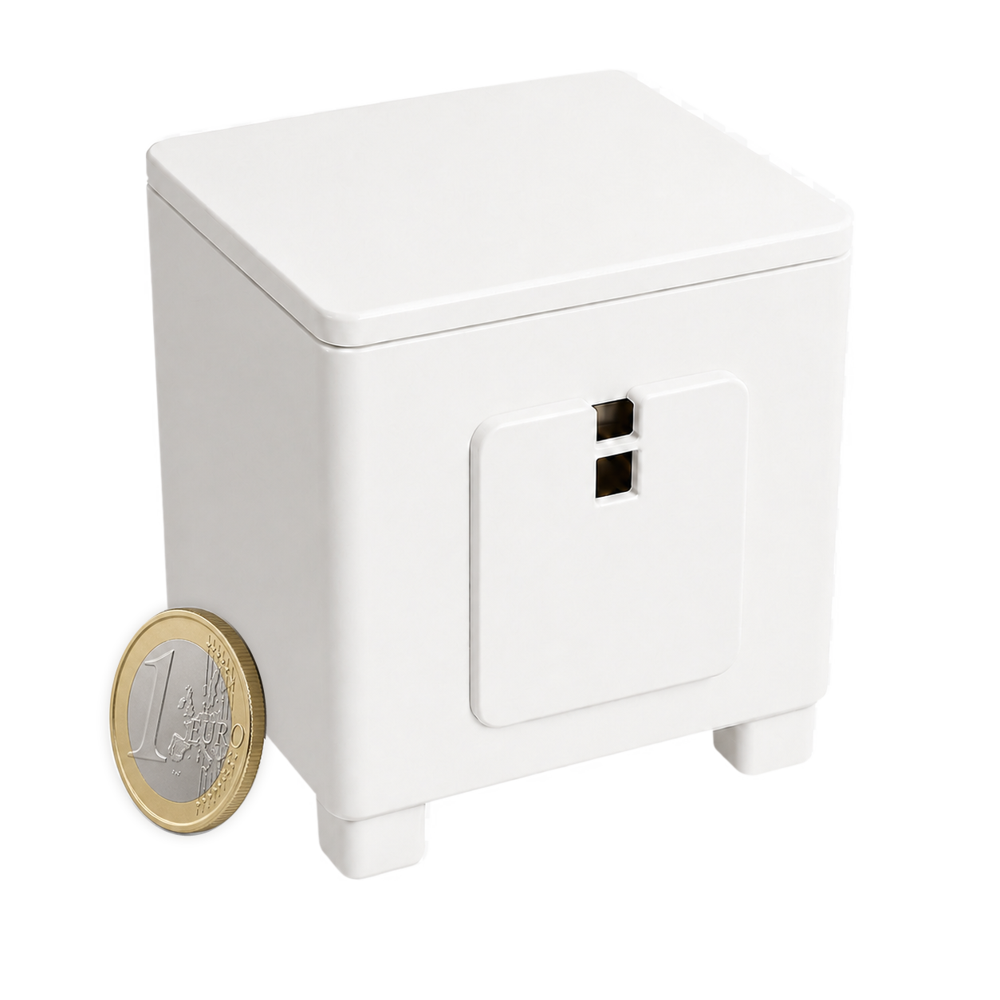
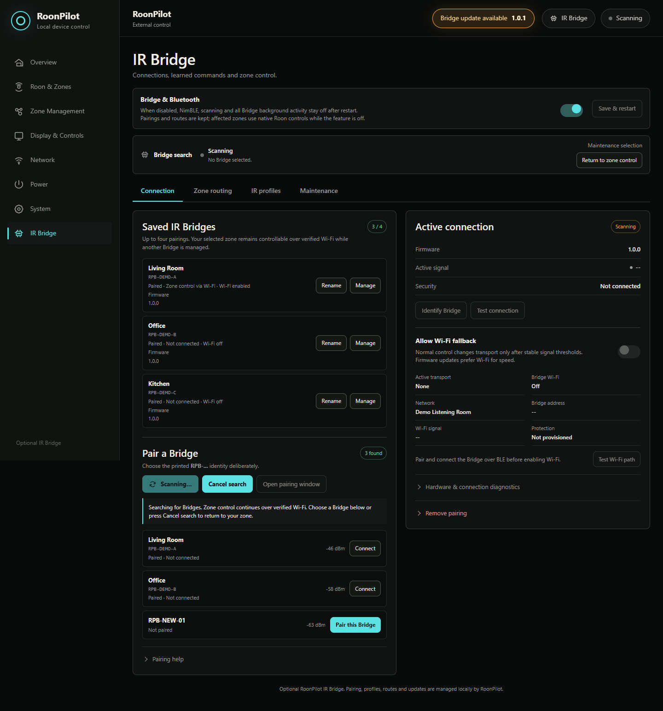

# IR Bridge hardware and Factory installation

**English** · [Deutsch](de/ir-bridge-installation.md) · [Bridge overview](ir-bridge.md)

This guide is for the separate RoonPilot IR Bridge. It does **not** install the
round RoonPilot display and it does not use the second ESP inside the Waveshare
display module.

## Supported reference build

| Part | Reference | Connection |
| --- | --- | --- |
| Controller | [Waveshare ESP32-S3-Zero and official hardware documentation](https://docs.waveshare.com/ESP32-S3-Zero) · [retailer listing for the project board](https://www.amazon.de/dp/B0F3XKMPMK?th=1) | USB power, no battery |
| IR receiver | [AZ-Delivery KY-022 IR receiver module](https://www.az-delivery.de/products/ir-empfanger-modul) | Signal to `GPIO5` / board label `GP5` |
| IR transmitter | [Adafruit High Power Infrared LED Emitter, product 5639](https://www.adafruit.com/product/5639) | Control signal from `GPIO4` / `GP4`, separate 5 V supply as specified by the module |
| Status | On-board addressable RGB LED | Pairing, learning, success and update patterns |

`GPIO5` and `GP5` are two labels for the same general-purpose pin on the
documented board; likewise for `GPIO4` and `GP4`.

Use the [official Waveshare ESP32-S3-Zero hardware documentation](https://docs.waveshare.com/ESP32-S3-Zero)
for the pinout, native USB/BOOT procedure, onboard RGB LED and antenna-clearance
information. The second controller link is only the retailer listing for the
board used by the project. Sellers may silently change board revisions. Before
wiring or flashing, compare the board, ESP32-S3 marking, native USB connector
and printed `GP4`/`GP5` pin labels with this guide. Do not substitute a similarly
named ESP32-C3 or classic ESP32 board.

> [!WARNING]
> Disconnect USB before changing wiring. Never feed the transmitter's 5 V
> supply into an ESP32 GPIO. The GPIO provides only the control signal. The
> controller, receiver and transmitter must share ground. Follow the module
> labels and its manufacturer documentation; wire colours are not a reliable
> pin definition.

The high-power transmitter may use a 5 V supply while its control input is
driven by the ESP32's 3.3 V logic. That does not make the GPIO a 5 V pin: only
the module's supply input receives 5 V, and the common ground gives the control
signal a reference. Do not substitute a bare IR LED at high current without a
calculated driver and resistor.

*Example enclosure of the compact test build; the coin is a size reference only.
Keep both infrared apertures clear and verify range and temperature in the final
installation.*

## Bridge status LED

The small RGB LED is on the ESP32-S3-Zero board. **It is off during normal
operation**; that does not mean the Bridge is powered off or disconnected. It
shows temporary operations only:

| LED pattern | Meaning |
| --- | --- |
| Slowly pulsing blue | A pairing window is open. |
| Two short blue flashes | Encrypted Bluetooth pairing succeeded. |
| Repeated short blue pulses for about 1.5 seconds | Identify Bridge was requested in RoonPilot. |
| Pulsing orange | The Bridge is waiting for or recording an IR signal during learning. |
| Two short green flashes | Two matching IR captures were stored. After pulsing violet: firmware accepted; restart follows. |
| Two short red flashes | IR learning failed or timed out. After pulsing violet: firmware transfer or verification failed. |
| Pulsing violet | Firmware is being transferred or verified. **Do not remove power.** |

After a short confirmation the LED turns off again or resumes indicating an
open pairing window. Cancelling IR learning turns off the orange pattern
without a red error signal. Use RoonPilot's Bridge page for ongoing connection
status, not the LED.

## Physical placement

- Power the finished Bridge from a stable USB supply.
- Keep the ESP32 antenna away from metal and from the high-current emitter path.
- Point the receiver so the original remote can reach it during learning.
- Point the emitter at the controlled device or a reliable reflective surface.
- Start close to the equipment and increase distance only after every command
  works repeatedly.
- Perform the final range test with the installed Adafruit 5639. Verify every
  intended device position because distance, direction and reflections affect
  infrared reliability.

## Before the first flash

1. Disconnect USB and inspect `5V`, `3V3`, `GND`, `GP4` and `GP5` labels.
2. Confirm that receiver output goes to GP5 and transmitter control to GP4.
3. Confirm common ground and that no 5 V wire can touch a GPIO.
4. Use a known USB data cable, not a charge-only cable.
5. Use a current desktop Chromium browser with Web Serial: Chrome, Edge,
   Chromium or Brave. Safari, Firefox, phones and tablets cannot run the Web
   Installer.
6. Close Arduino Serial Monitor, ESP-IDF Monitor, PuTTY and every other program
   that may own the serial port.

## Selecting the serial device

Connect only the Bridge while learning the procedure. In the Web Installer's
device chooser, select the native ESP32-S3 port:

- Windows: **USB JTAG/serial debug unit** (`COM…`).
- macOS: **USB JTAG/serial debug unit** (`cu.usbmodem…`).

The name before the parentheses is what matters; the port name in parentheses
may vary. There is no need to inspect Device Manager or macOS System Information
first. **USB serial** denotes a classic ESP32 in the browser chooser and is not
the ESP32-S3 Bridge. If a wrong entry appears, leave the chooser open,
disconnect USB and reconnect the intended device; the Web Installer immediately
lists it again. If a round RoonPilot is connected at the same time, its main
processor may also appear as **USB JTAG/serial debug unit**. Connect only the
Bridge by USB during Bridge installation.

If no native port appears, try another data cable and direct USB port. Some
boards require holding **BOOT** while connecting USB, then releasing it when
the port appears. This button is needed only for recovery/first USB detection;
normal pairing later does not require opening the enclosure.

## Factory installation

Factory installation is for a new board or complete recovery. It erases the
Bridge flash areas used by the project, including:

- its `RPB-…` identity;
- Bluetooth bonding;
- provisioned Wi-Fi fallback;
- learned IR profiles and commands held on that Bridge. Zone routes are stored
  on RoonPilot, but need their matching profiles to work again.

If this is an existing working Bridge, synchronize its latest IR profiles to
RoonPilot's library, then create a **complete backup on System** before Factory
installation. The Bridge need not stay online during export. A brand-new board
has nothing useful to back up.

Factory installation replaces the Bridge identity. Pair the new `RPB-…` unit
with RoonPilot, then choose it explicitly when restoring named IR profiles from
the unified backup. Each target Bridge receives its own local profile IDs.
Normal signed application updates remain simpler because they preserve the
identity, bond and learned data.

1. Open the official Bridge Factory Installer in a supported HTTPS browser.
2. Read the hardware and erase notice.
3. Select **Connect and install**.
4. Choose the verified ESP32-S3 serial device.
5. Confirm the Factory operation.
6. Keep USB attached until erase, writing and verification have completed.
7. Wait for the Bridge to restart. A factory-new unit creates a new identity and
   advertises for pairing; its RGB LED pulses blue.

A separate `erase-flash` command is neither required nor recommended. The Web
Installer performs the erase required for the Factory image as part of the same
controlled operation.

## Continue in RoonPilot

1. Keep the Bridge powered near RoonPilot.
2. Open the local RoonPilot web interface.
3. Select **IR Bridge**.
4. Enable **Bridge & Bluetooth**, save and restart if it is currently off.
5. Select **Scan for Bridges**.
6. Compare the entire `RPB-…` identity; do not select merely the strongest
   signal.
7. Select **Pair this Bridge** and wait for the connected/ready state.

Continue with [Pairing and connectivity](ir-bridge-connectivity.md), then
[IR learning and zone routing](ir-bridge-zones-and-profiles.md).

## Later firmware updates

Do not return to the Factory Installer for routine updates. RoonPilot displays
installed and available Bridge versions under **IR Bridge → Maintenance** and
performs signed online updates over the current encrypted connection. Wi-Fi is
preferred; BLE remains the recovery path. Installation starts only after user
confirmation and normally retains pairing, Wi-Fi and profiles.

See [Bridge updates and recovery](ir-bridge-updates.md).
