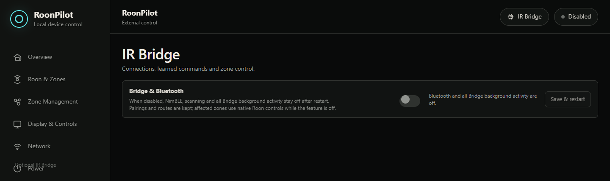

# IR Bridge troubleshooting

**English** · [Deutsch](de/ir-bridge-troubleshooting.md) · [Bridge overview](ir-bridge.md)

Start with the symptom and avoid Factory erase as a diagnostic step. Most
connection problems do not require deleting pairing or profiles.

## The IR Bridge entry is missing

- Install a unified RoonPilot build that includes the optional feature.
- Reload the local page without an old browser cache.
- A disabled Bridge still has an **IR Bridge** navigation entry and a compact
  master-switch page. If the build deliberately has no Bridge feature, the
  entry is absent.

## The Bridge page shows only the top switch

This is the intended disabled state. Enable **Bridge & Bluetooth**, select
**Save & restart**, wait for RoonPilot to reconnect and reopen the page. Saved
pairings and routes have not been erased.

## No Bridge is found

1. Confirm the Bridge has power. Its status LED is off during normal operation;
   it pulses blue only while a pairing window is open. See the
   [Bridge status LED](ir-bridge-installation.md#bridge-status-led) patterns.
2. Move it close to RoonPilot for the first pairing.
3. Confirm Bridge & Bluetooth is enabled after restart.
4. Select **Scan for Bridges** and wait for the complete scan.
5. If the unit was paired before, open its pairing window by cycling power three
   times within 15 seconds.
6. Switch off other nearby Bridges temporarily.
7. Restart only the Bridge and scan again.

Do not use RSSI as identity. Match the complete `RPB-…` value.

## The list says Paired · Not connected

That is usually normal: the pairing remains saved, but this unit may not be
the current zone or maintenance target. Another Bridge may be reachable over
its own Wi-Fi path at the same time. Check:

- which zone is selected on RoonPilot;
- its route under **Zone routing**;
- the `Bridge & profile` identity;
- whether the page is in maintenance selection.

Select **Connect** or **Manage** only for maintenance. Finish with **Return to
zone control**.

## A paired Bridge is absent from “Pair a Bridge”

Discovery shows only the last ten-second BLE scan, not all saved pairings.
**Saved IR Bridges** is the persistent inventory. After the unit comes back
into Bluetooth range, press **Scan for Bridges** again. Absence from a scan
does not mean that pairing or Wi-Fi access was lost.

## I pressed Scan and cannot return

Use **Cancel search** in the Pair a Bridge section. It remains available after
an empty scan and after reloading the page. It restores automatic zone control.
If it does not respond, record the event log and diagnostics before restarting;
do not remove pairings.

## BLE/Wi-Fi status changes too often

A changing dBm value by itself is normal. Frequent transport changes or
connected notices are not.

1. Record both BLE and Wi-Fi signal values, not only one.
2. Keep RoonPilot and Bridge stationary for ten minutes.
3. Temporarily disable **Allow Wi-Fi fallback**. Stable BLE then isolates the
   Wi-Fi path; continued breaks point to BLE/power/interference.
4. Restore Wi-Fi and run **Test Wi-Fi path**.
5. Use a stable USB supply and keep the ESP antenna away from metal/USB cables.
6. Check the RoonPilot event log for a planned local close, supervision timeout,
   status-query timeout and transport fallback.

RoonPilot should change transport only after filtered thresholds and grace
periods. Background Bridge status traffic must not block Roon keepalive. A
repeatable Roon disconnect immediately after Bridge timeouts is a defect worth
reporting with both event and Roon Server timestamps.

## RoonPilot reports the wrong Bridge after a zone change

- Check the zone's saved Bridge ID/profile.
- Leave maintenance mode with **Return to zone control**.
- Wait for the switching status to finish before turning the ring.
- If the assigned Bridge is off, RoonPilot deliberately does not use a different
  Bridge or silently send native Roon volume.

## Learning receives no signal

1. Receiver `OUT/S` must be on GP5; `VCC` and `GND` must match the module label.
2. Many receiver modules are physically labelled in a different pin order—do
   not rely on the board colour or an Internet photo.
3. Point the original remote at the receiver and test at 10–30 cm.
4. Verify the learning LED indication begins before pressing the remote.
5. Avoid direct sunlight and strong lamps near the receiver.
6. Try a known working remote to distinguish receiver wiring from a protocol
   problem.

## The two recordings do not match

- Press the same key both times.
- Use the same short/held behaviour requested by the guide.
- Do not move the remote between captures.
- Release the key fully before the second capture.
- Reduce distance and ambient IR interference.
- Retry from the beginning; the previous valid command remains until a new one
  is accepted.

## Test says sent, but the audio device does nothing

1. Confirm transmitter control is on GP4 and all modules share ground.
2. Confirm the high-power module receives its required 5 V at its supply input;
   never at the ESP GPIO.
3. Aim at the device's IR receiver window from short range.
4. Check that carrier and Duty have not been changed accidentally.
5. Relearn with the original remote and test immediately.
6. Verify the installed Adafruit 5639 at every intended device position; its
   range depends on direction and room reflections.

## Volume amount is wrong

The zone's `Knob step` is a count, not a percentage or dB conversion.

- `1x` on an IR route sends one complete learned command per detent.
- If the DAC changes 0.5 dB per command, `2x` produces 1 dB.
- If it changes 1 dB per command, `2x` produces 2 dB.

Set the value by observing the real equipment. Make sure you changed the step
for the correct zone in Zone Management.

## Commands continue after the ring stops

A very small bounded amount of work may still be in flight, but seconds of
continued volume change are not acceptable.

- Reduce the zone step temporarily and repeat.
- Verify the profile was learned with correct repeat timing.
- Test a sudden direction change. Pending old-direction steps should be
  cancelled promptly.
- Record the number of physical detents and the exact device dB change.
- Download event/diagnostic data before rebooting.

## External volume displays no absolute number

That is intentional. Ordinary IR has no feedback channel. RoonPilot shows
Volume up/down or a relative signed counter in an amber overlay. An absolute
0–100 or dB value appears only when a Roon endpoint reports it.

## Power or Mute button is absent

Open Zone Management and enable the button for that zone. For an external route,
the assigned profile must contain the command. Power uses short press for ON and
long press for OFF. If HTTP is desired, Power must be enabled before **Enable
HTTP** becomes available.

## HTTP test is disabled

- Enable Power, then Enable HTTP.
- Enable that pair's ON or OFF direction.
- Enter a valid numeric-IPv4 `http://` URL.
- Save the zone configuration before testing.
- Confirm no other HTTP test is running.

A test may change real power. There is deliberately no automatic retry or
redirect following.

## Online update is slow

Wi-Fi is preferred when configured and verified. BLE transfer is expected to be
slower. Do not interrupt power while RoonPilot's warning and the Bridge update
LED are active. If the progress stops completely, wait for a reported timeout or
reconnect before retrying; the same image can resume from confirmed data.

## Update finished but the old version remains

RoonPilot does not declare success until the Bridge restarts and reports the
requested version. Check for:

- compatibility block;
- signature/digest failure;
- rollback after startup validation;
- the wrong Bridge being selected for maintenance;
- power or transport loss near finalization.

Keep the prior version running, download diagnostics and use the approved local
recovery image only when directed. Do not Factory erase first.

## IR commands are missing after a restore

Check whether the named profile is present in RoonPilot's permanent library
and was assigned to the intended target Bridge during restore. New exports
read the library even when a Bridge is offline. Only changes that had not
synchronized to the library before export may be absent. An older
RoonPilot-only export never contained Bridge IR data; import the older
single-Bridge file on **System** or relearn the commands. See
[Configuration backup and restore](configuration-backup.md).

## Information to include in a report

- RoonPilot and Bridge versions;
- both `RPB-…` identities involved, if not private;
- selected Roon zone and its route/profile (no music metadata required);
- active transport and BLE/Wi-Fi signal values;
- exact operation and result;
- RoonPilot event-log download;
- sanitized diagnostics;
- Roon Server timestamps if Roon also disconnected;
- whether either device or USB power was moved.

Never publish Wi-Fi passwords, BLE keys, private signing material, raw factory
backups or combined settings/IR backups you consider private.
