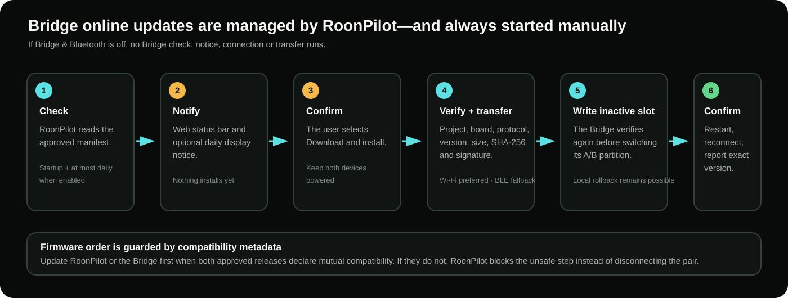
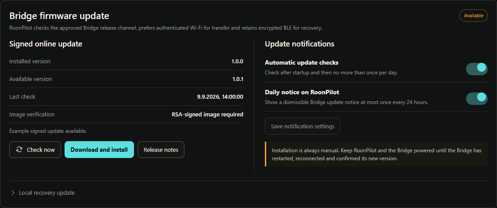

# IR Bridge updates, backup and recovery

**English** · [Deutsch](de/ir-bridge-updates.md) · [Bridge overview](ir-bridge.md)

Bridge firmware is updated from RoonPilot. A normal update does not require a
USB cable to the Bridge, a separate BIN download or a return to the Factory Web
Installer.

## Update notifications

Under **IR Bridge → Maintenance**, RoonPilot shows:

- installed Bridge version;
- available approved version;
- last check and current check state;
- whether the connected Bridge supports signed OTA;
- automatic-check and device-notification switches.

When enabled, update checks run after startup and no more than once per day. A
new Bridge version can appear in the web status bar and as a dismissible
RoonPilot display notice at most once every 24 hours. Notices wait until
important interaction, battery calibration or another firmware operation is no
longer active.

Discovery is automatic only if configured. Installation is **never** automatic.

## Before installing

1. Finish IR learning and any profile edits.
2. If profiles changed since the last backup, open **System → Create Backup**.
   Ensure learned profiles have synchronized to RoonPilot; Bridges need not be reachable during export.
3. Connect RoonPilot and the Bridge to stable power.
4. Do not start a RoonPilot firmware update at the same time.
5. Read release notes and the compatibility result.
6. If Bridge Wi-Fi is enabled, confirm it is connected. RoonPilot prefers Wi-Fi
   for transfer. If the paired Bridge has Wi-Fi disabled but BLE is available,
   the update flow can provision and enable Wi-Fi temporarily, use it for the
   image transfer and restore the previous off state afterwards.

## Normal online update

1. Open **IR Bridge → Maintenance**.
2. Select **Check now** if the automatic result is not current.
3. Confirm the intended Bridge identity at the top of the page.
4. Select **Download and install**.
5. Leave both devices powered. RoonPilot shows a persistent update warning on
   its display; the Bridge RGB LED shows the update pattern.
6. Wait through download, verification, transfer, Bridge restart and reconnect.
7. Success is shown only after the Bridge reports the exact requested version.

The transfer prefers authenticated local Wi-Fi for speed. Encrypted BLE is the
fallback and can be slower; do not remove power merely because progress pauses
briefly. Temporary update-only Wi-Fi does not silently change the Bridge's
normal fallback preference after the update has ended.

## What is verified?

RoonPilot verifies the release channel, project, target board, protocol range,
version, image size, SHA-256 and signature metadata before installation. The
Bridge independently verifies block order, complete size, digest, embedded
identity and signature before selecting its inactive A/B application slot.

After reboot, RoonPilot reconnects and validates the reported target version.
Byte transfer alone is not treated as success.

## If RoonPilot and Bridge updates are both available

The release metadata declares the supported controller and Bridge ranges. If
both releases are mutually compatible, either approved update may be installed
first. If an intermediate combination would be unsafe, RoonPilot blocks that
step and explains the required order instead of allowing the two devices to
disconnect permanently.

Never bypass a compatibility block with an older local image. Keep both current
release notes available until both updates have completed.

## One backup for RoonPilot and Bridges

Use **System → Create Backup** to save settings, all zone routes, the permanent
IR profile library and separate Bridge assignments in one JSON file. The
export reads RoonPilot's library, not each Bridge; paired Bridges may be
offline. Ensure recent learning has synchronized first. There is no separate
Bridge backup section on Maintenance.

To restore, pair the target Bridges, then select **System → Restore backup**.
File and IR checksums are validated before changes. Keep both
devices powered, review routes and test Volume, Mute and both Power commands
at the real equipment afterward. Older individual Bridge files remain
importable on System and are converted into independent named profiles.

Factory installation or a replacement board has a different `RPB-…` identity.
Choose that newly paired Bridge explicitly in the restore dialog. Named
profiles can be transferred to several Bridges, each with a new local profile
ID; old numeric IDs are not blindly reused. Keep normal signed updates
separate from Factory recovery.

See [Configuration backup and restore](configuration-backup.md) for the
current and legacy-file rules. Wi-Fi passwords, Roon authorization
and Bluetooth keys are never exported; private HTTP URLs are included.

## Local recovery update

The collapsed **Local recovery update** section is for a signed Bridge
application image produced by the RoonPilot IR Bridge project when online
updating is unavailable. It is not the normal update path.

- A Bridge Factory image, RoonPilot display image or unsigned file is rejected.
- The exact version embedded in the file must match the entered/release value.
- The same compatibility, hash and signature rules still apply.
- Do not use recovery to downgrade or bypass a blocked pairing contract.

## Interrupted update

If the connection drops, keep power applied. The protocol tracks confirmed
blocks and can resume the same image. A different image invalidates the old
session. The Bridge's inactive-slot design and boot validation preserve the
last valid application when final verification or startup fails.

If the page reports failure:

1. Wait for Bridge reconnect/rollback rather than immediately retrying.
2. Check the exact installed version and event log.
3. Reopen Maintenance and download diagnostics from **System**.
4. Confirm power and Wi-Fi/BLE state.
5. Retry only when the previous session is clearly idle.
6. Use local recovery only with the approved signed application image.
7. Use the Factory Installer only for complete recovery; Factory erases pairing,
   Wi-Fi and learned profiles.

## When the Bridge feature is disabled

No Bridge update check, status-bar notice, display notice, connection or
background update activity occurs. The saved notification preferences remain
stored and take effect again after Bridge & Bluetooth is enabled and RoonPilot
has restarted.
