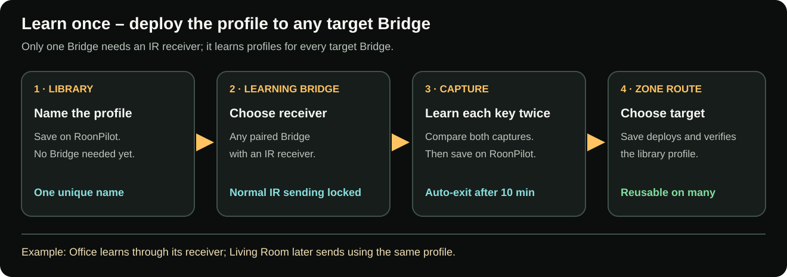

# IR profiles, learning and zone routing

**English** · [Deutsch](de/ir-bridge-zones-and-profiles.md) · [Bridge overview](ir-bridge.md)

There are two separate configuration layers:

- **IR Bridge → Zone routing** chooses native Roon, an external Bridge/profile
  or disabled volume.
- **Zone Management** chooses the ring step and optional Power/Mute buttons for
  each zone, and can attach additional HTTP power actions.

Keeping these layers separate lets a single RoonPilot use native Roon volume in
one room, learned IR in another and no volume control in a third.

**Only one Bridge needs an IR receiver, even when several Bridges are paired.**
It can learn every profile. The other Bridges need no receiver to transmit IR.
The learning Bridge and the eventual target Bridge may be different units.

## Create an IR profile

1. Open **IR Bridge**.
2. Open **IR profiles** and select **Create profile**.
3. Give it a unique equipment name, such as `RME ADI-2 DAC`.
4. Leave carrier at 38 kHz and Duty at 33% unless the equipment documentation
   or a measured test proves another value is required.
5. Select **Save on RoonPilot**. No Bridge needs to be connected yet.

The profile stays in RoonPilot's persistent library, independent of any
Bridge. Its name must be unique there. Saving a zone route later automatically
deploys and verifies a copy on the selected target Bridge. The same library
profile may be assigned to several Bridges, whose local profile slots are
independent. Each Bridge can hold up to eight deployed profiles.

## Commands in every profile

| Command | RoonPilot action |
| --- | --- |
| Volume up | Clockwise ring steps when the external route is active. |
| Volume down | Counter-clockwise ring steps. |
| Mute | Optional Mute button on the player screen. |
| Power on | Short tap on the optional Power button. |
| Power off | Long press on the same Power button. |

Power on and Power off deliberately occupy separate learning slots. A device
may use the same remote key but require a held/repeated signal for off; the
Bridge stores the learned transmission behaviour for each command instead of
calling both a generic toggle.

## Learn commands with one receiver Bridge

1. Select the saved profile and **any paired Bridge with an IR receiver** as
   the learning Bridge. It need not be the eventual target Bridge.
2. Place its receiver where the original remote can reach it and select
   **Start learning**.
3. Select **Learn** for the desired command. Wait for the first-capture prompt
   and point the original remote at the receiver, not at RoonPilot.
4. Press the original key once in its normal manner. Repeat the same press
   when prompted for the second capture.
5. Capture the remaining commands in the same way. RoonPilot compares the
   captures; the learning Bridge cannot transmit normal IR while learning.
6. **Save on RoonPilot** ends the session and commits the confirmed commands
   to the library. **Discard learning** leaves the library profile unchanged.
   An unfinished session ends automatically after at most ten minutes.
7. Under **Zone routing**, select the target Bridge and this profile, then
   save. Only then test at the final equipment and confirm that exactly the
   expected IR action occurs.

Do not press another remote key between the two captures. For a long-power-off
command, follow the prompt and reproduce the way the original device expects
the key to be held.

[Open full-size diagram](../docs/ir-bridge/assets/bridge-learning-workflow-en.svg)

### What is analysed automatically?

The learning path records the demodulated pulse sequence and attempts to detect
known protocol data, bit count, repeat style and frame period. When a safe
protocol representation is available, the Bridge uses it. Otherwise it retains
a portable raw microsecond sequence. The two recordings help reject noise,
wrong buttons and incomplete frames.

This is why one learned command can be sent more than once without teaching a
separate code for every ring speed. The stored repeat/timing strategy determines
how repeated frames are emitted.

### What does Duty mean?

Duty is the percentage of each IR carrier cycle for which the emitter is on.
At 38 kHz and 33%, the LED is on for roughly one third of each carrier period.
It is not a volume step, button-hold time or number of repeats. Higher duty can
increase average emitter current and heat; it does not automatically improve
reliability. Keep 33% unless the transmitter and target equipment have been
tested for another value.

## Configure a zone route

Open **IR Bridge → Zone routing**. For each Roon zone choose:

### Roon / endpoint volume

RoonPilot uses the volume capability reported by the endpoint. It automatically
handles numeric, dB and incremental volume types. If the endpoint reports dB,
the current value begins at that reported dB value, not at zero.

### External IR Bridge

Select a paired Bridge and a profile from the RoonPilot library. Press
**Save**: RoonPilot connects to that Bridge, transfers and verifies the IR
profile, then activates the zone route. You do not need to load or transfer
profiles manually. If the Bridge is offline or the transfer fails, the old
route remains active and your unsaved choice stays in the form for retry.

RoonPilot cannot read the absolute volume position back from ordinary IR
equipment. The player therefore shows a relative amber overlay and a signed
step counter such as `+2` or `-1`, rather than inventing an absolute 0–100 or dB
value.

### Disabled

The ring sends no volume command for that zone. Playback controls remain Roon
controls.

## What happens when Roon groups zones?

Routes are attached to the physical outputs, not replaced by the temporary
group name. When Roon combines outputs, RoonPilot builds one group action from
those existing settings:

- every native member receives its own output-specific Roon command;
- every External IR member uses its assigned Bridge and library profile;
- Disabled members are skipped;
- each required Bridge is checked independently and an unavailable one is shown
  as `OFFLINE` without silently changing the route;
- when two members reference the same physical Bridge, one detent produces only
  one IR action on that Bridge, preventing accidental double steps.

The first single detent opens the touch-selectable group mixer without changing
volume. Continue turning for all members, tap a row for one member, or tap the
group heading to return to all. Read the illustrated
[Roon group guide](roon-groups.md) for mixed units, multiple Bridges and the
three-visible-row limit.

## Configure the per-zone ring step

Open **Zone Management** and choose **Knob step** for every zone.

- For a native Roon zone, `2x` means two native endpoint steps. If the endpoint
  reports 1 dB steps, a detent requests 2 dB before optional acceleration.
- For an external IR zone, `2x` means two complete IR volume commands per
  detent. Software acceleration is not added to the IR route; the learned
  repeat timing controls the transmission.
- A remote/device may interpret one complete command as 0.5 dB, 1 dB or another
  amount. Configure the number by observing the real equipment, not by assuming
  a percentage.

Fast rotation is accumulated, direction changes cancel pending steps promptly,
and stale queues are bounded so the DAC must not continue changing for seconds
after the ring stops.

## Power and Mute buttons

In **Zone Management**, enable Power and/or Mute separately for each zone.

- Native Roon routes use the endpoint capability when available.
- External routes use the corresponding learned command from the assigned
  profile.
- Power is a short press for ON and a long press for OFF.
- Do not enable a button until its endpoint action or IR command is known to
  work. Missing external commands do not silently fall back to Roon.

## Optional HTTP power actions

When Power is enabled, **Enable HTTP** becomes available for that zone. Up to
three named command pairs can be stored, for example `DAC power`, `Tablet dock`
and `Room light`.

Each pair has independent ON and OFF switches, URLs and **Test** buttons.
Disabling one direction retains its label and URL. The player Power action runs
all enabled commands for that direction in order, alongside the configured
native/IR power path.

Safety rules:

- A Test button sends a real HTTP request and can switch real equipment.
- Save before testing. The confirmation identifies the zone, pair and direction.
- Only plain local HTTP with a numeric IPv4 target is accepted.
- Redirects and automatic retries are deliberately disabled to avoid duplicate
  power actions.
- Each URL is limited to 512 characters; the zone settings share a bounded
  deduplicated URL pool.
- The combined System backup contains these private URLs, so store the file
  privately.

