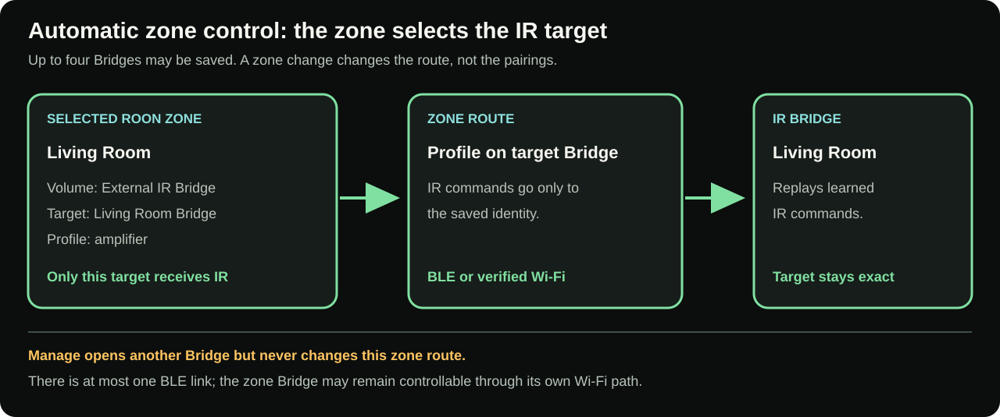
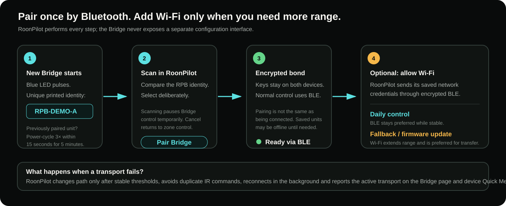
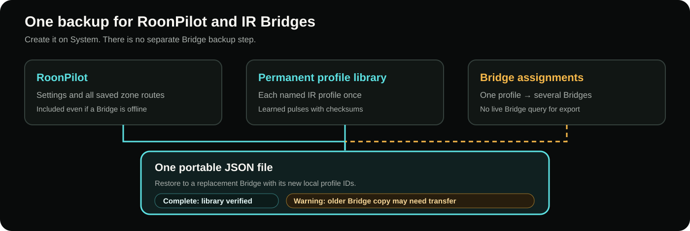
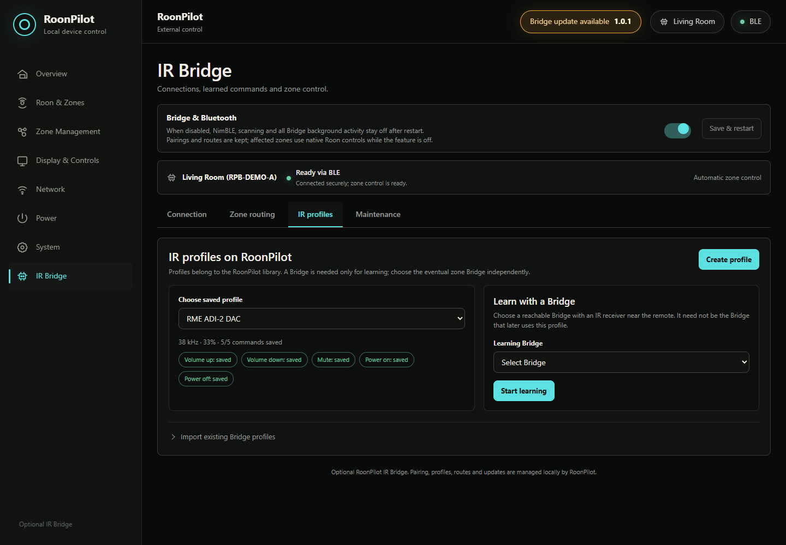

# RoonPilot IR Bridge

**English** · [Deutsch](de/ir-bridge.md)

The RoonPilot IR Bridge is an optional ESP32-S3 companion for audio equipment
that cannot expose every useful control through Roon. RoonPilot remains the
only control centre: it pairs the Bridge, teaches infrared commands, assigns a
Bridge and profile to each Roon zone, chooses Bluetooth or Wi-Fi, installs
Bridge updates and backs up learned profiles.

The Bridge page and the IR Bridges Quick Settings view follow RoonPilot's global
English/German language setting. Physical `RPB-…` identities and user-defined
zone, equipment and profile names are never translated.

If the feature is not needed, switch **Bridge & Bluetooth** off and restart.
Bluetooth, scanning, Bridge connections, update checks and every Bridge
background task then remain off. The ordinary RoonPilot features continue to
work, and saved pairings, routes and profiles are retained for a later
reactivation.

> [!NOTE]
> Every screenshot and address in this documentation uses fictional example
> data. Names such as `RPB-DEMO-A` and addresses from `192.0.2.0/24` are not
> credentials for a real device.

*The example enclosure shows the scale of the compact test build; the one-euro
coin is only a size reference. Keep both infrared apertures unobstructed.*

The RGB status LED is off during normal operation. The blue, orange, green,
red and violet patterns are explained in the
[hardware guide's LED legend](ir-bridge-installation.md#bridge-status-led).

## What problem does it solve?

A Roon Ready endpoint normally reports its volume capability to Roon, and
RoonPilot sends the corresponding command through Roon. That is the preferred
path when it controls the desired hardware volume correctly.

Some systems need a different path. For example, an RME ADI-2 DAC can be
controlled with its original infrared remote. Routing the Roon zone through an
IR profile lets the RoonPilot ring change the DAC's own volume while preserving
RME's Auto Ref Level behaviour instead of using Roon's digital volume. The same
approach can operate an amplifier, DAC or streamer power command even when the
Roon endpoint does not expose standby.

Playback still remains in Roon. Play, pause, previous track, next track,
playlists and Live Radio are Roon operations; only the functions explicitly
routed to IR leave through the Bridge.

## Terms that look similar but mean different things

| Term | Meaning |
| --- | --- |
| **Paired / saved** | RoonPilot and the Bridge have exchanged encrypted keys. A saved Bridge may be switched off or disconnected. |
| **Connected** | RoonPilot currently has an active BLE or Wi-Fi control path to that Bridge. |
| **Automatic zone control** | The selected Roon zone—or every physical output in a selected group—determines which saved Bridges receive IR commands. This is the normal mode. |
| **Maintenance selection** | You temporarily open another saved Bridge to inspect profiles, connectivity or updates. The zone route remains unchanged and may continue over its verified Wi-Fi path. |
| **IR profile** | A named learned command set in RoonPilot's persistent library; it can be deployed to several Bridges. |
| **Zone route** | The choice of native Roon volume, an external Bridge/profile or disabled volume for one Roon zone. |
| **Wi-Fi fallback** | Optional Bridge networking provisioned through encrypted BLE. BLE remains preferred for normal nearby control; Wi-Fi extends range and is preferred for firmware transfer. |

## Multiple zones and multiple Bridges

RoonPilot can save up to four Bridges. Every Roon zone can independently use:

- **Roon / endpoint volume**;
- **External IR Bridge**, with a selected saved Bridge and a profile from RoonPilot's library;
- **Disabled**, when the ring must not change volume.

**Only one Bridge needs an IR receiver** to learn profiles for all paired
Bridges. The profiles remain in RoonPilot's library and can then be deployed
to other Bridges **without their own IR receiver**.

There is at most **one BLE link**, but several Bridges may be reachable at the
same time through their **separate authenticated Wi-Fi paths**. When you select
another zone or group, RoonPilot checks every relevant output route and sends
IR commands only to its assigned Bridge. Other saved units retain their pairing
and Wi-Fi settings.

### Roon groups

A Roon group does not collapse its members into one arbitrary volume route.
Each physical output keeps the route configured in RoonPilot. One turn may
therefore command a native dB endpoint, a native numeric endpoint and several
IR Bridges together. Required group Bridges are monitored independently; a
failed unit is shown as `OFFLINE` while other valid routes may continue.

The on-device mixer opens with the first detent without changing volume. It can
then control the whole group or one tapped member. See the complete
[Roon group guide](roon-groups.md).

**Saved Bridges** and the **last BLE scan result** are different views. “1
found” can correctly appear alongside “2 / 4 saved”. See the illustrated
[pairing and connectivity guide](ir-bridge-connectivity.md) for a two-Bridge
example and transport handover.

Current ownership is one RoonPilot per Bridge. Pairing a Bridge to a different
controller is a deliberate ownership change, not multi-controller sharing.

## How communication works

Initial pairing and all sensitive provisioning use Bluetooth Low Energy. The
connection is bonded and encrypted. If **Allow Wi-Fi fallback** is enabled,
RoonPilot transfers its saved network credentials to the selected Bridge over
the encrypted BLE link. The Bridge does not expose a separate setup access
point or independent management page.

During normal operation, BLE remains preferred while it is healthy. RoonPilot
changes transport only after stable thresholds, suppresses duplicate logical
commands and reconnects quietly. Wi-Fi can take over when the Bridge is out of
BLE range and is the preferred path for a firmware image. The active transport
and both signal values are visible on the Bridge page; the device Quick Menu
also reports Bridge status.

## What is stored where?

RoonPilot stores saved Bridge identities/bonds, per-zone routes, feature
switches and the persistent library of named IR profiles. Each Bridge stores
its own identity, Bluetooth bond, optional Wi-Fi configuration and deployed
copies of its assigned IR profiles. This keeps a volume command small and
fast: RoonPilot sends a logical command and the Bridge reproduces the stored
signal.

**System → Create Backup** creates one JSON file with RoonPilot settings, all
saved zone routes and the permanent named IR profile library. The backup reads
RoonPilot's library rather than contacting each paired Bridge, so an offline
Bridge does not block it. Unsynchronized changes made on a Bridge may be absent.
There is no separate backup step on Maintenance. Wi-Fi passwords, Roon
authorization and Bluetooth/transport keys are excluded. See
[Configuration backup and restore](configuration-backup.md) for details.

The importer lets you choose the currently paired target Bridges for each
profile. A Factory reinstall or replacement board has a new `RPB-…` identity;
pair it first, then select it as the restore target. Old numeric profile IDs
are never reused blindly.

## Normal setup in eight steps

1. Build and inspect the Bridge hardware with USB disconnected.
2. Install the approved Bridge Factory image with the separate Bridge Web
   Installer.
3. In RoonPilot, open **IR Bridge**, enable **Bridge & Bluetooth**, save and
   allow the controlled restart.
4. Scan, compare the complete printed `RPB-…` identity and pair that unit.
5. Optionally enable and test the Wi-Fi path.
6. Create an IR profile, record each required original-remote command twice and
   test it at the real equipment.
7. Open **Zone routing**, choose the Bridge/profile for the intended Roon zone,
   select Power/Mute buttons if required and save.
8. On **System**, create one complete backup after the profiles have synchronized
   to RoonPilot and the routes work as intended.

Detailed procedures:

- [Bridge hardware and Factory installation](ir-bridge-installation.md)
- [3D-printable enclosure and STL downloads](ir-bridge-enclosure.md)
- [Pairing, automatic zone control and connectivity](ir-bridge-connectivity.md)
- [IR profiles, learning and zone routing](ir-bridge-zones-and-profiles.md)
- [Bridge updates, backups and recovery](ir-bridge-updates.md)
- [Bridge troubleshooting](ir-bridge-troubleshooting.md)

## What the main switch guarantees

After **Bridge & Bluetooth** is disabled and RoonPilot restarts:

- the Bluetooth controller and NimBLE host are not started;
- no scan, reconnect, Bridge status request or Bridge update check runs;
- the Bridge page shows only the compact master-switch section;
- Bridge data remains stored;
- zones whose stored route is External IR or Disabled temporarily use native
  Roon behaviour while the complete feature is off;
- importing a compatible configuration backup does not require the Bridge to be
  enabled.

After re-enabling and restarting, the saved routes become active again. By
contrast, when the Bridge feature is enabled but an assigned Bridge is missing,
RoonPilot does **not** silently send the same volume/power action through Roon.
That fail-closed behaviour prevents an unexpected second device from reacting.

## Limits and expectations

- Infrared requires useful placement and line of sight or suitable reflections.
- Independent IR profiles persist on RoonPilot; copies are deployed to their
  assigned Bridges. Create a current System backup before a Factory reinstall.
- Up to eight profiles are supported per Bridge and up to four Bridges per
  RoonPilot.
- Active routes follow the selected zone or every physical member of a Roon
  group; maintenance can use BLE only while all affected control paths remain
  available, normally through their verified Wi-Fi links.
- A single Bridge is currently owned and managed by one RoonPilot.
- Wi-Fi fallback is optional, local-only and not cloud control.
- Update discovery may run automatically; installation never does.
- Do not assume `Duty` is volume strength. It is the IR carrier duty cycle;
  33% is the normal default unless the hardware requires a verified change.

## Current interface examples

