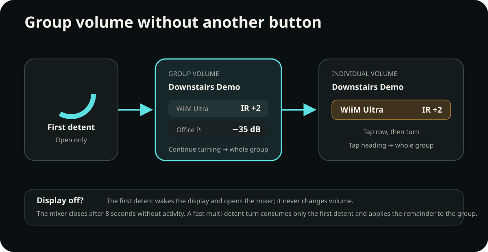

# Roon groups and the on-device group mixer

**English** · [Deutsch](de/roon-groups.md) · [Device controls](device-controls.md)

RoonPilot treats a Roon group as one selected playback zone whose physical
outputs may still need different volume controls. A single turn can therefore
combine native Roon volume, real dB values, relative Roon commands and one or
more IR Bridges. The route saved for each physical output remains decisive;
grouping in Roon does not overwrite it.

[Open the routing diagram at full size](../docs/assets/roon-group-routing-en.svg)

## What the first ring movement does

When the selected zone has more than one output and the mixer is closed:

1. Turn the ring by one detent in either direction.
2. RoonPilot opens the group mixer and consumes that first detent. **No volume
   command is sent.**
3. Continue turning to change every controllable member of the group.

This deliberate first step makes the mixer available without another small
button. If the display is black, the same first detent wakes the display and
opens the mixer without changing volume. A fast movement that already contains
several detents consumes only the first one; the remaining detents control the
whole group.

[Open the interaction diagram at full size](../docs/assets/roon-group-mixer-en.svg)

## Control the whole group

The initial heading is **Group volume** and the Roon group name appears below
it. Continue turning the ring. RoonPilot processes every physical output
independently:

| Saved route of a group member | Ring result | Display example |
| --- | --- | --- |
| Native Roon `number` | Output-specific native Roon command | `48` — no invented percent sign |
| Native Roon `db` | Output-specific native Roon command | `−35.0 dB` |
| Native Roon `incremental` | Relative louder/quieter command | `Roon +2` |
| External IR Bridge | Learned command through that output's assigned Bridge/profile | `IR +2` |
| Disabled or unsupported | No volume command for that member | Member is skipped |
| Required IR Bridge unavailable | No silent fallback to another route | `OFFLINE` |

The values do not need to share a unit. Seeing `48`, `−35.0 dB` and `IR +2` in
the same group is correct: each row reports the honest model of that output.
Playback, track changes, playlists and Live Radio remain Roon operations.

  

## Control one member without another button

While the group mixer is visible:

1. Tap the large row of the member to control.
2. The heading changes to **Individual volume** and that row is highlighted.
3. Turn the ring. Only the selected physical output receives volume commands.
4. Tap the group-name heading to return to the whole group.

The mixer remains open for eight seconds after the last ring or touch activity.
It then closes automatically and the normal player returns.

  

## Several IR Bridges in one group

All Bridges required by the currently controlled group are considered. There
is at most one BLE connection, but several independently authenticated Wi-Fi
paths can be active at the same time. A nearby Bridge may use BLE while another
room is controlled over Wi-Fi.

- Each group member keeps its own saved Bridge and IR profile.
- A failed Bridge makes only its own route unavailable; valid native and other
  Bridge routes can still complete.
- RoonPilot reports outage and recovery per relevant Bridge without repeatedly
  flooding the display or event log during a continuing failure.
- A transport change between BLE and Wi-Fi does not change the saved zone route
  and must not duplicate an IR command.
- Two independently controlled IR outputs must not share the same Bridge in a
  group. Such a conflict stops the group command instead of guessing which
  profile to use. See the route-protection explanation below.

See [IR Bridge connectivity](ir-bridge-connectivity.md) for pairing, scan
results, authenticated Wi-Fi and transport handover.

## CHECK ROUTES and STOP

If two IR outputs in the selected group resolve to the **same Bridge**,
RoonPilot shows **CHECK ROUTES** (German: **ROUTEN PRUEFEN**) above the mixer.
The controllable rows show **STOP**. No group-volume command is sent to any
member, including native Roon outputs. Group Power or Mute can also be stopped
when their participating IR routes conflict.

This protects against an ambiguous assignment; it does not mean the Bridges
are offline. In contrast, **OFFLINE** marks an unavailable Bridge route while
other valid group members can continue working. Grouping or ungrouping alone
does not require route confirmation if every member retains a valid independent
assignment.

To resolve **CHECK ROUTES**:

1. Open the local website and select **IR Bridge → Zone routing**.
2. Check each physical output in the group, not just the group name. Give each
   independent IR target its own paired Bridge and the correct library profile.
   Select native Roon control or disable volume for an output that should not
   use IR.
3. Save each corrected route. RoonPilot verifies the selected profile copy
   before activating it; if preparation fails, the previous route stays in place.
4. Return to the mixer and select the whole group again. **Group volume** and
   the normal values replace **CHECK ROUTES / STOP** once the conflict is gone.

Do not change a route to native Roon merely to hide the warning if the actual
equipment must be controlled through IR.

## Display capacity and larger groups

RoonPilot can process the complete group model, but the round touch overlay has
space for at most **three controllable rows**. If more routes exist, the heading
shows a fraction such as `3/4`:

- whole-group turning still processes all eligible outputs;
- only the three visible rows can be selected individually on the device;
- use Roon or change the group temporarily when an output beyond those visible
  rows needs individual adjustment.

This is a display-space limit, not a change to the Roon group itself.

## Worked example

The fictional group **Downstairs Demo** contains:

- **WiiM Ultra** — external IR through the Living Room Bridge;
- **Office Pi** — native Roon dB volume;
- **Kitchen** — native numeric Roon volume.

One detent opens the mixer. Two further clockwise detents can display `IR +2`,
`−35.0 dB` and `48` together. Tapping **Office Pi** and turning once changes only
that output. Tapping **Downstairs Demo** selects the whole group again. If the
Living Room Bridge is powered off, WiiM Ultra reads `OFFLINE`; Office Pi and
Kitchen still use their valid native routes.
