# Complete device-screen reference

**English** · [Deutsch](de/screen-reference.md)

The following renders mirror the 360 × 360 LVGL layouts and use fictional data.
Minor colour differences can occur between a browser render and the physical IPS
panel.

## Player and listening screens

### Classic

The default balanced layout: zone at the top, circular cover, title, artist and
three transport buttons. Wi-Fi and the coarse battery symbol sit beside the
artwork rather than against the clipped upper edge.

### Focus

Emphasizes title and large transport controls. A progress bar and combined
elapsed/total time are shown near the lower edge.

### Orbit

Uses full-screen cover art, a fine outer progress ring and outlined transport
buttons. Text and controls remain inside the circular safe area.

### Volume

Appears while the ring is turned. The arc and number represent the pending
volume for the named zone.

### Zone picker

Shows the enabled Roon zones. The accent outline/check identifies the current
selection; an activity mark distinguishes a playing room.

## Connection and selection screens

| View | Meaning |
| --- | --- |
|  | Wi-Fi and discovery work; approve RoonPilot in **Roon → Settings → Extensions**. |
|  | No saved Wi-Fi; join the protected setup AP. |
| 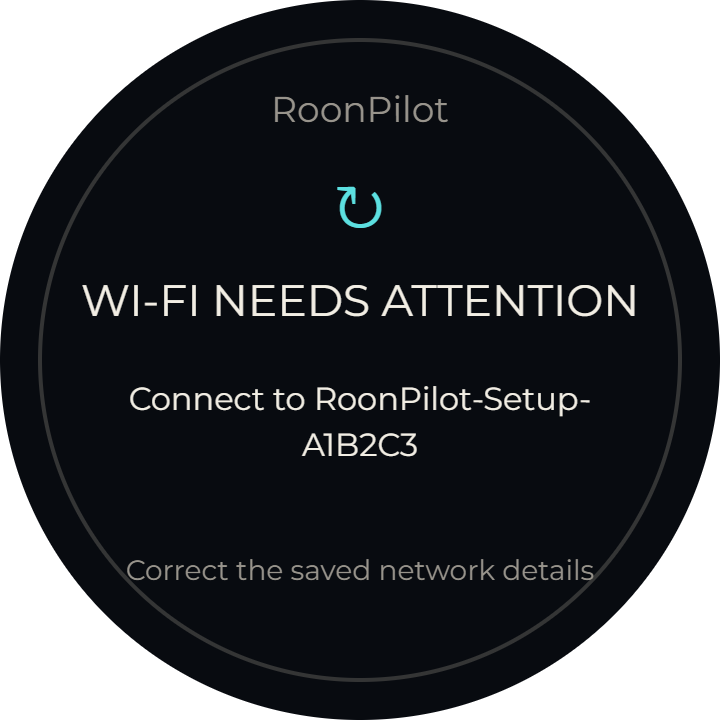 | Saved Wi-Fi needs attention; the recovery AP is available. |
| 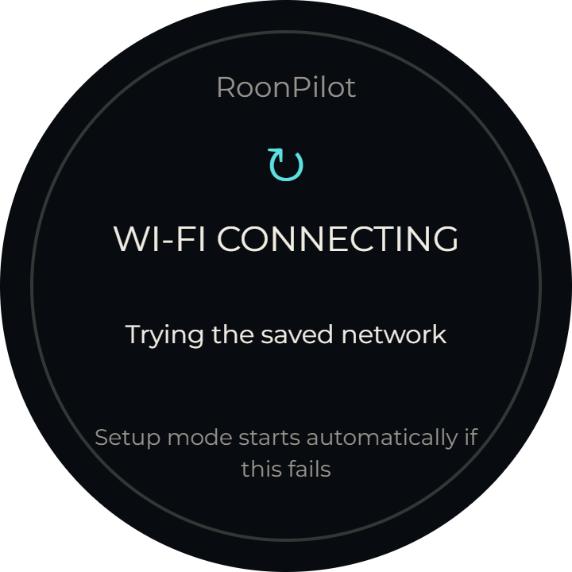 | Credentials were saved and RoonPilot is trying to join. |
| 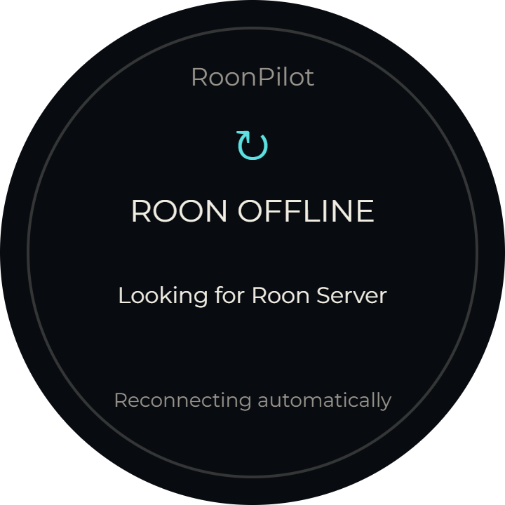 | Network is up but the chosen Roon Server is currently unreachable. |
|  | More than one server was discovered; choose the intended one. |
| 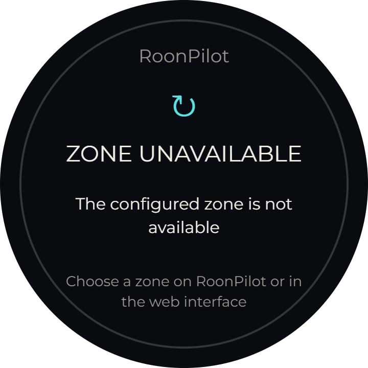 | The remembered zone no longer exists or is offline. |
| 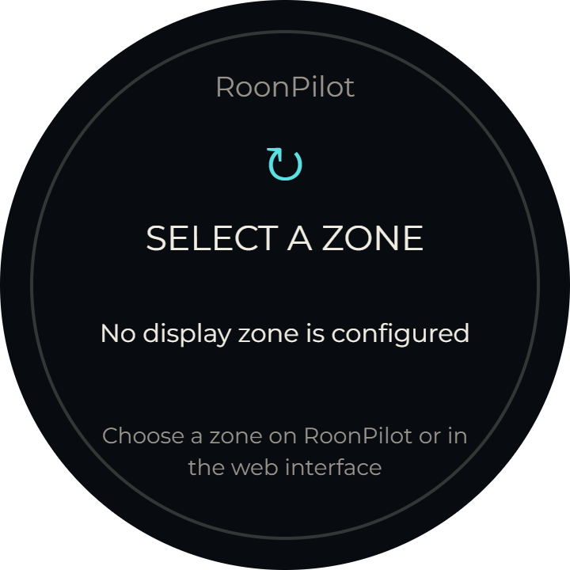 | Roon is authorized but no control zone has been selected. |

The Wi-Fi icon reports measured RSSI in coarse levels; it is not a decorative
always-full symbol.

## Clock screens

| Station | Digital |
| --- | --- |
|  |  |

The Station face has forward-running hands. Digital shows time and date. Both
use separate day/night brightness and scheduled switch times. Touch returns to
Now Playing.

## Quick Settings screens

| Home | System | Display |
| --- | --- | --- |
|  |  | 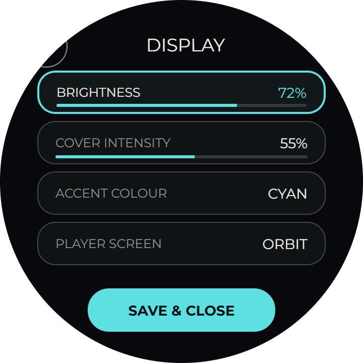 |

| Volume | Clock |
| --- | --- |
| 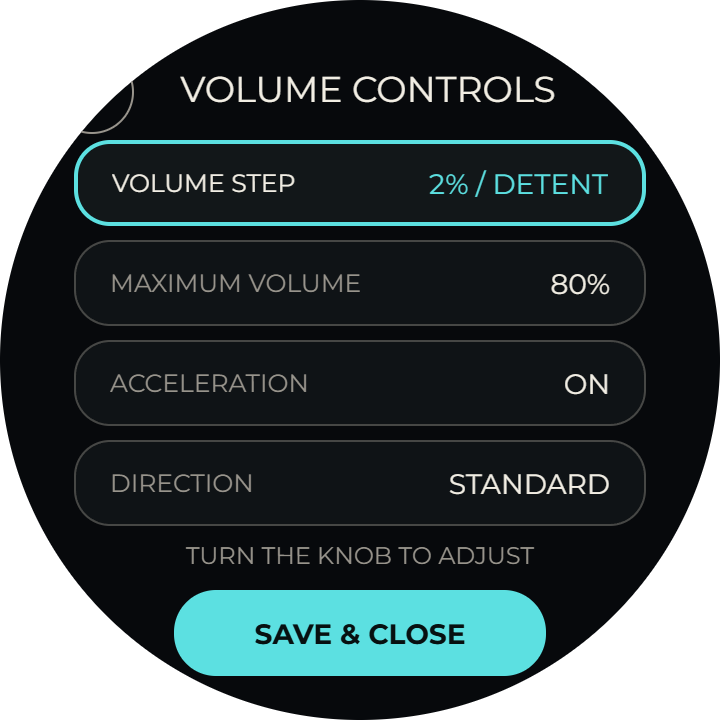 | 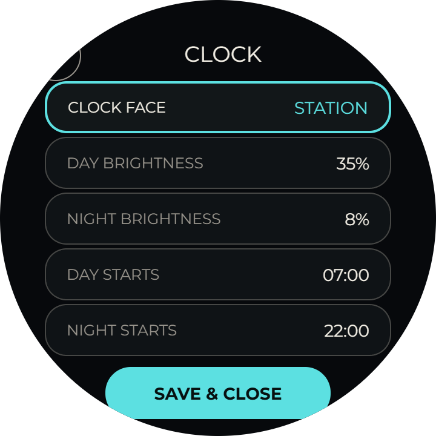 |

**System** is the first entry and displays the current device IP address, the
connected Roon Server and an overall connection state. It is deliberately
read-only and makes the local web address discoverable without consulting the
router. Use touch to open/select and the ring to choose or adjust. Save changed
settings explicitly.

## Battery-calibration screens

| Prepare | Running | Result |
| --- | --- | --- |
| 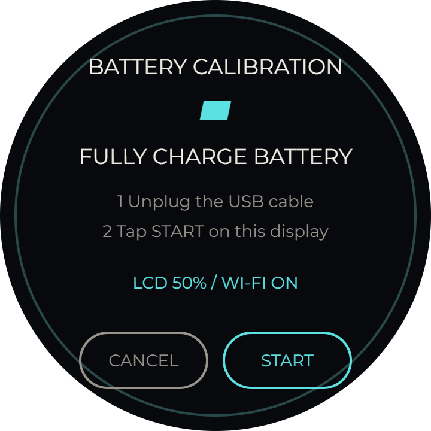 | 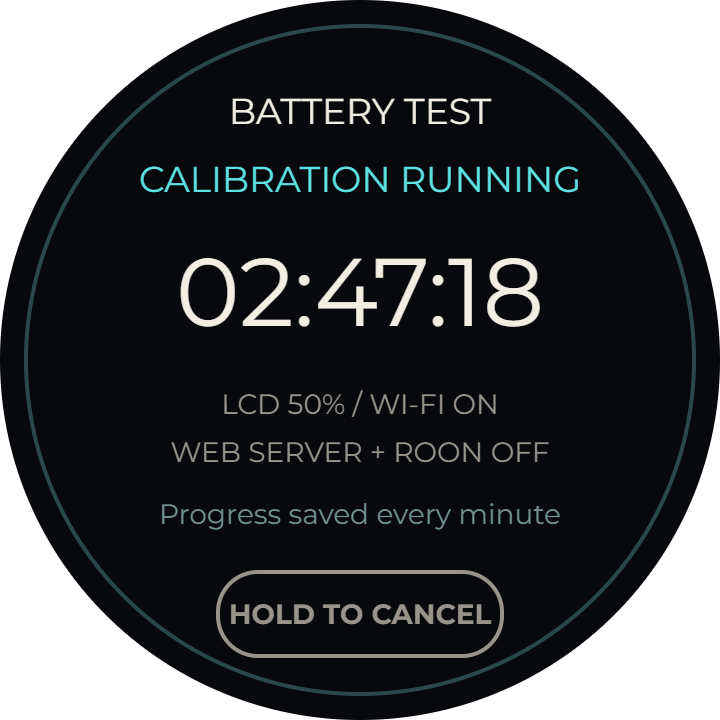 | 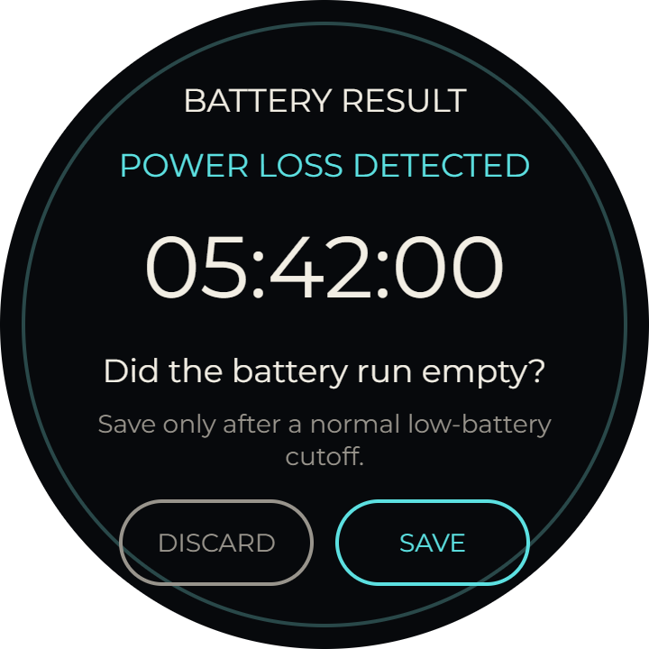 |

The heading is kept inside the circular safe area. During a run the calibration
owns the display and enforces its test profile. The next boot offers the recovered
runtime for explicit acceptance; it is not silently converted into a percentage.

## Lock feedback

| Locked | Unlocked |
| --- | --- |
|  | 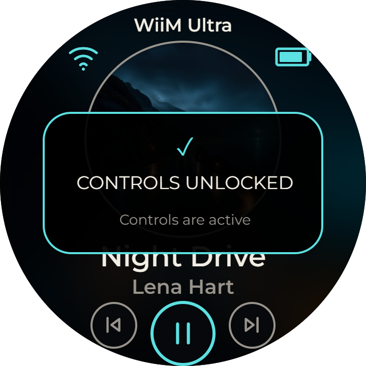 |

Any attempted operation while locked repeats the locked notice. Hold the centre
for about 1.2 seconds to change state.

## Boot and maintenance

| View | Meaning |
| --- | --- |
| 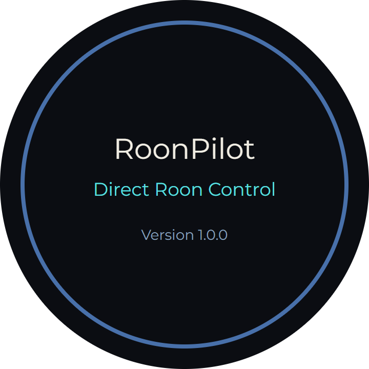 | Firmware is starting; the installed version is shown. |
| 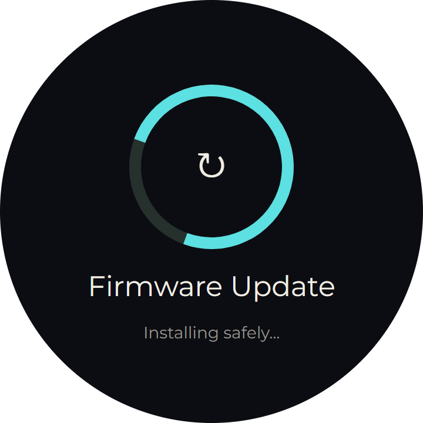 | An OTA image is being installed. Do not remove power. |
| 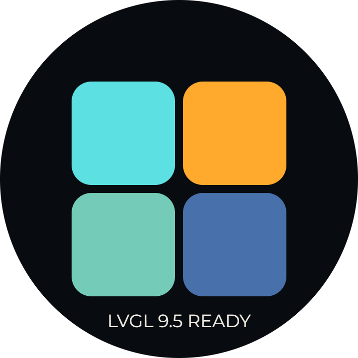 | Manufacturer-aligned display/ring test view used during hardware diagnosis. |
|  | Black idle mode. The first input wakes without issuing a command. |
