# Complete device-screen reference

**English** · [Deutsch](de/screen-reference.md)

The following images mirror the 360 × 360 LVGL layouts. Classic uses the
authoritative project reference; the remaining renders use fictional data.
Minor colour differences can occur between a browser image and the physical IPS
panel.

These examples use the English interface. Choosing German under **System →
Language** changes every firmware-owned label on the device and in Quick
Settings. Music metadata, Roon zone names, Bridge identities and names chosen
by the user remain unchanged.

## Player and listening screens

### Classic

The default balanced layout: zone at the top, circular cover, title, artist and
three transport buttons. Wi-Fi and, when battery hardware is enabled under
**Power**, the coarse battery symbol sit beside the artwork rather than against
the clipped upper edge. With the relevant settings enabled, Classic also shows
elapsed/total time, a fine progress arc exactly around the existing cover
outline, Playlist and Live Radio shortcuts plus the current zone's optional
Power/Mute controls. The cover itself does not become smaller.

### Focus

Emphasizes title and large transport controls. A progress bar and combined
elapsed/total time are shown near the lower edge.

### Orbit

Uses full-screen cover art, a fine outer progress ring and outlined transport
buttons. Text and controls remain inside the circular safe area.

### Aura

Uses only the softly reconstructed colours of the current artwork, without
showing the cover itself. Title, artist and transport remain calm and spacious;
an absolute native Roon volume value is shown prominently beneath the artist.
For an External IR Bridge route that value is deliberately hidden because the
external equipment does not report its absolute state.

### Optional large centre Play/Pause area

The dashed outline exists only in this explanation and is not drawn on the
device. When enabled under **Display & Controls**, the roughly artwork-sized
area toggles Play/Pause with a short tap in every player layout. Visible buttons
retain priority and a long hold still locks the controls. Centre double-tap
display-off is unavailable in this mode. The option is off by default.

### Volume

Appears while the ring is turned and starts from the zone's current value. The
text automatically follows Roon's native volume type: `number` is shown as a
dimensionless value without an invented percent sign, while `db` shows the
actual value such as `-40 dB`. Relative-only
`incremental` outputs can still be controlled but do not provide an absolute
value. The arc represents the pending level only when Roon supplies usable
minimum and maximum bounds; RoonPilot does not fabricate a dB range.

For an External IR Bridge route, the player remains visible and a compact amber
overlay counts accepted relative actions from zero. `+4` means four upward
steps in this adjustment; it is not an absolute hardware volume.

### Zone picker

Shows the enabled Roon zones. The accent outline/check identifies the current
selection; an activity mark distinguishes a playing room.

### Roon group mixer

| Complete group | One physical output |
| --- | --- |
|  |  |

When the selected Roon zone is a group, the first ring detent opens this mixer
without changing volume. Further turning controls the whole group. Each visible
row retains its real feedback model: dimensionless number, dB, relative Roon
steps, IR steps or `OFFLINE`. Tap one of the large rows to control only that
physical output; tap the group heading to return to the complete group. The
overlay closes after eight seconds without input. It can show three individually
selectable rows, while whole-group control still processes all eligible outputs.
See [Roon groups and the on-device group mixer](roon-groups.md) for routing,
several Bridges and failure handling.

## Connection and selection screens

| View | Meaning |
| --- | --- |
| 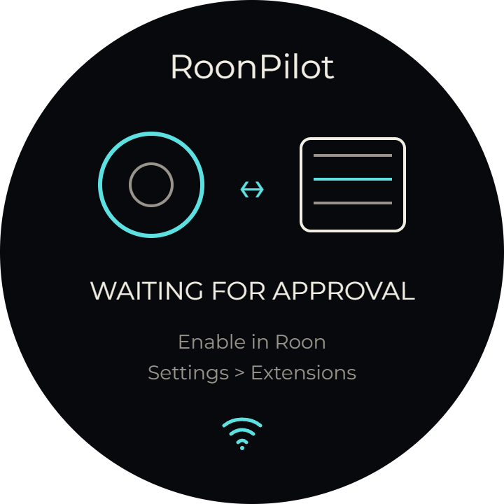 | Wi-Fi and discovery work; approve RoonPilot in **Roon → Settings → Extensions**. |
| 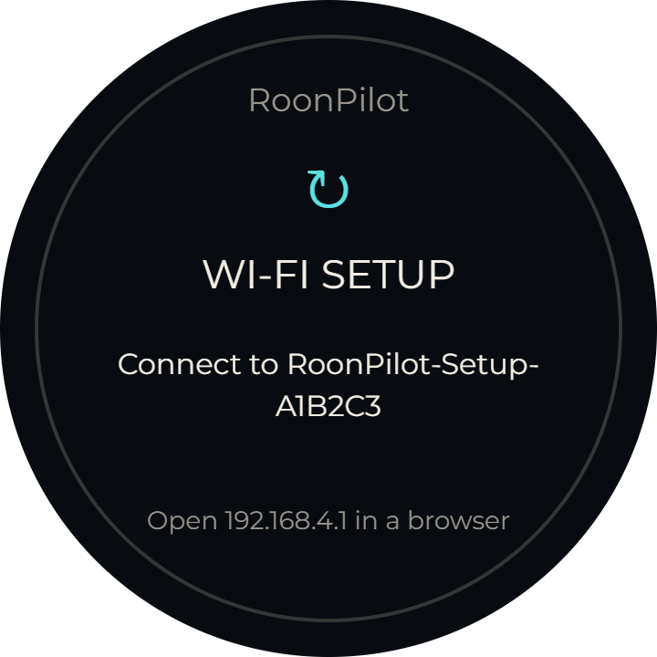 | No saved Wi-Fi; join the protected setup AP. |
| 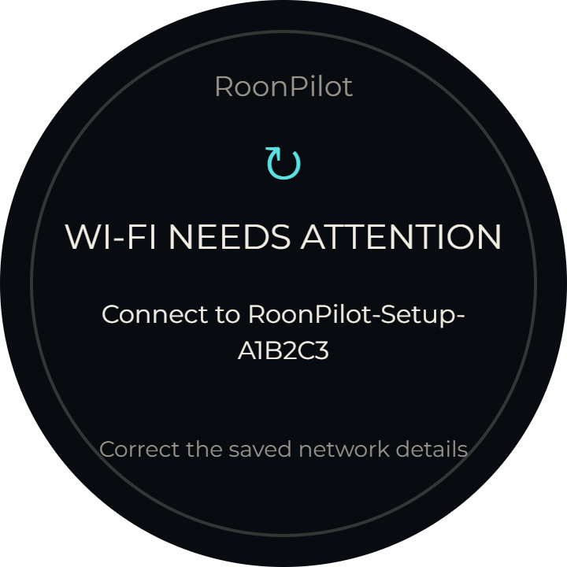 | Saved Wi-Fi needs attention; the recovery AP is available. |
| 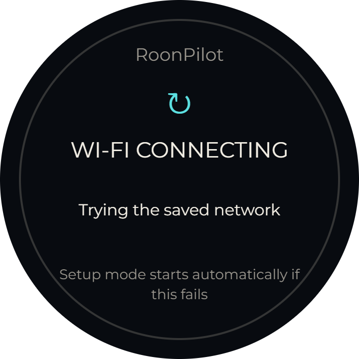 | Credentials were saved and RoonPilot is trying to join. |
| 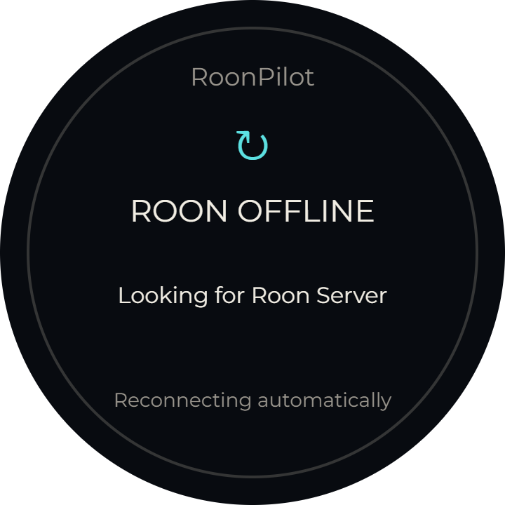 | Network is up but the chosen Roon Server is currently unreachable. |
| 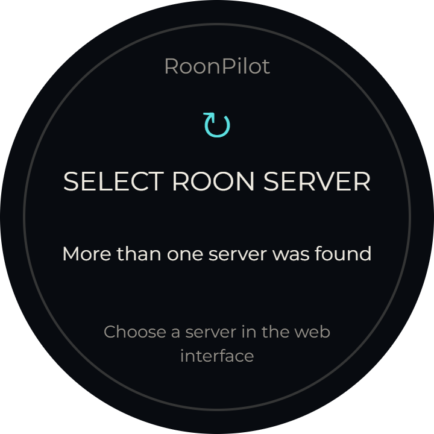 | More than one server was discovered; choose the intended one. |
| 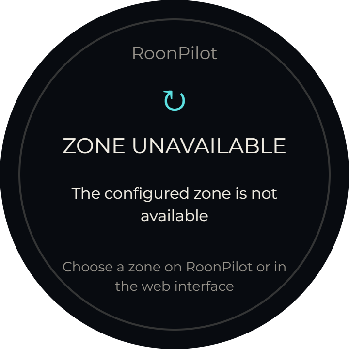 | A transient notice when the remembered zone is missing or offline; RoonPilot opens the picker automatically as soon as another enabled zone is available. |
| 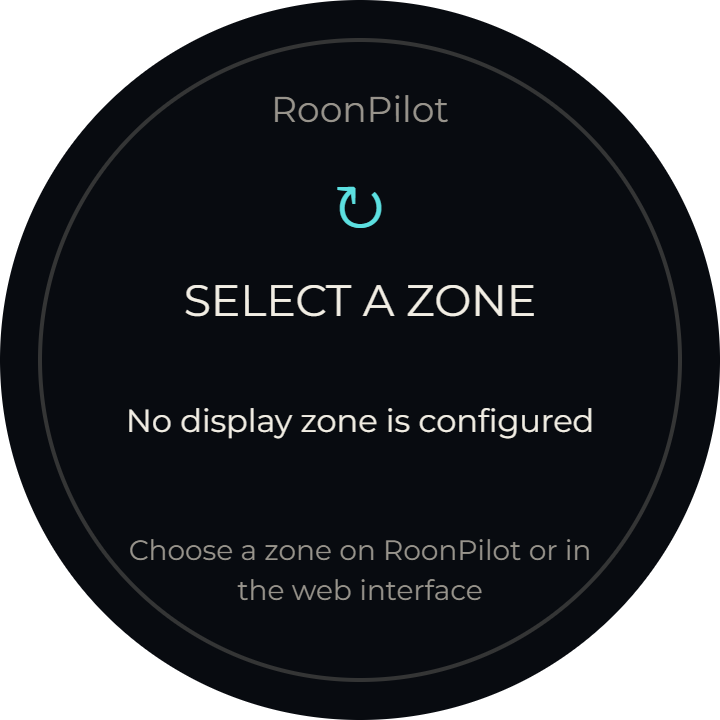 | Roon is authorized but no control zone has been selected. |

The Wi-Fi icon reports measured RSSI in coarse levels; it is not a decorative
always-full symbol.

## Clock screens

| Station | Digital |
| --- | --- |
|  |  |

The Station face has forward-running hands. Digital shows time and date. Both
use separate day/night brightness and scheduled switch times. Touch returns to
Now Playing.

## Quick Settings screens

| Home | System | Display |
| --- | --- | --- |
|  |  | 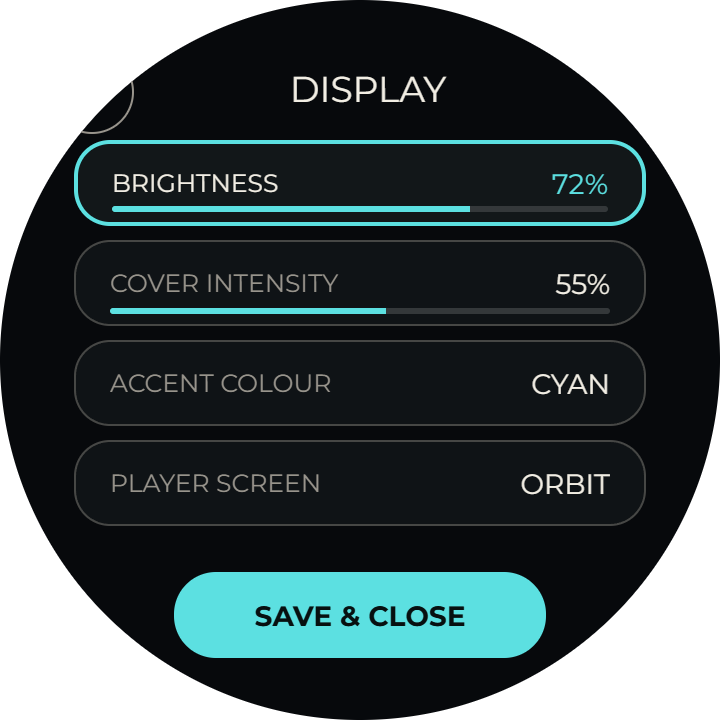 |

| Volume | Clock | IR Bridges |
| --- | --- | --- |
| 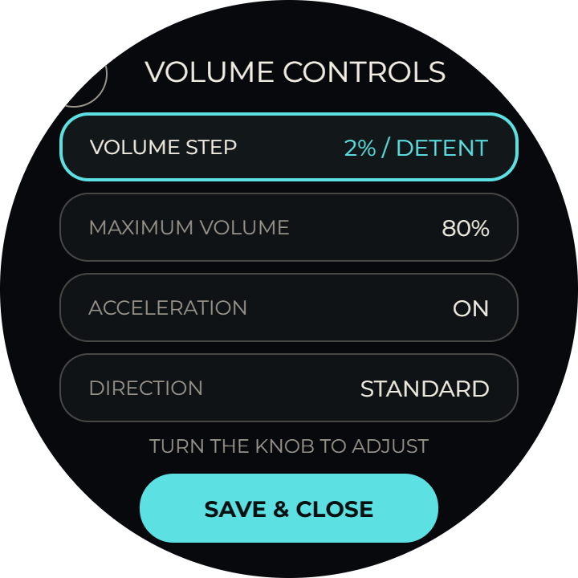 | 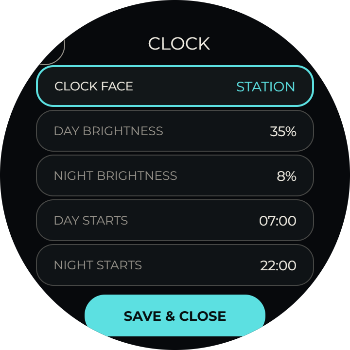 |  |

**System** is the first entry and displays the current device IP address, the
connected Roon Server and an overall connection state. It is deliberately
read-only and makes the local web address discoverable without consulting the
router. **IR Bridges** appears when the optional feature is enabled and shows
the Bridges required by the selected zone or Roon group, including transport,
Wi-Fi state and signal. Use touch to open/select and the ring to choose or
adjust. Save changed settings explicitly. The menu closes after 30 seconds
without input.

## Roon library screens

| Playlists | Live Radio |
| --- | --- |
|  |  |

Playlist names occupy at most two complete lines. Turn the ring or swipe to
change pages and touch a row to select it. A playlist then asks Normal or
Shuffle; Live Radio starts without that question. Empty final-page placeholders
and disabled-looking navigation tiles are not displayed.
Both screens follow the order saved on the Music web page. Playlists can be
ordered by Name, Track count or Roon-delivered Modified order, and Live Radio by
Name, in either ascending or descending direction.

## Battery-calibration screens

These screens and the calibration card on the Power page are available only
when **Installed battery** is set to **Installed**, or Automatic has positively
confirmed a battery. **Not installed** removes the complete calibration path.

| Prepare | Running | Result |
| --- | --- | --- |
| 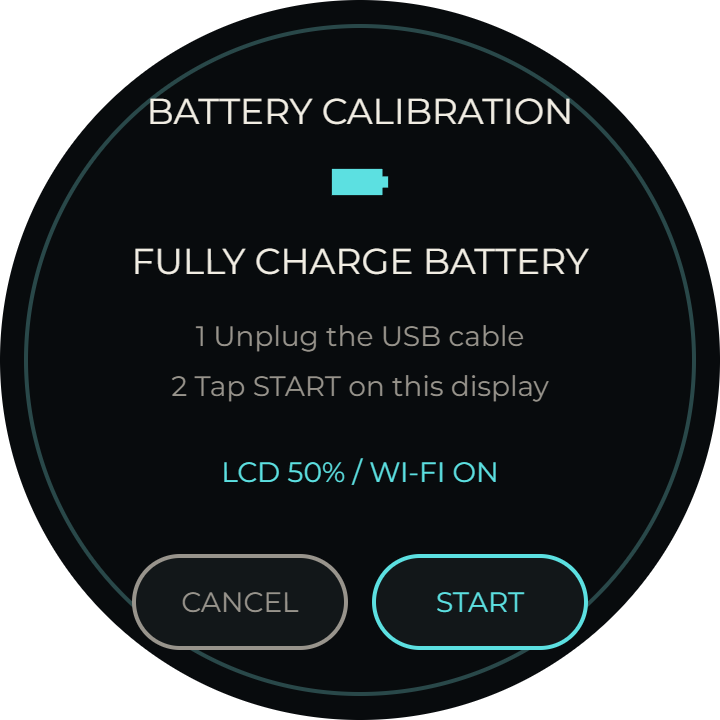 | 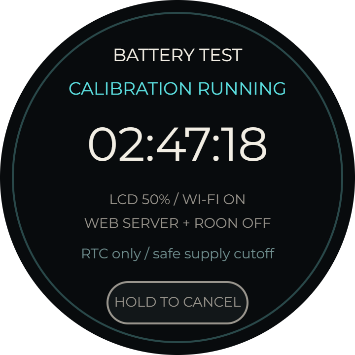 | 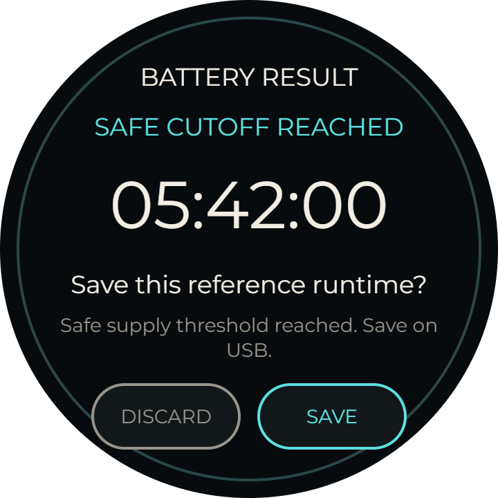 |

The heading is kept inside the circular safe area. During a run, calibration
owns the display and enforces 50% brightness and a 240 MHz CPU. Elapsed time is
recorded every second in retained RTC memory, not every minute in flash. The
run ends at the low-voltage protective stop.

After stable USB power is reconnected, the display may remain black for about
33 seconds before restart. Only a completed run with a valid retained record
and at least five minutes of runtime can be saved. Save is disabled for an
interrupted run; discarding it preserves the previous reference. No result is
accepted automatically or converted into a battery percentage.
See [Battery and runtime](battery-and-runtime.md).

An interrupted run instead shows **TEST INTERRUPTED** with **SAVE** disabled,
even when the recorded duration exceeds five minutes:

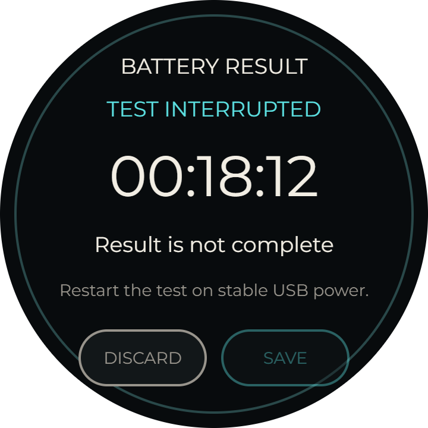

## Lock feedback

| Locked | Unlocked |
| --- | --- |
|  | 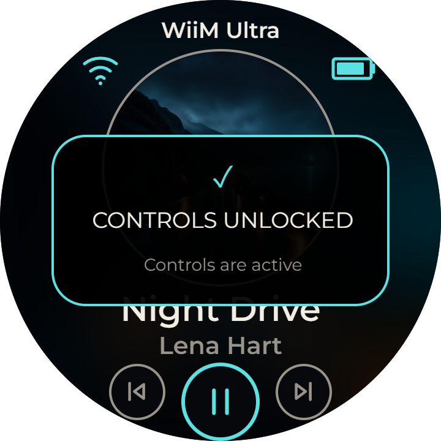 |

Any attempted operation while locked repeats the locked notice. Hold the centre
for about 1.2 seconds to change state.

## Boot and maintenance

When an approved newer release has been found, **UPDATE AVAILABLE** shows the
installed and available versions. It appears only over an idle Now Playing
screen and at most once per 24 hours. **LATER** dismisses it; turning the ring
dismisses it and continues with volume control. The notice never installs an
update. Use the web interface under **System → Firmware update** when ready.

| View | Meaning |
| --- | --- |
| 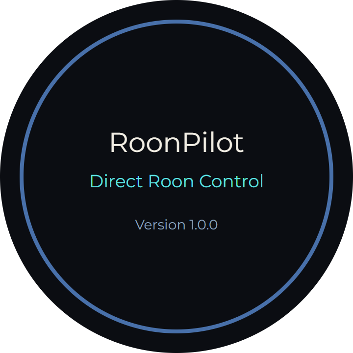 | Firmware is starting; the installed version is shown. |
| 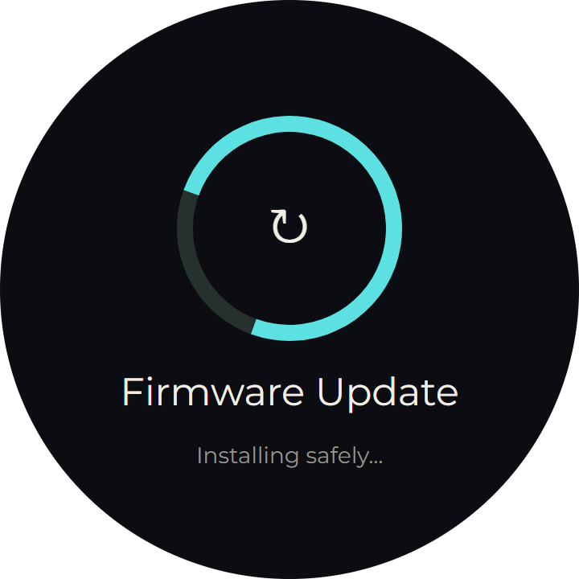 | An OTA image is being installed. Do not remove power. |
|  | Manufacturer-aligned display/ring test view used during hardware diagnosis. |
|  | Black idle mode. The first input wakes without issuing a command. |
