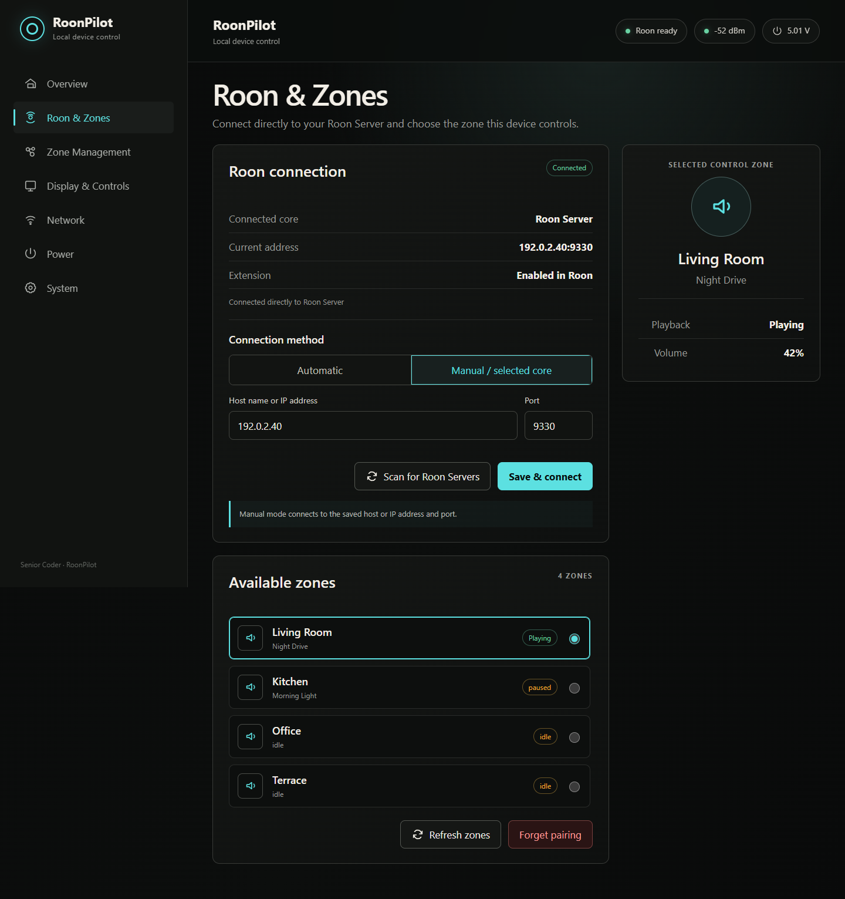
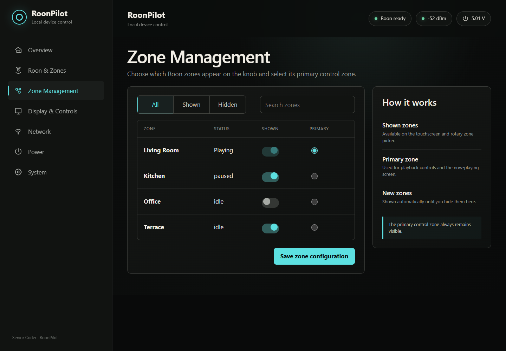
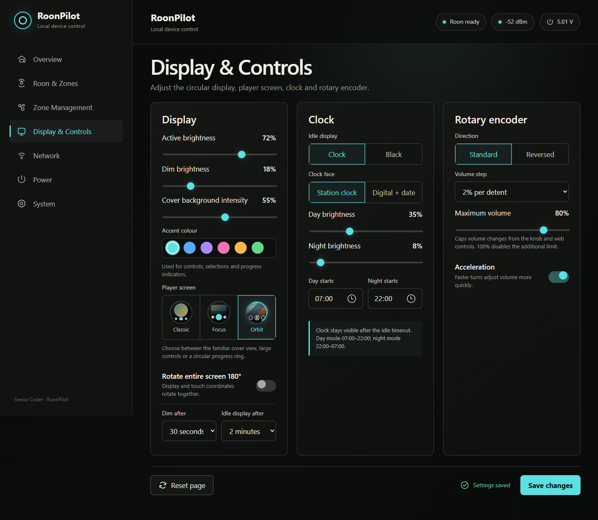
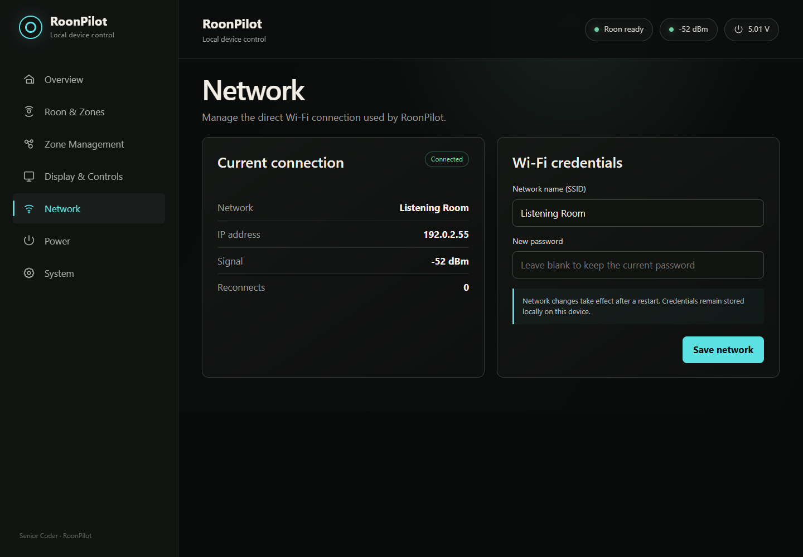
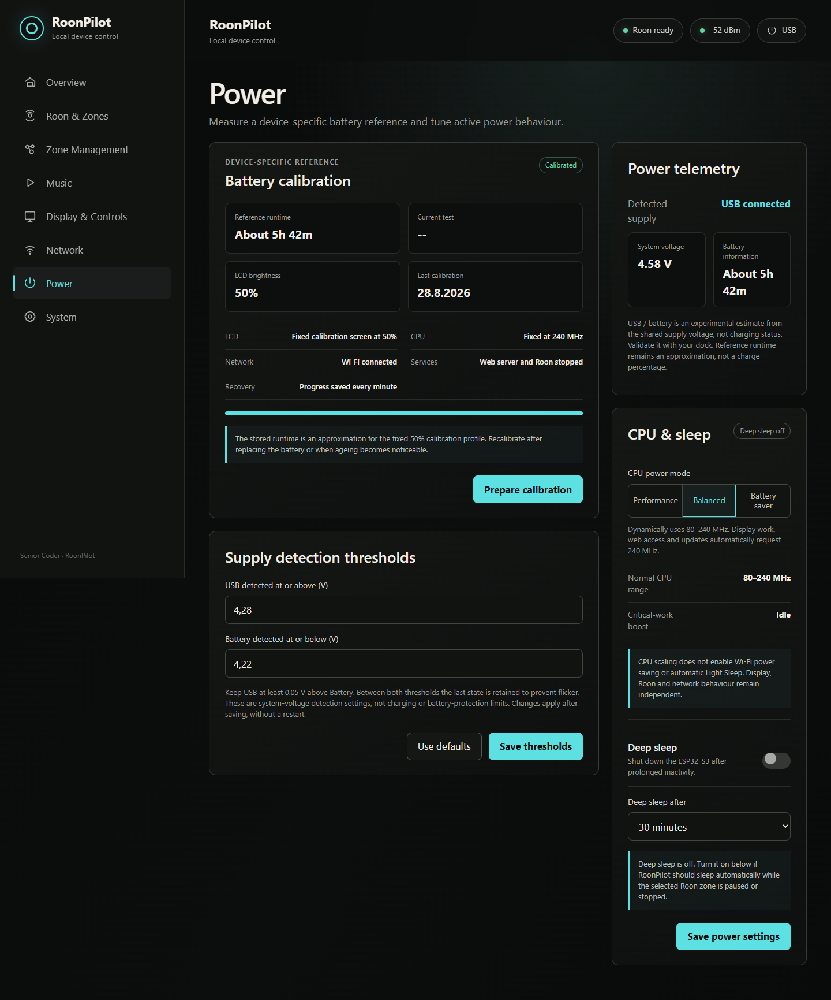
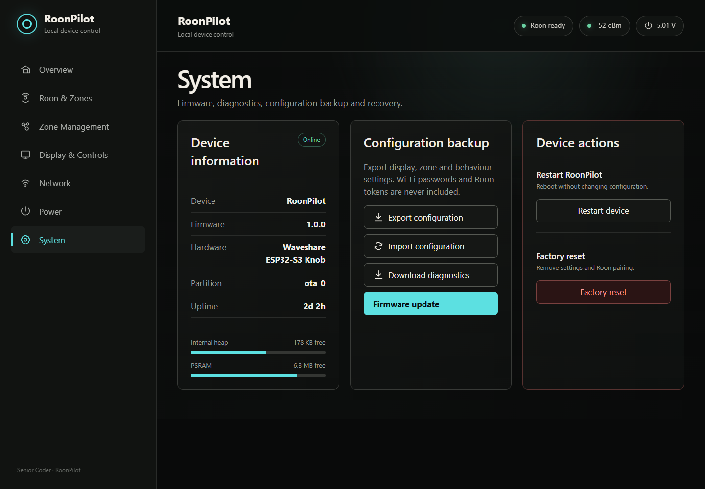
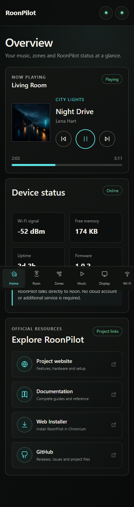
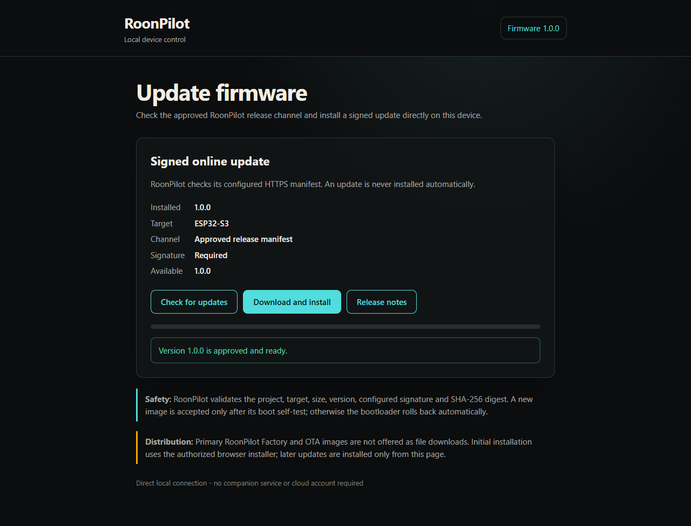

# Complete web-interface reference

**English** · [Deutsch](de/web-interface.md)

The English web interface is served directly from RoonPilot on the local Wi-Fi
network. It uses no Internet cloud after page assets have loaded from the device.
Desktop cards become a compact bottom-navigation layout on phones.

## Opening it

Enter the device's local IP address in a browser, for example
`http://192.0.2.40` in the fictional screenshots. Your real address will be
different. The `192.0.2.0/24` range in this documentation is reserved for
examples and is not a value embedded in the public firmware.

The page shell appears first; current settings and status then arrive from the
device API. Settings load once at startup and after changes, while the smaller
status/summary endpoints refresh periodically. This avoids the slow repeated
full-configuration requests used by earlier versions.

When a newer approved release is known, an amber **Update available** notice is
shown in the status bar on every page. It includes the available version and
opens **System → Firmware update** directly. The notice is informational only;
it never starts an installation.

## Overview

- current zone, cover, title, artist and play state;
- previous, play/pause and next test controls;
- selected-zone volume, capped by Maximum volume;
- Wi-Fi RSSI, free memory, uptime and firmware version;
- direct Roon and Wi-Fi status in the header.

This page is useful for confirming the connection but is not intended to replace
Roon's full browsing interface.

## Roon & Zones

- connected server name/address and extension approval;
- Automatic discovery or Manual/selected server mode;
- manual host/IP and port (normally 9330);
- discovery scan and explicit candidate selection when several servers exist;
- available zones and primary control-zone selection;
- refresh and **Forget pairing** actions.

Forgetting pairing does not remove Wi-Fi or display settings, but RoonPilot must
be enabled again in **Roon → Settings → Extensions**.

## Zone Management

Filter All/Shown/Hidden, search by name, decide which zones appear on the device
and choose the primary zone. Switch changes remain a draft until **Save zone
configuration** is pressed; a periodic status refresh does not reset that draft.
The primary zone is always kept shown, and new Roon zones start shown by default.

## Display & Controls

### Display card

- Active brightness;
- Dim brightness;
- Cover background intensity;
- accent colour palette;
- visual Classic/Focus/Orbit player selector;
- entire display/touch rotation by 180 degrees;
- Dim after, including Never;
- Idle display after, including Never.

### Clock card

- Clock or Black as idle display;
- Station or Digital + date face;
- independent day and night brightness;
- exact Day starts and Night starts times.

When Clock is selected, the clock remains visible after the idle delay and uses
its own schedule; it is not followed by an unrelated black-screen timeout.

### Rotary card

- Standard/Reversed direction;
- 1, 2, 3, 5 or 10% volume step;
- Maximum volume in 5% increments;
- acceleration on/off.

**Reset page** restores the unsaved form values. **Save changes** persists them
to the device. Text links and buttons use deliberate button styling without
browser-default underlines.

## Network

Shows SSID, local address, real RSSI and reconnect count. To change networks,
enter the new SSID and password and save. Leaving the password blank retains the
existing password when the SSID is unchanged. Network changes take effect after
a restart.

If the new details fail, the protected recovery AP starts after approximately
45 seconds. Use its minimal setup page to correct them.

## Power

Prepares, tracks and accepts/discards the device-specific battery runtime test.
It reports the measured system rail honestly and explains that it cannot derive
a precise cell percentage.

The Power policy card enables deep sleep and selects its idle timeout. Its live
badge reads Disabled, Waiting or Armed. Sleep is armed only for an available
selected zone that reports paused/stopped; Wi-Fi setup, firmware operations and
battery calibration block it. Touch or ring movement wakes into a normal reboot,
so Wi-Fi, Roon and this page need a moment to return.

Read [Battery and runtime](battery-and-runtime.md) before starting a run and
[Deep sleep](deep-sleep.md) before validating the power policy.

## System

- installed firmware, active partition, uptime, internal heap and PSRAM;
- installed and available firmware versions plus the last successful/attempted
  manifest check;
- separate switches for automatic online checks and the once-daily device
  notice;
- **Check now** and a direct jump to the signed firmware-update page;
- safe JSON configuration export/import;
- downloadable diagnostics;
- restart without changing settings;
- typed-confirmation factory reset.

Automatic checking reads only the approved signed-release manifest after boot
and then daily. A failed automatic check retries later. Checking never installs
firmware. Installation always requires an explicit action on the separate
firmware-update page.

Factory reset removes local settings, Wi-Fi and Roon pairing, then returns to
first-time AP setup. It does not restore Waveshare's original firmware.

## Mobile layout

Cards become one column and the seven primary pages move into a horizontally
scrollable bottom navigation. Controls retain useful touch sizes instead of
being stretched across the full desktop width.

## Minimal Wi-Fi setup page

Served only in setup/recovery AP mode. It has no Roon, update, reset, import or
diagnostic functions. This reduces both confusion and the exposed surface before
the device joins the trusted local network.

## Signed firmware update page

Used by an existing RoonPilot to check and install an approved signed online
update. It checks metadata and integrity, writes the inactive A/B slot, reboots,
validates startup and can roll back if the new application does not become
healthy. Manual firmware upload is intentionally unavailable. Keep power
connected.

## USB Web Installer

This is a separate authorized HTTPS page, not a page served by the device. It
explains the unusual two-processor hardware, requires confirmation of backups,
processor and personal-use binary licence, and writes the complete Factory
image to the main ESP32-S3 only. The primary image is not offered as a download.
