# Complete web-interface reference

**English** · [Deutsch](de/web-interface.md)

The English/German web interface is served directly from RoonPilot on the local
Wi-Fi network. It uses no Internet cloud after page assets have loaded from the
device. Desktop cards become a compact bottom-navigation layout on phones.

## Opening it

Enter the device's local IP address in a browser, for example
`http://192.0.2.40` in the fictional screenshots. Your real address will be
different. The `192.0.2.0/24` range in this documentation is reserved for
examples and is not a value embedded in the public firmware.

The page shell appears first; current settings and status then arrive from the
device API. Settings load once at startup and after changes, while the smaller
status/summary endpoints refresh periodically. This avoids the slow repeated
full-configuration requests used by earlier versions.

When a newer approved release is known, an amber **Update available** notice is
shown in the status bar on every page. It includes the available version and
opens **System → Firmware update** directly. The notice is informational only;
it never starts an installation.

## Overview

- current zone, cover, title, artist and play state;
- previous, play/pause and next test controls;
- elapsed/total time and a track-progress indicator instead of a web volume
  slider, so the page remains truthful for absolute, dB and IR-only zones;
- Wi-Fi RSSI, free memory, uptime and firmware version;
- direct Roon and Wi-Fi status in the header;
- compact links to the project page, documentation, troubleshooting, GitHub and
  the authorized Factory installer.

This page is useful for confirming the connection but is not intended to replace
Roon's full browsing interface.

## Roon & Zones

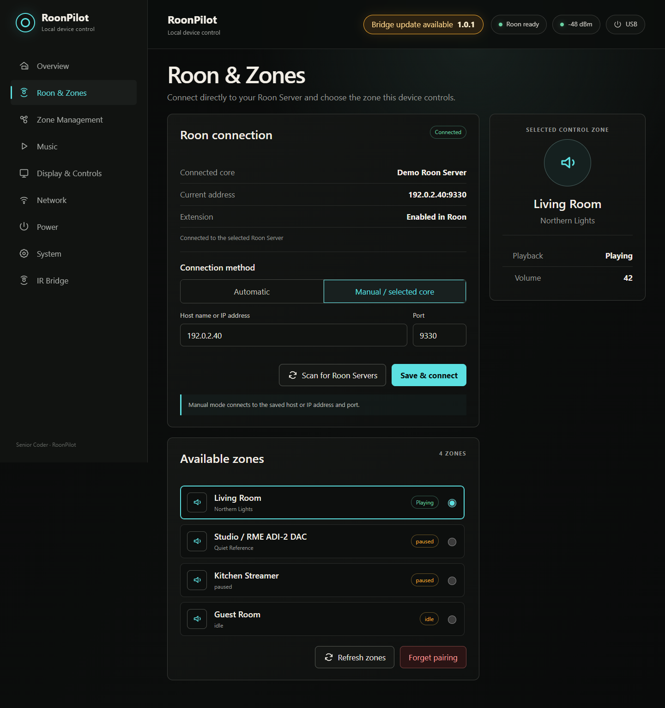

- connected server name/address and extension approval;
- Automatic discovery or Manual/selected server mode;
- manual host/IP and port (normally 9330);
- discovery scan and explicit candidate selection when several servers exist;
- available zones and primary control-zone selection;
- refresh and **Forget pairing** actions.

Forgetting pairing does not remove Wi-Fi or display settings, but RoonPilot must
be enabled again in **Roon → Settings → Extensions**.

## Zone Management

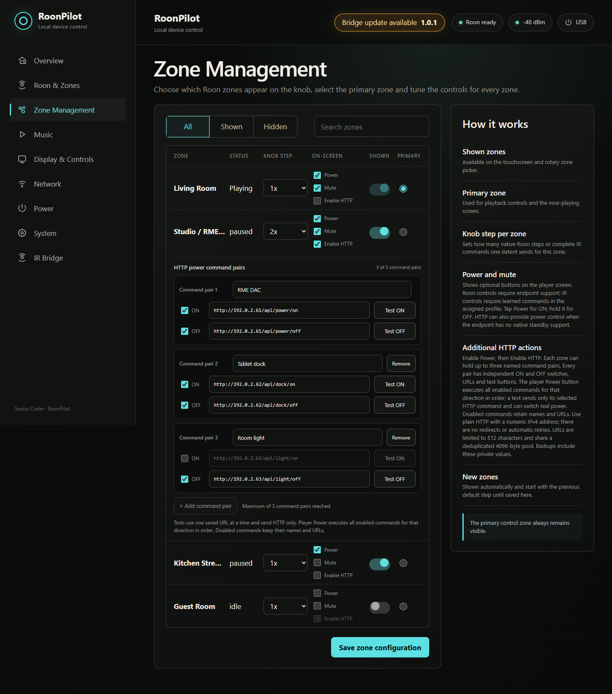

Filter All/Shown/Hidden, search by name, decide which zones appear on the device
and choose the primary zone. Switch changes remain a draft until **Save zone
configuration** is pressed; a periodic status refresh does not reset that draft.
The primary zone is always kept shown, and new Roon zones start shown by default.

The unified Bridge-capable firmware also keeps the settings that genuinely
belong to a zone here:

- native Roon/endpoint, External IR Bridge or deliberately Disabled volume path;
- saved Bridge and IR profile for an external path;
- independent encoder-step multiplier for every zone;
- optional Power and Mute display buttons;
- **Enable HTTP**, available only when Power is enabled;
- up to three named HTTP action pairs, each with separate retained URL and
  enable switch for ON and OFF;
- a Test button beside each HTTP request. Testing sends a real request and must
  therefore be used only when the target action is safe.

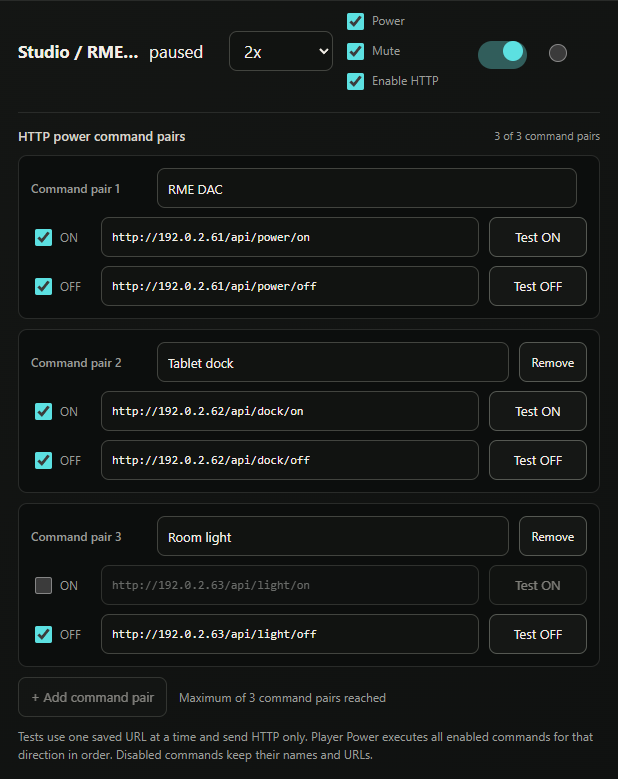

An unchecked action keeps its label and URL; it merely stops being sent. HTTP
actions are local-network requests and do not replace IR or native Roon power.
When a zone's Power button is used, all enabled actions configured for that
direction are executed in addition to the selected native/IR power path.

## Music

The optional Playlist and Live Radio buttons on the player can also be managed
from this page. RoonPilot requests the lists from the connected Roon Server only
when needed and pages the results to keep RAM and response times bounded.

<table>
  <tr>
    <td>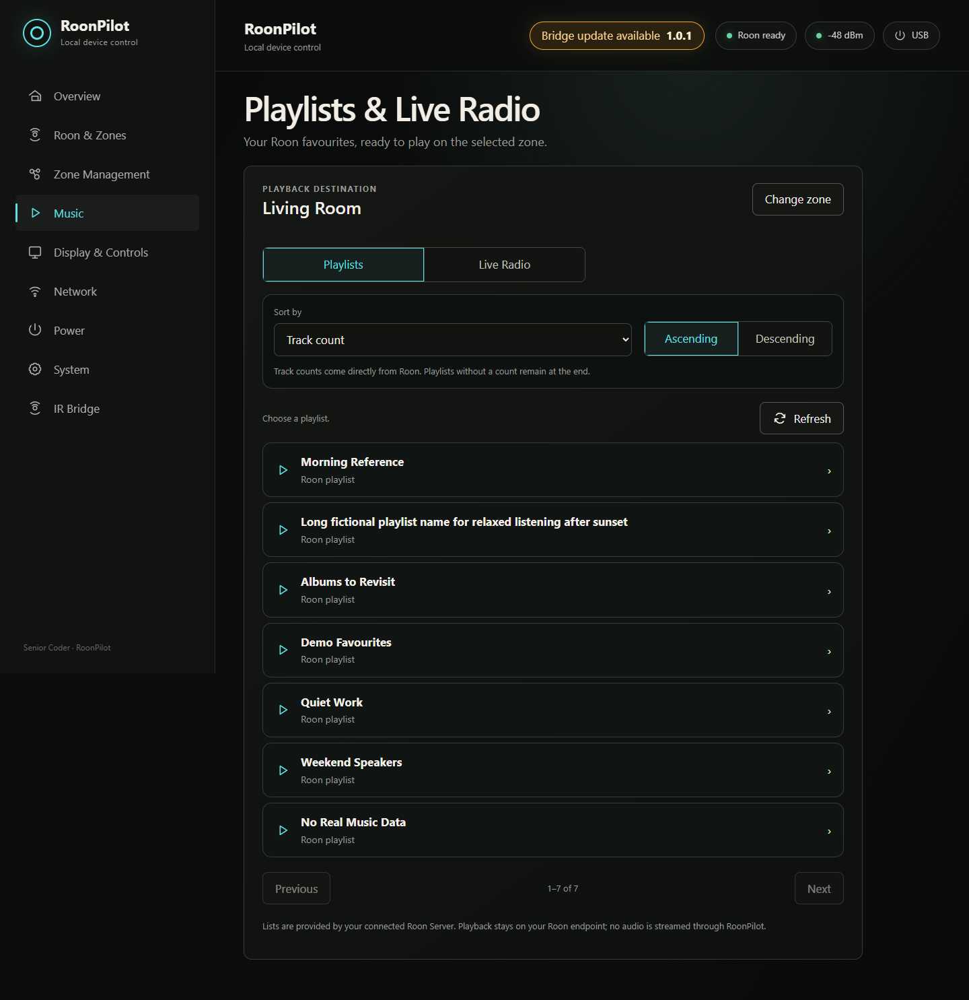</td>
    <td>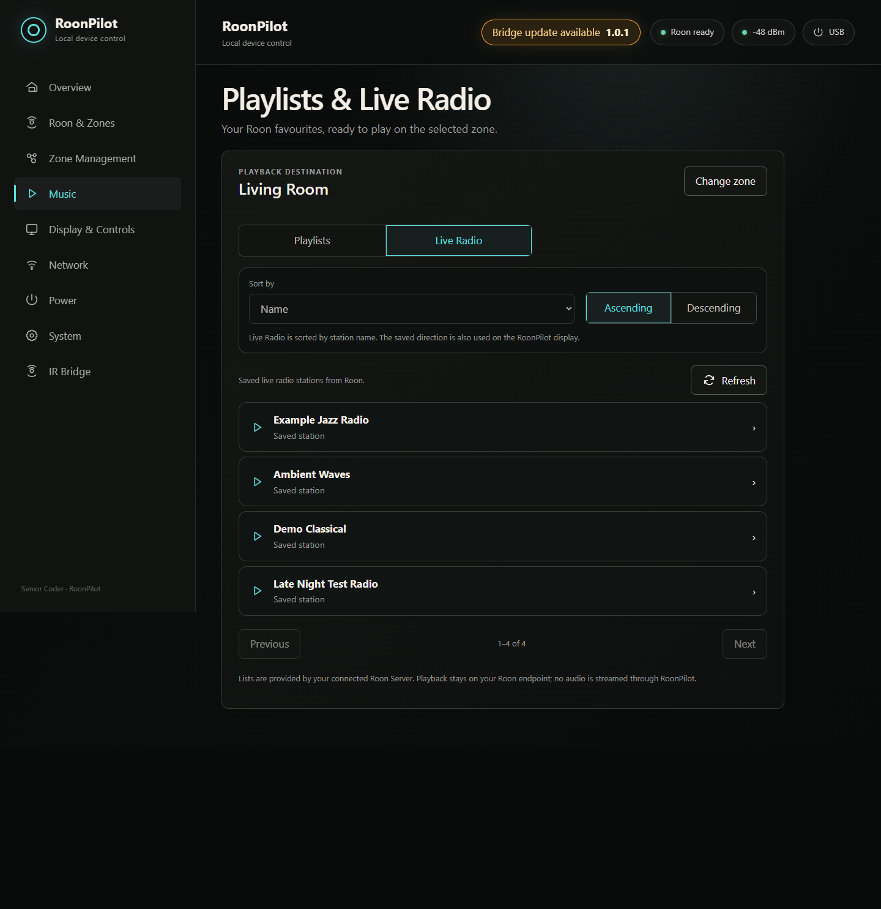</td>
  </tr>
</table>

Starting a playlist opens a final Normal/Shuffle confirmation. Starting a
station has no shuffle question. A request can take longer when Roon is busy;
the page remains available, shows progress and reports a timeout without
blocking the display or restarting the device. These are playback actions and
will replace the selected zone's current queue or station.

The saved order applies to both the web page and the lists on the device.
Playlists can be sorted ascending or descending by **Name**, **Track count** or
**Modified**. Roon's public browse interface supplies neither a dependable date
value nor total playlist duration here, so Modified means Roon's delivered order
(descending) or its reverse (ascending), while **Length** remains visible but
disabled. Live Radio can be ordered by **Name** in either direction. RoonPilot
stores only the criterion and direction, not a second copy of either list.

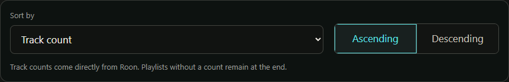

## Display & Controls

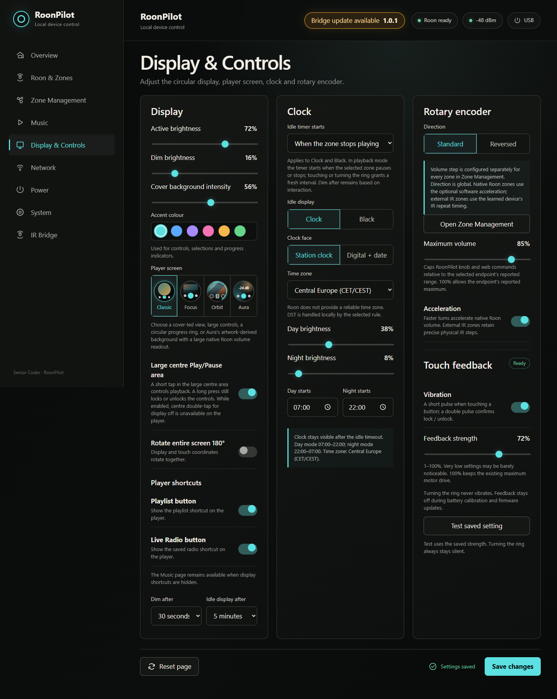

### Display card

- Active brightness;
- Dim brightness;
- Cover background intensity;
- accent colour palette;
- visual Classic/Focus/Orbit/Aura player selector;
- optional large centre Play/Pause touch area;
- entire display/touch rotation by 180 degrees;
- Dim after, including Never;
- Idle display after, including Never.

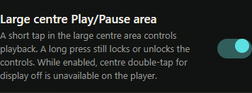

The large area is off by default. When enabled, a short tap inside the
194-pixel centre area toggles playback in every player layout. Visible buttons
retain priority and a long hold still locks or unlocks the controls. Centre
double-tap display-off is deliberately disabled in this mode so two playback
commands cannot be reinterpreted as a display gesture.

### Clock card

- Clock or Black as idle display;
- Station or Digital + date face;
- explicit regional time zone, because Roon does not provide a reliable one;
- automatic daylight-saving changes for the selected regional rule;
- independent day and night brightness;
- exact Day starts and Night starts times.

When Clock is selected, the clock remains visible after the idle delay and uses
its own schedule; it is not followed by an unrelated black-screen timeout.

### Rotary card

- Standard/Reversed direction;
- 1, 2, 3, 5 or 10 native Roon steps per detent;
- Maximum volume where Roon supplies a usable minimum/maximum range;
- acceleration on/off.

The unit is detected automatically from Roon. A `number` output is shown as the
dimensionless Roon value without an invented percent sign, a `db` output uses
the actual reported dB value, and an
`incremental` output receives relative commands. The selected step is a
multiplier of the endpoint's native step, not always a percentage: setting `2`
means 2 dB per detent when the output reports a 1 dB step.

An absolute volume slider and the local maximum limit require known bounds.
Older `number` outputs may use the conventional 0-100 fallback. If a dB output
does not report minimum and maximum, its correct dB text and ring control remain
available, but the web slider is disabled and RoonPilot does not invent a
potentially misleading range.

**Reset page** restores the unsaved form values. **Save changes** persists them
to the device. Text links and buttons use deliberate button styling without
browser-default underlines.

### Touch feedback card

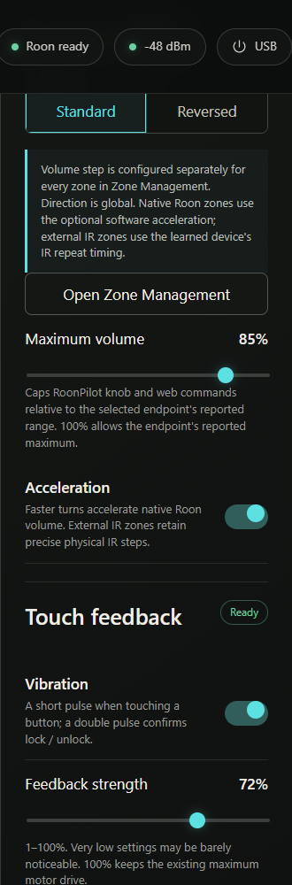

The vibration motor can be disabled or adjusted continuously from 0 to 100%.
It acknowledges touch actions and gives a distinct lock/unlock pattern. Turning
the already tactile ring never vibrates. The same strength is available in the
on-device **Quick Settings → Display** menu.

## Network

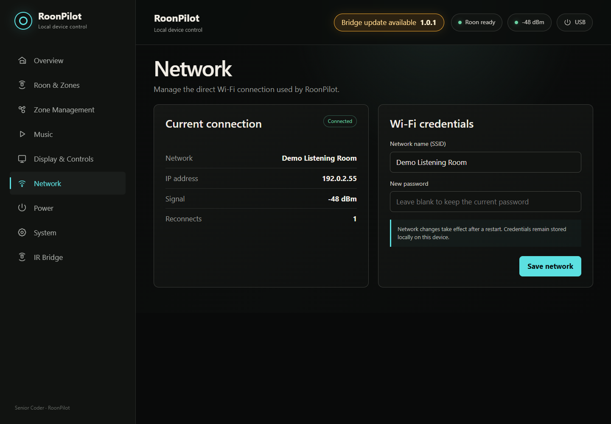

Shows SSID, local address, real RSSI and reconnect count. To change networks,
enter the new SSID and password and save. Leaving the password blank retains the
existing password when the SSID is unchanged. Network changes take effect after
a restart.

If the new details fail, the protected recovery AP starts after approximately
45 seconds. Use its minimal setup page to correct them.

## Power

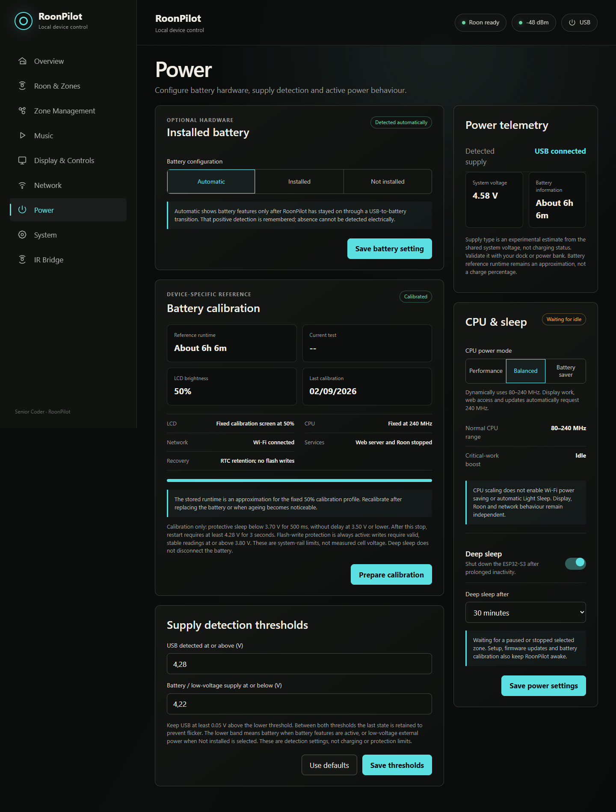

The **Installed battery** card accounts for Waveshare variants with and without
an internal battery. The board has no dedicated battery-present signal, so a
single system-voltage value cannot prove that a battery is fitted. The three
choices are:

- **Automatic:** hides battery-specific UI until the running device has first
  recognised USB power and then continues operating in the lower voltage band
  after USB is removed. This uninterrupted transition is positive evidence of
  a battery and is remembered locally.
- **Installed:** always enables the battery symbol, battery information and
  calibration.
- **Not installed:** hides the battery symbol, battery information and the
  entire calibration card.

Automatic can confirm a battery but deliberately cannot prove its absence; a
low-voltage USB source can resemble battery operation. Select **Not installed**
for a battery-free unit. CPU modes, supply thresholds, display timers and Deep
Sleep remain available in every mode, including for an external power bank.

When battery functions are available, this page prepares, tracks and
accepts/discards the device-specific runtime test. It reports the measured
system rail honestly and explains that it cannot derive a precise cell
percentage. Two configurable, hysteresis-protected thresholds classify the
rail as battery or low-voltage external supply, USB, or unknown. A lightning
symbol identifies external power; it is not a promise that the battery is
actually charging.

Calibration records elapsed time every second in retained RTC memory, without
minute-by-minute flash writes. During the run, the web server, Roon client and
ordinary Deep Sleep are disabled; the independent low-voltage guard stays
active. The run ends at the protective supply stop, not at the battery's
hardware cutoff.

Preparation and **Save result** require **4.28 V system voltage for three
seconds**. Only a completed protective-stop run with a valid retained record
and a duration of at least five minutes can be saved. An interrupted result
can only be discarded; the previous reference remains unchanged.

Only during a **running calibration**, RoonPilot enters protective deep sleep
below **3.70 V for 500 ms**; at **3.50 V or lower**, it does not wait those
500 ms. The ordinary Deep Sleep switch does not disable this calibration stop.
In normal operation, briefly changing USB sources does not activate protective
sleep. Flash-write protection remains active in every mode, including
**Not installed**: new writes and erases need valid, stable readings at or above
**3.80 V** for at least 300 ms. During the calibration run, all flash writes
remain blocked. These fixed limits are separate from the adjustable
source-detection thresholds and refer to the system rail, not the battery cell.

After a calibration protective stop, reconnect stable USB power. The restart check can
leave the display dark for about **33 seconds** before boot. Touch and ring
input cannot override this stop. Deep sleep does not disconnect the battery
and does not replace its protection circuit.

Before calibration, fully charge RoonPilot from a stable USB power
supply/charger. A computer USB port can show a lower system voltage and may run
the device without charging its battery completely; it is therefore not a
reliable full-charge reference.

The **CPU & sleep** card selects the CPU mode, enables deep sleep
and sets its idle timeout. Its live badge reads **Deep sleep off**, **Waiting
for idle** or **Sleep armed**, so an intentional off state is not confused with
the whole power configuration being disabled. Sleep is armed only for an
available selected zone that reports paused/stopped; Wi-Fi setup, firmware
operations and battery calibration block it. Touch or ring movement wakes into
a normal reboot, so Wi-Fi, Roon and this page need a moment to return. This
touch/ring wake behaviour applies to ordinary idle sleep, not a protective stop.

The CPU choices trade response reserve for power: Performance, Balanced and
Battery saver. Web activity, Roon communication, updates and other critical work
may temporarily request the performance ceiling. Display-off timing can start
either after the last local interaction or after the selected zone stops
playing; those are intentionally different policies.

Read [Battery and runtime](battery-and-runtime.md) before starting a run and
[Deep sleep](deep-sleep.md) before validating the power policy.

## System

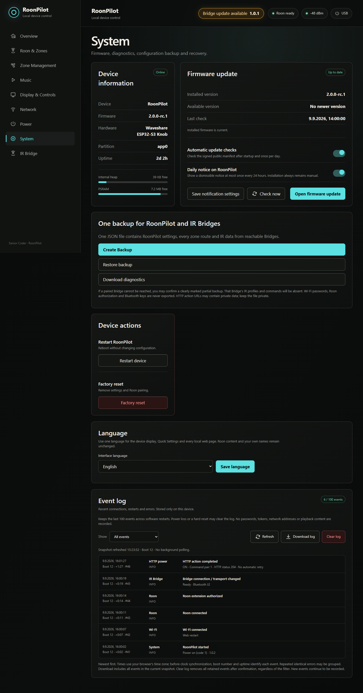

### Language

**System → Language** changes one device-wide setting between **English** and
**Deutsch**. It applies to the round display, Quick Settings, the Wi-Fi setup
portal, the firmware-update pages, the IR Bridge page and every other local
RoonPilot page. The device display changes immediately and the browser reloads
after a successful save.

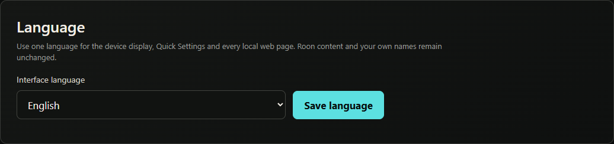

Roon metadata and user data deliberately remain as supplied: track, artist and
album text, zone names, playlists, Live Radio names, Bridge identities and IR
profile names are not translated. The language is part of the combined
backup. Compatible older configurations without the field use
English as their safe default.

Those values remain UTF-8. The device fonts include Western, Central and Eastern
European Latin characters, Greek, Cyrillic, common punctuation/currency symbols
and a selected set of everyday monochrome emoji. Large Asian writing systems
are not bundled in the embedded display fonts because of memory limits; the web
page itself is unaffected and uses the browser's fonts.

- installed firmware, active partition, uptime, internal heap and PSRAM;
- installed and available firmware versions plus the last successful/attempted
  manifest check;
- separate switches for automatic online checks and the once-daily device
  notice;
- **Check now** and a direct jump to the signed firmware-update page;
- **Create Backup** and **Restore backup**: one JSON file for RoonPilot
  settings, every zone route, an independent named IR profile library and
  separate assignments to Bridges;
- downloadable diagnostics;
- a reboot-persistent event log for boots, connection transitions, updates and
  important server/API failures;
- restart without changing settings;
- typed-confirmation factory reset.

Automatic checking reads only the approved signed-release manifest after boot
and then daily. A failed automatic check retries later. Checking never installs
firmware. Installation always requires an explicit action on the separate
firmware-update page.

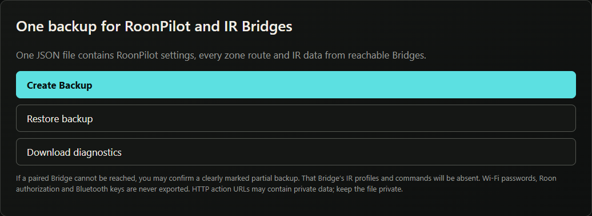

The backup reads RoonPilot's permanent profile library, so a paired Bridge
may be offline without delaying the file. Changes on a Bridge that have not
yet synchronized to that library may be missing. Restore also continues if a
Bridge is unavailable: RoonPilot settings and the library are restored, while
unconfirmed Bridge transfers are listed for later completion. Unverified IR
routes are not activated. See
[Configuration backup and restore](configuration-backup.md); the Bridge
Maintenance tab no longer has separate backup controls.

Factory reset removes local settings, Wi-Fi and Roon pairing, then returns to
first-time AP setup. It does not restore Waveshare's original firmware.

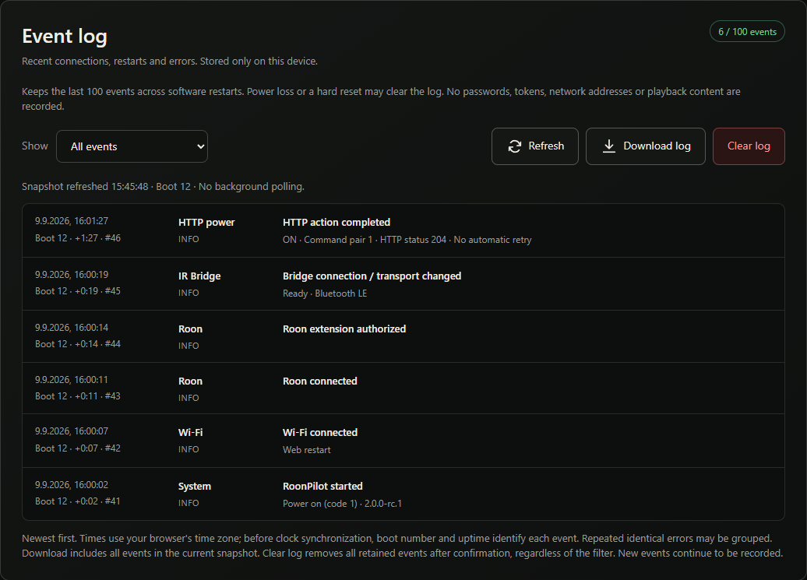

The event log survives a software reboot but is allowed to disappear after a
complete loss of power. Repeated identical events are condensed. **Download
JSON** preserves it for diagnosis; **Clear log** deletes only this event list,
not settings, pairings or the separate crash report. Errors returned by a web
settings endpoint are logged as well as shown in the red browser message.

## Mobile layout

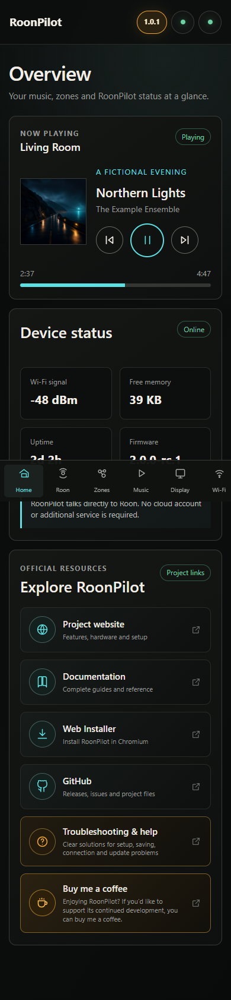

Cards become one column and the eight core pages move into a horizontally
scrollable bottom navigation; **IR Bridge** is added only when that optional
feature is enabled. Controls retain useful touch sizes instead of being
stretched across the full desktop width.

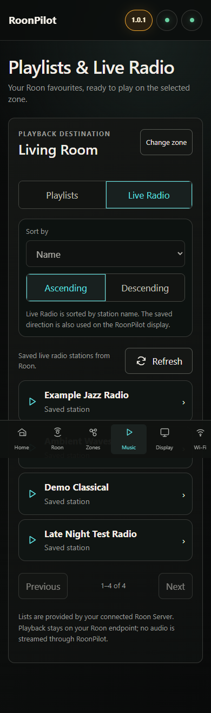

## IR Bridge

When **Bridge & Bluetooth** is enabled, the additional IR Bridge page provides
Connection, Zone routing, IR profiles and Maintenance tabs. It supports up to
four saved pairings. Automatic zone control follows every physical output in
the selected zone or group: one BLE link is available, while several required
Bridges can remain ready through their independent authenticated Wi-Fi paths.
Maintenance selection temporarily uses BLE for learning, profile editing and
firmware work without changing a saved zone route. Backups are created and
restored on **System**.

The Bridge interface follows the global RoonPilot language. Physical `RPB-…`
identities, user-defined profile names and equipment/zone names remain unchanged
so labels can still be compared exactly with the real hardware.

Grouped-zone ring and touch behaviour is covered separately under
[Roon groups and the group mixer](roon-groups.md).

If the master switch is disabled and the device is restarted, the page reduces
to its small master-switch card. Bluetooth, scanning, Bridge status work and
Bridge update checks remain off; pairings, routes and profile references are
retained. Read the dedicated [IR Bridge documentation](ir-bridge.md) before
pairing or changing a route.

## Minimal Wi-Fi setup page

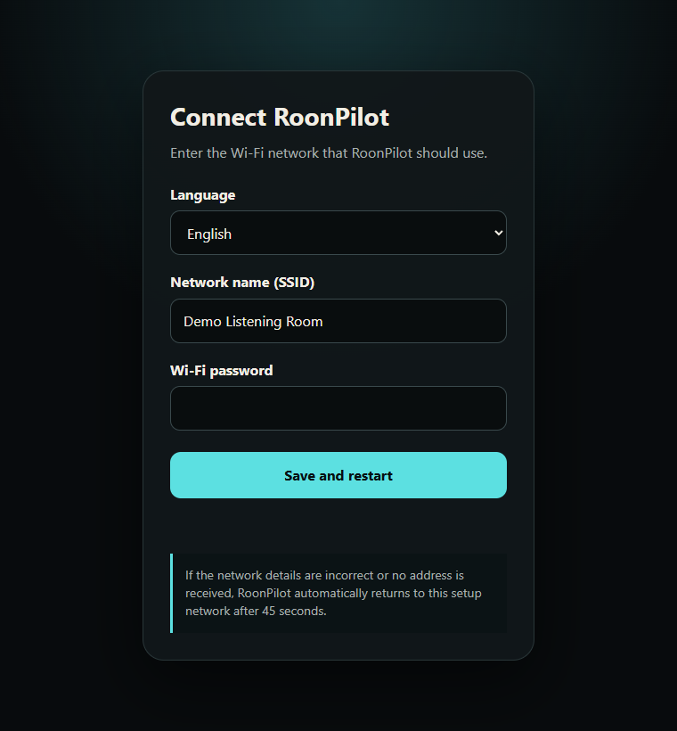

Served only in setup/recovery AP mode. It has no Roon, update, reset, import or
diagnostic functions. This reduces both confusion and the exposed surface before
the device joins the trusted local network.

## Signed firmware update page

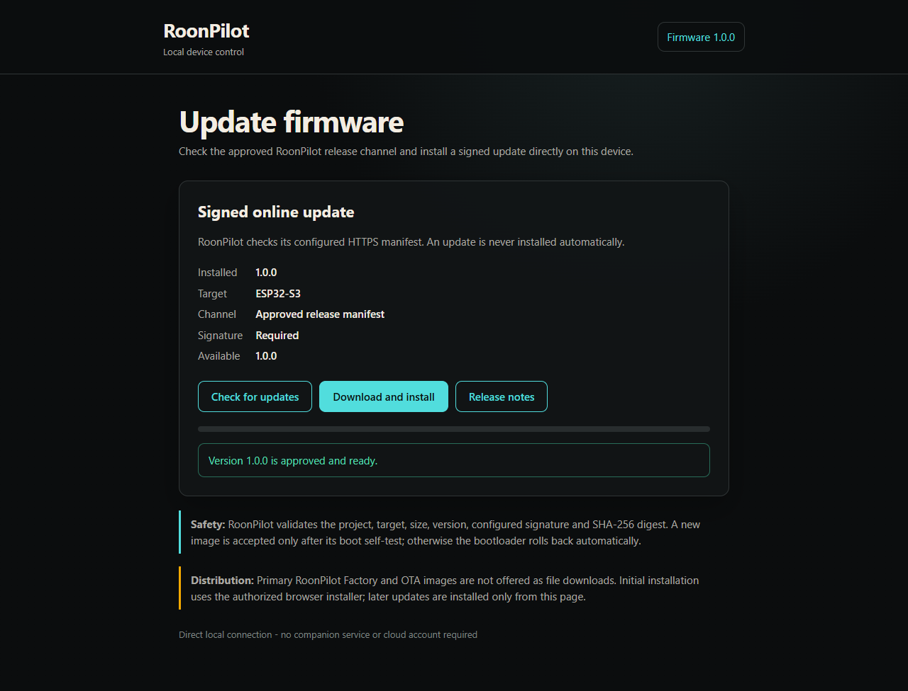

Used by an existing RoonPilot to check and install an approved signed online
update. It checks metadata and integrity, writes the inactive A/B slot, reboots,
validates startup and can roll back if the new application does not become
healthy. Manual firmware upload is intentionally unavailable. Keep power
connected.

## USB Web Installer

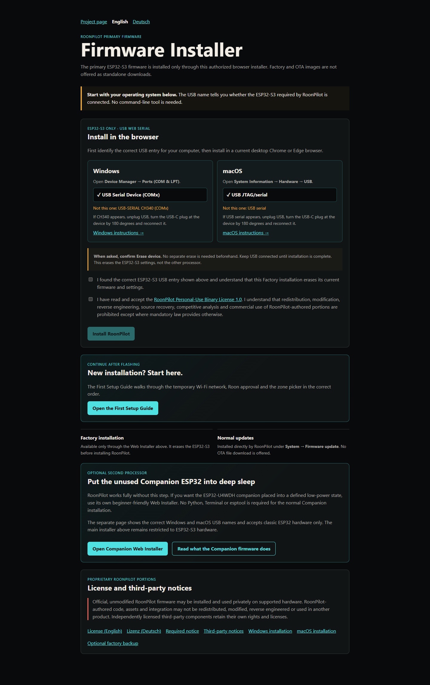

This is a separate authorized HTTPS page, not a page served by the device. It
explains the unusual two-processor hardware, requires confirmation of the
ESP32-S3 target, Factory erase and personal-use binary licence, and writes the
complete Factory image to the main ESP32-S3 only. An original-firmware backup
is explained as an optional restore path, not an installation requirement. The
primary image is not offered as a download.

The installer separates **Current RoonPilot release** from **Return to
RoonPilot 1.0.2**. The second choice always installs the original 1.0.2 with a
mandatory erase and an additional confirmation of the loss of settings and
profiles. Do not restore a 2.0.0 backup or run battery calibration under 1.0.2.
The selected recovery version is preserved when changing language. See
[Return to RoonPilot 1.0.2](return-to-1.0.2.md) for the full procedure.

The optional Companion card opens a separate, beginner-friendly Web Installer
for the classic ESP32-U4WDH. It needs neither Python nor esptool and accepts only
the Companion processor; the main ESP32-S3 installer never writes that second
chip.
